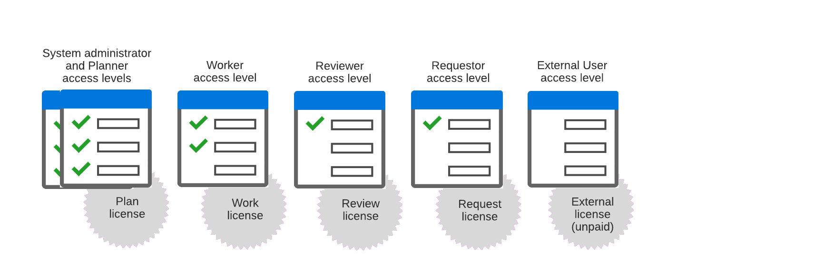

# Visão geral dos níveis de acesso herdados

<!-- Audited: 12/2023 -->

>[!NOTE]
>
>As informações contidas neste artigo referem-se aos níveis de acesso legados. Para obter informações sobre os níveis de acesso atuais, consulte [Visão geral dos novos níveis de acesso](/help/quicksilver/administration-and-setup/add-users/how-access-levels-work/access-level-overview.md).

Como administrador do Adobe Workfront, você atribui um nível de acesso a um usuário para 2 fins:

* Cada usuário deve ter um nível de acesso para poder fazer login e trabalhar no Workfront.
* Os níveis de acesso controlam o que um usuário pode ver e fazer com determinados objetos e áreas do Workfront.

Cada um dos seis níveis de acesso integrados está associado a uma das cinco licenças do Workfront: Plano, Trabalho, Revisão, Solicitação e Externo.

A licença externa é uma licença gratuita projetada principalmente para compartilhar documentos com colaboradores que não utilizam o Workfront.

Para obter informações sobre tópicos relacionados aos níveis de acesso, consulte os seguintes artigos:

<table style="table-layout:auto"> 
 <col> 
 <col> 
 <thead> 
  <tr> 
   <th>Tópico</th> 
   <th>Artigos</th> 
  </tr> 
 </thead> 
 <tbody> 
  <tr> 
   <td>
<strong>Licenças</strong>
</td> 
   <td> 
A licença associada a um nível de acesso determina como ele pode ser configurado.
 
Para obter mais informações, consulte <a href="../../../administration-and-setup/add-users/access-levels-and-object-permissions/wf-licenses.md" class="MCXref xref">Visão geral das licenças</a>.
 
<strong>Dica</strong>: você pode ver qual nível de acesso e licença está atribuído a cada usuário visualizando a lista de usuários ou um relatório. Para obter instruções, consulte <a href="../../../administration-and-setup/add-users/access-levels-and-object-permissions/list-access-levels-and-licenses-for-your-users.md" class="MCXref xref">Listar os níveis de acesso e licenças dos seus usuários</a>.
 </td> 
  </tr> 
  <tr> 
   <td><strong>Níveis de acesso integrados</strong></td> 
   <td> 
Para obter mais informações sobre os 6 níveis de acesso integrados mostrados na imagem acima, consulte <a href="../../../administration-and-setup/add-users/access-levels-and-object-permissions/default-access-levels-in-workfront.md" class="MCXref xref">Níveis de acesso integrados</a>.
 </td> 
  </tr> 
  <tr> 
   <td><strong>Atribuição de níveis de acesso</strong></td> 
   <td> 
Para obter instruções sobre como atribuir um nível de acesso a um usuário, consulte <a href="../../../administration-and-setup/add-users/create-and-manage-users/edit-a-users-profile.md" class="MCXref xref">Editar o perfil de um usuário</a>.
 </td> 
  </tr> 
  <tr> 
   <td><b>Tipos de níveis de acesso</b></td> 
   <td>
Existem dois tipos de níveis de acesso no Workfront:

   <ul><li>Níveis de acesso legados</li>
   <ul><li>Plano</li>
   <li>Trabalho</li>
   <li>Revisar</li>
   <li>Solicitação</li></ul>
   <li>Novos níveis de acesso:</li>
   <ul><li>Padrão</li>
   <li>Light</li>
   <li>Colaborador</li></ul></ul> 
   
Para obter informações sobre os novos níveis de acesso, consulte <a href="../../../administration-and-setup/add-users/how-access-levels-work/access-level-overview.md" class="MCXref xref">Visão geral dos novos níveis de acesso</a>.
 </td> 
  </tr> 
  <!--
  <tr> 
   <td>Access levels and proofing</td> 
   <td> 
Your users' access levels can affect proofing for each permission profile. For more information, see the section in the article .
 </td> 
  </tr> 
  -->
 </tbody> 
</table>
