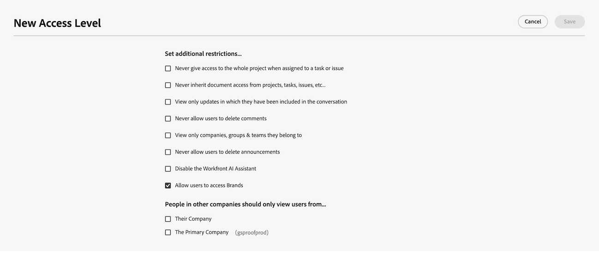

# Conceder acesso às permissões da marca

{{highlighted-preview-article-level}}

Os usuários recebem as permissões de criação, edição e publicação da marca dos gerentes de sistema do Adobe GenStudio quando adicionados a um grupo de usuários.

## Requisitos de acesso

+++ Expanda para visualizar os requisitos de acesso da funcionalidade neste artigo.

<table style="table-layout:auto"> 
 <col> 
 <col> 
 <tbody> 
  <tr> 
   <td role="rowheader">Pacote do Adobe Workfront</td> 
   <td> 
Qualquer
 </td> 
  </tr> 
  <tr> 
   <td role="rowheader">Licença do Adobe Workfront</td> 
   <td> 
Padrão
 </td> 
  </tr> 
  <tr> 
   <td role="rowheader">Configurações de nível de acesso</td> 
   <td> 
Você deve ser um administrador do Workfront.
 </td> 
  </tr> 
  <tr> 
   <td role="rowheader">Permissões do Admin Console</td> 
   <td> 
Você deve ser um administrador do sistema na Adobe Admin Console.
 </td> 
  </tr> 
 </tbody> 
</table>

Para obter mais detalhes sobre as informações contidas nesta tabela, consulte [Requisitos de acesso na documentação do Workfront](/help/quicksilver/administration-and-setup/add-users/access-levels-and-object-permissions/access-level-requirements-in-documentation.md).

+++

## Requisitos

* Sua instância do Workfront deve ter as Aprovações unificadas habilitadas.

* Sua organização deve ter o GenStudio Foundation.
   * O Revisor de conteúdo no Workfront fornece a funcionalidade disponível no GenStudio Foundation para revisão de ativos e fluxos de trabalho de aprovação. Não é necessário acessar o GenStudio Foundation diretamente para concluir o trabalho. Seu acesso à funcionalidade do GenStudio Foundation por meio do Revisor de conteúdo se enquadra nos termos de seu contrato com a Workfront.
* A Adobe deve ter um contrato de API Gen da Adobe assinado no arquivo.
Para obter mais informações sobre como assinar o contrato, consulte [Assinar o contrato da Adobe Gen AI](/help/quicksilver/workfront-basics/ai-assistant/ai-assistant-overview.md#sign-the-adobe-gen-ai-agreement).

## &#x200B;1. Configurar as permissões da marca no Admin Console

### Etapa 1: Criar um grupo de usuários

Crie um novo grupo de usuários no Admin Console para gerenciar permissões de criação e edição de marca.

### Etapa 2: atribuir um perfil de produto ao grupo de usuários

O direito associado ao perfil atribuído fornece a todos os usuários neste grupo permissões de Marcas da GenStudio (criar, atualizar e excluir marcas).

Para atribuir um perfil:

1. Navegue até o grupo de usuários recém-criado.
1. Clique na guia **Perfis de produto atribuídos**.
1. Clique em **Atribuir perfil**.
1. Na janela pop-up, selecione **Adobe GenStudio** na lista de produtos e clique em **Aplicar**.
1. Selecione o perfil do **Adobe GenStudio system manager**.
1. Clique em **Aplicar**.
1. Clique em **Salvar**.

### Etapa 3: adicionar usuários ao grupo de usuários

Para atribuir permissões aos usuários para criar, editar e publicar marcas, adicione-as ao grupo de usuários.

>[!NOTE]
>
>Você deve adicionar pelo menos um usuário antes de adicionar o grupo a um projeto, conforme descrito na etapa 4.

Para adicionar usuários:

1. Vá para **Admin Console** > **Usuários** > **Grupos de Usuários**.
1. Selecione seu grupo de usuários.
1. Adicione usuários por nome de usuário ou endereço de email.
1. Selecione entre as correspondências sugeridas para os usuários existentes.

### Etapa 4: criar um projeto de marcas

Um projeto fornece um local de armazenamento onde os usuários podem salvar ativos da marca.

Para criar um projeto:

1. Navegue até a guia **Armazenamento** no Admin Console.
1. Clique em **Projetos**.
1. Clique em **Criar projeto**.
1. Na janela pop-up, digite o nome do projeto: **Marcas da Adobe GenStudio**.

   >[!IMPORTANT]
   >
   >Insira o nome do projeto exatamente como mostrado. Não adicione espaços extras nem altere letras maiúsculas e minúsculas.

1. Clique em **Criar**.

### Etapa 5: convidar o grupo de usuários para o projeto

Adicione o grupo de usuários ao projeto Marcas para que eles possam acessar e gerenciar ativos.

1. No pop-up **Convidar para o projeto**, adicione o grupo de usuários que você criou.
1. Selecione **Pode editar** permissões.
1. Clique em **Convidar**.

### Resultado

Os usuários do grupo agora têm permissões para criar, editar e publicar ativos de marca no Workfront.

## &#x200B;2. Conceder acesso às marcas nos níveis de acesso da Workfront

Você deve concluir todas as etapas da seção anterior antes de conceder acesso a usuários individuais a Marcas nos níveis de acesso do Workfront.

>[!IMPORTANT]
>
>* Somente os usuários atribuídos ao grupo de usuários com o perfil de produto GenStudio system manager na Admin Console podem criar, editar e publicar marcas na Workfront, mesmo que outros usuários tenham acesso às Marcas ativadas nas configurações de nível de acesso.
>* Os usuários adicionados ao nível de acesso com acesso a Marcas ativado, mas não adicionado ao grupo de usuários na Admin Console, só podem visualizar marcas.

Para conceder acesso às marcas nos níveis de acesso do Workfront:

{{step-1-to-setup}}

1. Clique em **Níveis de acesso** no painel esquerdo.
1. Localize o nível de acesso que você deseja editar e clique no ícone de edição  para editá-lo.

   Ou

   Clique em **Novo Nível de Acesso** para criar um novo nível de acesso. Para obter mais informações sobre como criar níveis de acesso, consulte [Criar ou modificar níveis de acesso personalizados](../../../administration-and-setup/add-users/configure-and-grant-access/create-modify-access-levels.md).
1. Role para baixo até **Definir restrições adicionais** e selecione **Permitir que usuários acessem marcas**.
   
1. Clique em **Salvar**.

Depois de configurar as Marcas, é possível criar um Revisor de conteúdo para revisar os ativos em relação às diretrizes da marca no fluxo de trabalho de revisão e aprovação. Para obter mais informações, consulte [Configurar colaboradores de IA](/help/quicksilver/administration-and-setup/set-up-workfront/configure-system-defaults/configure-ai-collaborators.md).