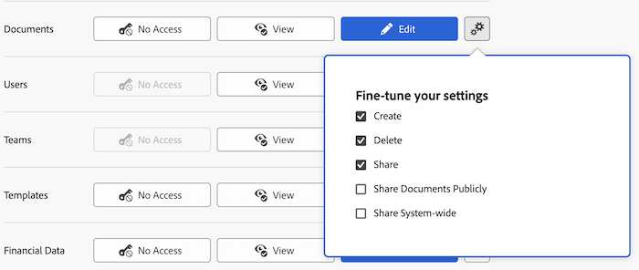

# Conceder acesso a documentos

Como administrador do Adobe Workfront, você pode usar um nível de acesso para definir o acesso de um usuário a documentos, conforme explicado na [Visão geral dos níveis de acesso](../../../administration-and-setup/add-users/access-levels-and-object-permissions/access-levels-overview.md).

Esse acesso também se aplica a pastas de documentos.

Para obter informações sobre como usar níveis de acesso personalizados para gerenciar o acesso dos usuários a outros tipos de objetos no Workfront, consulte [Criar ou modificar níveis de acesso personalizados](../../../administration-and-setup/add-users/configure-and-grant-access/create-modify-access-levels.md).

## Requisitos de acesso

+++ Expanda para visualizar os requisitos de acesso da funcionalidade neste artigo.

<table style="table-layout:auto"> 
 <col> 
 <col> 
 <tbody> 
  <tr> 
   <td role="rowheader">Pacote do Adobe Workfront</td> 
   <td>Qualquer</td> 
  </tr> 
  <tr> 
   <td role="rowheader">Licença do Adobe Workfront</td> 
   <td>
   
Padrão

   
Plano

   </td> 
  </tr> 
  <tr> 
   <td role="rowheader">Configurações de nível de acesso</td> 
   <td> 
Você deve ser um administrador do Workfront.
 </td> 
  </tr> 
 </tbody> 
</table>

Para obter mais detalhes sobre as informações contidas nesta tabela, consulte [Requisitos de acesso na documentação do Workfront](/help/quicksilver/administration-and-setup/add-users/access-levels-and-object-permissions/access-level-requirements-in-documentation.md).
+++

## Configurar o acesso do usuário a documentos usando um nível de acesso personalizado

1. Comece a criar ou editar o nível de acesso, conforme explicado em [Criar ou modificar níveis de acesso personalizados](../../../administration-and-setup/add-users/configure-and-grant-access/create-modify-access-levels.md).
1. Clique no ícone de engrenagem  no botão **Exibir** ou **Editar** à direita de Documentos e selecione as capacidades que deseja conceder em **Ajustar suas configurações**.

   

   Você pode permitir que os usuários façam o seguinte em projetos, tarefas e problemas aos quais tenham acesso:

   <table style="table-layout:auto"> 
    <col> 
    <col> 
    <tbody> 
     <tr> 
      <td role="rowheader">Criar</td> 
      <td>Fazer upload de documentos.</td> 
     </tr> 
     <tr> 
      <td role="rowheader">Excluir</td> 
      <td> 
Remover documentos carregados.
 
A opção <b>Criar</b> é habilitada automaticamente quando essa opção é habilitada.
 </td> 
     </tr> 
     <tr> 
      <td role="rowheader">Compartilhar</td> 
      <td>Compartilhe documentos com usuários específicos, funções de trabalho e equipes.</td> 
     </tr> 
     <tr> 
      <td role="rowheader">Compartilhar documentos publicamente</td> 
      <td>Compartilhe documentos com usuários externos (não tem uma licença do Workfront).</td> 
     </tr> 
     <tr> 
      <td role="rowheader">Compartilhe com todo o sistema</td> 
      <td> 
Disponibilize documentos para todos na instância do Workfront.
 
Qualquer pessoa no sistema pode ver um documento compartilhado dessa maneira se:
 
       <ul> 
        <li> 
Você envia a eles um link para a página Documentos onde ele é carregado.
 </li> 
        <li> 
Eles pesquisam por isso no Workfront
 </li> 
       </ul> 
A opção <b>Compartilhar</b> é habilitada automaticamente quando essa opção é habilitada.
 </td> 
     </tr> 
    </tbody> 
   </table>

   >[!NOTE]
   >
   >Quando você define uma configuração de nível de acesso para um determinado tipo de objeto, essa configuração não afeta o acesso dos usuários aos objetos com uma classificação mais baixa. Por exemplo, você pode impedir que os usuários excluam projetos em seu nível de acesso, mas isso não os impede de excluir documentos, que são de classificação inferior aos projetos.Para obter mais informações sobre a hierarquia de objetos, consulte a seção [Interdependência e hierarquia de objetos](../../../workfront-basics/navigate-workfront/workfront-navigation/understand-objects.md#understanding-interdependency-and-hierarchy-of-objects) no artigo [Entender objetos no Adobe Workfront](../../../workfront-basics/navigate-workfront/workfront-navigation/understand-objects.md).

1. (Opcional) Para restringir permissões herdadas de documentos de objetos de classificação mais alta, clique em **Definir restrições adicionais** e selecione **Nunca herdar acesso a documentos de projetos, tarefas, problemas, etc**.
1. (Opcional) Para definir as configurações de acesso para outros objetos e áreas no nível de acesso em que você está trabalhando, continue com um dos artigos listados em [Configurar acesso ao Adobe Workfront](../../../administration-and-setup/add-users/configure-and-grant-access/configure-access.md), como [Conceder acesso a tarefas](../../../administration-and-setup/add-users/configure-and-grant-access/grant-access-tasks.md) e [Conceder acesso a dados financeiros](../../../administration-and-setup/add-users/configure-and-grant-access/grant-access-financial.md).
1. Quando terminar, clique em **Salvar**.

   Após criar o nível de acesso, você pode atribuí-lo a um usuário. Para obter mais informações, consulte [Editar perfil de usuário](../../../administration-and-setup/add-users/create-and-manage-users/edit-a-users-profile.md).

## Acesso a documentos por tipo de licença

Para obter mais informações sobre o que os usuários em cada nível de acesso podem fazer com documentos, consulte a seção [Documentos](../../../administration-and-setup/add-users/access-levels-and-object-permissions/functionality-available-for-each-object-type.md#document) no artigo [Funcionalidade disponível para cada tipo de objeto](../../../administration-and-setup/add-users/access-levels-and-object-permissions/functionality-available-for-each-object-type.md).

## Acesso a documentos compartilhados

Após carregar um documento no Workfront, você poderá compartilhá-lo com outros usuários concedendo a eles permissões, conforme explicado em [Compartilhar um documento](../../../workfront-basics/grant-and-request-access-to-objects/document-permissions.md).

<!--
If you make changes here, make them also in the "Grant access to" articles where this snippet had to be converted to text:
* reports, dashboards, and calendars
* financial data<
* issue
-->

Quando você compartilha qualquer objeto com outro usuário, os direitos do recipient sobre ele são determinados por uma combinação de dois itens:

* As permissões concedidas ao destinatário para o objeto
* As configurações de nível de acesso do destinatário para o tipo do objeto
