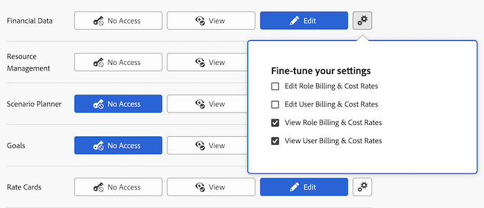

# Conceder acesso a dados financeiros

{{highlighted-preview}}

Como administrador do Adobe Workfront, você pode definir o acesso de um usuário aos itens a seguir por meio do nível de acesso do usuário, conforme explicado na [Visão geral dos níveis de acesso](../../../administration-and-setup/add-users/access-levels-and-object-permissions/access-levels-overview.md):

* Informações financeiras sobre projetos no Workfront
* Informações de orçamento de recursos nas ferramentas de Planejamento de recursos

## Requisitos de acesso

+++ Expanda para visualizar os requisitos de acesso para a funcionalidade neste artigo.

<table style="table-layout:auto"> 
 <col> 
 <col> 
 <tbody> 
  <tr> 
   <td role="rowheader">Pacote do Adobe Workfront</td> 
   <td>Qualquer</td> 
  </tr> 
  <tr> 
   <td role="rowheader">Licença do Adobe Workfront</td> 
   <td>
    
Standard

   
Plano

   </td> 
  </tr> 
  <tr> 
   <td role="rowheader">Configurações de nível de acesso</td> 
   <td> 
Você deve ser um administrador do Workfront.
 </td> 
  </tr> 
 </tbody> 
</table>

Para obter mais detalhes sobre as informações nesta tabela, consulte [Requisitos de acesso na documentação do Workfront](/help/quicksilver/administration-and-setup/add-users/access-levels-and-object-permissions/access-level-requirements-in-documentation.md).

+++

## Considerações para conceder acesso a dados financeiros

Considere o seguinte ao conceder aos usuários acesso a dados financeiros no Workfront:

* Um usuário cujo nível de acesso não permite acesso a dados financeiros não pode criar um risco para um projeto. Para obter mais informações, consulte [Criar e editar riscos em projetos](../../../manage-work/projects/define-a-business-case/create-edit-risks-on-projects.md).
* Você também pode usar um nível de acesso para determinar quais atividades de Gerenciamento de recursos um usuário pode empregar para fazer um orçamento ou exibir a alocação de recursos. Para obter informações, consulte [Conceder acesso ao Gerenciamento de Recursos](../../../administration-and-setup/add-users/configure-and-grant-access/grant-access-resource-management.md).

## Configurar o acesso do usuário a dados financeiros usando um nível de acesso personalizado

1. Comece a criar ou editar o nível de acesso, conforme explicado em [Criar ou modificar níveis de acesso personalizados](../../../administration-and-setup/add-users/configure-and-grant-access/create-modify-access-levels.md).
1. Clique no ícone de engrenagem  no botão **Exibir** ou **Editar** à direita de Dados Financeiros e selecione as capacidades que deseja conceder em **Ajustar suas configurações**.

   

1. (Opcional) Na área **Permitir acesso administrativo para**, selecione as seguintes opções:

   <table style="table-layout:auto"> 
    <col> 
    <col> 
    <tbody> 
     <tr> 
      <td role="rowheader">Taxas de câmbio</td> 
      <td> 
Adicionar nova moeda no Workfront.
 
Sem esse acesso, o usuário só poderá adicionar uma moeda existente a um projeto que criar.
 </td> 
     </tr> 
     <tr> 
      <td role="rowheader">Despesas</td> 
      <td> 
Exibir todas as despesas em objetos no Workfront.
 
Isso não permite que o usuário crie novos Tipos de Despesas.
 
Sem esse acesso, o usuário só poderá exibir o seguinte:
 
       <ul> 
        <li>Despesas com projetos, tarefas ou problemas que gerenciam</li> 
        <li>Suas próprias despesas</li> 
        <li>As despesas de seus subordinados</li> 
       </ul> </td> 
     </tr> 
    </tbody> 
   </table>

1. (Opcional) Para definir as configurações de acesso para outros objetos e áreas no nível de acesso em que você está trabalhando, continue com um dos artigos listados em [Configurar acesso ao Adobe Workfront](../../../administration-and-setup/add-users/configure-and-grant-access/configure-access.md), como [Conceder acesso às tarefas](../../../administration-and-setup/add-users/configure-and-grant-access/grant-access-tasks.md).
1. Quando terminar, clique em **Salvar**.

   Após criar o nível de acesso, você pode atribuí-lo a um usuário. Para obter mais informações, consulte [Editar perfil de usuário](../../../administration-and-setup/add-users/create-and-manage-users/edit-a-users-profile.md).

## Acesso a informações financeiras compartilhadas

Você pode compartilhar informações financeiras sobre um projeto, tarefa ou problema com outros usuários concedendo a eles permissões, conforme explicado em [Compartilhar permissões financeiras em um objeto](../../../workfront-basics/grant-and-request-access-to-objects/share-financial-permissions-object.md).

<!--
If you make changes here, make them also in the "Grant access to" articles where this snippet had to be converted to text:
* reports, dashboards, and calendars
* financial data
* issue
-->

Quando você compartilha qualquer objeto com outro usuário, os direitos do recipient sobre ele são determinados por uma combinação de dois itens:

* As permissões concedidas ao destinatário para o objeto
* As configurações de nível de acesso do destinatário para o tipo do objeto

## Acesso a informações financeiras por tipo de licença

Para obter informações sobre o que os usuários em cada nível de acesso podem fazer com informações financeiras, consulte a seção [Dados financeiros](../../../administration-and-setup/add-users/access-levels-and-object-permissions/functionality-available-for-each-object-type.md#financia) no artigo [Funcionalidade disponível para cada tipo de objeto](../../../administration-and-setup/add-users/access-levels-and-object-permissions/functionality-available-for-each-object-type.md).

## Acesso a informações financeiras definindo

As informações a seguir podem ajudar você a entender como usar as configurações de Nível de acesso para controlar o acesso dos usuários aos dados financeiros.

### Sem acesso

Um usuário sem acesso a dados financeiros não tem acesso ao seguinte:

* Seção Finanças em Objetos de projeto e tarefa
* Plano de Negócio
* Taxas de cobrança e registros de cobrança
* Classificar cartões
* Custo por hora e faturamento por hora nas preferências do usuário

  Você pode configurar isso usando o ícone de engrenagem  no botão Exibir na etapa 4 acima.

* Custo por hora e faturamento por hora em Funções de trabalho

  Você pode configurar isso usando o ícone de engrenagem  no botão Exibir na etapa 4 acima.

### Exibir acesso

Um usuário com acesso de Exibição a dados financeiros pode exibir (não editar) o seguinte:

* Seção Finanças em Objetos de projeto e tarefa
* Plano de Negócio
* Taxas de cobrança e registros de cobrança
* Custo por hora e faturamento por hora nas preferências do usuário

  Você pode configurar isso usando o ícone de engrenagem  no botão Exibir na etapa 4 acima.

* Custo por hora e faturamento por hora em Funções de trabalho

  Você pode configurar isso usando o ícone de engrenagem  no botão Exibir na etapa 4 acima.

### Editar acesso

Um usuário com acesso de Edição a dados financeiros pode exibir e editar o seguinte:

* Seção Finanças em Objetos de projeto e tarefa
* Plano de Negócio
* Taxas de cobrança e registros de cobrança
* Classificar cartões
* Custo por hora e faturamento por hora nas preferências do usuário

  Você pode configurar isso usando o ícone de engrenagem  no botão Editar na etapa 4 acima.

* Custo por hora e faturamento por hora em Funções de trabalho

  Você pode configurar isso usando o ícone de engrenagem  no botão Editar na etapa 4 acima.
