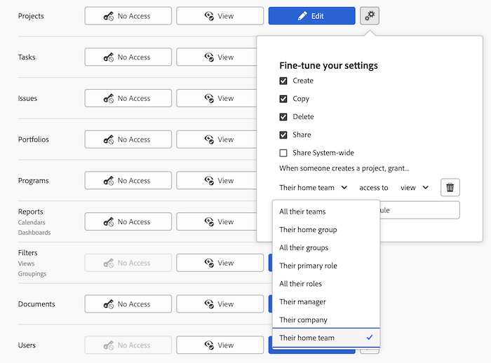

# Conceder acesso aos projetos

<!-- Audited: 12/2023 -->

Como administrador do Adobe Workfront, você pode usar um nível de acesso para definir o acesso de um usuário aos projetos, conforme explicado nos seguintes artigos:
* [Visão geral dos níveis de acesso](../../../administration-and-setup/add-users/access-levels-and-object-permissions/access-levels-overview.md)
* [Visão geral dos novos níveis de acesso](/help/quicksilver/administration-and-setup/add-users/how-access-levels-work/access-level-overview.md)

Para obter informações sobre como usar níveis de acesso personalizados para gerenciar o acesso dos usuários a outros tipos de objetos no Workfront, consulte [Criar ou modificar níveis de acesso personalizados](../../../administration-and-setup/add-users/configure-and-grant-access/create-modify-access-levels.md).

## Requisitos de acesso

+++ Expanda para visualizar os requisitos de acesso para a funcionalidade neste artigo.

Você deve ter o seguinte acesso para executar as etapas deste artigo:

<table style="table-layout:auto"> 
 <col> 
 <col> 
 <tbody> 
  <tr> 
   <td role="rowheader">plano do Adobe Workfront</td> 
   <td>Qualquer</td> 
  </tr> 
    <tr> 
   <td role="rowheader">Licença do Adobe Workfront</td> 
   <td> 
Novo: Padrão 

 
ou
 

Atual: Plano 
 
</td> 
  </tr>

<tr> 
   <td role="rowheader">Configurações de nível de acesso</td> 
   <td> 
Você deve ser um administrador do Workfront.
 </td> 
  </tr> 
 </tbody> 
</table>

Para obter mais detalhes sobre as informações nesta tabela, consulte [Requisitos de acesso na documentação do Workfront](/help/quicksilver/administration-and-setup/add-users/access-levels-and-object-permissions/access-level-requirements-in-documentation.md).

+++

## Configurar o acesso do usuário aos projetos usando um nível de acesso personalizado

1. Comece a criar ou editar o nível de acesso, conforme explicado em [Criar ou modificar níveis de acesso personalizados](../../../administration-and-setup/add-users/configure-and-grant-access/create-modify-access-levels.md).
1. Clique no ícone de engrenagem  no botão **Exibir** ou **Editar** à direita de Projetos e selecione as capacidades que deseja conceder em **Ajustar suas configurações**.

   

   >[!NOTE]
   >
   >* Os usuários com uma licença de Trabalho têm direitos de projeto limitados. Eles podem contribuir para um projeto, mas não podem gerenciá-lo.
   >* Os usuários com uma licença de Revisão têm direitos de Visualização em projetos a partir de problemas convertidos, mas seus direitos de Visualização são limitados.
   >* Para obter informações sobre as permissões que os usuários podem conceder ao compartilhar projetos com outras pessoas, consulte [Compartilhar um projeto no Adobe Workfront](../../../workfront-basics/grant-and-request-access-to-objects/share-a-project.md).
   >* Quando você define uma configuração de nível de acesso para um determinado tipo de objeto, essa configuração não afeta o acesso dos usuários aos objetos com uma classificação mais baixa. Por exemplo, você pode impedir que usuários excluam projetos em seus níveis de acesso, mas isso não os impede de excluir tarefas, que são de classificação inferior à dos projetos.Para obter mais informações sobre a hierarquia de objetos, consulte a seção [Interdependência e hierarquia de objetos](../../../workfront-basics/navigate-workfront/workfront-navigation/understand-objects.md#understanding-interdependency-and-hierarchy-of-objects) no artigo [Entender os objetos no Adobe Workfront](../../../workfront-basics/navigate-workfront/workfront-navigation/understand-objects.md).

1. (Opcional) Clique em **definir padrões de compartilhamento** à direita da opção Criar e em **Adicionar regra** para adicionar uma regra de compartilhamento para novos projetos.

   Quando o usuário com esse nível de acesso cria um projeto, o projeto é compartilhado automaticamente com os usuários selecionados no menu à esquerda.

   

   No menu à direita, especifique como deseja que o projeto seja compartilhado com esses usuários:

   

   >[!NOTE]
   >
   >Se um usuário com este nível de acesso estiver usando um modelo de acesso do projeto, o modelo substituirá as configurações de compartilhamento no nível de acesso. Para obter informações sobre modelos de acesso ao projeto, consulte [Compartilhar um projeto no Adobe Workfront](../../../workfront-basics/grant-and-request-access-to-objects/share-a-project.md).

   Você pode repetir essa etapa para adicionar quantas regras de compartilhamento de projeto forem necessárias para o nível de acesso.

1. Clique no X para fechar a caixa **Ajustar suas configurações**.
1. (Opcional) Para definir as configurações de acesso para outros objetos e áreas no nível de acesso em que você está trabalhando, continue com um dos artigos listados em [Configurar acesso ao Adobe Workfront](../../../administration-and-setup/add-users/configure-and-grant-access/configure-access.md), como [Conceder acesso a tarefas](../../../administration-and-setup/add-users/configure-and-grant-access/grant-access-tasks.md) e [Conceder acesso a dados financeiros](../../../administration-and-setup/add-users/configure-and-grant-access/grant-access-financial.md).
1. Quando terminar, clique em **Salvar**.

   Após criar o nível de acesso, você pode atribuí-lo a um usuário. Para obter mais informações, consulte [Editar perfil de usuário](../../../administration-and-setup/add-users/create-and-manage-users/edit-a-users-profile.md).

## Acesso a relatórios, painéis e calendários por tipo de licença

Para obter informações sobre o que os usuários em cada nível de acesso podem fazer com problemas, consulte a seção [Projetos](../../../administration-and-setup/add-users/access-levels-and-object-permissions/functionality-available-for-each-object-type.md#projects) no artigo [Funcionalidade disponível para cada tipo de objeto](../../../administration-and-setup/add-users/access-levels-and-object-permissions/functionality-available-for-each-object-type.md).

## Acesso a projetos compartilhados

Como proprietário ou criador de um problema, você pode compartilhar com outros usuários concedendo a eles permissões, conforme explicado em [Compartilhar um projeto no Adobe Workfront](../../../workfront-basics/grant-and-request-access-to-objects/share-a-project.md).

<!--
If you make changes here, make them also in the "Grant access to" articles where this snippet had to be converted to text:
* reports, dashboards, and calendars
* financial data
* issue
-->

Quando você compartilha qualquer objeto com outro usuário, os direitos do recipient sobre ele são determinados por uma combinação de dois itens:

* As permissões concedidas ao destinatário para o objeto
* As configurações de nível de acesso do destinatário para o tipo do objeto
