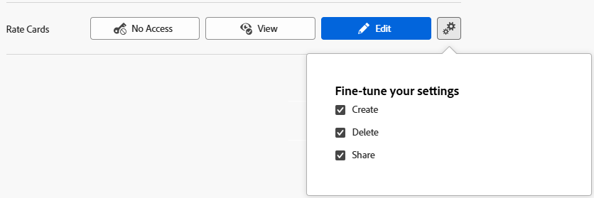

# Conceder acesso aos cartões de taxa

{{highlighted-preview-article-level}}

Como administrador do Adobe Workfront, você pode definir o acesso de um usuário a cartões de taxa por meio do nível de acesso do usuário, conforme explicado na [Visão geral dos níveis de acesso](../../../administration-and-setup/add-users/access-levels-and-object-permissions/access-levels-overview.md).

Para obter informações sobre cartões de taxa, consulte [Gerenciar cartões de taxa](/help/quicksilver/administration-and-setup/manage-enterprise-operations/manage-rate-cards.md).

## Requisitos de acesso

+++ Expanda para visualizar os requisitos de acesso da funcionalidade neste artigo.

<table style="table-layout:auto"> 
 <col> 
 <col> 
 <tbody> 
  <tr> 
   <td role="rowheader">Pacote do Adobe Workfront</td> 
   <td>Workflow Ultimate</td> 
  </tr> 
  <tr> 
   <td role="rowheader">Licença do Adobe Workfront</td> 
   <td>Padrão</td> 
  </tr> 
  <tr> 
   <td role="rowheader">Configurações de nível de acesso</td> 
   <td> 
Você deve ser um administrador do Workfront.
 </td> 
  </tr> 
 </tbody> 
</table>

Para obter mais detalhes sobre as informações contidas nesta tabela, consulte [Requisitos de acesso na documentação do Workfront](/help/quicksilver/administration-and-setup/add-users/access-levels-and-object-permissions/access-level-requirements-in-documentation.md).

+++

## Considerações para conceder acesso a cartões de taxa

Considere o seguinte ao conceder aos usuários acesso aos cartões de taxa no Workfront:

* Os usuários devem ter acesso de edição a cartões de taxa, projetos e dados financeiros para anexar um cartão de taxa a um projeto.
* Usuários sem acesso a cartões de taxa e com acesso de edição a dados financeiros não podem anexar um cartão de taxa a um projeto, mas podem editar outras taxas de cobrança no projeto provenientes de outras fontes.

## Configurar o acesso do usuário aos cartões de taxa usando um nível de acesso personalizado

1. Comece a criar ou editar o nível de acesso, conforme explicado em [Criar ou modificar níveis de acesso personalizados](../../../administration-and-setup/add-users/configure-and-grant-access/create-modify-access-levels.md).
1. Clique no ícone de engrenagem  no botão **Exibir** ou **Editar** à direita de Cartões de Taxa e selecione as capacidades que deseja conceder em **Ajustar suas configurações**.

   

1. (Opcional) Para definir as configurações de acesso para outros objetos e áreas no nível de acesso em que você está trabalhando, continue com um dos artigos listados em [Configurar acesso ao Adobe Workfront](../../../administration-and-setup/add-users/configure-and-grant-access/configure-access.md), como [Conceder acesso às tarefas](../../../administration-and-setup/add-users/configure-and-grant-access/grant-access-tasks.md).
1. Quando terminar, clique em **Salvar**.

   Após criar o nível de acesso, você pode atribuí-lo a um usuário. Para obter mais informações, consulte [Editar perfil de usuário](../../../administration-and-setup/add-users/create-and-manage-users/edit-a-users-profile.md).

## Acesso a cartões de taxa compartilhados

Você pode compartilhar um cartão de taxa com outros usuários concedendo a eles permissões, conforme explicado em [Compartilhar um cartão de taxa](/help/quicksilver/administration-and-setup/manage-enterprise-operations/share-rate-cards.md).

Quando você compartilha qualquer objeto com outro usuário, os direitos do recipient sobre ele são determinados por uma combinação de dois itens:

* As permissões concedidas ao destinatário para o objeto
* As configurações de nível de acesso do destinatário para o tipo do objeto
