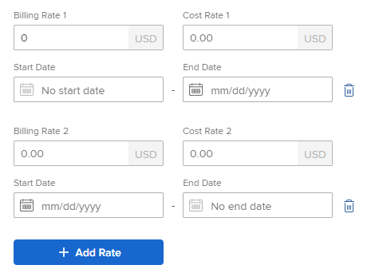

# Editar o perfil de um usuário

{{highlighted-preview}}

<!--

>[!IMPORTANT]
>
>The procedure described on this page applies only to organizations that have not yet been onboarded to the Admin Console. If your organization has been onboarded to the Adobe Admin Console, you must perform this action through the Adobe Admin Console.
>
>For instructions on editing a user's profile in the Adobe Admin Console, see the section "Edit user details" in the article [Manage users individually](https://helpx.adobe.com/enterprise/using/manage-users-individually.html) or contact your Adobe Admin Console Administrator.
>
>For a list of procedures that differ based on whether your organization has been onboarded to the Adobe Admin Console, see [Platform-based administration differences (Adobe Workfront/Adobe Business Platform)](../../../administration-and-setup/get-started-wf-administration/actions-in-admin-console.md).
-->

Como administrador do Adobe Workfront, você pode criar usuários e gerenciar os perfis dos existentes. Para obter informações sobre como criar usuários, consulte [Adicionar usuários](../../../administration-and-setup/add-users/create-and-manage-users/add-users.md).

Para obter informações sobre usuários atualizando seus próprios perfis, consulte [Definir minhas configurações](/help/quicksilver/workfront-basics/manage-your-account-and-profile/configuring-your-user-profile/configure-my-settings.md).

## Requisitos de acesso

+++ Expanda para visualizar os requisitos de acesso para a funcionalidade neste artigo.

Você deve ter o seguinte acesso para executar as etapas deste artigo:

<table style="table-layout:auto"> 
 <col> 
 <col> 
 <tbody> 
  <tr> 
   <td role="rowheader">plano do Adobe Workfront</td> 
   <td>Qualquer</td> 
  </tr> 
  <tr> 
   <td role="rowheader">Licença do Adobe Workfront</td> 
   <td>
Novo: Padrão

Ou

Atual: Plano
</td> 
  </tr> 
  <tr> 
   <td role="rowheader">Configurações de nível de acesso</td> 
   <td> 
Você deve ter um dos seguintes:
 
    <ul> 
     <li> 
O nível de acesso Administrador do sistema. </li> 
     <li> 
A configuração <b>Usuários</b> no seu nível de acesso foi configurada para <b>Editar</b> acesso, com as opções <b>Criar</b> e pelo menos uma das duas opções <b>Administrador de Usuários</b> habilitadas em <b>Ajustar suas configurações</b> . 
 
Dessas duas opções, se <b>Administrador de Usuários (Usuários de Grupo)</b> estiver habilitado, você deverá ser um administrador de grupo de um grupo do qual o usuário seja membro.
 </li> 
    </ul> </td> 
  </tr> 
 </tbody> 
</table>

Para obter mais detalhes sobre as informações nesta tabela, consulte [Requisitos de acesso na documentação do Workfront](/help/quicksilver/administration-and-setup/add-users/access-levels-and-object-permissions/access-level-requirements-in-documentation.md).

+++

## Editar um perfil de usuário

{{step-1-to-users}}

1. Selecione o usuário e clique no **ícone Editar** .

   A caixa Editar Usuário é exibida.

1. Na caixa **Editar Usuário**, altere as informações em qualquer uma das seções e clique em **Salvar** a qualquer momento.

### Informações pessoais

* **Nome**
* **Sobrenome**

  >[!NOTE]
  >
  >Editar o nome de um usuário no Workfront não edita o nome do usuário no Adobe Admin Console.

* **Endereço de email**: o endereço de email de um usuário também é seu nome de usuário no Workfront. Esse campo diferencia maiúsculas e minúsculas e deve ser exclusivo. Se qualquer usuário tentar adicionar um endereço de email não exclusivo 3 vezes em uma janela de 10 minutos, uma resposta do reCAPTCHA será exibida.

  Selecione a configuração **Não sou um robô** antes de continuar.

  Se você usar a inclui na lista de permissões por email e inserir um domínio de email que não esteja na lista, o usuário não receberá notificações por email. Para obter mais informações sobre a incluir na lista de permissões inclui na lista de permissões, consulte [Configurar a pesquisa por email](/help/quicksilver/administration-and-setup/get-started-wf-administration/configure-your-email-allowlist.md).

  Se sua organização tiver migrado para a Adobe Admin Console, não será possível editar o endereço de email de um usuário no Workfront. O endereço de email do usuário é definido na Adobe Admin Console.

* **Alterar Senha**: clique neste botão para redefinir a senha do usuário. Você deve digitar sua própria senha antes de redefinir a senha de outro usuário.

  Para redefinir a senha de outro usuário, você deve ser um administrador do Workfront ou um administrador de grupo.

  Se você for um administrador de grupo, poderá redefinir senhas somente para usuários nos grupos em que foi designado como administrador. Além disso, a permissão Administrador de usuários (usuários de grupo) deve estar ativada em seu nível de acesso:

  

  Essa configuração é desativada por padrão. Para obter mais informações, consulte [Criar ou modificar níveis de acesso personalizados](/help/quicksilver/administration-and-setup/add-users/configure-and-grant-access/create-modify-access-levels.md).

  Não é possível redefinir a senha de um administrador do Workfront.

<!--
* **&lt;SSO Configuration&gt; Username**: If your Workfront administrator enabled an SSO integration with Workfront, the SSO Username displays in this field. The type of SSO configuration enabled for your Workfront instance is visible in this field.
* **OnlyAllow &lt;SSO Configuration&gt; Authentication**: If your Workfront administrator enabled an SSO integration with Workfront and has updated all users for SSO, this field is selected by default. The type of SSO configuration enabled for your Workfront instance is visible in this field.
  
  When this field is selected, the user is required to log into Workfront with their SSO credentials. Unchecking it will allow them to log in to Workfront with their Workfront credentials.

  For more information about configuring Workfront with an SSO solution, see [Overview of single sign-on in Adobe Workfront](/help/quicksilver/administration-and-setup/add-users/single-sign-on/sso-in-workfront.md).

  For more information about updating users for SSO, see [Update users for single sign-on](/help/quicksilver/administration-and-setup/add-users/single-sign-on/update-users-sso.md).

  >[!NOTE]
  >
  >If you are a group administrator, you can edit the &lt;SSO Configuration&gt; fields only for users in the groups where you are designated as such. Also, the User Admin (Group Users) permission must be enabled in your access level.
  >
  >If you are a group administrator and you have the User Admin (All Users) permission enabled in your access level, you can edit the &lt;SSO Configuration&gt; fields for all users.
-->

* **Foto do perfil**: clique em **Carregar novo** para carregar a imagem de perfil do usuário. É possível carregar um arquivo JPG, GIF ou PNG. O limite de tamanho do arquivo é 4 MB.

  A imagem de perfil se torna o avatar do usuário e é visível em todo o sistema Workfront, onde quer que o nome do usuário seja exibido.

* **Informações do trabalho**: Informações sobre o trabalho, como o cargo (no campo **Título**), e a área de conhecimento pela qual o usuário é responsável (no campo **Fale Comigo Sobre**).
* **Informações de contato**: o número de telefone do usuário (no **Número de telefone**, **Ramal.** e **Número do celular** campos) e endereço (nos campos **Endereço**, **Cidade**, **Estado**, **CEP** e **País**).

  Se o usuário estiver habilitado para o Gerenciamento Unificado de Usuários (UUM) ou o Adobe Identity Management System (IMS), o campo **País** na seção Informações de Contato só aceitará valores de código de país (por exemplo, EUA, GB, IN).

### Preferências

* **Fuso Horário**: o fuso horário do usuário.

  Para obter informações sobre como ajudar usuários a colaborar na Workfront em fusos horários diferentes, consulte [Trabalhando em fusos horários diferentes](/help/quicksilver/workfront-basics/tips-tricks-and-troubleshooting/working-across-timezones.md).

* **Localidade de email**: a localidade de email preferencial do usuário. Isso afeta o formato de números e datas nos emails que vêm do Workfront para esse usuário.

  >[!NOTE]
  >
  >Quando sua organização está na Experiência unificada do Adobe, as preferências de idioma do usuário são armazenadas no perfil do Adobe e a localidade do email não é usada. Para obter informações sobre como acessar essas preferências, consulte [Adobe Unified Experience for Workfront](/help/quicksilver/workfront-basics/navigate-workfront/workfront-navigation/adobe-unified-experience.md).

* **Receber emails deste ambiente de teste**: marque esta opção se desejar receber notificações por email do ambiente em que você está conectado no momento.

  >[!NOTE]
  >
  >Essa opção está disponível somente nos ambientes Pré-visualização e Sandbox. As notificações por email estão ativadas no ambiente de Produção por padrão.

<!--* **Automatically set the task status to In Progress when tasks are self-assigned**: When this option is selected, work that the user self-assigns is automatically set to In Progress status instead of New.-->

<!--**Send work I assign to myself to my Working On tab**: This setting refers to a deprecated feature that has been removed from Workfront.-->

* **Gerar provas automaticamente ao carregar documentos**: marque esta opção se desejar que os documentos carregados pelo usuário gerem uma prova imediatamente.

### Notificações

Selecione as notificações por email que devem ser ativadas para o novo usuário.

Você pode selecionar notificações de resumo instantâneas e diárias.

Para obter mais informações, consulte [Configurar notificações de eventos para todos no sistema](/help/quicksilver/administration-and-setup/manage-workfront/emails/configure-event-notifications-for-everyone-in-the-system.md).

### Acesso

* **O usuário está ativo**: habilite esta opção para indicar que o usuário está ativo. Usuários ativos usam uma licença Workfront. A desativação do campo desativa o usuário e impede que ele faça logon no Workfront.

* **Nível de Acesso**: selecione o nível de acesso a ser atribuído a este usuário.

  Ao atribuir um nível de acesso a um usuário, você pode atribuir um nível igual ou inferior ao seu próprio nível de acesso. (Por exemplo, se o seu nível de acesso for Padrão, você não poderá atribuir o nível de acesso Administrador.)

  No entanto, não é possível atribuir um nível de acesso que, por padrão, seja inferior ao seu próprio nível de acesso se o administrador do Workfront tiver ativado permissões não padrão no nível de acesso que também não estejam ativadas no seu próprio nível de acesso.

  Por exemplo, se você tiver uma licença Standard sem acesso para excluir tarefas, não será possível atribuir uma licença Light a alguém com acesso para excluir tarefas, embora a licença Light seja inferior à licença Standard. Para obter mais informações, consulte [Criar ou modificar níveis de acesso personalizados](/help/quicksilver/administration-and-setup/add-users/configure-and-grant-access/create-modify-access-levels.md).

  Para obter mais informações sobre níveis de acesso, consulte [Configurar acesso ao Adobe Workfront](/help/quicksilver/administration-and-setup/add-users/configure-and-grant-access/configure-access.md).

  >[!NOTE]
  >
  >Se sua organização usar o novo modelo de acesso (Padrão/Claro/Colaborador), você não poderá reatribuir um usuário Padrão ou Light a um nível de acesso de Colaborador se ele já tiver atingido o limite de decisão para o mês.
  >
  >Para obter mais informações sobre o novo modelo de acesso, consulte [Visão geral sobre novos níveis de acesso](/help/quicksilver/administration-and-setup/add-users/how-access-levels-work/access-level-overview.md).
  >
  >Para obter informações sobre limites de decisão, consulte [Visão geral sobre documento limitado e decisão de prova para usuários não pagos](/help/quicksilver/review-and-approve-work/proof-doc-decision-limits.md).

* **Modelo de layout**: escolha um modelo de layout para o usuário. este modelo de layout tem precedência sobre qualquer modelo de layout atribuído ao Grupo padrão, Equipe padrão ou Função principal do usuário. Para obter mais informações sobre a prioridade de atribuição de modelos de layout, consulte [Criar e gerenciar modelos de layout](/help/quicksilver/administration-and-setup/customize-workfront/use-layout-templates/create-and-manage-layout-templates.md).

  A lista a seguir descreve como a lista de modelos disponíveis neste campo depende do seu acesso:

   * Como administrador do Workfront, você pode ver todos os modelos de layout de nível de sistema e de grupo.
   * Como administrador de grupo, você pode ver o modelo de layout no nível do sistema, bem como aqueles associados aos grupos que gerencia.
   * Como um usuário com uma licença Padrão ou de Plano e acesso para editar usuários, você pode ver apenas modelos de layout no nível do sistema.

     Para obter mais informações sobre modelos de layout de nível de grupo, consulte [Criar e modificar modelos de layout de um grupo](/help/quicksilver/administration-and-setup/manage-groups/work-with-group-objects/create-and-modify-a-groups-layout-templates.md).

### Organização

* **Empresa**: a empresa do usuário. Os usuários podem ser associados a apenas uma empresa. Você deve criar uma empresa antes de associá-la a um usuário. Somente empresas ativas são exibidas na lista. Para obter informações sobre como criar empresas, consulte [Criar e editar empresas](/help/quicksilver/administration-and-setup/set-up-workfront/organizational-setup/create-and-edit-companies.md).
* **Relatórios para**: se você especificou uma empresa para o usuário, você também pode especificar o gerente direto do usuário neste campo. Um usuário pode ter apenas um gerente. Esse campo não será exibido se o usuário não estiver associado a uma empresa primeiro.
* **Subordinados diretos**: se você especificou uma empresa para o usuário, você também pode especificar os subordinados diretos do usuário. Um usuário pode ter vários subordinados diretos. Esse campo não será exibido se o usuário não estiver associado a uma empresa primeiro.
* **Equipe interna**: especifique a equipe interna do usuário. Os usuários só podem ter uma equipe inicial. A Equipe interna é importante ao atribuir um modelo de layout ou ao definir o botão Trabalhar na tarefa para as tarefas e problemas atribuídos ao usuário.
* **Outras equipes**: os usuários podem pertencer a várias equipes. Um usuário pode visualizar itens de trabalho atribuídos a qualquer uma de suas equipes na área Início.
* **Grupo padrão**: selecione um grupo apropriado para atribuir ao usuário. Isso dá ao usuário a capacidade de acessar objetos que são compartilhados com o grupo. Você também pode compartilhar modelos de layout com o Grupo padrão do usuário.

  Este campo é obrigatório. Todos os usuários devem estar associados a um grupo padrão. Se você não selecionar um, seu Grupo padrão será atribuído como o Grupo padrão do novo usuário.

  Você pode atribuir um grupo a um usuário somente se um dos seguintes for verdadeiro:

   * você é um administrador do Workfront
   * você é o administrador do grupo
   * o grupo é público

* **Outros grupos**: os usuários podem pertencer a vários grupos. Você pode atribuir um grupo a um usuário somente se for um administrador do Workfront, se for o administrador do grupo ou se o grupo for público.

  >[!IMPORTANT]
  >
  >Adicionar um usuário a mais de 100 grupos pode causar problemas de desempenho em qualquer área do Workfront que carrega a lista de grupos.

  Para obter mais informações sobre grupos públicos, consulte [Criar um grupo](/help/quicksilver/administration-and-setup/manage-groups/create-and-manage-groups/create-a-group.md).

  Para obter mais informações sobre grupos, consulte [Visão geral sobre grupos](/help/quicksilver/administration-and-setup/manage-groups/groups-overview/groups.md).

### Planejamento de recursos

* **Tempo de Trabalho**: representa a porcentagem de tempo FTE (equivalente a tempo completo) em que o usuário está disponível para o trabalho real, sem incluir a sobrecarga. A Hora Útil deve ser um número decimal até 1, e não pode ser 0. Por exemplo, uma disponibilidade de 20% para o trabalho real seria de 0,2.

  O campo padrão é 1, indicando que um usuário gasta todo o FTE em trabalho real relacionado ao projeto.

  O sistema usa esse número para calcular a disponibilidade do usuário para o trabalho real relacionado ao projeto.

  Para obter mais informações sobre como criar agendas no Workfront, consulte [Criar uma agenda](/help/quicksilver/administration-and-setup/set-up-workfront/configure-timesheets-schedules/create-schedules.md).

  As exceções de agendamento e a folga também podem afetar a capacidade do usuário.

  O Workfront calcula a disponibilidade de um usuário dependendo das preferências de Gerenciamento de recursos na área Configuração. Para obter mais informações, consulte [Configurar preferências de Gerenciamento de Recursos](/help/quicksilver/administration-and-setup/set-up-workfront/configure-system-defaults/configure-resource-mgmt-preferences.md).

  >[!TIP]
  >
  >Defina o valor de Tempo de trabalho como 1 para indicar que o usuário está disponível para trabalho relacionado ao projeto em todo o equivalente de tempo integral.

* **Definir data de desativação**: clique neste botão se desejar agendar a desativação deste usuário em uma determinada data e hora.
* **Data de desativação**: a data e a hora em que o usuário se torna desativado. Para obter informações sobre como agendar usuários para desativação, consulte [Agendar usuários para desativação](/help/quicksilver/administration-and-setup/add-users/create-and-manage-users/deactivate-a-user.md#schedule-users-for-deactivation) em [Desativar ou reativar um usuário](/help/quicksilver/administration-and-setup/add-users/create-and-manage-users/deactivate-a-user.md).
* **Função principal**: esta é a função principal que o usuário pode desempenhar no Workfront. Todas as tarefas e problemas aos quais o usuário está atribuído também são atribuídos a essa função de trabalho. As funções de trabalho são essenciais no gerenciamento de recursos. Você só poderá atualizar esse campo se tiver uma licença Padrão ou de Plano com acesso de usuário administrativo ou se for um administrador do Workfront. Para obter mais informações sobre como configurar usuários com acesso administrativo, consulte [Conceder acesso aos usuários](/help/quicksilver/administration-and-setup/add-users/configure-and-grant-access/grant-access-other-users.md).

  Somente as funções de trabalho ativas são exibidas na lista.

* (Condicional) Se você selecionou uma **Função principal**, o campo **Porcentagem de disponibilidade de FTE** será exibido. Especifique o percentual de tempo do agendamento do usuário alocado para esta função de trabalho. O valor padrão para o Percentual de Disponibilidade de FTE para a Função Principal é 100%.
* **Outras funções**: um usuário pode ter várias funções de trabalho no Workfront. As funções de trabalho são essenciais no gerenciamento de recursos. Não há limite para quantas funções de trabalho um usuário pode realizar. No entanto, recomendamos não atribuir um usuário a um número excessivamente grande de funções de trabalho, pois o gerenciamento de recursos pode se tornar muito complexo para esses usuários.

  Somente as funções de trabalho ativas são exibidas na lista. Para obter mais informações sobre funções de trabalho, consulte [Criar e gerenciar funções de trabalho](/help/quicksilver/administration-and-setup/set-up-workfront/organizational-setup/create-manage-job-roles.md).

  Você só poderá atualizar esse campo se tiver uma licença Padrão ou de Plano com acesso de usuário administrativo ou se for um administrador do Workfront.

  Para obter mais informações sobre como configurar usuários com acesso administrativo, consulte [Conceder acesso aos usuários](/help/quicksilver/administration-and-setup/add-users/configure-and-grant-access/grant-access-other-users.md).

* (Condicional) Se você selecionou uma ou várias **Outras funções**, o campo **Porcentagem de disponibilidade de FTE** será exibido para cada função. Especifique que porcentagem de tempo do cronograma do usuário está alocada para cada função de trabalho. O valor padrão para a Porcentagem de Disponibilidade FTE para as Outras Funções é 0%.

  Se Outras Funções tiverem 0% de Disponibilidade FTE, elas não serão exibidas no Planejador de Recursos, a menos que os usuários sejam atribuídos a tarefas nessas funções.

  

  A soma de todos os **Percentuais de Disponibilidade de FTE** para todas as funções deve ser igual a 100%. Cada Porcentagem de Disponibilidade de FTE calcula as Horas Disponíveis para cada função por usuário no Planejador de Recursos. As Horas Disponíveis para cada função por usuário dependem do tempo disponível para o usuário.

  O tempo disponível para o usuário é calculado pelo Workfront, dependendo do método selecionado pelo administrador do Workfront para calcular o FTE nas Preferências de gerenciamento de recursos.

  Para obter informações sobre como calcular a disponibilidade do usuário, consulte [Visão geral do cálculo de horas e FTE para usuários e funções no Planejador de recursos](/help/quicksilver/resource-mgmt/resource-planning/calculate-hours-fte-for-users-roles-resource-planner.md).

  Para obter informações sobre como configurar preferências de Gerenciamento de Recursos, consulte [Configurar preferências de Gerenciamento de Recursos](/help/quicksilver/administration-and-setup/set-up-workfront/configure-system-defaults/configure-resource-mgmt-preferences.md).

  (Opcional) As atribuições de função de trabalho de data de efetivação são usadas em cálculos financeiros se a função de trabalho do usuário mudar durante um projeto.

  Clique em **Definir funções por data**, selecione a **Função Primária** e as **Outras Funções** e insira a porcentagem de alocação para cada função. As funções podem ser iguais às funções existentes (usando porcentagens diferentes) ou às novas funções. Selecione a data de início quando essas funções se tornam ativas. Esta pode ser uma data futura. Quando as funções mais recentes se tornarem ativas, você poderá clicar em **Mostrar funções anteriores** para ver as funções anteriores e inativas.

* **Agendamento**: associe um agendamento ao usuário. O agendamento do usuário calcula a linha do tempo das tarefas às quais o usuário está atribuído.

  Você deve criar um agendamento antes de associá-lo a um usuário. Para obter mais informações sobre como criar agendas, consulte [Criar uma agenda](/help/quicksilver/administration-and-setup/set-up-workfront/configure-timesheets-schedules/create-schedules.md).

  >[!NOTE]
  >
  >Recomendamos que o agendamento associado ao usuário corresponda ao fuso horário do usuário.

  >[!IMPORTANT]
  >
  >O Workfront só usa o agendamento de um usuário quando a configuração **Calcular Disponibilidade de Recursos Usando** está definida como **O Agendamento do Usuário**. Para obter informações sobre como essa configuração afeta qual agendamento é usado para o Gerenciamento de Recursos, consulte [Configurar preferências de Gerenciamento de Recursos](/help/quicksilver/administration-and-setup/set-up-workfront/configure-system-defaults/configure-resource-mgmt-preferences.md).

* **Perfil de Planilha de Horas**: Associe um Perfil de Planilha de Horas ao usuário para garantir que as planilhas de horas sejam geradas automaticamente para o usuário.

  A lista de perfis que você tem disponível neste campo depende do seu acesso:

   * Como administrador do Workfront, você pode ver todos os perfis de planilha de horas no nível do sistema e no nível do grupo.
   * Como administrador de grupo, você pode ver os Perfis de planilha de horas no nível do sistema, bem como aqueles associados aos grupos que você gerencia.
   * Como um usuário com uma licença Padrão ou de Plano e acesso para editar usuários, você pode ver somente Perfis de planilha de horas no nível do sistema. Para obter mais informações sobre Perfis de Planilha de Horas no nível do grupo, consulte [Criar, editar e atribuir perfis de planilha de horas](/help/quicksilver/timesheets/create-and-manage-timesheets/create-timesheet-profiles.md).

* **Tipo de Hora Padrão**: Selecione o tipo de hora padrão para o usuário. Esse é o tipo de hora usado por padrão quando o usuário registra horas.
* **Tipos de Horas Disponíveis**: Selecione os tipos de horas que devem estar disponíveis para o usuário. Esses tipos de horas estão visíveis em qualquer lugar no Workfront, onde o usuário possa registrar horas. Um usuário só pode ver os tipos de horas que estão ativados no nível do projeto, bem como no nível do usuário. Para obter mais informações sobre quais tipos de horas estão disponíveis para os usuários, consulte [Definir tipos de horas e disponibilidade](/help/quicksilver/timesheets/create-and-manage-timesheets/define-hour-types-and-availability.md).
* **Registrar Tempo em**: selecione se o usuário deve registrar horas em itens de trabalho em horas ou dias. Para obter mais informações, consulte [Configurar se a hora está conectada em horas ou dias](/help/quicksilver/timesheets/config-timesheet-prefs/config-time-logged-hrs-days.md).
* **FTE**: este é o equivalente de tempo integral do usuário. O Workfront usa esse número para calcular a disponibilidade do usuário com base na Programação Padrão apenas quando as Preferências de Gerenciamento de Recursos no nível do sistema são definidas como A Programação Padrão.

  O FTE indica a quantidade de tempo que o usuário pode gastar no trabalho. Isso inclui as despesas gerais e o tempo gasto no trabalho do projeto. Por exemplo, o tempo gasto em reuniões ou treinamento também é incluído no FTE.

  O FTE deve ser um número decimal até 1 e não pode ser 0. Por exemplo, se o valor de FTE for 0,5 e o Agendamento padrão no Workfront for 40 horas, o usuário estará disponível 20 horas por semana.

  O padrão do campo é 1.

  Exceções de cronograma, folga e o valor de Tempo de trabalho podem afetar a disponibilidade do usuário.

  O Workfront calcula a disponibilidade de um usuário dependendo das preferências de Gerenciamento de recursos na área Configuração.

  Se as Preferências de Gerenciamento de Recursos no nível do sistema forem definidas como O Cronograma do Usuário, o valor especificado aqui será ignorado e o usuário será considerado disponível de acordo com o especificado em seu cronograma.

  Para obter mais informações, consulte [Configurar preferências de Gerenciamento de Recursos](/help/quicksilver/administration-and-setup/set-up-workfront/configure-system-defaults/configure-resource-mgmt-preferences.md).

  Para obter mais informações sobre como criar agendas no Workfront, consulte [Criar uma agenda](/help/quicksilver/administration-and-setup/set-up-workfront/configure-timesheets-schedules/create-schedules.md).

* **Conjuntos de Recursos**: associe o usuário aos Conjuntos de Recursos. Para obter mais informações, consulte [Associar pools de recursos a usuários](/help/quicksilver/resource-mgmt/resource-planning/resource-pools/associate-resource-pools-with-users.md).
* **Taxa de Custo**: a quantidade de custo por hora para o usuário.

  Para taxas de custo atuais, clique em **Adicionar taxa**. Informe o valor da taxa de custo para o período e atribua uma Data Inicial e uma Data Final conforme necessário. A Taxa de Custo 1 não terá uma data inicial e a última taxa de custo não terá uma data final.

  Algumas datas são adicionadas automaticamente. Por exemplo, se a Taxa de Custo 1 não tiver uma data final e você adicionar a Taxa de Custo 2 com uma data inicial de 1º de maio de 2023, uma data final de 30 de abril de 2023 será adicionada à Taxa de Custo 1 para que não haja lacunas.

* **Taxa de Cobrança**: a quantidade de cobrança por hora para o usuário.

  Para taxas de cobrança efetivas por data, clique em **Adicionar taxa**. Informe o valor da taxa de faturamento para o período e atribua uma Data Inicial e uma Data Final conforme necessário. A Taxa de Cobrança 1 não terá uma data inicial e a última taxa de cobrança não terá uma data final.

  Algumas datas são adicionadas automaticamente. Por exemplo, se a Taxa de cobrança 1 não tiver uma data final e você adicionar um segundo com uma data inicial de 1º de maio de 2023, uma data final de 30 de abril de 2023 será adicionada à Taxa de cobrança 1 para que não haja lacunas.

  

### Formulários personalizados

Associar um formulário personalizado de usuário existente a este usuário. Você deve criar um formulário personalizado antes de associá-lo a um usuário. Somente formulários personalizados ativos são exibidos na lista. Os campos que você não tem acesso para editar não são exibidos em um formulário personalizado individual.

>[!NOTE]
>
>Recursos avançados de formulário personalizado, como campos de pesquisa externos e campos nativos do Workfront, só estão disponíveis quando você abre o registro do usuário na página de detalhes, não na caixa de diálogo Editar usuário. (Na lista de usuários, clique no nome do usuário para abrir os detalhes.)

Para obter informações sobre como criar formulários personalizados, consulte [Criar um formulário personalizado](/help/quicksilver/administration-and-setup/customize-workfront/create-manage-custom-forms/form-designer/design-a-form/design-a-form.md).

### Comentário

Digite o comentário que deseja enviar ao usuário e à área Atualizações do perfil do usuário.

<!--
   <table style="table-layout:auto"> 
    <col> 
    <col> 
    <tbody> 
     <tr> 
      <td role="rowheader">Personal Info </td> 
      <td> 
       <ul> 
        <li>
<b>First Name</b>
</li>
        <li>
<b>Last Name</b>

<b>NOTE:</b>

Editing a user's name in Workfront does not edit the user's name in the Adobe Admin Console.
</li> 
        <li> 
<b>Email Address:</b> The email address for a user is also their username in Workfront. This field is case-sensitive and must be unique. If any user attempts to add a non-unique email address 3 times within a 10-minute window, a reCAPTCHA response appears.
 
 Select the <b>I am not a robot</b> setting before you can proceed.

If you use the email allowlist and enter an email domain not on the list, the user will not receive email notifications. For more information about the allowlist, see <a href="../../../administration-and-setup/get-started-wf-administration/configure-your-email-allowlist.md" class="MCXref xref">Configure your email allowlist</a>.

If your organization has been migrated to the Adobe Admin Console, you cannot edit a user's email address in Workfront. The user's email address is set in the Adobe Admin Console. </li> 
        <li> 
<b>Reset Password</b>: Click this link to reset the user's password. You must enter your own password before you can reset another user's password.
 
To reset another user's password, you must be a Workfront administrator, or a group administrator.
 
<b>NOTE</b>:  
          <ul> 
           <li> 
If you are a group administrator, you can reset passwords only for users in the groups where you are designated as an administrator. Also, the User Admin (Group Users) permission must be enabled in your access level:
 
  
 
This setting is disabled by default. For more information, see <a href="../../../administration-and-setup/add-users/configure-and-grant-access/create-modify-access-levels.md" class="MCXref xref">Create or modify custom access levels</a>.
 </li> 
           <li> 
You cannot reset the password of a Workfront administrator.
 </li> 
          </ul> 
 </li> 
        <li><b>&lt;SSO Configuration&gt; Username</b>: If your Workfront administrator enabled an SSO integration with Workfront, the SSO Username displays in this field. The type of SSO configuration enabled for your Workfront instance is visible in this field. </li> 
        <li> 
<b>OnlyAllow &lt;SSO Configuration&gt; Authentication</b>: If your Workfront administrator enabled an SSO integration with Workfront and has updated all users for SSO, this field is selected by default. The type of SSO configuration enabled for your Workfront instance is visible in this field.
 
When this field is selected, the user is required to log into Workfront with their SSO credentials. Unchecking it will allow them to log in to Workfront with their Workfront credentials.
 
For more information about configuring Workfront with an SSO solution, see <a href="../../../administration-and-setup/add-users/single-sign-on/sso-in-workfront.md" class="MCXref xref">Overview of single sign-on in Adobe Workfront</a>
 
For more information about updating users for SSO, see <a href="../../../administration-and-setup/add-users/single-sign-on/update-users-sso.md" class="MCXref xref">Update users for single sign-on</a>.
 
        
<b>NOTE</b>:
 
        
 If you are a group administrator, you can edit the &lt;SSO Configuration&gt; fields only for users in the groups where you are designated as such. Also, the User Admin (Group Users) permission must be enabled in your access level.
        
If you are a group administrator and you have the User Admin (All Users) permission enabled in your access level, you can edit the &lt;SSO Configuration&gt; fields for all users.
 </li> 
        <li><b>Job Info:</b> Information about the job, like the job title (in the <b>Title</b> field), and what area of expertise the user is responsible for (in the <b>Talk to Me About</b> field).</li> 
        <li>
<b>Contact Info</b>: The user's phone number (in the <b>Phone number, Ext.</b>, and <b>Mobile number</b> fields) and address (in the <b>Address, City, State, Postal Code, Country</b> fields ).

        
If the user is enabled for Unified User Management (UUM) or Adobe Identity Management System (IMS), the <b>Country</b> field in the Contact Info section only accepts country code values (for example, US, GB, IN).
</li>
       </ul> </td> 
     </tr> 
     <tr> 
      <td role="rowheader">Preferences </td> 
      <td> 
       <ul> 
      <li> 
<b>Time Zone:</b> The user's time zone.
 
For information about helping users collaborate in Workfront across time zones, see <a href="../../../workfront-basics/tips-tricks-and-troubleshooting/working-across-timezones.md" class="MCXref xref">Working across time zones</a>.
 </li>

      <li>
<b>Email Locale</b>: The user's preferred email locale. This affects the format of numbers and dates in the emails that come from Workfront to this user.

      
<b>NOTE:</b> When your organization is on the Adobe Unified Experience, the user's language preferences are stored in their Adobe profile and the email locale is not used. For information about accessing these preferences, see <a href="/help/quicksilver/workfront-basics/navigate-workfront/workfront-navigation/adobe-unified-experience.md">Adobe Unified Experience for Workfront</a>.
</li> 
      
      <li><b>Receive emails from this test environment</b>: Check this option if you want to receive email notifications from the environment that you are currently logged in.
      
<b>NOTE</b>

      
This option is available only in the Preview and Sandbox environments. Email notifications are enabled in the Production environment by default. 

      </li> 
      
      </li> 
       <li><b>Send work I assign to myself to my Working On tab</b>: This setting refers to a deprecated feature that has been removed from Workfront.</li> 
       <li><b>Automatically generate proofs when uploading documents</b>: Check this option if you want the documents that the user uploads to immediately generate a proof. </li>
       </ul> </td> 
     </tr> 
     <tr> 
      <td role="rowheader">Notifications</td> 
      <td> 
Select the email notifications which should be enabled for the new user.
 
You can select instant as well as daily digest notifications.
 
For more information, see <a href="../../../administration-and-setup/manage-workfront/emails/configure-event-notifications-for-everyone-in-the-system.md" class="MCXref xref">Configure event notifications for everyone in the system</a>.
 </td> 
     </tr> 
     <tr> 
      <td role="rowheader">Access</td> 
      <td> 
       <ul> 
      <li><b>Is Active:</b> Select this box to indicate that the user is active. Active users use a Workfront license. Clearing the box deactivates the user and prevents them from logging in to Workfront.</li> 
       <li> 
<b>Access Level:</b> Select the access level to assign to this user.
 
       
When you assign an access level to a user, you can assign a level equal to or lower than your own access level.

       
For example, if your access level is Plan, you cannot assign the Administrator access level. However, you cannot assign an access level that by default is lower than your own access level if the Workfront administrator has enabled non-default permissions on the access level that are not also enabled in your own access level. 

       
For example, if you have a Plan license with no access to delete tasks, you cannot assign someone a Work license with access to delete tasks, although the Work license is lower than the Plan license. For more information, see  <a href="../../../administration-and-setup/add-users/configure-and-grant-access/create-modify-access-levels.md" class="MCXref xref">Create or modify custom access levels</a>. 
 
       
For more information about access levels, see <a href="../../../administration-and-setup/add-users/configure-and-grant-access/configure-access.md" class="MCXref xref">Configure access to Adobe Workfront</a>.

       
 <b>NOTE:</b>
 
       
 If your organization uses the new access model (Standard/Light/Contributor), you cannot reassign a Standard or Light user to a Contributor access level if that user has already reached their decision limit for the month. 

For more information on the new access model, see <a href="../how-access-levels-work/access-level-overview.md" class="MCXref xref">New access levels overview</a>. 

For information on decision limits, see <a href="/help/quicksilver/review-and-approve-work/proof-doc-decision-limits.md" class="MCXref xref">Limited document and proof decision for non-paid users overview</a>.
</li> 
       <li> 
<b>Layout Template</b>: Choose a Layout Template for the user. This Layout Template takes precedence over any Layout Template assigned to the user's Home Group, Home Team or Primary Role. For more information about the assignment priority of Layout Templates, see <a href="../../../administration-and-setup/customize-workfront/use-layout-templates/create-and-manage-layout-templates.md" class="MCXref xref">Create and manage layout templates</a>.
 
<b>NOTE</b>:  
The following list describes how the list of templates you have available in this field depends on your access:
 
       <ul> 
       <li>As a Workfront administrator, you can see all system-level and group-level Layout Templates.</li> 
       <li>As a group administrator, you can see system-level layout template, as well as those associated with the groups that you manage.</li> 
       <li>As a user with a Plan license and access to edit users, you can see only system-level Layout Templates.</li> 
       </ul> 
For more information about group-level Layout Templates, see <a href="../../../administration-and-setup/customize-workfront/use-layout-templates/create-and-manage-layout-templates.md" class="MCXref xref">Create and manage layout templates</a>.
 
 </li> 
       </ul> </td> 
     </tr> 
     <tr> 
      <td role="rowheader">Organization </td> 
      <td> 
       <ul> 
      <li><b>Company</b>: The company of the user. Users can be associated only with one company. You must create a company before you can associate it with a user. Only active companies display in the list. For information about creating companies, see <a href="../../../administration-and-setup/set-up-workfront/organizational-setup/create-and-edit-companies.md" class="MCXref xref">Create and edit companies</a>.</li> 
      <li><b>Reports to:</b> If you specified a company for the user, you can also specify the direct manager of the user in this field. A user can have only one manager. This field does not display if the user is not associated with a company first. </li> 
      <li><b>Direct Reports:</b> If you specified a company for the user, you can also specify the direct reports of the user. A user can have multiple direct reports. This field does not display if the user is not associated with a company first.</li> 
      <li><b>Home Team</b>: Specify the home team for the user. Users can only have one home team. The Home Team is important when assigning a layout template or when defining the Work On It button for the tasks and issues assigned to the user. </li> 
      <li><b>Other Teams</b>: Users can belong to multiple teams. A user can view work items assigned to any of their teams in their Home area. </li> 
      <li> 
<b>Home Group:</b> Select an appropriate group to assign the user. This gives the user the ability to access objects that are shared with the group. You can also share layout templates with the user's Home Group.
 
This is a required field. Every user must be associated with a home group. If you don't select one, your Home Group is assigned as the new user's Home Group.
 
<b>NOTE</b>:
 
      
 You can assign a group to a user only if one of the following is true:

      <ul><li>you are a Workfront administrator</li>
      <li>you are the administrator of the group</li>
      <li>the group is public.</li></ul> 
      <li> 
<b>Other Groups</b>: Users can belong to multiple groups. You can assign a group to a user only if you are a Workfront administrator, you are the administrator of the group, or the group is public.
 
<b>IMPORTANT</b>:
 
      
Adding a user to more than 100 groups may cause performance issues in any area of Workfront that loads the list of groups.
 
For more information about public groups, see <a href="../../../administration-and-setup/manage-groups/create-and-manage-groups/create-a-group.md" class="MCXref xref">Create a group</a>.
 
For more information about groups, see <a href="../../../administration-and-setup/manage-groups/groups-overview/groups.md" class="MCXref xref">Groups overview</a>.
 </li> 
       </ul> </td> 
     </tr> 
     <tr> 
      <td role="rowheader">Resource Planning </td> 
      <td> 
       <ul>
       <li>
       <b>Work Time</b>: Represents the percentage of the Full Time Equivalent (FTE) time that the user is available for actual work, not including overhead. Work Time must be a decimal number up to 1, and it cannot be 0. For example, a 20% availability for actual work would be 0.2.

      The field's default is 1, indicating that a user spends their entire FTE on actual, project-related work.  

      The system uses this number to calculate the availability of the user for actual, project-related work. 

      For more information about creating schedules in Workfront, see <a href="../../set-up-workfront/configure-timesheets-schedules/create-schedules.md">Create a schedule</a>.

      Schedule exceptions and time off might also affect the user's capacity. 

      Workfront calculates a user's availability depending on the Resource Management preferences in your Setup area. For more information, see <a href="../../set-up-workfront/configure-system-defaults/configure-resource-mgmt-preferences.md">Configure Resource Management preferences</a>. 

      <b>TIP</b>

      Set the Work Time value to 1 to indicate that the user is available for project-related work their entire full-time equivalent.
      </li> 
      <li> <b>Schedule Deactivation</b>: Check this box if you want to schedule this user to be deactivated on a certain date and at a certain time. </li> 
       <li><b>Scheduled Deactivation Date</b>: The date and time on which the user becomes deactivated. For information about scheduling users for deactivation, see the <a href="../../../administration-and-setup/add-users/create-and-manage-users/deactivate-a-user.md#scheduling-users-for-deactivation" class="MCXref xref">Schedule users for deactivation</a> in <a href="../../../administration-and-setup/add-users/create-and-manage-users/deactivate-a-user.md" class="MCXref xref">Deactivate or reactivate a user</a>.</li> 
       <li> 
<b>Primary Role</b>: This is the primary job role that the user can fulfill in Workfront. Every task and issue that the user is assigned to is also assigned to this job role. Job roles are essential in resource management. You can update this field only if you have a Plan license with administrative user access, or if you are a Workfront administrator. For more information about setting up users with administrative user access, see <a href="../../../administration-and-setup/add-users/configure-and-grant-access/grant-access-other-users.md" class="MCXref xref">Grant access to users</a>.
 
Only active job roles display in the list. 
 </li> 
       <li>If you selected a <b>Primary Role</b>, the <b>Percentage of FTE Availability</b> field displays. Specify what percentage of time of the user's schedule is allocated to this job role. The default value for the Percentage of FTE Availability for the Primary Role is 100%. </li> 
       <li> 
<b>Other Roles</b>: A user can have multiple job roles in Workfront. Job roles are essential in resource management. There is no limit for how many job roles a user can fulfill. However, we recommend to not assign one user to an excessively large number of job roles, because resource management might become too complex for these users.
Only active job roles display in the list. For more information about job roles, see <a href="../../../administration-and-setup/set-up-workfront/organizational-setup/create-manage-job-roles.md" class="MCXref xref">Create and manage job roles</a>.
 
You can update this field only if you have a Plan license with administrative user access, or if you are a Workfront administrator.  For more information about setting up users with administrative user access, see <a href="../../../administration-and-setup/add-users/configure-and-grant-access/grant-access-other-users.md" class="MCXref xref">Grant access to users</a>.
 </li> 
       <li> 
(Conditional) If you selected one or multiple <b>Other Roles</b>, the <b>Percentage of FTE Availability</b> field displays for each role. Specify what percentage of time of the user's schedule is allocated to each job role. The default value for the Percentage of FTE Availability for the Other Roles is 0%.
 
<b>NOTE</b>:  If Other Roles have a 0% FTE Availability, they do not display in the Resource Planner, unless the users are assigned to tasks in these roles.
 
  
 
<b>NOTE</b>: 
The sum of all <b>Percentages of FTE Availability</b> for all roles must equal 100%. Each Percentage of FTE Availability calculates the Available Hours for each role per user in the Resource Planner. The Available Hours for each role per user depends on the available time for the user.
 
The available time for the user is calculated by Workfront depending on the method that has been selected by the Workfront administrator to calculate the FTE in the Resource Management Preferences.
 
For information about calculating availability for the user, see <a href="../../../resource-mgmt/resource-planning/calculate-hours-fte-for-users-roles-resource-planner.md" class="MCXref xref">Overview of calculating hours and FTE for users and roles in the Resource Planner</a>.
 
For information about configuring Resource Management preferences, see <a href="../../../administration-and-setup/set-up-workfront/configure-system-defaults/configure-resource-mgmt-preferences.md" class="MCXref xref">Configure Resource Management preferences</a>.
 

       
(Optional) Date effective job role assignments are used in financial calculations if the user's job role changes during a project.

Click <b>Define roles by date</b>, select the <b>Primary Role</b> and <b>Other Roles</b>, and enter the allocation percentage for each role. The roles could be the same as the existing roles (using different percentages), or new roles. Select the <b>Start date</b> when these roles become active. This can be a future date. When the newest roles become active, you can click <b>Show previous roles</b> to see the previous, inactive roles.
 </li>
       <li> 
<b>Schedule</b>: Associate a schedule with the user. The schedule of the user calculates the timeline of the tasks the user is assigned to.
 
You must create a schedule before you can associate it with a user. For more information about creating schedules, see <a href="../../../administration-and-setup/set-up-workfront/configure-timesheets-schedules/create-schedules.md" class="MCXref xref">Create a schedule</a>.
 
<b>NOTE</b>: We recommend that the schedule you associate with the user matches the user's Time Zone.
 </li> 
       <li> 
<b>Timesheet Profile</b>: Associate a Timesheet Profile with the user to ensure that timesheets generate automatically for the user.
 
<b>NOTE</b>:  The list of profiles you have available in this field depends on your access:
       <ul>
       <li>As a Workfront administrator, you can see all system-level and all group-level Timesheet Profiles.</li>
       <li>As a group administrator, you can see system-level Timesheet Profiles, as well as those associated with the groups that you manage.</li>
       <li>As a user with a Plan license and access to edit users, you can see only system-level Timesheet Profiles. For more information about group-level Timesheet Profiles, see <a href="../../../timesheets/create-and-manage-timesheets/create-timesheet-profiles.md" class="MCXref xref">Create, edit, and assign timesheet profiles</a>.</li>
      </ul>
 </li> 
       <li><b>Default Hour Type</b>: Select the default hour type for the user. This is the hour type that is used by default when the user logs time.</li> 
       <li><b>Available Hour Types</b>: Select the hour types that should be available to the user. These hour types are visible everywhere in Workfront where the user can log time. A user can only see the hour types that are enabled at the project level as well as the user level. For more information about what hour types are available to users, see <a href="../../../timesheets/create-and-manage-timesheets/define-hour-types-and-availability.md" class="MCXref xref">Define hour types and availability</a>.</li> 
       <li><b>Log Time in:</b> Select whether the user should log time on work items in hours or days. For more information, see <a href="../../../timesheets/config-timesheet-prefs/config-time-logged-hrs-days.md" class="MCXref xref">Configure whether time is logged in hours or days</a>.</li>
       
      <li> <b>FTE</b>: This is the Full Time Equivalent of the user. Workfront uses this number to calculate the availability of the user based on the Default Schedule only when the Resource Management Preferences at the system level are set to The Default Schedule. 

      
The FTE indicates the amount of time that the user can spend at work. This includes overhead, as well as time spent on project work. For example, time that is spent in meetings, or training is also included in the FTE.
 

      The FTE must be a decimal number up to 1, and it cannot be 0. For example, if the FTE value is 0.5 and the Default Schedule in Workfront is 40 hours, the user is available for 20 hours a week. 

      The field's default is 1.

      Schedule exceptions, time off might, and the value of Work Time may affect the availability of the user. 

      Workfront calculates a user's availability depending on the Resource Management preferences in your Setup area.

      If the Resource Management Preferences at the system level are set to The User's Schedule, the value you specify here is ignored and the user is considered to be available according to what is specified in their schedule. 

      For more information, see <a href="../../set-up-workfront/configure-system-defaults/configure-resource-mgmt-preferences.md">Configure Resource Management preferences</a>. 

      For more information about creating schedules in Workfront, see <a href="../../set-up-workfront/configure-timesheets-schedules/create-schedules.md">Create a schedule</a>.
      </li> 
      
      <li><b>Resource Pools</b>: Associate the user with Resource Pools. For more information, see <a href="../../../resource-mgmt/resource-planning/resource-pools/associate-resource-pools-with-users.md" class="MCXref xref">Associate resource pools with users </a>.</li> 
      
      <li><b>Cost Rate</b>: The amount of cost per hour for the user.
      
For date effective cost rates, click <strong>Add Rate</strong>. Enter the value of the cost rate for the time period, and assign a Start Date and End Date as needed. Cost Rate 1 will not have a start date and the last cost rate will not have an end date.

Some dates are added automatically. For example, if Cost Rate 1 does not have an end date, and you add Cost Rate 2 with a start date of May 1, 2023, an end date of April 30, 2023 is added to Cost Rate 1 so that no gaps exist.
</li> 
      
      <li><b>Billing Rate</b>: The amount of billing per hour for the user.
      
For date effective billing rates, click <strong>Add Rate</strong>. Enter the value of the billing rate for the time period, and assign a Start Date and End Date as needed. Billing Rate 1 will not have a start date and the last billing rate will not have an end date.
 
Some dates are added automatically. For example, if Billing Rate 1 does not have an end date, and you add a second with a start date of May 1, 2023, an end date of April 30, 2023 is added to Billing Rate 1 so that no gaps exist.

  
</li>

      </ul> </td> 
     </tr> 
     <tr> 
      <td role="rowheader">Custom Forms</td> 
      <td>
Associate an existing user custom form with this user. You must create a custom form before you can associate it with a user. Only active custom forms display in the list. Fields you do not have access to edit are not displayed in an individual custom form.
 
<strong>Note:</strong> Advanced custom form features such as External lookup fields and Workfront native fields are only available when you open the user record on the details page, not on the Edit User dialog. (From the list of users, click the user name to open the details.)
 
For information about creating custom forms, see <a href="/help/quicksilver/administration-and-setup/customize-workfront/create-manage-custom-forms/form-designer/design-a-form/design-a-form.md" class="MCXref xref">Create a custom form</a>.
</td> 
     </tr> 
     <tr> 
      <td role="rowheader">Comment</td> 
      <td>Type the comment you want to send to the users and to the Updates area of their user profiles.</td> 
     </tr> 
    </tbody> 
   </table>
-->
