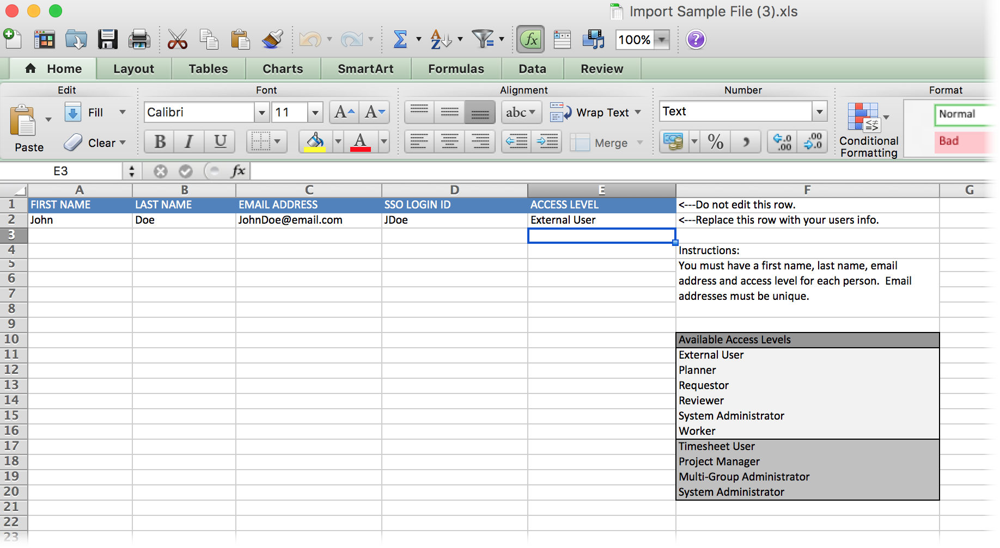

# Importar usuários

<!--

>[!IMPORTANT]
>
>The procedure described on this page applies only to organizations that have not yet been onboarded to the Admin Console. If your organization has been onboarded to the Adobe Admin Console, you must perform this action through the Adobe Admin Console.
>
>For instructions on editing a user's profile in the Adobe Admin Console, see the section "Add users" in the article [Bulk Upload Users](https://helpx.adobe.com/br/enterprise/using/bulk-upload-users.html) or contact your Adobe Admin Console Administrator.
>
>For a list of procedures that differ based on whether your organization has been onboarded to the Adobe Admin Console, see [Platform-based administration differences (Adobe Workfront/Adobe Business Platform)](../../../administration-and-setup/get-started-wf-administration/actions-in-admin-console.md).

-->

Você pode importar usuários usando um arquivo de importação de planilha.

Antes de criar um novo usuário, primeiro verifique se você criou todos os objetos que deseja associar ao usuário. Por exemplo, se você não criou um agendamento, não pode atribuir um agendamento ao novo usuário e o campo que você usa para associar um agendamento com o novo usuário não aparecerá na tela Novo Usuário.

## Requisitos de acesso

+++ Expanda para visualização requisitos de acesso do funcionalidade neste artigo.

Você deve ter o seguinte acesso para executar as etapas neste artigo:

<table style="table-layout:auto"> 
 <col> 
 <col> 
 <tbody> 
  <tr> 
   <td role="rowheader">Adobe Systems plano da Workfront</td> 
   <td>Qualquer</td> 
  </tr> 
  <tr> 
   <td role="rowheader">licença da Adobe Systems Workfront</td> 
   <td>
Novo: Padrão

Ou

Atual: Plano
</td> 
  </tr> 
  <tr> 
   <td role="rowheader">Configurações de nível de acesso</td> 
   <td> 
Você deve ter um dos seguintes:
 
    <ul> 
     <li> 
O nível de acesso do Administrador do sistema. </li> 
     <li> 
<b>Os usuários</b> configuram em seu nível de acesso configurado para <b>Editar</b> acesso, com <b>Criar</b> e pelo menos uma das duas <b>opções de Administrador</b> de usuários ativadas em <b>Ajustar suas configurações</b>. 
 
Dessas duas opções, se <b>o Administrador de usuários (usuários do grupo)</b> estiver ativado, você deve ser um administrador grupo de um grupo em que o usuário é membro.
 </li> 
    </ul> </td> 
  </tr> 
 </tbody> 
</table>

Para obter mais detalhes sobre as informações nesta tabela, consulte [Os requisitos de acesso na documentação](/help/quicksilver/administration-and-setup/add-users/access-levels-and-object-permissions/access-level-requirements-in-documentation.md) da Workfront.

+++

## Usar um arquivo de importação de planilha para importar usuários

{{step-1-to-users}}

1. Clique na **seta suspensa Novo Usuário** e, em seguida, clique **Importar Usuários**.

1. Na caixa **Importar Usuários** que é exibida, baixe o arquivo de amostra e atualize-o para incluir suas informações pessoais de usuário.

   Cada linha inclui os seguintes campos:

   * **Nome**
   * **Sobrenome**
   * **Endereço eletrônico**

     Os endereços de email devem ser exclusivos.

   * **Nível de acesso**

     Os níveis de acesso são diferencia maiúsculas de minúsculas.

   * **ID de logon SSO**

     Este campo é incluído somente se o SSO estiver ativado em seu sistema. Você deve adicionar a ID da Federação neste campo para cada usuário. Ao criar um usuário na guia Pessoas, você pode configurar uma senha para o usuário se quiser permitir que os usuários façam logon sem SSO. No entanto, o recurso de importação não permite que você deixe a ID DE LOGON DE SSO em branco.

   * Verifique se não há espaços extras antes ou depois do endereço de email de um usuário.

   Quando terminar de usar uma linha, ela deverá ter esta aparência:

   

1. Salve o arquivo em um local na estação de trabalho.
1. Clique **em Escolher Arquivo** na **caixa Importar Usuários** .

1. Navegue até o arquivo salvo e selecione-o.
1. (Opcional) Selecione a opção **Enviar um email de convite para esta usuário** opção de enviar um convite por e-mail para o usuário, notificando-os de que um conta da Workfront foi criado e levando-os a definir suas senha.

   Desmarque essa opção se desejar definir a senha para a usuário.

1. Clique **Importar**.

   Você receberá uma mensagem de confirmação na parte superior da tela de que o usuário foi importado com êxito.
