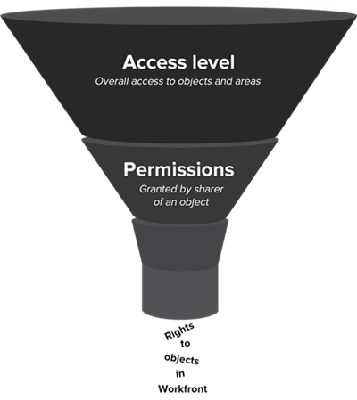

# Visão geral dos níveis de acesso

>[!NOTE]
>
>As informações neste artigo se referem aos níveis de acesso atuais. Para obter informações sobre os níveis de acesso legados, consulte [Visão geral dos níveis de acesso](/help/quicksilver/administration-and-setup/add-users/access-levels-and-object-permissions/access-levels-overview.md).

Como administrador do Adobe Workfront, você atribui um nível de acesso a um usuário para 2 fins:

* Todos os usuários devem ter um nível de acesso para fazer logon e trabalhar no Workfront.
* Você usa o nível de acesso para controlar o que um usuário pode ver e fazer com determinados objetos e áreas do Workfront.

## Novos níveis de acesso integrados ao Adobe Workfront {#built-in-access}

O Workfront tem cinco novos níveis de acesso integrados:

* Administrador de sistema
* Padrão
* Light
* Colaborador
* Externo

Dependendo do nível de acesso, até três permissões estão disponíveis para a maioria dos tipos de objeto do Workfront:

<table style="table-layout:auto">
    <tr>
        <td>Editar</td>
        <td>Os usuários podem criar, editar, excluir e compartilhar os objetos do Workfront</td>
    </tr>
    <tr>
        <td>Visualizar</td>
        <td>Os usuários podem revisar e compartilhar os objetos do Workfront</td>
    </tr>
    <tr>
        <td>Sem acesso</td>
        <td>Os usuários não podem acessar os objetos do Workfront</td>
    </tr>
</table>

Se você precisar de um nível de acesso personalizado, poderá copiar o nível de acesso integrado e ajustar a quantidade de acesso que deseja que ele permita para os vários tipos de objeto do Workfront. Para obter informações sobre como criar um nível de acesso personalizado, consulte [Criar ou modificar níveis de acesso personalizados](../../../administration-and-setup/add-users/configure-and-grant-access/create-modify-access-levels.md).

>[!IMPORTANT]
>
>É altamente recomendável deixar os níveis de acesso integrados inalterados para que possa consultá-los após configurar os usuários.

### Nível de acesso de administrador do sistema

Anexado à licença padrão, esse nível de acesso integrado foi projetado para um usuário responsável pela administração do sistema do Adobe Workfront. Não é possível modificar esse nível de acesso integrado.

Os usuários com nível de acesso de administrador do sistema podem fazer tudo dentro do Workfront. Eles podem visualizar e editar todos os objetos e informações do Workfront inseridos no Workfront por todos os outros usuários.

Eles também têm acesso à área Configuração completa, onde podem alterar qualquer configuração no nível do sistema e acessar todas as áreas no menu principal.

Para obter mais informações, consulte [Conceder acesso administrativo total a um usuário](../../../administration-and-setup/add-users/configure-and-grant-access/grant-a-user-full-administrative-access.md).

### Nível de acesso padrão

Também anexado à licença padrão, esse nível de acesso foi projetado para usuários que querem:

* Planejar, criar e acompanhar todos os projetos em um único local
* Automatizar processos de rotina
* Gerenciar recursos
* Rastrear e colaborar nas solicitações
* Rastrear e relatar as finanças do projeto
* Iniciar solicitações de trabalho de entrada
* Colaborar em projetos, tarefas e problemas

>[!NOTE]
>
>Você pode criar uma versão personalizada do nível de acesso integrado padrão e ajustar a quantidade de acesso permitida para os vários tipos de objeto do Workfront. Para obter informações sobre como criar um nível de acesso personalizado, consulte [Criar ou modificar níveis de acesso personalizados](../../../administration-and-setup/add-users/configure-and-grant-access/create-modify-access-levels.md).

#### **Detalhes do acesso**

A seguir, estão as configurações de acesso mais altas disponíveis para objetos no nível de acesso padrão:

| Tipo de objeto do Workfront | Sem acesso | Acesso para visualizar | Acesso para editar |
|---|---|---|---|
| Projetos |   |   | ✓ |
| Tarefas |   |   | ✓ |
| Problemas |   |   | ✓ |
| Portfólios |   |   | ✓ |
| Programas |   |   | ✓ |
| Relatórios (incluindo painéis e relatórios de calendário) |   |   | ✓ |
| Filtros, visualizações e agrupamentos |   |   | ✓ |
| Documentos |   |   | ✓ |
| Usuários |   |   | ✓ |
| Função no trabalho |   |   | ✓ |
| Equipes |   |   | ✓ |
| Modelos |   |   | ✓ |
| Dados financeiros |   |   | ✓ |
| Gerenciamento de recursos |   |   | ✓ |
| Planejador de cenários |   |   | ✓ (A configuração padrão é Sem acesso.) |
| Metas |   |   | ✓ |

{style="table-layout:auto"}

### Nível de acesso Light

Anexado à licença Light, esse nível de acesso foi projetado para usuários que querem:

* Visualizar todos os itens e atualizações vinculados ao trabalho
* Aprovar projetos, tarefas e problemas
* Visualizar painéis e relatórios
* Acompanhe o tempo em projetos, tarefas e problemas e aprove planilhas de horas
* Criar e gerenciar problemas

Usuários com nível de acesso Light:

* Podem ser atribuídos a itens de trabalho, mas não podem concluí-los.
* Podem acessar solicitações e documentos no menu principal.
* Têm capacidade limitada para criar objetos — não podem criar projetos, portfólios, programas ou relatórios.
* Só é possível registrar horas no nível do projeto quando o acesso Editar está habilitado. Eles não podem criar, editar, excluir ou compartilhar projetos.
* Pode atualizar formulários personalizados somente em ocorrências e documentos.

>[!NOTE]
>
>Você pode criar uma versão personalizada do nível de acesso integrado Light e ajustar a quantidade de acesso que ele permite para os diversos tipos de objetos do Workfront. Para obter informações sobre como criar um nível de acesso personalizado, consulte [Criar ou modificar níveis de acesso personalizados](../../../administration-and-setup/add-users/configure-and-grant-access/create-modify-access-levels.md).

#### **Detalhes do acesso**

A seguir, estão as configurações de acesso mais altas disponíveis para objetos no nível de acesso Light:

<table style="table-layout:auto"> 
 <col> 
 <col> 
 <col> 
 <col> 
 <thead> 
  <tr> 
   <th>Tipo de objeto do Workfront</th> 
   <th>Sem acesso</th> 
   <th>Acesso para visualizar</th> 
   <th>Acesso para editar</th> 
  </tr> 
 </thead> 
 <tbody> 
  <tr> 
   <td>Projetos</td> 
   <td> </td> 
   <td> </td> 
   <td>✓ (para o tempo de registro no nível do projeto)</td> 
  </tr> 
  <tr> 
   <td>Tarefas</td> 
   <td> </td> 
   <td></td> 
   <td>✓ (limitado)</td> 
  </tr> 
  <tr> 
   <td>Problemas</td> 
   <td> </td> 
   <td> </td> 
   <td>✓</td> 
  </tr> 
  <tr> 
   <td>Portfólios</td> 
   <td> </td> 
   <td>✓ (A configuração padrão é Sem acesso.)</td> 
   <td> </td> 
  </tr> 
  <tr> 
   <td>Programas</td> 
   <td> </td> 
   <td>✓ (A configuração padrão é Sem acesso.)</td> 
   <td> </td> 
  </tr> 
  <tr> 
   <td>Relatórios (incluindo painéis e relatórios de calendário)</td> 
   <td> </td> 
   <td>✓</td> 
   <td> </td> 
  </tr> 
  <tr> 
   <td>Filtros, visualizações e agrupamentos</td> 
   <td> </td> 
   <td> </td> 
   <td>✓</td> 
  </tr> 
  <tr> 
   <td>Documentos</td> 
   <td> </td> 
   <td> </td> 
   <td>✓</td> 
  </tr> 
  <tr> 
   <td>Usuários</td> 
   <td> </td> 
   <td>✓</td> 
   <td> </td> 
  </tr> 
  <tr> 
   <td>Função no trabalho</td> 
   <td> </td> 
   <td>✓</td> 
   <td> </td> 
  </tr> 
  <tr> 
   <td>Equipes</td> 
   <td> </td> 
   <td>✓</td> 
   <td> </td> 
  </tr>
  <tr> 
   <td>Modelos</td> 
   <td>✓</td> 
   <td> </td> 
   <td> </td> 
  </tr> 
  <tr> 
   <td>Dados financeiros</td> 
   <td></td> 
   <td> 
✓ (A configuração padrão é Sem Acesso)
 </td> 
   <td> </td> 
  </tr> 
  <tr> 
   <td>Gerenciamento de recursos</td> 
   <td> </td> 
   <td>✓</td> 
   <td> </td> 
  </tr> 
  <tr> 
   <td>Planejador de cenários </td> 
   <td> </td> 
   <td> </td> 
   <td>✓ (A configuração padrão é Sem acesso.)</td> 
  </tr>

<tr>   
   <td>Metas </td> 
   <td> </td> 
   <td> </td> 
   <td>✓ (A configuração padrão é Sem Acesso)</td> 
 </tbody> 
</table>

### Nível de acesso Colaborador

Anexado à licença Colaborador, este nível de acesso foi projetado para usuários que:

* Enviam solicitações
* Rastreiam solicitações
* Atualizam e revisam solicitações
* Aprovam solicitações

Usuários com este nível de acesso integrado:

* Podem fazer solicitações e atualizar essas solicitações
* Podem fazer upload e aprovar documentos
* Podem aprovar projetos, tarefas e questões

  >[!NOTE]
  >
  >Os colaboradores podem participar das aprovações, mas não podem acessar a guia Aprovações para visualizar ou gerenciar os processos de aprovação.

* Podem verificar o status das questões que enviaram
* Pode atualizar formulários personalizados somente em ocorrências e documentos.
* Podem ser atribuídos a itens de trabalho, mas não podem concluí-los
* Podem acessar solicitações somente no menu principal. Para obter mais informações sobre filas de solicitações, consulte [Criar uma fila de solicitações](../../../manage-work/requests/create-and-manage-request-queues/create-request-queue.md).

>[!NOTE]
>
>Você pode criar uma versão personalizada do nível de acesso integrado de colaborador e ajustar a quantidade de acesso que ele permite para os diversos tipos de objetos do Workfront. Para obter informações sobre como criar um nível de acesso personalizado, consulte [Criar ou modificar níveis de acesso personalizados](../../../administration-and-setup/add-users/configure-and-grant-access/create-modify-access-levels.md).

#### **Detalhes de acesso**

A seguir estão as configurações de acesso mais altas disponíveis para objetos no nível de acesso Colaborador:

| Tipo de objeto do Workfront | Sem acesso | Acesso para visualizar | Acesso para editar |
|---|---|---|---|
| Projeto |   | ✓ (limitado) |   |
| Tarefa |   | ✓(limitado) |   |
| Problema |   |   | ✓ |
| Portfólios |   | ✓ |   |
| Programas |   | ✓ |   |
| Relatórios (incluindo painéis e relatórios de calendário) |   | ✓ (Somente a guia Detalhes) |   |
| Filtros, visualizações e agrupamentos |   |   | ✓ |
| Documento |   |   | ✓ |
| Usuários |   | ✓ |   |
| Função no trabalho |   | ✓ |   |
| Equipes |   | ✓ |   |
| Modelos | ✓ |   |   |
| Dados financeiros | ✓ |   |   |
| Gerenciamento de recursos | ✓ |   |   |
| Planejador de cenários | ✓ |   |   |
| Metas |   |   | ✓ (A configuração padrão é Sem Acesso) |

{style="table-layout:auto"}

>[!IMPORTANT]
>
>A partir da versão 24.7, os colaboradores têm acesso de visualização aos programas e portfólios por padrão.
>
> 
>Os colaboradores adicionados antes do lançamento da versão 24.7 continuarão sem acesso aos Programas e Portfólios por padrão. Você pode atualizar o acesso deles para visualização manualmente, se necessário.

### Nível de acesso Usuário externo

Este nível de acesso não está vinculado a uma licença paga do Workfront. É o nível de acesso mais restritivo, projetado principalmente para colaboradores como consultores externos que não fazem login no Workfront, mas precisam revisar, baixar ou visualizar documentos ocasionalmente.

Usuários com nível de acesso Usuário externo:

* Podem visualizar somente documentos e relatórios de calendário compartilhados com eles
* Visualizam os usuários que compartilharam documentos e relatórios de calendário com eles
* Aprovam os documentos compartilhados com eles

Usuários externos não podem ser atribuídos a itens de trabalho.

Não é possível modificar esse nível de acesso.

>[!IMPORTANT]
>
>O usuário externo só estará disponível se a opção &quot;Colaborar com pessoas sem contas do Workfront usando seu endereço de email&quot; estiver ativada na área Preferências do sistema em Configuração. Para obter mais informações, consulte [Configurar preferências de segurança do sistema](/help/quicksilver/administration-and-setup/manage-workfront/security/configure-security-preferences.md).

#### **Detalhes do acesso**

A seguir, estão as configurações de acesso mais altas disponíveis para objetos no nível de acesso de Usuário externo.

| Tipo de objeto do Workfront | Sem acesso | Acesso para visualizar | Acesso para editar |
|---|---|---|---|
| Projeto | ✓ |   |   |
| Tarefa | ✓ |   |   |
| Problema | ✓ |   |   |
| Portfólios | ✓ |   |   |
| Programas | ✓ |   |   |
| Relatórios (incluindo painéis e relatórios de calendário) |   | ✓ (Somente para relatórios de calendário; sem capacidade de compartilhar relatórios) |   |
| Filtros, visualizações e agrupamentos | ✓ |   |   |
| Documento |   | ✓ (Sem capacidade de compartilhar documentos) |   |
| Usuários |   | ✓ |   |
| Função no trabalho | ✓ |   |   |
| Equipes | ✓ |   |   |
| Modelos | ✓ |   |   |
| Dados financeiros | ✓ |   |   |
| Gerenciamento de recursos | ✓ |   |   |
| Planejador de cenários | ✓ |   |   |
| Metas | ✓ |   |   |

## Como os níveis de acesso e as permissões funcionam juntos

Os níveis de acesso definem o que os usuários podem ver e fazer com tipos de objetos gerais e áreas no sistema, como projetos, tarefas e problemas. As permissões definem a que você tem acesso em objetos específicos criados por outras pessoas no sistema, como um projeto criado para executar uma campanha de marketing.

A tabela a seguir compara o acesso geral de um usuário aos objetos (definido pelo nível de acesso do usuário) com permissões para um objeto compartilhado específico:

<table style="table-layout:auto"> 
 <col> 
 <col> 
 <col> 
 <thead> 
  <tr> 
   <th> </th> 
   <th>Nível de acesso </th> 
   <th>Permissões </th> 
  </tr> 
 </thead> 
 <tbody> 
  <tr> 
   <td>Concedido por um administrador do Workfront no nível de acesso de um usuário</td> 
   <td>✓</td> 
   <td> </td> 
  </tr> 
  <tr> 
   <td>Concedido por um usuário que compartilha um objeto no nível do objeto</td> 
   <td> </td> 
   <td>✓</td> 
  </tr> 
  <tr> 
   <td> 
Herdado de um objeto compartilhado de classificação mais alta 
   </td> 
   <td> </td> 
   <td>✓</td> 
  </tr> 
 </tbody> 
</table>

As atividades que um usuário pode realizar com um objeto são definidas por uma combinação entre o nível de acesso e as permissões concedidas a ele.

### Conceder permissões por meio do compartilhamento de objetos

Os usuários obtêm acesso a objetos individuais quando outros usuários compartilham e concedem determinadas permissões nesses objetos.

>[!NOTE]
>
>* Se um usuário compartilhar um objeto com determinadas permissões e esse objeto tiver objetos secundários abaixo dele, o destinatário herdará as mesmas permissões para eles também.
>* Se um nível de acesso impedir que os usuários excluam determinados objetos, isso não os impedirá de excluir objetos secundários contidos nesses objetos.

Um usuário pode conceder ao destinatário qualquer uma das seguintes permissões para o objeto individual:

* **Visualização**: esse nível de permissão permite que o destinatário compartilhe o objeto de uma das seguintes maneiras:

   * Em todo o sistema, para que todos os usuários possam visualizá-lo (não disponível para todos os objetos)
   * Com usuários externos que não têm uma licença do Workfront (não disponível para todos os objetos)
   * Com um endereço de email (disponível somente para documentos e calendários)

* **Contribute**: (não disponível para todos os objetos)
* **Gerenciamento**: quando alguém compartilha um objeto, os direitos do destinatário ao objeto são determinados por uma combinação entre o nível de acesso do destinatário e as permissões do objeto que foram concedidas pelo compartilhador. O nível de acesso mais baixo disponível nessa combinação é o que determina o que o destinatário pode fazer com o objeto.

### Exemplos de cenários

#### **Cenário 1**

Se o nível de acesso do destinatário não permitir a edição do projeto, essa pessoa não poderá editar ou excluir um projeto, mesmo que quem o compartilhou tenha concedido permissões para gerenciá-lo.

Ou, se o nível de acesso do destinatário permitir a edição do projeto, mas quem compartilhou concedeu permissões somente de visualização para um projeto, o usuário não poderá editar ou excluir o projeto.

#### **Cenário 2**

Quando Olivia compartilha um projeto do Workfront com Tony, o acesso de Tony ao projeto é determinado por uma combinação de dois fatores:

* O nível de acesso de Tony, atribuído pelo administrador do Workfront
* As permissões de Tony para o projeto, especificadas por Olivia

As ações de Tony no projeto podem ser ainda mais restringidas no próprio projeto, mas não podem ser irrestritas além do que é permitido em seu nível de acesso:

* Se o nível de acesso de Tony não permitir que ele crie tarefas, ele não poderá adicionar tarefas ao projeto, mesmo que Olivia tenha lhe dado permissões para adicionar tarefas.
* Se o nível de acesso de Tony permitir que ele crie tarefas, mas Olivia não tiver concedido permissões para adicionar tarefas ao projeto, ele não poderá adicionar tarefas a esse projeto, mas poderá adicionar tarefas a outros projetos nos quais tenha recebido permissões para isso.
