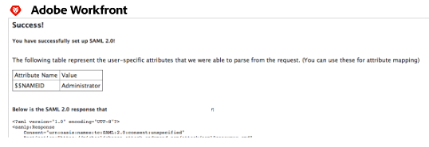

# Configurar o Adobe Workfront com SAML 2.0 usando ADFS

{{important-admin-console-onboard}}

Como administrador do Adobe Workfront, você pode integrar o Workfront a uma solução SAML (Security Assertion Markup Language) 2.0 para logon único ao usar os ADFS (Ative Diretory Federation Services).

Este guia tem como foco a configuração do ADFS sem provisionamento automático ou mapeamentos de atributos. Recomendamos concluir a configuração e testá-la antes de configurar qualquer provisionamento automático.

## Requisitos de acesso

+++ Expanda para visualizar os requisitos de acesso para a funcionalidade neste artigo.

Você deve ter o seguinte acesso para executar as etapas deste artigo:

<table style="table-layout:auto"> 
 <col> 
 <col> 
 <tbody> 
  <tr> 
   <td role="rowheader">plano do Adobe Workfront</td> 
   <td>Qualquer</td> 
  </tr> 
  <tr> 
   <td role="rowheader">Licença do Adobe Workfront</td> 
   <td>Plano</td> 
  </tr> 
  <tr> 
   <td role="rowheader">Configurações de nível de acesso</td> 
   <td> 
Você deve ser um administrador do Workfront.
 
<b>OBSERVAÇÃO</b>: se você ainda não tiver acesso, pergunte ao administrador do Workfront se ele definiu restrições adicionais no seu nível de acesso. Para obter informações sobre como um administrador do Workfront pode modificar seu nível de acesso, consulte <a href="../../../administration-and-setup/add-users/configure-and-grant-access/create-modify-access-levels.md" class="MCXref xref">Criar ou modificar níveis de acesso personalizados</a>.
 </td> 
  </tr> 
 </tbody> 
</table>

+++

## Habilitar autenticação para o Workfront com SAML 2.0

Para habilitar a autenticação para o aplicativo web do Workfront e o aplicativo móvel do Workfront com SAML 2.0, conclua as seguintes seções:

* [Recuperar o arquivo de metadados de SSO do Workfront](#retrieve-the-workfront-sso-metadata-file)
* [Configurar Confiança da Terceira Parte Confiável](#configure-relying-party-trusts)
* [Configurar Regras de Declaração](#configure-claim-rules)
* [Fazer upload do arquivo de metadados e testar a conexão](#upload-the-metadata-file-and-test-the-connection)

### Recuperar o arquivo de metadados de SSO do Workfront {#retrieve-the-workfront-sso-metadata-file}

{{step-1-to-setup}}

1. No painel esquerdo, clique em **Sistema** > **Logon Único (SSO)**.
1. No menu suspenso **Tipo**, clique em **SAML 2.0** para exibir informações e opções adicionais.
1. Copie a URL exibida após **a URL de metadados**.
1. Prossiga para a seguinte seção, [Configurar Objeto de Confiança de Terceira Parte Confiável](#configure-relying-party-trusts).

### Configurar Confiança da Terceira Parte Confiável {#configure-relying-party-trusts}

1. Abra o **ADFS Manager** usando o Windows Server 2008 R2 (a versão pode variar).
1. Ir para **Início.**
1. Clique em **Ferramentas Administrativas.**
1. Clique em **Gerenciamento do ADFS 2.0.**
1. Selecione **ADFS** e expanda **Relações de Confiança**.
1. Clique com o botão direito do mouse em **Confiança da Terceira Parte Confiável** e selecione **Adicionar Confiança da Terceira Parte Confiável** para iniciar o Assistente para Adicionar Confiança da Terceira Parte Confiável.
1. Na **Página de Boas-vindas**, selecione **Iniciar**.
1. Na seção **Selecionar Source de Data**, cole a URL de metadados do Workfront.
1. Clique em **Avançar**.
1. Clique em **OK** para confirmar a mensagem de aviso.
1. Na seção **Especificar Nome para Exibição**, adicione um **Nome para Exibição** e **Observações** para distinguir a Confiança e clique em **Avançar**.
1. Selecione **Permitir que todos os usuários acessem esta terceira parte confiável** (Ou **Nenhuma** se desejar configurá-la posteriormente).
1. Clique em **Avançar**.

   Você será direcionado à seção **Pronto para Adicionar Confiança**.

1. Prossiga para a seguinte seção [Configurar Regras de Declaração](#configure-claim-rules).

### Configurar Regras de Declaração {#configure-claim-rules}

1. Clique em **Avançar** na seção **Pronto para Adicionar Confiança** e verifique se a opção **Abrir a caixa de diálogo Editar Regras de Declaração** está selecionada.

   Isso permitirá que você edite as Regras de reclamação em uma etapa futura.

1. Clique em **Fechar**.
1. Clique em **Adicionar regra.**
1. Selecione **Enviar Atributo LDAP como Declarações**.
1. Clique em **Avançar** para exibir a etapa **Configurar Regra de Declaração**.
1. Especifique os seguintes requisitos mínimos para configurar a regra de declaração: (Isso irá para a **ID da Federação** na configuração do usuário e é usado para distinguir quem está fazendo logon.)

   <table >                
      <tbody>
            <tr>
               <td>Nome da regra de reclamação
               </td>
               <td>Especifique um nome para a regra de reclamação. Por exemplo, "Workfront".</td>
            </tr>
            <tr>
               <td>Repositório de atributos</td>
               <td >Selecione <b>Ative Diretory</b> no menu suspenso.</td>
            </tr>
            <tr>
               <td>Atributo LDAP</td>
               <td>Pode ser qualquer tipo de atributo. Recomendamos usar <b>SAM-Account-Name</b> para este atributo.</td>
            </tr>
            <tr>
               <td>Tipo de Declaração de Saída</td>
               <td>Você deve selecionar <b>ID de Nome</b> como o tipo de declaração de saída</td>
            </tr>
      </tbody>
   </table>

1. (Opcional) Para estabelecer o provisionamento automático, adicione as seguintes declarações adicionais no Atributo LDAP e no Tipo de Declaração de Saída:

   * Nome
   * Sobrenome
   * Endereço de e-mail

1. Clique em **Concluir** e em **OK** na próxima tela.
1. Clique com o botão direito do mouse na nova **Terceira Parte Confiável** e selecione **Propriedades**.
1. Selecione a **Guia Avançado**. E em **Algoritmo de hash seguro**, selecione SHA-1 ou SHA-256.

   >[!NOTE]
   >
   >A opção selecionada em Algoritmo de hash seguro deve corresponder ao campo Algoritmo de hash seguro no Workfront em Configuração > Sistema > Logon único (SSO).

1. Prossiga para a seguinte seção [Fazer upload do arquivo de metadados e testar a conexão](#upload-the-metadata-file-and-test-the-connection).

### Fazer upload do arquivo de metadados e testar a conexão {#upload-the-metadata-file-and-test-the-connection}

1. Abra um navegador e navegue até `https://<yourserver>/FederationMetadata/2007-06/FederationMetadata.xml` .

   Isso deve baixar um arquivo de metadados FederationMetadata.xml.

1. Clique em **Escolher Arquivo** em **Preencher campos a partir dos Metadados do Provedor de Identidade** e selecione o arquivo **FederationMetadata.xml**.

1. (Opcional) Se as informações do certificado não foram preenchidas com o arquivo de metadados, você pode fazer upload de um arquivo separadamente. Selecione **Escolher Arquivo** na seção **Certificado**.

1. Clique em **Testar Conexão**. Se configurada corretamente, você deverá ver uma página semelhante à mostrada abaixo:

   

   >[!NOTE]
   >
   >Se quiser configurar o mapeamento de atributos, certifique-se de copiar os atributos da Conexão de Teste para o Atributo de Diretório. Para obter mais informações, consulte Mapeamento de atributos de usuário.

1. Selecione **Isenção de administrador** para permitir que os administradores do Workfront façam logon usando as credenciais da Workfront com a URL de desvio.

   Os indicadores que apontam para `<yourdomain>`.my.workfront.com/login ignoram o redirecionamento.

1. Selecione a caixa **Habilitar** para habilitar a configuração.
1. Clique em **Salvar**.

## Sobre a atualização de usuários para SSO

Seguindo este guia, o **Nome de Usuário do SSO** será seu **Nome de Usuário do Ative Diretory**.

Como administrador do Workfront, você pode atualizar usuários em massa para o SSO. Para obter mais informações sobre como atualizar usuários para SSO, consulte [Atualizar usuários para logon único](../../../administration-and-setup/add-users/single-sign-on/update-users-sso.md).

Como administrador do Workfront, você também pode atribuir manualmente uma ID da Federação editando o perfil do usuário e preenchendo o campo ID da Federação. Para obter mais informações sobre como editar um usuário, consulte [Editar perfil de usuário](../../../administration-and-setup/add-users/create-and-manage-users/edit-a-users-profile.md).

>[!NOTE]
>
>Ao editar os perfis dos usuários para incluir uma Federation ID, selecionar **Permitir Apenas Autenticação SAML 2.0** remove a capacidade de fazer logon no Workfront usando a URL de bypass (`<yourdomain>`.my.workfront.com/login).
