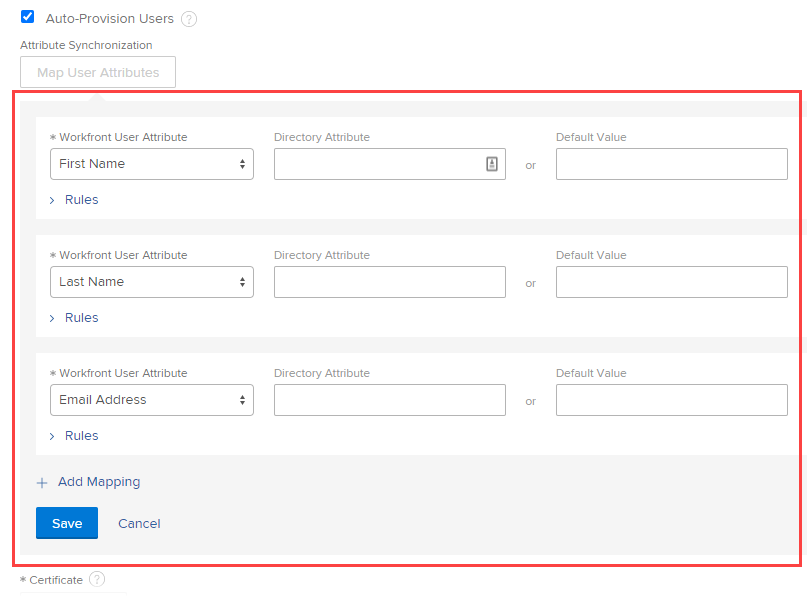

# Configurar o Adobe Workfront com SAML 2.0

<!--
**DON'T DELETE, DRAFT OR HIDE THIS ARTICLE. IT IS LINKED TO THE PRODUCT, THROUGH THE CONTEXT SENSITIVE HELP LINKS.** 

-->

{{important-admin-console-onboard}}

Como administrador do Adobe Workfront, você pode configurar os aplicativos móveis e da Web do Workfront para se integrarem a uma solução SAML (Security Assertion Markup Language) 2.0 para logon único (SSO).

Depois de configurar o SAML 2.0 no Workfront, conforme descrito nas seções a seguir, você poderá manter a configuração, conforme descrito em [Atualizar metadados do SAML 2.0 no provedor de identidade](../../../administration-and-setup/add-users/single-sign-on/update-saml-2-metadata-ip.md).

## Requisitos de acesso

Você deve ter o seguinte acesso para executar as etapas deste artigo:

<table style="table-layout:auto"> 
 <col> 
 <col> 
 <tbody> 
  <tr> 
   <td role="rowheader">plano do Adobe Workfront</td> 
   <td>Qualquer</td> 
  </tr> 
  <tr> 
   <td role="rowheader">Licença do Adobe Workfront</td> 
   <td>
Novo: Padrão 

       
ou
 
       
Atual: Plano 

   </td> 
  </tr> 
  <tr> 
   <td role="rowheader">Configurações de nível de acesso</td> 
   <td> 
Você deve ser um administrador do Workfront.
 
<b>NOTA</b>: se você ainda não tiver acesso, pergunte ao administrador do Workfront se ele definiu restrições adicionais em seu nível de acesso. Para obter informações sobre como um administrador do Workfront pode modificar seu nível de acesso, consulte <a href="../../../administration-and-setup/add-users/configure-and-grant-access/create-modify-access-levels.md" class="MCXref xref">Criar ou modificar níveis de acesso personalizados</a>.
 </td> 
  </tr> 
 </tbody> 
</table>

## Habilitar autenticação para o Workfront com SAML 2.0

{{step-1-to-setup}}

1. Clique em **Sistema** > **Logon único (SSO).**

1. No **Tipo** selecione **SAML 2.0.**

1. Ao lado da parte superior das opções exibidas, clique em **Baixar os Metadados do SAML 2.0** para baixar o arquivo no seu computador.

   O Provedor de Identidade SAML 2.0 requer um arquivo XML com informações geradas na instância do Workfront. Depois de baixar o arquivo, você deve acessar o servidor do Provedor de Identidade SAML 2.0 e carregar o arquivo XML de metadados Workfront SAML 2.0 nele.

1. Especifique as seguintes informações no Workfront:

   <table style="table-layout:auto">
    <col>
    <col>
    <tbody>
     <tr>
      <td role="rowheader">Provedor de Serviço </td>
      <td> Este URL, já preenchido para você, identifica o Workfront para seu provedor de identidade. Por exemplo: <code>&lt;yourcompany&gt;.com/SAML2</code>.</td>
     </tr>
     <tr>
      <td role="rowheader">Tipo de vínculo </td>
      <td> 
Selecione o método compatível com o servidor IDP para enviar informações de autenticação:

       <ul>
       <li>POST</li>
       <li>REDIRECIONAR</li>
       </ul> </td>
     </tr>
     <tr>
      <td role="rowheader">Preencher campos a partir dos metadados do provedor de identidade </td> 
      <td>Na solução Provedor de identidade SAML 2.0, exporte um arquivo XML de metadados do provedor de serviços e salve-o em um local temporário no computador. Selecionar <strong>Escolher arquivo</strong>, localize e selecione o arquivo salvo para adicioná-lo à sua configuração do Workfront.</td> 
     </tr> 
     <tr> 
      <td role="rowheader">URL do Portal de Login </td> 
      <td>Insira o portal de logon comum da sua organização. Este é o URL no qual os usuários fazem logon para acessar o Workfront e todos os outros aplicativos integrados ao SAML 2.0.</td> 
     </tr>
     <tr>
      <td role="rowheader">URL de saída </td> 
      <td> 
Insira o URL de saída do servidor IDP. O Workfront envia uma solicitação HTTP para esse URL antes de sair do Workfront. Isso fecha a sessão do usuário no servidor remoto quando a sessão do Workfront é encerrada.
 
<b>NOTA</b>: você será redirecionado para o URL de saída somente se tiver a opção <strong>Permitir apenas Autenticação SAML 2.0</strong> ativado no seu perfil de usuário.
 </td>
     </tr>
     <tr>
      <td role="rowheader">Endereço para alterar senha </td> 
      <td> 
 Especifique o URL para o qual os usuários serão redirecionados para alterar suas senhas. 
 
Como as credenciais do SAML 2.0 são usadas para acessar o Workfront, os usuários devem ser redirecionados para uma página em que possam alterar sua senha do SAML 2.0 em vez de concluir essa atividade por meio do Workfront.
 </td> 
     </tr> 
     <tr> 
      <td role="rowheader">Algoritmo de hash seguro </td> 
      <td> 
Selecione o Secure Hash Algorithm (SHA) compatível com o IDP:
 
       <ul> 
       <li>SHA-1</li> 
       <li>SHA-256</li> 
       </ul> </td> 
     </tr> 
     <tr> 
      <td role="rowheader">Usuários auto provisionados </td> 
      <td> 
Esta opção cria automaticamente um usuário no sistema quando um novo usuário com um nome de usuário e senha de diretório tenta fazer logon no Workfront pela primeira vez.
 
Para criar usuários no Workfront, você deve mapear atributos de dados do Workfront com os seguintes atributos de dados do usuário no provedor de diretório:
 
       <ul> 
       <li>Nome</li> 
       <li>Sobrenome</li> 
       <li>Endereço de email</li> 
       </ul> 
       
Ao marcar a caixa de seleção, as seguintes opções são exibidas:
 
       
  
 
       
Selecione o Atributo de Usuário do Workfront que deseja mapear na lista drop-down e, em seguida, especifique o Atributo de Diretório correspondente no diretório de usuário.
 
       
A variável <strong>Diretório de Atributo</strong> O campo deve conter o Nome do atributo de diretório na tabela Atributo do usuário que você salvou ao testar com êxito a configuração do SAML 2.0.
 
       
Você pode definir um Valor padrão de Workfront na variável <strong>Valor padrão</strong> campo. Você também pode definir regras com base nos valores do seu Provedor de Identidade SAML 2.0.
 
       
<b>AVISO</b>: o Workfront tenta mapear os atributos listados abaixo sempre que um usuário fizer logon no sistema. Por causa disso, não recomendamos mapear os níveis de acesso. Você poderá remover facilmente o acesso administrativo se um atributo for mapeado incorretamente. Clique em <strong>Adicionar mapeamento</strong> para adicionar outras regras.
       
 
       
Você pode mapear os seguintes atributos do Workfront:
 
      <ul> 
      <li> 
Nível de acesso
 </li> 
      <li> 
Endereço
 </li> 
      <li> 
Endereço2
 </li> 
      <li> 
Cobrança por hora
 </li> 
      <li> 
Cidade
 </li> 
      <li> 
Empresa
 </li> 
      <li> 
Custo por hora
 </li> 
      <li> 
Endereço de email
 </li> 
      <li> 
Extensão
 </li> 
      <li> 
Nome
 </li> 
      <li> 
Grupo padrão
 </li> 
      <li> 
Equipe interna
 </li> 
      <li> 
Função no trabalho
 </li> 
      <li> 
Sobrenome
 </li> 
      <li> 
Modelo de Layout
 </li> 
      <li> 
Gerente
 </li> 
      <li> 
Telefone celular
 </li> 
      <li> 
Número de telefone
 </li> 
      <li> 
Código postal
 </li> 
      <li> 
Agendar
 </li> 
      <li> 
Estado
 </li> 
      <li> 
Perfil da Planilha de Horas
 </li> 
      <li> 
Título
 </li> 
      </ul>
      
Clique em <strong>Salvar</strong> quando terminar de mapear os atributos do usuário.
 </td> 
     </tr> 
     <tr> 
      <td role="rowheader">Certificado </td> 
      <td> 
Carregue um certificado SSL válido para garantir uma conexão segura entre o serviço de autenticação e o Workfront. Para contas OnDemand, um certificado é sempre necessário. Você pode obter este certificado com o administrador do sistema SAML 2.0.
 </td> 
     </tr> 
     <tr> 
      <td role="rowheader">Exceções do administrador </td> 
      <td> 
Permite que os administradores do Workfront acessem o Workfront usando o logon do Workfront. Se essa opção não estiver selecionada, os administradores do Workfront deverão usar o nome de usuário e a senha do SAML 2.0.
 
      
A Workfront tenta fazer logon pela primeira vez no Workfront via SAML 2.0 para usuários com o nível de acesso de Administrador do sistema do Workfront. Se a autenticação do SAML 2.0 falhar, o Workfront usará a autenticação local para administradores do Workfront.
 
      
Recomendamos que essa opção seja sempre selecionada para que o administrador do Workfront possa fazer logon no Workfront se o provedor SAML 2.0 ficar temporariamente indisponível.
 </td> 
     </tr> 
     <tr> 
      <td role="rowheader">Habilitar </td> 
      <td> 
Ativa o SSO no sistema Workfront. Certifique-se de ter comunicado as instruções de logon aos usuários.
 
Após ativar a configuração de SSO no Workfront, você deve ativar o <strong>Permitir apenas Autenticação SAML 2.0</strong> para que todos os usuários possam usar o SSO.
 
Para obter mais informações sobre a atualização de usuários para SSO, consulte <a href="../../../administration-and-setup/add-users/single-sign-on/update-users-sso.md" class="MCXref xref">Atualizar usuários para logon único</a>.
 
Para obter mais informações sobre as configurações do usuário, consulte <a href="../../../administration-and-setup/add-users/create-and-manage-users/edit-a-users-profile.md" class="MCXref xref">Editar o perfil de um usuário</a>.
 </td> 
     </tr> 
     <tr> 
      <td role="rowheader">Confirma a Configuração </td> 
      <td> 
      
Clique em <strong>Testar conexão</strong> para verificar se o Workfront e o Provedor de identidade SAML 2.0 podem se comunicar. Essa conexão só terá êxito se você tiver trocado os arquivos XML.
      
 
      
Depois de testar com êxito o link entre o Provedor de identidade SAML 2.0 e o Workfront, você verá uma tela semelhante à imagem abaixo.

      
<b>NOTA</b>: essa tela é exibida em um pop-up do navegador, portanto, desative os bloqueadores de pop-up no navegador.

      
Salve as informações exibidas na tabela para uso posterior.

      

</td> 
     </tr> 
    </tbody> 
   </table>

1. Clique em **Salvar** para salvar a configuração do SAML 2.0.
