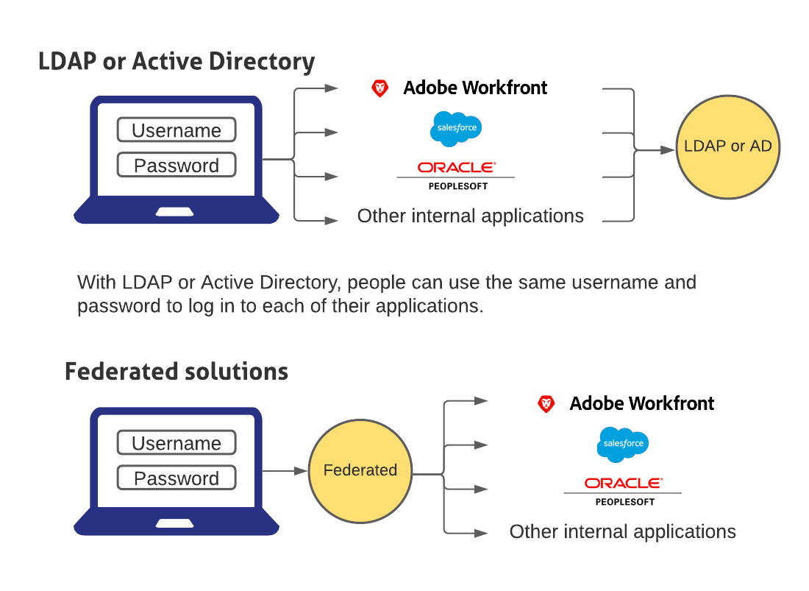

# Visão geral do logon único no Adobe Workfront

{{important-admin-console-onboard}}

O Workfront fornece uma configuração de logon único (SSO) gerenciada centralmente que integra facilmente o Workfront à sua solução corporativa de SSO existente. Essa configuração é fácil de configurar e gerenciar e está disponível para clientes OnDemand e OnPremise Enterprise.

Para usar a funcionalidade SSO no Workfront, sua organização precisa configurar um aplicativo SSO. Em seguida, você pode configurar o Workfront para que ele possa se comunicar com sua solução SSO.

As soluções federadas permitem que os usuários façam logon em todos os seus aplicativos inserindo seu nome de usuário e senha em um portal de logon centralizado.

## Configurar o firewall

Ao usar uma solução de SSO, o Workfront inicia uma conexão com seu servidor na porta especificada.

Se assinar o Workfront sob demanda e tiver configurado seu firewall ou servidor de email para permitir acesso somente a fornecedores específicos, será necessário adicionar determinados endereços IP do Workfront à  de firewall lista de permissões. Para obter mais informações, consulte [Configurar a  lista de permissões do firewall](../../../administration-and-setup/get-started-wf-administration/configure-your-firewall.md).

## Configurar logon único

A Workfront integra-se com as seguintes soluções SSO:

* Soluções federadas que oferecem suporte ao SAML 2.0

   Para obter informações sobre a integração do Workfront com o SAML 2.0, consulte [Configurar o Adobe Workfront com o SAML 2.0](../../../administration-and-setup/add-users/single-sign-on/configure-workfront-saml-2.md).

* Soluções federadas que oferecem suporte ao SAML 2.0 usando ADFS

   Para obter informações sobre a integração do Workfront com o SAML 2.0 usando o ADFS, consulte [Configurar o Adobe Workfront com o SAML 2.0 usando ADFS](../../../administration-and-setup/add-users/single-sign-on/configure-workfront-saml-2-adfs.md).
