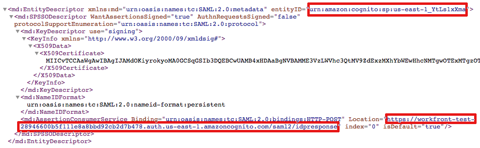

# Atualize os metadados SAML 2.0 no IDP ao usar a autenticação aprimorada

<!-- enhanced authentication is no longer available for workfront customers -->

{{important-admin-console-onboard}}

Como administrador do Adobe Workfront, você pode integrar o Logon único (SSO) do Workfront a qualquer provedor de identidade compatível com o protocolo SAML 2.0 (Security Assertion Markup Language).

As seções a seguir descrevem o processo de integração quando sua conta do Workfront é atualizada para a experiência de autenticação aprimorada (ainda não disponível para todas as organizações). Para obter mais informações sobre a experiência de autenticação aprimorada, consulte [Visão geral da autenticação aprimorada](../../../administration-and-setup/manage-workfront/security/get-started-enhanced-authentication.md).

Para obter informações sobre como configurar o SAML antes da migração para a experiência de autenticação aprimorada, consulte [Atualize os metadados SAML 2.0 no seu provedor de identidade](../../../administration-and-setup/add-users/single-sign-on/update-saml-2-metadata-ip.md).

## Requisitos de acesso

Você deve ter o seguinte acesso para executar as etapas neste artigo:

<table style="table-layout:auto"> 
 <col> 
 <col> 
 <tbody> 
  <tr> 
   <td role="rowheader">Plano Adobe Workfront</td> 
   <td>Qualquer Um</td> 
  </tr> 
  <tr> 
   <td role="rowheader">Licença Adobe Workfront</td> 
   <td>Plano</td> 
  </tr> 
  <tr> 
   <td role="rowheader">Configurações de nível de acesso</td> 
   <td> 
Você deve ser um administrador do Workfront.
 
<b>OBSERVAÇÃO</b>: Caso ainda não tenha acesso, pergunte ao administrador do Workfront se ele definiu restrições adicionais em seu nível de acesso. Para obter informações sobre como um administrador do Workfront pode modificar seu nível de acesso, consulte <a href="../../../administration-and-setup/add-users/configure-and-grant-access/create-modify-access-levels.md" class="MCXref xref">Criar ou modificar níveis de acesso personalizados</a>.
 </td> 
  </tr> 
 </tbody> 
</table>

## Use o Okta como seu provedor de identidade

Okta é um exemplo de um provedor de identidade que oferece suporte ao SAML 2.0. Esta seção descreve como usar o Okta como seu provedor de identidade. Etapas semelhantes seriam necessárias ao configurar outro provedor de identidade compatível com SAML 2.0.

>[!NOTE]
>
>Os usuários são mapeados com base em seus endereços de email. Para fazer logon no Workfront usando o Okta, é necessário ter um usuário com o mesmo endereço de email (não diferencia maiúsculas de minúsculas) criado no cliente do Workfront.

Conclua as seções a seguir para configurar o Okta como seu provedor de identidade no Workfront.

* [Criar um aplicativo Workfront no Okta](#create-a-workfront-app-in-okta)
* [Adicionar sua instância Okta como um provedor de identidade no Workfront](#add-your-okta-instance-as-an-identity-provider-in-workfront)

### Criar um aplicativo Workfront no Okta {#create-a-workfront-app-in-okta}

1. Faça logon no ambiente Okta.
1. Certifique-se de que **Interface clássica** é selecionado no canto superior esquerdo da interface Okta.
1. No menu, clique em **Aplicativos** > **Aplicativos**.

1. Clique em **Adicionar Aplicativo**, depois clique em **Criar novo aplicativo**.

1. No **Caixa de diálogo Criar nova integração de aplicativo** , selecione **SAML 2.0**, depois clique em **Criar**.

1. Especifique um nome para seu aplicativo Workfront e clique em **Próximo**.
1. Na página Configurações do SAML que é exibida, localize as informações necessárias para a página Configurações do SAML:

   1. Sem sair da guia do navegador, onde a interface Okta é exibida, abra uma guia ou janela separada do navegador.
   1. Especifique o seguinte URL no navegador:

      `https://[your_customer_subdomain].my.workfront.com/auth/saml2/metadata`

   1. No arquivo XML resultante, identifique os valores para **entityID** e **Localização**.

      

   1. Copie o valor do **entityID** para a área de transferência do sistema. Não feche esta guia do navegador.

1. Volte para a página Configurações do SAML que você abriu na Etapa 6.
1. Cole o valor da variável **entityID** no campo **URI do público-alvo (ID da entidade da controladora de armazenamento)** campo.

1. No arquivo XML da outra guia do navegador, copie o valor da variável **Localização** campo.
1. Cole o valor da variável **Localização** no campo **Logon único** **URL** campo.

1. Role para **Declarações de atributos (opcional)** seção.
1. No **Nome** , especifique **email**.

1. No **Valor** , especifique **user.email**.

1. (Opcional) Adicione quaisquer valores avançados.
1. Clique em **Próximo**.
1. Selecione, **Sou um cliente da Okta, adicionando um aplicativo interno**, depois clique em **Concluir**.

### Adicionar sua instância Okta como um provedor de identidade no Workfront {#add-your-okta-instance-as-an-identity-provider-in-workfront}

Este procedimento fornece informações essenciais para configurar o Okta como um provedor de identidade no Workfront. Para obter informações adicionais sobre outros mapeamentos ou opções de configuração, consulte [Configurar o Adobe Workfront com o SAML 2.0](../../../administration-and-setup/add-users/single-sign-on/configure-workfront-saml-2.md).

1. Baixe os metadados do provedor de identidade para sua instância Okta:

   1. Faça logon no ambiente Okta.
   1. Certifique-se de que **Interface clássica** é selecionado no canto superior esquerdo da interface Okta.
   1. No menu, clique em **Aplicativos** > **Aplicativos**.

   1. Clique no aplicativo Workfront criado, conforme descrito na seção, [Criar um aplicativo Workfront no Okta](#create-a-workfront-app-in-okta)
   1. No **Fazer logon** clique em **Metadados do provedor de identidade**.

      

      Os metadados são abertos como XML em uma nova guia do navegador.

   1. Copie o URL que é exibido no campo URL do navegador .

1. Faça logon no Workfront as a Workfront Administrator.
1. Clique no botão **Menu principal** ícone  no canto superior direito do Adobe Workfront, em seguida, clique em **Configuração** .

1. No painel esquerdo, clique em **Sistema** > **Logon único (SSO)**.

1. (Condicional) Se você vir duas guias, clique no botão **Novos provedores SSO** guia .

   

   >[!IMPORTANT]
   >
   >Não exclua suas configurações existentes do SSO no **Provedor SSO atual** até que sua conta seja atualizada para a experiência de autenticação aprimorada e a nova configuração do SSO seja totalmente funcional.

1. Clique em **Novo Provedor SSO**.
1. Especifique um nome, como Okta IDP, e depois especifique uma descrição.
1. No **Preencher campos a partir dos metadados do fornecedor de identidade** , cole o URL que você copiou na Etapa 1 na **URL de metadados** campo.\
   Como alternativa, você pode clicar em **Escolher arquivo** para carregar um arquivo .xml, mas recomendamos que você cole o URL.

1. No **Mapear atributos do usuário** na seção **Atributo do diretório** campo, tipo **email**. (**Endereço de email** já está preenchida na variável **Atributo de usuário do Workfront** campo .)

1. (Opcional) Ativar **Tornar Provedor SSO Padrão** para enviar usuários não autenticados para a tela de logon do provedor de identidade, em vez de para a tela de logon da Workfront para autenticação. Recomendamos que você ative essa opção somente se todos os usuários em seu sistema acessarem o Workfront por meio do provedor de identidade.
1. Selecione o **Habilitar** caixa de seleção. Antes de fazer isso, verifique se os usuários do sistema estão cientes da nova experiência de logon para garantir que não percam o acesso ao sistema Workfront.
1. Clique em **Testar conexão**.\
   Você deve ver uma mensagem informando que a conexão foi bem-sucedida.

1. Clique em **Salvar**.

## Uso de outros provedores de identidade

Ao usar provedores de identidade diferentes do Okta (como Ping ou Centralizar), você deve fazer upload novamente dos metadados do Workfront para seu provedor de identidade.
