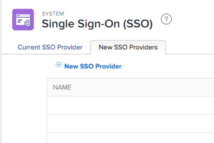

# Atualizar os metadados do SAML 2.0 no IDP ao usar a autenticação aprimorada

<!-- enhanced authentication is no longer available for workfront customers -->

{{important-admin-console-onboard}}

Como administrador do Adobe Workfront, você pode integrar o logon único (SSO) da Workfront a qualquer provedor de identidade que ofereça suporte ao protocolo SAML (Security Assertion Markup Language) 2.0.

As seções a seguir descrevem o processo de integração quando sua conta do Workfront é atualizada para a experiência de autenticação aprimorada (ainda não disponível para todas as organizações). Para obter mais informações sobre a experiência de autenticação aprimorada, consulte [Visão geral da autenticação aprimorada](../../../administration-and-setup/manage-workfront/security/get-started-enhanced-authentication.md).

Para obter informações sobre como configurar o SAML antes de migrar para a experiência de autenticação aprimorada, consulte [Atualizar metadados do SAML 2.0 no seu provedor de identidade](../../../administration-and-setup/add-users/single-sign-on/update-saml-2-metadata-ip.md).

## Requisitos de acesso

+++ Expanda para visualizar os requisitos de acesso para a funcionalidade neste artigo.

Você deve ter o seguinte acesso para executar as etapas deste artigo:

<table style="table-layout:auto"> 
 <col> 
 <col> 
 <tbody> 
  <tr> 
   <td role="rowheader">plano do Adobe Workfront</td> 
   <td>Qualquer</td> 
  </tr> 
  <tr> 
   <td role="rowheader">Licença do Adobe Workfront</td> 
   <td>Plano</td> 
  </tr> 
  <tr> 
   <td role="rowheader">Configurações de nível de acesso</td> 
   <td> 
Você deve ser um administrador do Workfront.
 
<b>OBSERVAÇÃO</b>: se você ainda não tiver acesso, pergunte ao administrador do Workfront se ele definiu restrições adicionais no seu nível de acesso. Para obter informações sobre como um administrador do Workfront pode modificar seu nível de acesso, consulte <a href="../../../administration-and-setup/add-users/configure-and-grant-access/create-modify-access-levels.md" class="MCXref xref">Criar ou modificar níveis de acesso personalizados</a>.
 </td> 
  </tr> 
 </tbody> 
</table>

+++

## Usar o Okta como seu provedor de identidade

Okta é um exemplo de um provedor de identidade compatível com SAML 2.0. Esta seção descreve como usar o Okta como seu provedor de identidade. Etapas semelhantes seriam necessárias ao configurar outro provedor de identidade que ofereça suporte ao SAML 2.0.

>[!NOTE]
>
>Os usuários são mapeados com base em seus endereços de email. Para fazer logon no Workfront usando o Okta, você deve ter um usuário com o mesmo endereço de email (não diferencia maiúsculas de minúsculas) criado em seu cliente do Workfront.

Complete as seções a seguir para configurar o Okta como seu provedor de identidade na Workfront.

* [Criar um aplicativo Workfront no Okta](#create-a-workfront-app-in-okta)
* [Adicione sua instância do Okta como um provedor de identidade na Workfront](#add-your-okta-instance-as-an-identity-provider-in-workfront)

### Criar um aplicativo Workfront no Okta {#create-a-workfront-app-in-okta}

1. Faça logon no ambiente do Okta.
1. Verifique se a **Interface clássica** está selecionada no canto superior esquerdo da interface do Okta.
1. No menu, clique em **Aplicativos** > **Aplicativos**.

1. Clique em **Adicionar aplicativo** e em **Criar novo aplicativo**.

1. Na caixa de diálogo **Criar uma Nova Integração de Aplicativos**, selecione **SAML 2.0** e clique em **Criar**.

1. Especifique um nome para o aplicativo Workfront e clique em **Avançar**.
1. Na página Configurações SAML que é exibida, localize as informações necessárias para a página Configurações SAML:

   1. Sem sair da aba do navegador onde a interface do Okta é exibida, abra uma aba ou janela separada do navegador.
   1. Especifique o seguinte URL no navegador:

      `https://[your_customer_subdomain].my.workfront.com/auth/saml2/metadata`

   1. No arquivo XML resultante, identifique os valores de **entityID** e **Location**.

      

   1. Copie o valor do campo **entityID** para a área de transferência do sistema. Não feche esta guia do navegador.

1. Volte para a página Configurações SAML que você abriu na Etapa 6.
1. Cole o valor do campo **entityID** no campo **URI de Público-alvo (ID de Entidade SP)**.

1. No arquivo XML em outra guia do navegador, copie o valor do campo **Local**.
1. Cole o valor do campo **Local** no campo **Logon único** **URL**.

1. Role até a seção **Instruções de atributo (opcional)**.
1. No campo **Nome**, especifique **email**.

1. No campo **Value**, especifique **user.email**.

1. (Opcional) Adicione quaisquer valores avançados.
1. Clique em **Avançar**.
1. Selecione, **Sou um cliente do Okta adicionando um aplicativo interno** e clique em **Concluir**.

### Adicione sua instância do Okta como um provedor de identidade na Workfront {#add-your-okta-instance-as-an-identity-provider-in-workfront}

Este procedimento fornece informações essenciais para configurar o Okta como um provedor de identidade no Workfront. Para obter informações adicionais sobre outros mapeamentos ou opções de configuração, consulte [Configurar o Adobe Workfront com SAML 2.0](../../../administration-and-setup/add-users/single-sign-on/configure-workfront-saml-2.md).

1. Baixe os metadados do provedor de identidade para sua instância do Okta:

   1. Faça logon no ambiente do Okta.
   1. Verifique se a **Interface clássica** está selecionada no canto superior esquerdo da interface do Okta.
   1. No menu, clique em **Aplicativos** > **Aplicativos**.

   1. Clique no aplicativo Workfront que você criou, conforme descrito na seção [Criar um aplicativo Workfront no Okta](#create-a-workfront-app-in-okta)
   1. Na guia **Logon**, clique em **Metadados do Provedor de Identidade**.

      

      Os metadados são abertos como XML em uma nova guia do navegador.

   1. Copie o URL exibido no campo URL do navegador.

1. Faça logon no administrador do Workfront as a Workfront.

{{step-1-to-setup}}

1. No painel esquerdo, clique em **Sistema** > **Logon Único (SSO)**.

1. (Condicional) Se você vir duas guias, clique na guia **Novos Provedores de SSO**.

   

   >[!IMPORTANT]
   >
   >Não exclua suas definições de configuração de SSO existentes na guia **Provedor de SSO atual** até que sua conta seja atualizada para a experiência de autenticação aprimorada e a nova configuração de SSO seja totalmente funcional.

1. Clique em **Novo Provedor de SSO**.
1. Especifique um nome, como Okta IDP, e especifique uma descrição.
1. Na seção **Preencher campos a partir dos Metadados do provedor de identidade**, cole a URL copiada na Etapa 1 no campo **URL de metadados**.\
   Como alternativa, você pode clicar em **Escolher Arquivo** para carregar um arquivo .xml, mas recomendamos que você cole a URL.

1. Na seção **Mapear Atributos de Usuário**, no campo **Atributo de Diretório**, digite **email**. (**Endereço de email** já preenchido no campo **Atributo de Usuário do Workfront**.)

1. (Opcional) Habilite **Tornar Padrão o Provedor de SSO** para enviar usuários não autenticados para a tela de logon do provedor de identidade em vez de para a tela de logon da Workfront para autenticação. Recomendamos que você ative essa opção somente se todos os usuários no seu sistema acessarem o Workfront por meio do provedor de identidade.
1. Marque a caixa de seleção **Habilitar**. Antes de fazer isso, verifique se os usuários em seu sistema estão cientes da nova experiência de logon para garantir que não percam o acesso ao sistema do Workfront.
1. Clique em **Testar Conexão**.\
   Você deve ver uma mensagem informando que a conexão foi bem-sucedida.

1. Clique em **Salvar**.

## Uso de outros provedores de identidade

Ao usar provedores de identidade diferentes do Okta (como Ping ou Centrify), você deve fazer upload novamente dos metadados do Workfront para seu provedor de identidade.
