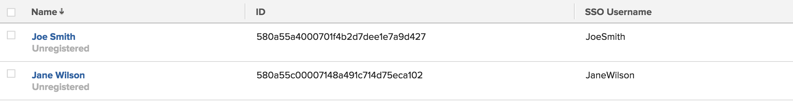

# Atualizar usuários para logon único

<!-- Audited: 1/2024 -->

{{important-admin-console-onboard}}

Quando o logon único (SSO) está ativado na instância do Adobe Workfront, os usuários podem fazer logon no Workfront com as credenciais de SSO.

Se você tiver um sistema existente que já esteja preenchido com usuários associados às credenciais de SSO, poderá importar as IDs dos usuários para o Workfront importando um arquivo de valores separados por vírgula (CSV) para o Workfront.

Para obter mais informações sobre a integração do Workfront com um sistema SSO, consulte [Visão geral do logon único no Adobe Workfront](../../../administration-and-setup/add-users/single-sign-on/sso-in-workfront.md).

## Requisitos de acesso

Você deve ter o seguinte acesso para executar as etapas deste artigo:

<table style="table-layout:auto"> 
 <col> 
 <col> 
 <tbody> 
  <tr> 
   <td role="rowheader">plano do Adobe Workfront</td> 
   <td>Qualquer</td> 
  </tr> 
  <tr> 
   <td role="rowheader">Licença do Adobe Workfront</td> 
   <td>
Novo: Padrão

Ou

Atual: Plano
</td> 
  </tr> 
  <tr> 
   <td role="rowheader">Configurações de nível de acesso</td> 
   <td> 
Você deve ser um administrador do Workfront.
  </td> 
  </tr> 
 </tbody> 
</table>

Para obter mais detalhes sobre as informações nesta tabela, consulte [Requisitos de acesso na documentação do Workfront](/help/quicksilver/administration-and-setup/add-users/access-levels-and-object-permissions/access-level-requirements-in-documentation.md).

## Nomes de usuários do SSO

Dependendo da solução de SSO usada, o nome de usuário no ambiente de SSO pode ser chamado de qualquer um dos seguintes:

* Nome de usuário do SSO
* Federation ID
* Nome de Usuário de Federação

Independentemente do nome de usuário chamado no seu ambiente de SSO, o valor do campo é armazenado no campo Nome de usuário de SSO, no objeto Usuário.

Para que os usuários possam usar suas credenciais de SSO para fazer logon no Workfront, você deve atualizar o perfil para incluir o nome de usuário SSO, além do nome de usuário do Workfront.

Como administrador do Workfront, você pode atualizar o campo Nome de usuário do SSO em massa para seus usuários do Workfront importando uma lista de nomes de usuário para o Workfront. Essa lista deve:

* Contém a ID de usuário do Workfront (GUID), bem como o nome de usuário do SSO correspondente para cada usuário
* Ser salvo como um arquivo CSV ou TSV.

Esse processo atualiza nomes de usuários SSO existentes no Workfront ou adiciona um novo nome de usuário SSO, se estiver faltando para os usuários.

## Preparar o arquivo de importação {#prepare-the-import-file}

Você pode começar a preparar seu arquivo de importação criando um relatório de todos os usuários no Workfront que devem ter seus campos de nome de usuário SSO atualizados.

1. Criar um relatório de usuário no Workfront.

   Para obter instruções sobre como criar relatórios de usuário no Workfront, consulte [Criar um relatório personalizado](../../../reports-and-dashboards/reports/creating-and-managing-reports/create-custom-report.md).

1. Selecione os seguintes campos no relatório:

   | Campo | Explicação |
   |---|---|
   | Nome | O nome completo do usuário do Workfront. |
   | ID | A ID é o GUID alfanumérico do Workfront. |
   | Nome de usuário do SSO | Adicionar o campo Nome de usuário SSO para garantir que não haja nomes de usuário que você esteja substituindo na sua importação. Este campo deve estar em branco para todos os usuários, se eles ainda não tiverem sido atualizados para SSO. |

   

1. Salve o relatório.
1. Clique em **Exportar** na parte superior do relatório e exporte o relatório para o Excel.
1. Abra o arquivo do Excel exportado e adicione seus Nomes de usuários SSO para cada usuário no relatório na coluna Nome de usuário SSO.

   >[!IMPORTANT]
   >
   >Os nomes de usuários SSO fazem distinção entre maiúsculas e minúsculas.

1. Exclua todas as colunas no arquivo do Excel, exceto a **ID** e a variável **Usuário do SSO** colunas.

1. Exclua os cabeçalhos da coluna e verifique se não há linhas em branco na parte superior do relatório.

   O arquivo que você está usando para atualizar seus usuários do Workfront com os nomes de usuário do SSO **deve** contém apenas 2 colunas, nesta ordem:

   * A primeira coluna deve exibir a ID de usuário do Workfront (a GUID do usuário conforme encontrada no Workfront).
   * A segunda coluna deve conter o Nome de usuário do SSO, como exibido em seu sistema SSO.
   * As colunas não devem ter cabeçalhos e não deve haver linhas vazias na parte superior da lista de nomes.

     

1. Salve o relatório como um arquivo CSV ou TSV no computador.

## Atualizar seus usuários para SSO {#update-your-users-for-sso}

O processo de atualização de usuários para SSO adiciona o campo Nome de usuário do SSO aos usuários do Workfront, se algum usuário não estiver presente, ou atualiza o valor nesse campo, se já houver um valor associado aos usuários.

1. Clique em **[!UICONTROL Menu principal]** ícone  no canto superior direito do Adobe Workfront ou (se disponível), clique no link **[!UICONTROL Menu principal]** ícone  no canto superior esquerdo e clique em **Configuração** .

1. Clique em. **Sistema** e selecione **Atualizar usuários para SSO**.

1. Clique em **Escolher arquivo** para procurar o arquivo que você preparou.

   Para obter mais informações sobre como preparar este arquivo, consulte [Preparar o arquivo de importação](#prepare-the-import-file).

1. Selecione o arquivo no local em que ele foi salvo no computador e clique em **Abertura**.

   Isso insere as credenciais de SSO no Workfront, permitindo que todos os usuários façam logon no Workfront usando suas credenciais de SSO.

   A variável **Permitir apenas `<SSO Configuration>` Autenticação** estiver ativada para todos os usuários incluídos no CSV. Isso garante que os usuários devem fazer logon por meio do SSO.

## Verificar o SSO em relação aos nomes de usuário do Workfront de seus usuários

Para obter instruções sobre como criar um relatório de usuário contendo informações de nome de usuário SSO, consulte [Preparar o arquivo de importação](#prepare-the-import-file).

1. Execute um relatório de usuário contendo informações de nome de usuário SSO.

   Observe que a coluna Nome de Usuário do SSO é preenchida para cada usuário.

1. Certifique-se de que os valores da coluna Nome do Usuário do SSO correspondam ao Nome do Usuário do SSO em seu servidor do SSO.
1. Se a coluna Nome de Usuário SSO estiver em branco, atualize os Nomes de Usuário SSO de seus usuários.

   

   Para obter instruções sobre como atualizar os usuários para SSO, consulte [Atualizar seus usuários para SSO](#update-your-users-for-sso).
