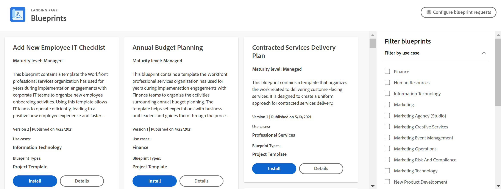

# Visão geral de blueprints

<!--Audited: 01/2024-->

Blueprints são conjuntos de objetos do Workfront que abordam casos de uso comuns no Workfront. Você pode baixar e instalar um esquema e depois configurar os objetos para seu caso de uso específico.

>[!INFO]
>
>Exemplos:
>
>* **Configuração da Organização de Recursos Humanos**
>
>   Este blueprint contém a configuração de estruturas organizacionais para expandir para um departamento de Recursos Humanos.
>
>* **Adicionar nova lista de verificação de TI do funcionário**
>
>   Esse esquema contém um modelo para organizar as atividades de integração de novos funcionários. O uso desse modelo permite que as equipes de TI operem com eficiência, gerando uma nova experiência positiva de funcionário e um rastreamento mais rápido da produtividade.
>
>* **Noções Básicas de Instância Herdada | Lista de verificação**
>
>    Esse esquema contém um modelo de projeto (ou lista de verificação) que você pode revisar com uma pequena lista de perguntas, recursos e links para ter uma compreensão clara de como sua instância do Workfront foi configurada. Use essa opção quando tiver herdado recentemente uma instância do Workfront e precisar de orientação sobre por onde começar.
>
>Para analisar os blueprints atuais, consulte [Lista de blueprints disponíveis](/help/quicksilver/administration-and-setup/blueprints/list-of-available-blueprints.md).

Os blueprints fornecem blocos de construção básicos para ajudá-lo a criar um sistema de gerenciamento de trabalho que cresce com você. Os administradores do sistema podem navegar pelo catálogo de blueprints e instalar modelos de projeto, painéis de controle e estruturas organizacionais prontos para usar. Outros usuários podem navegar no catálogo e solicitar a instalação de um esquema. Para obter mais informações, consulte [Navegar pelo catálogo de blueprints e solicitar instalação de blueprints](../../administration-and-setup/blueprints/browse-catalog.md).

Cada esquema é destinado a um departamento e a um nível de maturidade específico para ajudá-lo a implementar práticas recomendadas comprovadas em seu sistema com mais rapidez. Os níveis de maturidade detalhados abaixo estão indicados no cartão do catálogo de blueprint e nos detalhes.

* **[!UICONTROL Gerenciados]:** os modelos de projeto gerenciados ajudam a apoiar a adoção de um novo processo empresarial antes que as atividades e os resultados sejam totalmente aceitos como um procedimento padrão. Eles contêm tarefas para garantir que cada etapa do novo processo seja seguida.

* **[!UICONTROL Integrados]:** os modelos de projeto integrados presumem que há suporte para as funções empresariais por meio de um procedimento operacional padrão. Os colaboradores do processo conhecem as etapas e as tarefas necessárias para acompanhar o processo. Os modelos de projeto para dar suporte a esse processo contêm menos tarefas para rastrear apenas marcos e outros materiais de entrega importantes necessários para fins de relatório.

## Encontrar o blueprint correto

Você pode consultar blueprints por caso de uso, nível de maturidade, status de instalação e tipo com os filtros no lado direito do catálogo. Depois de encontrar um blueprint que lhe interessa, você pode visualizar os detalhes na página de detalhes.

### Tipos de blueprint

O tipo de esquema mostra o que está incluído no esquema. O tipo está listado na parte inferior do cartão de blueprint no catálogo. Observe que um blueprint pode ter mais de um tipo.

Os seguintes tipos de blueprints estão disponíveis:

* **Modelos de projeto**: inclui objetos padrão associados a um modelo de projeto (tarefas, problemas, funções e equipes) e algumas preferências relacionadas a esses objetos. Para obter mais informações, consulte [Configurar um blueprint](../../administration-and-setup/blueprints/configure-template-package.md).
* **Estruturas organizacionais**: inclui objetos associados à estrutura de uma organização (empresas, grupos, funções e equipes). Para obter mais informações, consulte [Configurar um blueprint](../../administration-and-setup/blueprints/configure-template-package.md).
* **Painéis**: inclui um ou mais painéis para um caso de uso específico, como serviços de implementação.
<!--
* Request queues: Includes one or more projects configured as request queues.
* Custom forms: Includes custom forms attached to another object type, such as a project or portfolio.
* Setup features: Includes one or more elements that are configured in the Setup area of Workfront, such as layout templates.
-->

Para analisar os blueprints atuais, consulte [Lista de blueprints disponíveis](/help/quicksilver/administration-and-setup/blueprints/list-of-available-blueprints.md).

### Exibir detalhes

Cada esquema contém uma página Detalhes. Nesta página, você pode:

* Exibir um resumo do conteúdo do fluxo de trabalho
* Leia um breve resumo do plano
* Exibir histórico de instalação (clique em **[!UICONTROL Ver Detalhes]** para ver a lista completa de objetos instalados com o esquema)
* Veja as descrições de função, equipe, empresa e grupo
* Veja um exemplo visual do esquema específico, como um modelo de projeto (você pode visualizar a imagem completa no navegador ou baixá-la)

![[!UICONTROL Detalhes do plano] página](assets/blueprint-details-page-2022.png)

## Instalar um blueprint

Um administrador do Workfront pode instalar um blueprint diretamente em qualquer ambiente (produção, pré-visualização ou sandbox). Para saber mais, consulte [Instalar um blueprint](../../administration-and-setup/blueprints/blueprints-install.md) ou [Configurar um blueprint](../../administration-and-setup/blueprints/configure-template-package.md).

Após a instalação, você pode não ter certeza sobre as melhores ações a serem executadas. Para obter informações, consulte [Ações a serem executadas após a instalação de um blueprint](../../administration-and-setup/blueprints/best-next-actions-after-install.md).

## Observações adicionais sobre blueprints e modelos

Os planos não substituem a funcionalidade de modelos de projeto em [!DNL Adobe Workfront]. Os blueprints são uma maneira de criar novos modelos mais rapidamente para organizar mais de seu trabalho no [!DNL Workfront].

Não é possível copiar ou editar um esquema. No entanto, depois de instalar a solução a partir de um esquema, você pode modificar o modelo de projeto, as funções de trabalho ou as equipes criadas a partir do esquema da mesma maneira que você normalmente atualiza esses registros na interface [!DNL Workfront]. Além disso, quando você instala um blueprint, o modelo é armazenado na área [!UICONTROL Modelos] de [!DNL Workfront] e o blueprint original permanece na área [!UICONTROL Blueprints]. Não é necessário fazer uma cópia do modelo antes de começar a ajustá-lo às suas necessidades.

Os blueprints não removem nem substituem nada configurado em seu ambiente. Se você pretende substituir um modelo existente instalando um esquema que cria um novo modelo, recomendamos que desative a versão anterior para evitar confusões entre os planejadores que criam projetos com base em modelos.
