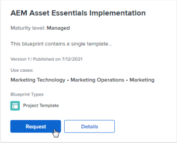

# Navegue pelo catálogo de projetos e solicite a instalação de projetos

Os blueprints fornecem blocos de construção básicos para ajudá-lo a criar um sistema de gerenciamento de trabalho que cresce com você. Todos os usuários do [!DNL Adobe Workfront] podem procurar o catálogo de blueprints. Você também pode fazer uma solicitação para que o administrador do [!DNL Workfront] instale um esquema específico para você, caso o administrador tenha habilitado solicitações de esquema.

Somente o administrador do sistema pode instalar os blueprints. Para obter mais informações, consulte [Instalar um esquema](../../administration-and-setup/blueprints/blueprints-install.md).

## Requisitos de acesso

+++ Expanda para visualizar os requisitos de acesso da funcionalidade neste artigo.

<table style="table-layout:auto"> 
 <col> 
 <col> 
 <tbody> 
  <tr> 
   <td role="rowheader">Pacote do Adobe Workfront</td> 
   <td> 
Qualquer 
 </td> 
  </tr> 
  <tr> 
   <td role="rowheader">Licença do Adobe Workfront</td> 
   <td>
Colaborador ou posterior

Solicitante ou superior

  </td> 
  </tr> 
 </tbody> 
</table>

Para obter informações, consulte [Requisitos de acesso na documentação do Workfront](/help/quicksilver/administration-and-setup/add-users/access-levels-and-object-permissions/access-level-requirements-in-documentation.md).

+++

## Pesquisar no catálogo de blueprints

O catálogo exibe todos os blueprints disponíveis para sua organização. Para obter informações sobre blueprints, como tipos de blueprint e níveis de maturidade, consulte [Visão geral de blueprints](../../administration-and-setup/blueprints/blueprints-overview.md).

{{step1-to-blueprints}}

1. Navegue pelo catálogo de blueprints.
1. Use o painel de filtro à direita para filtrar o catálogo pelas seguintes opções:

   * Caso de uso (como [!UICONTROL Recursos Humanos] ou [!UICONTROL Marketing])
   * Nível de maturidade ([!UICONTROL gerenciado] ou [!UICONTROL integrado])
   * Status da instalação ([!UICONTROL instalada] ou não [!UICONTROL instalada])
   * Tipo de blueprint (<!--Custom Form, -->[!UICONTROL Painel], [!UICONTROL Estrutura Organizacional], [!UICONTROL Modelo de Projeto]<!--, Request Queue, Setup Feature-->)

1. (Opcional) Clique em **[!UICONTROL Detalhes]** em um blueprint para saber como ele funciona.

   Para obter informações sobre o conteúdo disponível na página [!UICONTROL Detalhes], consulte [Visão geral dos blueprints](../../administration-and-setup/blueprints/blueprints-overview.md).

## Solicitar instalação de um blueprint

Você pode solicitar a instalação de um esquema se o administrador do sistema permitir solicitações de esquema. Para obter mais informações, consulte [Configurar acesso a plantas](../../administration-and-setup/blueprints/configure-access-to-blueprints.md).

Quando você solicita a instalação de um esquema, a solicitação é enviada ao administrador do sistema. Você será notificado quando a solicitação for concluída, de acordo com suas preferências de notificação.

{{step1-to-blueprints}}

1. Encontre o esquema que deseja instalar. Você pode filtrar por caso de uso, nível de maturidade, status de instalação e tipo usando os filtros no painel direito.
1. Clique em **[!UICONTROL Solicitar]** no esquema.

   Se o botão **[!UICONTROL Solicitar]** não aparecer no esquema, isso significa que o administrador do sistema não habilitou as solicitações.

   
