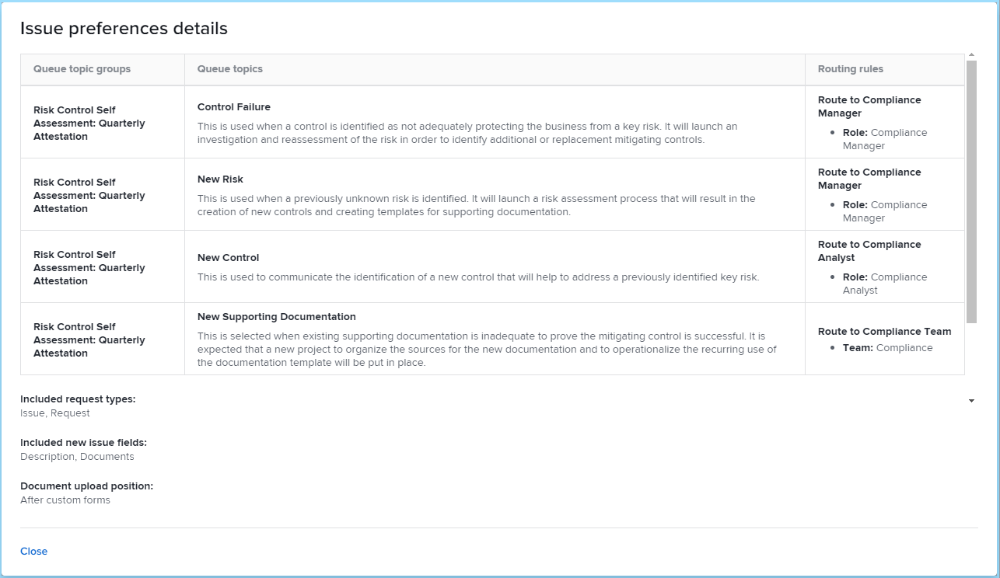
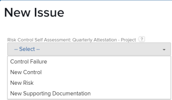
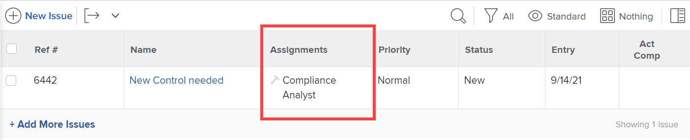

# Configurar um blueprint

Você pode configurar os detalhes de um esquema antes de instalá-lo. Os tipos de modelo de projeto e de estrutura organizacional geralmente exigem que algumas preferências sejam definidas e algumas propriedades sejam mapeadas. Outros tipos de blueprint podem não exigir configuração e você irá instalá-los como estão. Para obter mais informações sobre a instalação, consulte [Instalar um esquema](/help/quicksilver/administration-and-setup/blueprints/blueprints-install.md).

## Requisitos de acesso

+++ Expanda para visualizar os requisitos de acesso da funcionalidade neste artigo.

<table style="table-layout:auto"> 
 <col> 
 <col> 
 <tbody> 
  <tr> 
   <td role="rowheader">Pacote do Adobe Workfront</td> 
   <td>Qualquer</td> 
  </tr> 
  <tr> 
   <td role="rowheader">Licença do Adobe Workfront</td> 
   <td>
   
Padrão

   
Plano
</td> 
  </tr> 
  <tr> 
   <td role="rowheader">Configurações de nível de acesso</td> 
   <td>Administrador do Workfront </td> 
  </tr> 
 </tbody> 
</table>

Para obter mais detalhes sobre as informações contidas nesta tabela, consulte [Requisitos de acesso na documentação do Workfront](/help/quicksilver/administration-and-setup/add-users/access-levels-and-object-permissions/access-level-requirements-in-documentation.md).

+++

## Configurar um esquema de modelo de projeto

1. Localize o esquema que deseja usar.
1. Clique em **[!UICONTROL Instalar]** e escolha um ambiente:

   <table style="table-layout:auto">
        <tr>
        <td><strong>Produção</strong></td>
        <td>A produção é o seu ambiente ativo.</td>
    </tr>
    <tr>
        <td><strong>Visualização da sandbox</strong></td>
        <td>A visualização da sandbox é um ambiente de teste que serve como uma réplica do seu ambiente ativo e é atualizado todos os finais de semana pelo Workfront.</td>
    </tr>
    <tr>
        <td><strong>Sandbox 1 e 2</strong></td>
        <td>A sandbox de atualização personalizada é um ambiente de teste separado que é atualizado manualmente por você. Há um custo adicional para obter a sandbox de atualização personalizada.</td>
    </tr>
   </table>

1. Continue com as seguintes seções:

   * [[!UICONTROL Preferências do modelo]](#template-preferences)
   * [[!UICONTROL Mapeamento de funções]](#role-mapping)
   * [[!UICONTROL Mapeamento de equipe]](#team-mapping)
   * [[!UICONTROL Mapeamento da empresa]g](#company-mapping)
   * [[!UICONTROL Mapeamento de grupo]](#group-mapping)

## [!UICONTROL Preferências de modelo] {#template-preferences}

Escolha como deseja instalar o modelo.

Você também pode designar a propriedade do modelo antes de instalar o blueprint. Você pode fazer alterações nesses campos após a instalação do template. Para obter mais informações, consulte [Editar modelos de projeto](../../manage-work/projects/create-and-manage-templates/edit-templates.md).

Seção ![[!UICONTROL Preferências de modelo]](assets/Blueprints_TemplatePreferences.png)

1. Na seção [!UICONTROL Preferências de Modelo], especifique um novo nome de modelo.
1. Especifique o seguinte:

   <table style="table-layout:auto">
    <tr>
        <td><strong>[!UICONTROL Proprietário do modelo]<strong></td>
        <td>Esta pessoa recebe permissões de [!UICONTROL Gerenciar] no modelo e se tornará o proprietário do Projeto quando o modelo for usado para criar um projeto.</td>
    </tr>
    <tr>
        <td><strong>[!UICONTROL Patrocinador de modelo]</strong></td>
        <td>Essa pessoa geralmente é um gerente, executivo ou parte interessada que precisa saber o que está acontecendo com o projeto. O Patrocinador do Projeto não obtém acesso adicional ao projeto, mas é adicionado às notificações por email do projeto.</td>
    </tr>
    <tr>
        <td><strong>[!UICONTROL Portfolio]</strong></td>
        <td>Este é o portfólio ao qual o projeto pertencerá quando for criado.</td>
    </tr>
    <tr>
        <td><strong>[!UICONTROL Program]</strong></td>
        <td>Este é o programa ao qual o projeto pertencerá quando for criado.</td>
    </tr>
   </table>

1. Selecione se o modelo está instalado como ativo ou inativo.
1. Selecione se deseja usar as novas preferências de ocorrência definidas, se as preferências estiverem disponíveis.

   Clique em **[!UICONTROL Ver preferências de problema]** para revisar as preferências específicas que serão instaladas com o esquema. Os projetos criados a partir do modelo importado usam essas preferências para novos problemas adicionados na seção [!UICONTROL Problemas].

   <table style="table-layout:auto"> 
    <col> 
    <col> 
    <tbody> 
     <tr> 
      <td role="rowheader"><strong>Grupos de tópicos em fila</strong></td> 
      <td> 
Os grupos de tópicos da fila definem o nível mais alto de categorias para as ocorrências ou solicitações. Os usuários exibem grupos de tópicos como opções de menu ao selecionar para onde enviar solicitações. Um grupo de tópicos pode conter vários tópicos da fila. Para obter mais informações, consulte <a href="../../manage-work/requests/create-and-manage-request-queues/create-topic-groups.md" class="MCXref xref">Criar grupos de tópicos</a>. 
 </td> 
     </tr> 
     <tr> 
      <td role="rowheader"><strong>Enfileirar tópicos</strong></td> 
      <td> 
Tópicos de fila funcionam em conjunto com regras de roteamento para atribuir problemas ou solicitações. São as opções de menu que os usuários selecionam ao inserir uma ocorrência ou solicitação depois de selecionar um grupo de tópicos. Para obter mais informações, consulte <a href="../../manage-work/requests/create-and-manage-request-queues/create-queue-topics.md" class="MCXref xref">Criar tópicos da fila</a>. 
 </td> 
     </tr> 
     <tr> 
      <td role="rowheader"><strong>Regras de roteamento</strong></td> 
      <td>As regras de roteamento enviam problemas ou solicitações para funções de trabalho, usuários ou equipes específicas. Eles também podem enviar as solicitações para projetos específicos, diferentes daquele associado à fila de solicitações. Para obter mais informações, consulte <a href="../../manage-work/requests/create-and-manage-request-queues/create-routing-rules.md" class="MCXref xref">Criar Regras de Roteamento</a>. </td> 
     </tr> 
    </tbody> 
   </table>

   >[!INFO]
   >
   >**Exemplo:** as novas preferências de problema neste esquema fornecem quatro tópicos de fila. O usuário seleciona um desses tópicos ao criar uma ocorrência. (Como existe apenas um grupo de tópicos, ele é aplicado automaticamente e o usuário não precisa selecioná-lo.) Quando o usuário conclui e envia a ocorrência, as regras de roteamento determinam a qual função da tarefa ou equipe está atribuída.
   >
   >
   >

   >[!TIP]
   >
   >* Usar as preferências de ocorrência ajuda a criar consistência na maneira como as novas ocorrências ou solicitações são capturadas em seus projetos.
   >* Definir essas preferências não transforma automaticamente os projetos criados a partir do modelo em filas de solicitação. Para obter informações sobre a configuração de uma fila de solicitações, consulte [Criar uma Fila de Solicitações](../../manage-work/requests/create-and-manage-request-queues/create-request-queue.md).
   >* Nem todos os blueprints contêm preferências de novas ocorrências.

## [!UICONTROL Mapeamento de funções] {#role-mapping}

>[!NOTE]
>
>Esta seção pode não ser exibida em alguns blueprints.

Alguns modelos incluem funções de trabalho prescritas. As funções de tarefa ajudam a atribuir as pessoas certas quando o modelo é convertido em um projeto. Você pode personalizar como as funções são mapeadas antes de instalar o blueprint. Clique em **[!UICONTROL Ver descrições de funções]** para saber mais sobre as funções disponíveis no esquema.

O esquema pesquisa pelo nome da função para ver se alguma função existente corresponde. A pesquisa diferencia maiúsculas de minúsculas, portanto, os nomes devem ser uma correspondência exata. Se nenhuma função existente corresponder, você poderá fazer com que o esquema as crie para você.

![[!UICONTROL Seção de Mapeamento de Função]](assets/Blueprints_RoleMapping.png)

1. Se houver uma função, você poderá escolher uma das seguintes opções:

   1. Crie uma nova função com um nome diferente e digite o nome na caixa de texto.
   1. Use a função existente e, em seguida, selecione uma função na caixa de seleção.
   1. Não usar função mapeada. Esta opção não é recomendada porque algumas tarefas não terão funções atribuídas.

1. Se uma função não existir, você poderá escolher uma das seguintes opções:

   1. Criar uma nova função. Essa opção cria a função recomendada pelo plano.
   1. Crie uma nova função com um nome diferente e digite o nome na caixa de texto.
   1. Use a função existente, em seguida, selecione uma função na caixa de seleção.
   1. Não usar função mapeada. Esta opção não é recomendada porque algumas tarefas não terão funções atribuídas.

>[!NOTE]
>
>O processo de instalação não aplica funções a pessoas específicas. Você deve verificar as pessoas nessas funções depois de instalar a solução de blueprint e atribuir pessoas, se necessário. Para obter mais informações, consulte [Ações a serem executadas após a instalação de um esquema](../../administration-and-setup/blueprints/best-next-actions-after-install.md).

Para obter mais informações sobre funções de trabalho em [!DNL Workfront], consulte [Criar e gerenciar funções de trabalho](../../administration-and-setup/set-up-workfront/organizational-setup/create-manage-job-roles.md).

## [!UICONTROL Mapeamento de equipe] {#team-mapping}

>[!NOTE]
>
>Esta seção pode não ser exibida em alguns blueprints.

Alguns modelos incluem equipes prescritas. O trabalho atribuído a uma equipe pode ser concluído por qualquer membro da equipe. É possível personalizar o modo como os grupos são mapeados antes de instalar o esquema. Clique em **[!UICONTROL Ver descrições de equipe]** para saber mais sobre as equipes disponíveis no blueprint.

O blueprint pesquisa pelo nome da equipe para ver se alguma equipe existente corresponde. A pesquisa diferencia maiúsculas de minúsculas, portanto, os nomes devem ser uma correspondência exata. Se nenhum grupo já existente combinar, você poderá fazer com que o esquema os crie para você.

![[!UICONTROL Seção de Mapeamento de Equipe]](assets/Blueprints_TeamMapping.png)

1. Se houver um grupo, você poderá escolher uma destas opções:

   1. Crie um novo grupo com um nome diferente e digite o nome na caixa de texto.
   1. Use a [!UICONTROL equipe existente] e selecione uma equipe na caixa de seleção.
   1. Não use a equipe mapeada. Esta opção não é recomendada porque algumas tarefas não terão equipes atribuídas.

1. Se não existir uma equipe, você pode escolher uma das seguintes opções:

   1. Criar uma nova equipe. Essa opção cria a equipe recomendada pelo blueprint.
   1. Crie um novo grupo com um nome diferente e digite o nome na caixa de texto.
   1. Use a [!UICONTROL equipe existente] e selecione uma equipe na caixa de seleção.
   1. Não usar equipe mapeada. Esta opção não é recomendada porque algumas tarefas não terão equipes atribuídas.

>[!NOTE]
>
>O processo de instalação não adiciona pessoas às equipes. Você deve verificar as pessoas das equipes após instalar a solução de blueprint e atribuir pessoas, se necessário. Para obter mais informações, consulte [Ações a serem executadas após a instalação de um esquema](../../administration-and-setup/blueprints/best-next-actions-after-install.md).

Para obter mais informações sobre como as equipes funcionam em [!DNL Workfront], consulte [Criar e gerenciar equipes](../../people-teams-and-groups/create-and-manage-teams/create-and-mange-teams.md).

## Mapeamento da empresa {#company-mapping}

>[!NOTE]
>
>Esta seção pode não aparecer em alguns blueprints.

Alguns projetos incluem empresas prescritas. Uma empresa é uma unidade organizacional que pode representar sua organização, um departamento dentro da organização ou um cliente com o qual você trabalha. Você pode personalizar como as empresas são mapeadas antes de instalar o blueprint. Clique em **[!UICONTROL Ver descrições da empresa]** para saber mais sobre as empresas disponíveis no esquema.

O blueprint pesquisa pelo nome da empresa para ver se alguma empresa existente corresponde. A pesquisa diferencia maiúsculas de minúsculas, portanto, os nomes devem ser uma correspondência exata. Se nenhuma empresa existente corresponder, você pode fazer com que o blueprint as crie para você. A empresa principal no blueprint é mapeada para a empresa principal em seu ambiente, mesmo que não tenha o mesmo nome.

![[!UICONTROL seção Mapeamento da Empresa]](assets/Blueprints_CompanyMapping.png)

1. Se existir uma empresa, você poderá escolher uma das seguintes opções:

   1. Crie uma nova empresa com um nome diferente e digite o nome na caixa de texto.
   1. Use a empresa existente e selecione uma empresa na caixa de seleção.\

      A empresa principal no esquema é mapeada para a empresa principal no seu ambiente, mesmo que não tenha o mesmo nome.
   1. Não usar empresa mapeada. Esta opção não é recomendada, pois as referências da empresa em outros objetos estarão vazias.

1. Se não existir uma empresa, você poderá escolher uma das seguintes opções:

   1. Criar uma nova empresa. Essa opção cria a empresa recomendada pelo plano.
   1. Crie uma nova empresa com um nome diferente e digite o nome na caixa de texto.
   1. Use a empresa existente e selecione uma empresa na caixa de seleção.
   1. Não usar empresa mapeada. Esta opção não é recomendada, pois as referências da empresa em outros objetos estarão vazias.

>[!NOTE]
>
>Para configurar as empresas após a instalação do blueprint, consulte [Ações a serem executadas após a instalação de um blueprint](../../administration-and-setup/blueprints/best-next-actions-after-install.md).

Para obter informações sobre como associar um modelo a uma empresa, consulte [Editar modelos de projeto](../../manage-work/projects/create-and-manage-templates/edit-templates.md).

Para obter informações sobre como as empresas funcionam em [!DNL Workfront], consulte [Criar e editar empresas](../../administration-and-setup/set-up-workfront/organizational-setup/create-and-edit-companies.md).

## [!UICONTROL Mapeamento de grupo] {#group-mapping}

>[!NOTE]
>
>Esta seção pode não ser exibida em alguns blueprints.

Alguns projetos incluem grupos prescritos. Um grupo é um grupo de usuários que coincide com a estrutura de seu departamento. Os grupos são semelhantes, mas distintos, de equipes e empresas no Workfront. É possível personalizar como os grupos são mapeados antes de instalar o esquema. Clique em **[!UICONTROL Ver descrições de grupos]** para saber mais sobre os grupos disponíveis no esquema.

O esquema pesquisa pelo nome do grupo para ver se algum grupo existente corresponde. A pesquisa diferencia maiúsculas de minúsculas, portanto, os nomes devem ser uma correspondência exata. Se nenhum grupo existente corresponder, você poderá fazer com que o esquema os crie para você.

Seção ![[!UICONTROL  de ]Mapeamento de grupo](assets/Blueprints_GroupMapping.png)

1. Se existir um grupo, você poderá selecionar **[!UICONTROL Remapear Grupo]** e escolher uma das seguintes opções:

   1. **[!UICONTROL Crie um novo grupo com um nome diferente]** e digite o nome a ser atribuído a este grupo. Referências ao grupo na definição de esquema serão associadas a esse novo grupo.
   1. **[!UICONTROL Substituir por um grupo existente]** e, em seguida, procurar e selecionar um grupo na caixa de seleção.

      >[!NOTE]
      >
      >Não é possível renomear um grupo existente.

1. Se um grupo não existir, você poderá:

   1. Altere o nome do grupo sugerido digitando-o na caixa de texto.
   1. Selecione **[!UICONTROL Remapear Grupo]** e escolha [!UICONTROL Substituir por um grupo existente]. Em seguida, pesquise e selecione um grupo na caixa de seleção.
   1. Selecione **[!UICONTROL Remapear Grupo]** e escolha **[!UICONTROL Inserir em um grupo existente]** e, em seguida, procure e selecione um grupo na caixa de seleção. Esta opção cria um novo subgrupo no grupo existente.

>[!NOTE]
>
>Para configurar os grupos após a instalação do blueprint, consulte [Ações a serem executadas após a instalação de um blueprint](../../administration-and-setup/blueprints/best-next-actions-after-install.md).

Para obter informações sobre como usar grupos em [!DNL Workfront], consulte [Visão geral de grupos](../../administration-and-setup/manage-groups/groups-overview/groups.md).
