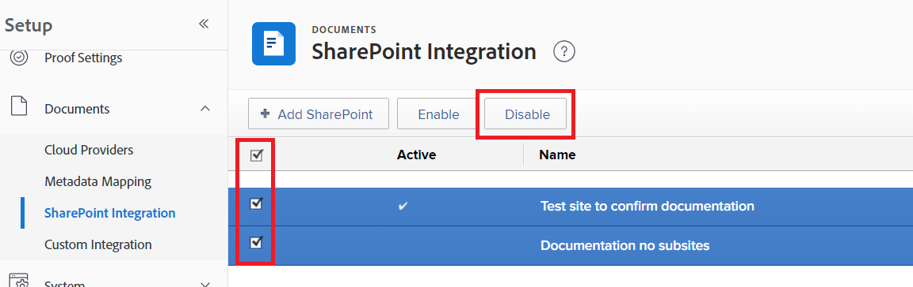

# Configure o [!DNL SharePoint] integração

<!--Audited: 12/2023-->

<!--
<p data-mc-conditions="QuicksilverOrClassic.Draft mode">**DON'T DELETE, DRAFT OR HIDE THIS ARTICLE. IT IS LINKED TO THE PRODUCT, THROUGH THE CONTEXT SENSITIVE HELP LINKS. **</p>
-->

>[!IMPORTANT]
>
>O novo [!DNL SharePoint] A integração do foi lançada para produção com a versão 22.3 (julho de 2022.) Embora seus usuários ainda possam acessar documentos vinculados por meio do herdado [!DNL SharePoint] integração, eles devem usar o novo [!DNL SharePoint] integração para vincular documentos do SharePoint.
>
>* A nova integração do SharePoint não requer a configuração por um administrador e pode ser definida por usuários individuais. No entanto, para garantir uma transição suave para a nova integração do SharePoint, um administrador do Workfront deve fazer algumas pequenas alterações de configurações na área Configuração do Workfront.
>
>    Para obter informações e instruções, consulte [Configurar a integração herdada do SharePoint para acesso contínuo aos documentos](#configure-the-legacy-sharepoint-integration-for-continued-access-to-documents) neste artigo.
>    
>* Recomendamos que os usuários vinculem documentos que estão atualmente vinculados por meio do herdado [!DNL SharePoint] integração por meio da nova integração.
>    
>    Para obter instruções sobre como vincular documentos, consulte [Vincular documentos de aplicativos externos](../../documents/adding-documents-to-workfront/link-documents-from-external-apps.md).

É possível integrar [!DNL Workfront] com [!DNL SharePoint Online], proporcionando aos usuários a capacidade de navegar, vincular e adicionar [!DNL SharePoint] documentos no Workfront. A funcionalidade fornecida é semelhante à de outros [!DNL Workfront] integrações, como [!DNL Google Drive], [!DNL Box], e [!DNL Dropbox].

Essa integração é compatível somente com o [!DNL SharePoint Online]. Instâncias locais de [!DNL SharePoint] não são compatíveis.

## Requisitos de acesso

Você deve ter o seguinte para executar as etapas deste artigo:

<table style="table-layout:auto"> 
 <col> 
 <col> 
 <tbody> 
  <tr> 
   <td role="rowheader">[!DNL Adobe Workfront] plano</td> 
   <td>Qualquer</td> 
  </tr> 
  <tr> 
   <td role="rowheader">[!DNL Adobe Workfront] licença</td> 
   <td>Novo: Padrão <p>Ou</p><p>Atual: Plano</p></td> 
  </tr> 
  <tr> 
   <td role="rowheader">Configurações de nível de acesso*</td> 
   <td>Você deve ser um [!DNL Workfront] administrador. Para obter informações sobre [!DNL Workfront] administradores, consulte <a href="../../administration-and-setup/add-users/configure-and-grant-access/grant-a-user-full-administrative-access.md" class="MCXref xref">Conceder acesso administrativo total a um usuário</a>. </td> 
  </tr> 
 </tbody> 
</table>

&#42;Para descobrir que plano, tipo de licença ou acesso você tem, entre em contato com o [!DNL Workfront] administrador.

## Pré-requisitos

Você deve ter o acesso ou as permissões necessárias no [!DNL SharePoint] para modificar ou configurar seu [!DNL SharePoint] integração.

## Vincular documentos por meio da nova integração do SharePoint

Os usuários individuais podem vincular documentos por meio da nova [!DNL SharePoint] integração. A integração não requer configuração de administrador. Em vez disso, o usuário faz logon em seu [!DNL Microsoft] ao vincular um documento, o que permite que a integração acesse documentos disponíveis no [!DNL SharePoint].

Na primeira vez que um usuário se conecta ao [!DNL Workfront] [!DNL SharePoint] integração ao seu [!DNL SharePoint] conta, eles verão e concordarão com todas as permissões que [!DNL Workfront] O usa o ao interagir com a [!UICONTROL SharePoint] conta. Permissões de leitura permitem [!DNL Workfront] para ver e acessar arquivos em [!DNL SharePoint]As permissões de gravação e do permitem que o usuário faça upload de arquivos no [!DNL SharePoint].


Para obter instruções sobre como vincular documentos por meio do novo [!DNL SharePoint] integração, consulte [Vincular um documento externo a [!DNL Workfront]](../../documents/adding-documents-to-workfront/link-documents-from-external-apps.md#link-an-external-document-to-workfront)

>[!NOTE]
>
>* A [!DNL SharePoint] A integração pode se conectar a um único [!DNL SharePoint] instância. Portanto, um usuário pode configurar uma integração para um [!DNL SharePoint], mas não pode configurar uma integração para um segundo [!DNL SharePoint], mesmo que eles tenham permissões para e documentos no segundo [!DNL SharePoint].
>
>* Um usuário tem acesso aos mesmos sites, coleções, pastas, subpastas e arquivos por meio do [!DNL Workfront] [!DNL SharePoint] integração, tal como acontece na sua [!DNL SharePoint] conta.

### Vincular documentos do SharePoint

Para obter instruções sobre como vincular documentos do SharePoint com a nova [!DNL SharePoint] integração, consulte [Vincular um documento externo a [!DNL Workfront]](../../documents/adding-documents-to-workfront/link-documents-from-external-apps.md#link-an-external-document-to-workfront).

### Enviar documentos para o SharePoint

Para enviar um documento ao SharePoint:

1. Clique em **Enviar para** ícone  e selecione SharePoint (Graph API).
1. (Opcional) Pesquise na barra de pesquisa o site ou pasta para onde deseja enviar o documento.
1. Selecione o site ou pasta na lista.

   * Os sites estão marcados com .

   * As pastas estão marcadas com .

   * Os arquivos não são marcados com um ícone.

1. Clique em **Salvar**.


## Informações de segurança, acesso e autorização para o [!DNL SharePoint] integração

### Autenticação e autorização

[!DNL Workfront] O usa OAuth2 para recuperar um token de acesso e um token de atualização. Este token de acesso é usado para autorização com todos [!DNL SharePoint] domínios.

### Acesso e permissões

Na primeira vez que um usuário adiciona um documento ao [!DNL Workfront] de [!DNL SharePoint], eles são direcionados a uma tela que solicita as seguintes permissões:

| Acesso | Motivo |
|---|---|
| Ter acesso total aos seus arquivos | Permite [!DNL Workfront] para acessar os arquivos de um usuário para vincular ativos. Quando os documentos são enviados de [!DNL Workfront] para [!DNL SharePoint], [!DNL Workfront] O requer acesso para criar o ativo. |
| Ler itens em todos os conjuntos de sites | Permite [!DNL Workfront] para ler ativos e permitir a navegação do usuário. |
| Editar ou excluir itens em todos os conjuntos de sites | Permite [!DNL Workfront] para criar ativos em sites e conjuntos de sites. Excluir é usado somente ao limpar após tentativas malsucedidas de link. |
| Manter acesso aos dados aos quais você concedeu acesso | Permite [!DNL Workfront] para gerar um token de atualização. |
| Entrar e ler o perfil do usuário | Permite [!DNL Workfront] para usar o token de acesso para agir em nome do usuário, por meio do fluxo de logon do OAuth2. |

* Esse acesso é concedido pelo usuário na primeira vez que ele usa a integração e pode ser revogado a qualquer momento.
* As permissões solicitadas para essa integração são **delegado** permissões.
* [!DNL Workfront] O solicita o acesso mínimo necessário para executar operações na integração.
* Acesso para exibir, editar ou excluir um [!DNL Adobe Workfront] documento vinculado a [!DNL SharePoint] é baseado no acesso do usuário em [!DNL Workfront]. No entanto, qualquer navegação, download ou edição de um [!DNL SharePoint] o arquivo ou pasta requer acesso a [!DNL SharePoint]e o acesso a essas ações é controlado por [!DNL SharePoint].
* Os usuários podem visualizar miniaturas e visualizar imagens obtidas de [!DNL SharePoint]e poderá ver os nomes de arquivos e pastas em [!DNL SharePoint], sem fazer logon no [!DNL SharePoint].
* O token de acesso de um usuário é usado somente quando o usuário está offline e outro usuário visualiza o conteúdo de uma pasta vinculada ao [!DNL Workfront]. O token de acesso é usado para descobrir se algum documento na pasta foi adicionado, removido ou editado.

### Segurança

Toda a comunicação entre [!DNL Workfront] e [!DNL SharePoint] O é conduzido por HTTPS, que criptografa as informações.

[!DNL Workfront] não armazena, copia ou duplica dados de [!DNL SharePoint]. A única exceção é que [!DNL Workfront] armazena miniaturas de [!DNL SharePoint] para exibir na exibição de lista e na Pré-visualização.

Se um ativo foi carregado pela primeira vez no [!DNL Workfront]e, em seguida, enviado para [!DNL SharePoint], [!DNL Workfront] retém os dados do primeiro arquivo porque os usuários podem baixar uma versão anterior de um [!DNL Workfront] documento. Se um documento foi criado em [!DNL SharePoint], [!DNL Workfront] O não armazena os dados desse arquivo.

## Configurar o herdado [!DNL SharePoint] integração para acesso contínuo aos documentos

Para garantir que seus usuários tenham acesso contínuo a documentos vinculados ao Workfront por meio do herdado [!DNL SharePoint] integração, você deve reconfigurar o acesso ao herdado [!DNL SharePoint] e mantenha o SharePoint Client Secret atualizado.

* [Reconfigurar o acesso ao herdado [!DNL SharePoint] integração](#reconfigure-access-to-the-legacy-sharepoint-integration)
* [Configurar o segredo do cliente para acesso contínuo ao herdado [!DNL SharePoint] integração](#configure-the-client-secret-for-continued-access-to-the-legacy-sharepoint-integration)

### Reconfigurar o acesso ao herdado [!DNL SharePoint] integração

Reconfiguração do herdado [!DNL SharePoint] A integração do permite que os usuários acessem documentos vinculados por meio do [!DNL SharePoint] integração, garantindo que os usuários não possam vincular novos documentos por meio dessa integração.

>[!NOTE]
>
> * O legado [!DNL SharePoint] a integração é rotulada como &quot;[!DNL SharePoint].&quot;
> * O novo [!DNL SharePoint] a integração é rotulada como &quot;[!UICONTROL [!DNL SharePoint] (API gráfica)].&quot;

1. Clique em **[!UICONTROL Menu principal]** ícone  no canto superior direito do Adobe Workfront ou (se disponível), clique no link **[!UICONTROL Menu principal]** ícone  no canto superior esquerdo e clique em **[!UICONTROL Configuração]** .
1. Selecionar **[!UICONTROL Documentos]** na navegação à esquerda, selecione **[!UICONTROL Provedores de nuvem]**.
1. Certifique-se de que a variável **[!DNL SharePoint]** opção e **[!UICONTROL [!DNL SharePoint](API gráfica)]** ambas as opções estão ativadas.
1. Clique em **[!UICONTROL Salvar]**.
1. Selecionar **[!UICONTROL Documentos]** na navegação à esquerda, selecione **[!UICONTROL [!DNL SharePoint]Integração]**.
1. Marque a marca de seleção à esquerda da lista para todas as integrações existentes e selecione **[!UICONTROL Desativar]**.
   


### Configurar o segredo do cliente para acesso contínuo ao herdado [!DNL SharePoint] integração

Seu [!DNL SharePoint] O segredo do cliente expira uma vez por ano. Para garantir acesso contínuo aos documentos em seu legado [!DNL SharePoint] integração, é necessário manter a [!DNL SharePoint] Segredo do cliente atualizado.

>[!IMPORTANT]
>
> Porque [!DNL SharePoint] Os segredos do cliente são tratados pelo [!DNL Microsoft], os recursos e procedimentos do Segredo do cliente podem ser alterados com base em atualizações no [!DNL SharePoint] feito por [!DNL Microsoft]. Sempre verifique o [!DNL Microsoft] documentação para obter as informações mais recentes sobre procedimentos e recursos em [!DNL SharePoint].

<!--1. Go to the site that your [!DNL SharePoint] integration uses. This may be a site that you created when setting up the integrations, or it may be your organization's root site.

1. Add `/_layouts/15/appregnew.aspx` to the end of the URL in the search bar at the top of your browser window.-->

1. Gere um novo segredo do cliente conforme descrito em [Substituir um segredo de cliente que está expirando em um [!DNL SharePoint] Suplemento](https://docs.microsoft.com/en-us/sharepoint/dev/sp-add-ins/replace-an-expiring-client-secret-in-a-sharepoint-add-in#generate-a-new-secret).
1. Copiar este Segredo do Cliente para um local seguro.
1. Efetue logon no [!DNL Workfront] como administrador.
1. No Workfront, clique no link **[!UICONTROL Menu principal]** ícone  no canto superior direito do Adobe Workfront ou (se disponível), clique no link **[!UICONTROL Menu principal]** ícone  no canto superior esquerdo e clique em **[!UICONTROL Configuração]** .
1. No painel esquerdo, clique em **[!UICONTROL Documentos]** > **[!UICONTROL [!DNL SharePoint]Integração]**.
1. Clique no link [!DNL SharePoint] que deseja atualizar e, em seguida, clique em **[!UICONTROL Editar]**.
1. Localize o **Informações de conexão** da janela de edição e, em seguida, digite o novo Segredo do cliente na caixa **[!UICONTROL SharePoint Client Secret]** campo.
1. Clique em **[!UICONTROL Salvar]**.

<!--

## Instructions for setting up the legacy SharePoint integration

>[!IMPORTANT]
>
>This integration has been deprecated. The instructions here are for information only and will be removed in the near future.


Workfront connects to [!DNL SharePoint] Online using OAuth 2.0, a standard used by most web-based integrations for the authentication and authorization of users.

To configure OAuth, you need to create a [!DNL SharePoint] site and a Site App within [!DNL SharePoint]. This process is described in the following sections.

For more information about OAuth, see [http://oauth.net](http://oauth.net/).

>[!TIP]
>
>To make it easy to copy and paste information between [!DNL Workfront] and [!DNL SharePoint] in these steps, we recommend keeping both applications open in separate tabs.

* [Create and configure a [!DNL SharePoint] site](#create-and-configure-a-sharepoint-site) 
* [Grant write permissions to the site app](#grant-write-permissions-to-the-site-app) 
* [Create a [!DNL Workfront] [!DNL SharePoint] integration instance](#create-a-workfront-sharepoint-integration-instance) 
* [Complete your integration](#complete-your-integration) 
* [Add documents](#add-documents)

### Create and configure a [!DNL SharePoint] site  {#create-and-configure-a-sharepoint-site}

In order for [!DNL Workfront] to authenticate with [!DNL SharePoint], [!DNL Workfront] ca use a master site where users have the [!UICONTROL Full Control] permission level or specific Manage permissions. This master site acts as an Authentication Entry Point for [!DNL Workfront].

To create and configure a [!DNL SharePoint] Site:

1. (Optional) If you do not want to use your organization's root site, you can create a master site in [!DNL SharePoint].

   For instructions, visit [Create a site](https://docs.microsoft.com/en-us/sharepoint/create-site-collection) in the [!DNL Microsoft] Documentation.

   * Select the **[!UICONTROL Team Site]** option when creating the site.

1. (Conditional) If you created a site in step 1, go to the site you just created.

   Or

   If you did not create a site in step 1, go to your organization's root site.

1. Add `/_layouts/15/appregnew.aspx` to the end of the URL in the search bar at the top of your browser window.
1. Configure the following fields:

   <table style="table-layout:auto"> 
    <col> 
    <col> 
    <tbody> 
     <tr> 
      <td role="rowheader"> <p>[!UICONTROL Client ID]</p> </td> 
      <td> <p>Click <strong>[!UICONTROL Generate]</strong> to generate a Client ID. Copy this ID to a secure location. You will use it later when you set up the [!DNL SharePoint] integration in [!DNL Workfront].</p> </td> 
     </tr> 
     <tr> 
      <td role="rowheader"> <p>[!UICONTROL Client Secret]</p> </td> 
      <td> <p>Click <strong>[!UICONTROL Generate]</strong> to generate a Client Secret. Copy this Secret to a secure location. You will use it later when you set up the [!DNL SharePoint] integration in [!DNL Workfront].</p> </td> 
     </tr> 
     <tr> 
      <td role="rowheader"> <p>Title</p> </td> 
      <td> <p>Enter a title, such as [!DNL Workfront] Site App. Users see this title when adding documents..</p> </td> 
     </tr> 
     <tr> 
      <td role="rowheader"> <p>[!UICONTROL App Domain]</p> </td> 
      <td> <p><code>my.workfront.com</code> </p> </td> 
     </tr> 
     <tr> 
      <td role="rowheader"> <p>[!UICONTROL Redirect URI]</p> </td> 
      <td> <p><code>https://oauth.my.workfront.com/oauth2/redirect</code> </p> </td> 
     </tr> 
    </tbody> 
   </table>

1. Click **[!UICONTROL Create]**
1. Continue to [Grant write permissions to the site app](#grant-write-permissions-to-the-site-app).

### Grant write permissions to the site app  {#grant-write-permissions-to-the-site-app}

At this point, you have successfully created a Site App and registered it within [!DNL Workfront]. This site app is also known as an app principal in [!DNL SharePoint]. It resides within your tenant. New site apps do not automatically have access to site collections within the tenant. Permissions must be granted explicitly, for each site collection. The steps below will show you how to grant Write permission to the new Site App a site collection. Repeat these steps for each of the site collections you added under [!UICONTROL Visible Site Collections] in the steps above.

This site app must have [!UICONTROL Write] permission to any site collections that users need to access through [!DNL Workfront].

1. Add '/_layouts/15/appinv.aspx' to the URL in [!DNL Sharepoint].

   **Example:**

   ```
   https://mycompany.sharepoint.com/sites/mysite/_layouts/15/appinv.aspx
   ```

1. Configure the following fields

   <table style="table-layout:auto"> 
    <col> 
    <col> 
    <tbody> 
     <tr> 
      <td role="rowheader">[!UICONTROL App ID]</td> 
      <td> <p>Add the Client ID that you created in <a href="#create-and-configure-a-sharepoint-site" class="MCXref xref">Create and configure a [!DNL SharePoint] site </a>and click <strong>[!UICONTROL Lookup]</strong>.</p> </td> 
     </tr> 
     <tr> 
      <td role="rowheader"> <p>[!UICONTROL Client] / [!UICONTROL App Domain] / [!UICONTROL Redirect URL]</p> </td> 
      <td> <p>These automatically fill when you click [!UICONTROL Lookup].</p> </td> 
     </tr> 
     <tr> 
      <td role="rowheader">[!UICONTROL Permission Request XML]</td> 
      <td> <p>Copy the following XML to the [!UICONTROL Permission Request XML] field. Make sure that it is added exactly as shown without additional spaces etc. in order to avoid errors.</p> 
      <div></a> 
      <div style="mc-code-lang: XML;" class="codeSnippetBody" data-mc-continue="False" data-mc-line-number-start="1" data-mc-use-line-numbers="False"> 
       <pre><code><span style="color: #63a35c; ">&lt;AppPermissionRequests&gt;</span><br><span style="color: #63a35c; ">&lt;AppPermissionRequest <span style="color: #795da3; ">Scope</span><span style="color: #df5000; ">="http://sharepoint/content/sitecollection/web"</span> <span style="color: #795da3; ">Right</span><span style="color: #df5000; ">="Write"</span>/&gt;</span><br><span style="color: #63a35c; ">&lt;/AppPermissionRequests&gt;</span></code></pre> 
      </div> 
      </div> </td> 
     </tr> 
    </tbody> 
   </table>

1. Click **[!UICONTROL Create]**. 
1. In the dialog that appears, click **[!UICONTROL Trust it]**.
1. Verify that the site app has access to the site collection by clicking the **[!UICONTROL Site collection app permissions]** link in [!UICONTROL Site Settings].
1. Repeat the steps above for the remaining site collections, then continue with [Create a [!DNL Workfront] [!DNL SharePoint] integration instance](#create-a-workfront-sharepoint-integration-instance).

### Create a [!DNL Workfront] [!DNL SharePoint] integration instance {#create-a-workfront-sharepoint-integration-instance}

When you have created a site app in [!DNL SharePoint], you can now copy information from the site app into [!DNL Workfront]. The site app is an app principal and acts as the conduit through which OAuth requests are made to access documents within site collections.

1. Log into [!DNL Workfront] as an administrator.
1. Click the **[!UICONTROL Main Menu]** icon  in the upper-right corner of Adobe Workfront, then click **[!UICONTROL Setup]** .

1. In the left panel, click **[!UICONTROL Documents]** > **[!UICONTROL [!DNL SharePoint] Integration]**.
1. Click **[!UICONTROL Add [!DNL SharePoint]]**.
1. Configure the following fields:

   <table style="table-layout:auto"> 
    <col> 
    <col> 
    <tbody> 
     <tr> 
      <td role="rowheader"> <p>[!UICONTROL Name]</p> </td> 
      <td> <p>Enter a name for the [!DNL SharePoint] integration. Users see this name when they click [!UICONTROL Add] &gt; [!UICONTROL From] 'name of integration'. </p> </td> 
     </tr> 
     <tr> 
      <td role="rowheader"> <p>[!UICONTROL [!DNL SharePoint] Host Instance]</p> </td> 
      <td> <p><code>&lt;YourDomain&gt;.sharepoint.com</code> </p> </td> 
     </tr> 
     <tr> 
      <td role="rowheader"> <p>[!UICONTROL [!DNL Azure] Access Domain]</p> </td> 
      <td> <p><code>&lt;YourDomain&gt;.onmicrosoft.com</code> </p> <p>This refers to the Master Site that users will use to authenticate through. It is likely the same domain as the [!UICONTROL [!DNL SharePoint] Host Instance].</p> </td> 
     </tr> 
     <tr> 
      <td role="rowheader"> <p>
      </p> </td> 
      <td> <b>Important</b> Site collections are used only in the Legacy [!DNL SharePoint] Integration.
       <ul> 
        <li> <p><b>If you are using your organization's root site</b><b>:</b> </p> <p>Enter <code>/</code></p> </li> 
        <li> <p><b>If you are using a master site and subsites:</b> </p> <p><b>IMPORTANT</b>: [!DNL Microsoft SharePoint] no longer recommends the use of subsites.</p> <p>Enter the URL stem for the site collection that you created in the section above.</p> <p>This is the section of the URL after .com.</p> <p>Example: for the URL <code>https://mycompany.sharepoint.com/sites/mysite</code>, the stem would be <code>/sites/mysite</code>.</p> </li> 
       </ul> </td> 
     </tr> 
     <tr> 
      <td role="rowheader">[!UICONTROL [!DNL SharePoint] Client ID]</td> 
      <td>Enter the Client ID that you generated in <a href="#create-and-configure-a-sharepoint-site" class="MCXref xref">Create and configure a [!DNL SharePoint] site </a>.</td> 
     </tr> 
     <tr> 
      <td role="rowheader">[!UICONTROL [!DNL SharePoint] Client Secret]</td> 
      <td>Enter the Client Secret that you generated in <a href="#create-and-configure-a-sharepoint-site" class="MCXref xref">Create and configure a [!DNL SharePoint] site </a>.</td> 
     </tr> 
     <tr> 
      <td role="rowheader">[!UICONTROL Visible Site Collections]</td> 
      <td> <b>Important</b> Site collections are used only in the Legacy [!DNL SharePoint] integration.
       <ul> 
        <li> <p><b> If you are using your organization's root site</b><b>:</b> </p> <p>Enter <code>/</code></p> </li> 
        <li> <p><b>If you are using a master site and subsites:</b> </p> <p><b>IMPORTANT</b>: [!DNL Microsoft SharePoint] no longer recommends the use of subsites.</p> <p>For each subsite you want to add to your [!DNL SharePoint] integration, enter the stem of the subsite.</p> <p>Example: for the URL<code>https://mycompany.sharepoint.com/sites/mysite/mysubsite</code>, the stem would be <code>/sites/mysite/mysubsite</code>.</p> <p><b>NOTE</b>:   <p>If you want to test your configuration only (no subsites), enter the stem of the master site. </p> <p>Example: for the URL <code> https://mycompany.sharepoint.com/sites/mysite</code>, the stem would be <code>/sites/mysite</code>.</p> <p>When you have tested your configuration as described in <a href="#complete-your-integration" class="MCXref xref">Complete your integration</a>, you must remove the master site and enter the subsites.</p> 
          <ol> 
           <li value="1">Click the <strong>[!UICONTROL Main Menu]</strong> icon  in the upper-right corner of [!DNL Adobe Workfront], then click <strong>[!UICONTROL Setup]</strong> .<li><p>In the left panel, click <strong>[!UICONTROL Documents]</strong> &gt; <strong>[!UICONTROL [!DNL SharePoint] Integration]</strong>.</p></li><li><p>Click the [!DNL SharePoint] integration you are setting up, then click Edit.</p></li><li><p>Delete the stem for the master site from the [!UICONTROL Visible Site Collections] field.</p></li><li><p>For each subsite you want to add to your [!DNL SharePoint] integration, enter the stem of the subsite.</p></li><p>Example: for the URL<code>https://mycompany.sharepoint.com/sites/mysite/mysubsite</code>, the stem would be <code>/sites/mysite/mysubsite</code>.</p></li> 
          </ol> </p> </li> 
       </ul> <p> </p> <p> </p> </td> 
     </tr> 
    </tbody> 
   </table>

1. Click **[!UICONTROL Save]**
1. Continue to [Complete your integration](#complete-your-integration).

### Complete your integration {#complete-your-integration}

The basic configuration is almost complete.

1. In Workfront, Click the **[!UICONTROL Main Menu]** icon  in the upper-right corner of Adobe Workfront, then click **[!UICONTROL Documents]** .
1. Click **[!UICONTROL Add new]**.
1. Click **[!UICONTROL From] `<title of your [!DNL SharePoint] site>`** in the dropdown.

   A dialog that invites you to Trust this site appears.

   >[!NOTE]
   >
   >If this dialog does not appear, your [!DNL SharePoint] integration is not configured correctly.

1. Click **[!UICONTROL Trust it]**.

### Add documents {#add-documents}

You can now add documents from your [!DNL SharePoint] site.

For instructions, see [Link an external document to [!DNL Workfront]](../../documents/adding-documents-to-workfront/link-documents-from-external-apps.md#linking-existing-documents) in [Link documents from external applications](../../documents/adding-documents-to-workfront/link-documents-from-external-apps.md)

>[!IMPORTANT]
>
>If the user who linked a folder no longer has access to the external application, [!DNL Workfront] can no longer access the contents of the folder. This may happen, for example, if the user who originally linked the folder leaves the company. To ensure continued access, a user with access to the folder must re-link the folder.
> 

-->

## Solução de problemas

* [Problema: os usuários experimentam erros baseados em autenticação ao usar o [!DNL SharePoint] integração.](#problem-users-experience-authentication-based-errors-when-using-the-sharepoint-integration)
* [Problema: ao tentar navegar [!DNL SharePoint] arquivos em [!DNL Workfront]No entanto, não vejo nenhum ou todos os conjuntos de sites.](#problem-when-attempting-to-browse-sharepoint-files-in-workfront-i-do-not-see-any-or-all-of-my-site-collections)
* [Problema: não consigo acessar pastas e documentos vinculados anteriormente no [!DNL SharePoint].](#problem-i-cannot-access-previously-linked-folders-and-documents-in-sharepoint)

### Problema: os usuários experimentam erros baseados em autenticação ao usar o [!DNL SharePoint] integração. {#problem-users-experience-authentication-based-errors-when-using-the-sharepoint-integration}

Soluções:

Os usuários devem ter as permissões apropriadas para o [!DNL SharePoint] local.

Usuários com [!UICONTROL Controle completo] ter todas as permissões necessárias para o [!DNL SharePoint] integração. Se não quiser conceder acesso de Controle total aos usuários, você deverá conceder as seguintes permissões:

<table style="table-layout:auto"> 
 <col> 
 <col> 
 <tbody> 
  <tr> 
   <td role="rowheader"> <p>[!UICONTROL Design]</p> </td> 
   <td> <p>Pode exibir, adicionar, atualizar, excluir, aprovar e personalizar</p> </td> 
  </tr> 
  <tr> 
   <td role="rowheader"> <p>[!UICONTROL Editar]</p> </td> 
   <td> <p>Pode adicionar, editar e excluir listas; pode exibir, adicionar, atualizar e excluir itens de lista e documentos</p> </td> 
  </tr> 
  <tr> 
   <td role="rowheader"> <p>[!UICONTROL Contribute]</p> </td> 
   <td> <p>Pode exibir, adicionar, atualizar e excluir itens de lista e documentos</p> </td> 
  </tr> 
  <tr> 
   <td role="rowheader"> <p>[!UICONTROL Somente exibição]</p> </td> 
   <td> <p>Pode exibir páginas, itens de lista e documentos (tipos de documento com manipuladores de arquivo do lado do servidor podem ser exibidos no navegador, mas não baixados)</p> </td> 
  </tr> 
 </tbody> 
</table>

Para obter instruções sobre como criar e editar níveis de permissão, consulte [Como criar e editar níveis de permissão](https://docs.microsoft.com/en-us/sharepoint/how-to-create-and-edit-permission-levels) na documentação do Microsoft.

<!--

### Problem: As a [!DNL Workfront] user, I am unable to provision a new [!DNL SharePoint] instance. When I attempt to do I see an error. {#problem-as-a-workfront-user-i-am-unable-to-provision-a-new-sharepoint-instance-when-i-attempt-to-do-i-see-an-error}

Solutions:

This can be caused by a number of things, originating in either [!DNL Workfront] or [!DNL SharePoint]'s configuration. Verify that:

* The Client ID, Client Secret, return URL and other configuration fields are correctly mapped between the [!DNL Workfront] [!DNL SharePoint] Integration instance and the [!DNL SharePoint] Site App.
* The user has [!UICONTROL Full Control] permission to the Site Collection used for authentication.
* The Site App is listed under [!UICONTROL Site App Permissions] for the [!UICONTROL Site Collection] used for authentication.

-->

### Problema: ao tentar navegar [!DNL SharePoint] arquivos em [!DNL Workfront]No entanto, não vejo nenhum ou todos os conjuntos de sites. {#problem-when-attempting-to-browse-sharepoint-files-in-workfront-i-do-not-see-any-or-all-of-my-site-collections}

Soluções:

Para ver um conjunto de sites em [!DNL Workfront], as seguintes condições devem ser atendidas:

<!--

* The site collection must be registered in the [!DNL Workfront] [!DNL SharePoint] Integration instance.

  To verify this in [!DNL Workfront]:

   1. Go to [!UICONTROL Setup] > [!UICONTROL Documents] > [!UICONTROL [!DNL SharePoint] Integration].
   1. Edit the [!DNL SharePoint] Integration instance information.
   1. Verify that the site collection is listed under [!UICONTROL Visible Site Collections].
   -->

* O usuário deve ter acesso de visualização ao conjunto de sites em [!DNL SharePoint].

  Para verificar isso em [!DNL SharePoint], verifique as permissões do conjunto de sites no SharePoint.

<!--* The [!DNL SharePoint] Site App must have access to the site collection.

  To verify this in [!DNL SharePoint]:

   1. Go to the site collection > [!UICONTROL Settings] > [!UICONTROL Site app permissions].
   1. Ensure that the [!UICONTROL Site App] used by [!DNL Workfront] is listed here.
   1. (Conditional) If the Site App is not listed, add to the site collection using _layouts/15/appinv.aspx.

      For information about adding the site collection, see Granting Write Permissions To The Site App.
      
-->

### Problema: não consigo acessar pastas e documentos vinculados anteriormente no [!DNL SharePoint]. {#problem-i-cannot-access-previously-linked-folders-and-documents-in-sharepoint}

Solução:

Se o usuário que vinculou um [!DNL SharePoint] a pasta não pode mais ser autenticada, [!DNL Workfront] O não pode mais acessar o conteúdo da pasta. Isso pode acontecer, por exemplo, se o usuário que originalmente vinculou a pasta sair da empresa.

Para garantir acesso contínuo, um usuário com acesso à pasta deve vincular novamente a pasta.

Para obter informações sobre como vincular pastas de provedores externos, consulte [Vincular documentos de aplicativos externos](../../documents/adding-documents-to-workfront/link-documents-from-external-apps.md).

<!--

### Problem: I see a "404 not found" error when attempting to add a document from [!DNL Sharepoint]

#### Solution:

This error might occur if one of the sites configured in the [!UICONTROL Visible Site Collections] list has been deleted in Sharepoint. Check the [!UICONTROL Visible Site Collections] list, and remove any sites that have been deleted in Sharepoint.-->