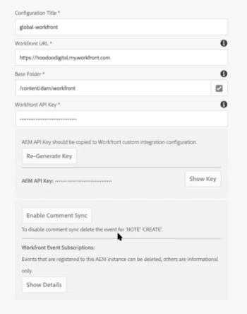
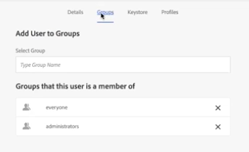

# Configurar [!DNL Workfront] com conector herdado [!DNL Adobe Experience Manager]

Como administrador do [!DNL Adobe Workfront], você pode integrar o [!DNL Workfront] ao [!UICONTROL Adobe Experience Manager (AEM) Assets] e fornecer à sua organização uma solução abrangente de gerenciamento de conteúdo para a criação, o compartilhamento e a manutenção de ativos no seu fluxo de trabalho.

## Requisitos de acesso

<!-- Audited: 4/2025 -->

+++ Expanda para visualizar os requisitos de acesso para a funcionalidade neste artigo.

Você deve ter o seguinte acesso para executar as etapas deste artigo:

<table style="table-layout:auto"> 
 <col> 
 <col> 
 <tbody> 
  <tr> 
   <td role="rowheader">[!DNL Adobe Workfront] plano</td> 
   <td>Qualquer</td> 
  </tr> 
  <tr> 
   <td role="rowheader">[!DNL Adobe Workfront] licença</td> 
   <td><p>Novo: Padrão</p>
   <p>Ou</p>
   <p>Atual: Plano</p>
 </td> 
  </tr> 
  <tr> 
   <td role="rowheader">Configurações de nível de acesso</td> 
   <td>Administrador de Sistema </td> 
  </tr> 
 </tbody> 
</table>

Para obter mais detalhes sobre as informações nesta tabela, consulte [Requisitos de acesso na documentação do Workfront](/help/quicksilver/administration-and-setup/add-users/access-levels-and-object-permissions/access-level-requirements-in-documentation.md).

+++

## [!DNL Workfront for AEM Assets]

O [!DNL Workfront for AEM Assets connector] permite que sua organização faça o seguinte:

* Colabore e gerencie conteúdo criativo vinculando ativos e pastas do AEM a projetos, tarefas, problemas e solicitações no [!DNL Workfront].

  Para obter mais informações sobre como configurar integrações de documentação com aplicativos de terceiros, consulte [Configurar integrações de documentos](../../administration-and-setup/configure-integrations/configure-document-integrations.md).

* Integre com o repositório do [!DNL AEM Digital Asset Managemen]t (DAM), permitindo que você use o [!DNL Workfront] para gerenciar e compartilhar ativos digitais armazenados no DAM.

  Para obter mais informações sobre como vincular documentos e pastas de ativos, consulte   [Vincular documentos de aplicativos externos](../../documents/adding-documents-to-workfront/link-documents-from-external-apps.md).

* Combine e aplique metadados de ambos os aplicativos a um ativo.
* Exibir um fluxo de comunicação abrangente para um ativo. Atualizações e comentários feitos em um ativo no [!DNL Workfront] ou no [!UICONTROL AEM Assets] são sincronizados com o outro aplicativo, estabelecendo um histórico abrangente das comunicações feitas com o ativo.

  Para obter mais informações sobre como fazer comentários em [!DNL Workfront], consulte [Adicionar uma atualização a um documento](../../documents/managing-documents/add-update-documents.md).

## Pré-requisitos para instalar o conector [!DNL AEM Assets]

Antes de instalar o conector [!DNL Workfront] para [!UICONTROL AEM Assets], verifique se os seguintes pré-requisitos foram atendidos:

* O [!UICONTROL AEM Assets] está instalado e configurado, versão 6.5 ou posterior. Para obter informações sobre como instalar o [!UICONTROL AEM Assets], consulte a [[!DNL Adobe Experience Manager] documentação](https://experienceleague.adobe.com/docs/experience-manager.html).
* (Condicional) Se as regras de firewall não permitirem o tráfego conforme o esperado, adicione o endereço IP e/ou domínio do cluster à inclui na lista de permissões. Incluir na lista de permissões Para obter mais informações, consulte [Configurar o arquivo do firewall](../../administration-and-setup/get-started-wf-administration/configure-your-firewall.md).

## Instalar o pacote do conector [!DNL Workfront for AEM Assets] {#install-the-workfront-for-aem-assets-connector-package}

>[!IMPORTANT]
>
>As instruções a seguir são para um conector herdado [!DNL Workfront with AEM Assets], que foi substituído pelo [[!DNL Workfront for Experience Manager] conector aprimorado](../../documents/workfront-and-experience-manager-integrations/workfront-for-experience-manager-enhanced-connector/workfront-for-aem-enhanced-connector.md). Entre em contato com o representante de sua conta para obter mais informações.

Para instalar o conector [!DNL Workfront for AEM Assets], você deve importar o conector para o AEM como um pacote usando o [!UICONTROL Gerenciador de Pacotes do CRX].

1. Em uma estação de trabalho em que você já instalou o AEM, baixe o arquivo de instalação do Conector do [!DNL Workfront for AEM Assets].

   Você pode obter o conector [!DNL Workfront for AEM Assets] de seu representante [!DNL Workfront].

1. Faça logon no AEM usando uma conta de administrador.
1. Clique em **[!UICONTROL Ferramentas]** > **[!UICONTROL Implantação]** > **[!UICONTROL Pacotes]**. O [!UICONTROL Gerenciador de Pacotes do CRX] se abre.

1. Clique em **[!UICONTROL Carregar pacote].**

1. Na caixa de diálogo **[!UICONTROL Carregar Pacote]**, procure e selecione o pacote do **[!UICONTROL Workfront Connector]** e clique em **[!UICONTROL OK]**. O pacote é exibido no [!UICONTROL Gerenciador de Pacotes do CRX].

1. Clique em **[!UICONTROL Instalar].**

1. Na caixa de diálogo **[!UICONTROL Pacote]**, ignore as configurações avançadas e clique em **[!UICONTROL Instalar]**.
1. (Opcional) Para confirmar se o conector foi instalado com êxito, verifique se a seguinte instrução é exibida no [!UICONTROL Log de atividades]:

   ```
   Package installed in <time>
   ```

1. Feche o [!UICONTROL Gerenciador de pacotes do CRX]. O conector está instalado e agora você pode configurar o [!DNL AEM Assets] para integrar com o [!DNL Workfront].

1. Continuar com [Configurar [!DNL AEM Assets] para integrar com [!DNL Workfront]](#configure-aem-assets-to-integrate-with-workfront).

## Configurar [!DNL AEM Assets] para integrar com [!DNL Workfront] {#configure-aem-assets-to-integrate-with-workfront}

Após instalar o conector, importe o pacote do conector para o AEM e configure o AEM para vincular com documentos em [!DNL Workfront].

Para obter informações sobre como instalar o conector, consulte [Instalar o [!DNL Workfront for AEM Assets] pacote do conector](#install-the-workfront-for-aem-assets-connector-package).

* [Pré-requisitos](#prerequisites)
* [Integrar o AEM com o  [!DNL Workfront]](#integrate-aem-with-workfront)
* [Configurar o [!UICONTROL Externalizador do AEM]](#configure-the-aem-externalizer)

### Pré-requisitos {#prerequisites}

Antes de começar, você deve ativar permissões para workfront-service:

1. No AEM, vá para **[!UICONTROL Ferramentas]** > **[!UICONTROL Segurança]** > **[!UICONTROL Permissões]**.
1. No canto superior esquerdo, escolha **[!UICONTROL Usuários]**&#x200B; no menu suspenso e digite *[!UICONTROL workfront-service]* no campo **[!UICONTROL Pesquisa]**&#x200B;. Selecione o usuário [!UICONTROL workfront-service].
1. No lado direito da tela, selecione **[!UICONTROL Adicionar ACE]** para criar novas entradas.
1. Na janela &#x200B;**[!UICONTROL Adicionar Nova Entrada]**&#x200B;, marque o ícone da caixa de seleção no campo **[!UICONTROL Caminho]**&#x200B; e escolha a pasta: */conf*
1. No campo **Privilégios**, digite: *jcr:read*
1. No canto superior direito, selecione **[!UICONTROL Adicionar]**&#x200B;.
1. (Opcional) Repita as etapas acima para criar mais entradas.

### Integrar o AEM com o [!DNL Workfront] {#integrate-aem-with-workfront}

1. Faça logon no AEM Assets como Administrador.
1. Clique em **[!UICONTROL Ferramentas]** > **[!UICONTROL Cloud Services]** > **[!UICONTROL Configuração da Integração do Workfront]** > **[!UICONTROL Global-Workfront].**&#x200B;**&#x200B;**

1. (Condicional) Se você ainda não tiver feito isso, crie um arquivo de configuração na nuvem [!DNL Workfront]:

   1. No canto superior direito da página [!DNL Global-Workfront], clique em **[!UICONTROL Criar]**.
   1. Na caixa **[!UICONTROL URL do Workfront]**, especifique a URL da instância [!DNL Workfront].

      Por exemplo, [!DNL https]://`<account>`.my.workfront.com, onde `<account>` é a conta usada para integrações com o AEM.

   1. No campo&#x200B;**[!UICONTROL Pasta base]**, marque o ícone de caixa de seleção.
   1. No menu suspenso, selecione o caminho onde os documentos vinculados a [!DNL Workfront] objetos são armazenados.
   1. No modal do AEM que aparece, siga o caminho para a pasta com os documentos que estão conectados a [!DNL Workfront] objetos. Escolha a pasta e pressione **[!UICONTROL Select]**&#x200B;no canto superior direito.

      Você pode vincular a qualquer pasta abaixo da raiz /content/dam/.

   1. Na caixa **[!UICONTROL Chave de API do Workfront]**, especifique a Chave de API do [!UICONTROL Workfront].

      Para recuperar sua chave de API [!DNL Workfront]:

      1. Abra uma guia do navegador e faça logon na sua conta do [!DNL Workfront] como administrador do [!DNL Workfront].

      {{step-1-to-setup}}

      1. Clique em **[!UICONTROL Sistema]** > **[!UICONTROL Informações do cliente]**.

         Se você já tiver gerado uma chave de API, sua Chave de API [!DNL Workfront] será exibida sob o rótulo **Chave de API do seu usuário**.

      1. (Condicional) Se você ainda não tiver gerado uma chave de API, precisará gerar uma:

         1. Na seção **[!UICONTROL Configurações da Chave de API]**, verifique se a opção **[!UICONTROL Após a Criação, as chaves de API expiram em]** está definida como **Nenhuma**.

            Se você selecionar um período de expiração, o conector deixará de funcionar após a chave de API expirar. Em seguida, será necessário gerar novamente uma Chave de API e atualizar sua configuração [!DNL Workfront].

         1. No rótulo **[!UICONTROL Chave de API do seu usuário]**, clique em **[!UICONTROL Gerar Chave de API]**. Uma Chave de API para [!DNL Workfront] é gerada e exibida.
      1. Copie a chave de API para a área de transferência.
      1. Abra a guia do navegador do AEM Connector e, na caixa **[!DNL Workfront API Key]**, cole a Chave de API copiada.
   1. (Condicional) Clique na guia **[!UICONTROL Avançado]** no canto superior esquerdo da página [!UICONTROL [!DNL Workfront] Configuração de integração] e selecione as seguintes opções, se aplicável:

      **[!UICONTROL Permitir Navegação da Coleção]:**&#x200B;Selecione esta opção se sua organização permitir que [!DNL Workfront] usuários vinculem coleções do AEM Assets a [!DNL Workfront] objetos.

      **[!UICONTROL Federated ID do Usuário]:** selecione esta opção se sua organização estiver usando Federated IDs ou Single Sign-On (SSO) ao fazer logon no Workfront.

      **[!UICONTROL Ignorar Domínio de Email]:** selecione esta opção se os usuários do AEM não usarem o nome de domínio em suas IDs de usuário.

      **[!UICONTROL Restringir Acesso]:** Selecione esta opção para especificar os endereços IP [!DNL Workfront] apropriados que precisam ser adicionados ao arquivo de inclui na lista de permissões. Para obter mais informações sobre a inclui na lista de permissões do firewall, consulte [Configurar a inclui na lista de permissões do firewall](../../administration-and-setup/get-started-wf-administration/configure-your-firewall.md).

   1. No canto superior esquerdo da página Configuração de integração do Workfront, clique na guia **[!UICONTROL Básico]** e em **[!UICONTROL Conectar]**.

      >[!NOTE]
      >
      >As alterações podem levar algum tempo para serem aplicadas. Reiniciar o pacote pode acelerar o processo.


1. (Condicional) Se você já criou um arquivo de configuração na nuvem [!DNL Workfront], selecione **[!UICONTROL Global-[!DNL Workfront]]** e, no canto superior esquerdo, clique em **[!UICONTROL Propriedades]**.

1. Gere a chave de API do AEM clicando em **[!UICONTROL Gerar chave],** e copie a chave de API do AEM para a área de transferência.

   Você precisará da Chave de API do AEM mais tarde ao configurar o [!UICONTROL Workfront] para integrar-se com o [!UICONTROL AEM Assets]. Para obter mais informações, consulte [Configurar o Workfront para integrar aos ativos do AEM](#configure-workfront-to-integrate-with-aem-assets).

1. No canto superior direito, clique em **[!UICONTROL Salvar]**. A janela [!UICONTROL Global-[!DNL Workfront]] é exibida.

   

1. (Opcional) Sincronizar a comunicação bidirecional entre o AEM e o [!DNL Workfront]:

   1. Clique em **[!UICONTROL Global-[!DNL Workfront]].**
   1. No canto superior esquerdo da janela, clique em **[!UICONTROL Propriedades]**. A página **[!UICONTROL [!DNL Workfront]Configuração de Integração]** é exibida.

      

   1. (Opcional) Para habilitar a sincronização de comentários entre o [!UICONTROL AEM Assets] e o [!DNL Workfront], clique em **[!UICONTROL Habilitar a Sincronização de Comentários]**.

      >[!IMPORTANT]
      >
      >Você deve habilitar a [!UICONTROL Sincronização de Documentos] para sincronizar os ativos.

   1. (Opcional) Para desativar a sincronização de comentários, clique em **[!UICONTROL Desabilitar Sincronização de Comentários].**

      Ou

      Exclua a assinatura de evento [!UICONTROL NOTA CRIAR] registrada em sua instância do AEM.

      Para obter informações sobre assinaturas de evento, consulte [API de Assinatura de Evento](../../wf-api/general/event-subs-api.md).

1. Continue com [Configurar o [!UICONTROL Externalizador do AEM]](#configure-the-aem-externalizer).

### Configurar o [!UICONTROL Externalizador do AEM] {#configure-the-aem-externalizer}

O [!UICONTROL Externalizador do AEM] permite que o AEM passe URLs em um formato que possa ser usado em [!DNL Workfront]. Se não estiver configurado corretamente, o [!DNL Workfront] não poderá fazer chamadas para a API do AEM e as URLs que vinculam documentos do AEM no Workfront não funcionarão.

1. No AEM, clique em **[!UICONTROL Ferramentas]** > **[!UICONTROL Operações]** > **[!UICONTROL Console da Web]**.

1. Clique em **[!UICONTROL OSGI]** e em **[!UICONTROL Configuração]** no menu suspenso.

1. Na lista de configuração, selecione&#x200B;**[!UICONTROL Day CQ Link Externalizer].** A página **[!UICONTROL Externalizador]** é exibida.

1. Na seção **[!UICONTROL Domínios]**, verifique se o domínio listado no campo **[!UICONTROL Autor]** é o nome de domínio acessível externamente aos usuários do AEM.

   O nome de domínio no campo [!UICONTROL autor] deve corresponder ao domínio listado na linha de URL da sua instância do AEM.

   ![[!DNL Extenalizer].png](assets/extenalizer-350x128.png)

1. (Condicional) Se necessário, atualize o domínio no campo **[!UICONTROL Autor]**.
1. Clique em **[!UICONTROL Salvar]**. [!UICONTROL AEM Assets] agora está configurado para vincular documentos com [!DNL Workfront].

1. Continuar com [Configurar [!DNL Workfront] para integrar com [!DNL AEM assets]](#configure-workfront-to-integrate-with-aem-assets).

## Configurar [!DNL Workfront] para integrar com [!DNL AEM assets] {#configure-workfront-to-integrate-with-aem-assets}

Depois de instalar o Conector do [!UICONTROL Workfront for AEM Assets] (conforme descrito em [Instalar o pacote de conectores do [!UICONTROL Workfront for AEM Assets]](#install-the-workfront-for-aem-assets-connector-package)) e configurar o [!UICONTROL AEM Assets] (conforme descrito em [Configurar[!UICONTROL  AEM Assets] para integração com o  [!DNL Workfront]](#configure-aem-assets-to-integrate-with-workfront)), você precisará configurar o [!DNL Workfront] para vincular documentos entre o [!DNL Workfront] e o [!DNL AEM Assets].

1. Faça logon no Workfront como administrador.

   >[!TIP]
   >
   >A [!UICONTROL Workfront] recomenda criar um administrador do [!UICONTROL Workfront] dedicado exclusivamente à sua integração com o AEM. Para obter mais informações sobre como atribuir o nível de acesso de administrador do [!UICONTROL Workfront] a um usuário, consulte [Conceder aos usuários acesso administrativo a determinadas áreas](../../administration-and-setup/add-users/configure-and-grant-access/grant-users-admin-access-certain-areas.md).

{{step-1-to-setup}}

1. Clique em **[!UICONTROL Documentos]** > **[!UICONTROL Integração personalizada].**

1. Clique em **[!UICONTROL Adicionar Integração Personalizada]**.
1. Na caixa **[!UICONTROL Nome]**, digite o nome da integração personalizada.

   Este é o nome que os usuários veem ao usar a integração no [!UICONTROL Workfront].

1. Na caixa **[!UICONTROL URL da API de Base]**, digite a URL da sua instância do AEM.

   O URL da API de base consiste no URL da instância do AEM seguido pelo caminho: /bin/webhooks/api/

   

1. No menu suspenso **[!UICONTROL Tipo de autenticação]**, selecione **[!UICONTROL ApiKey].**

1. Na caixa&#x200B;**[!UICONTROL Chave de API]**, cole a Chave de API do AEM que você copiou quando configurou o [!UICONTROL AEM Assets].
1. Clique em **[!UICONTROL Salvar]**.
1. (Opcional) Verifique se a integração está marcada como [!UICONTROL Ativa].\
   

   [!DNL Workfront] está configurado para trabalhar com [!DNL AEM Assets].

   Para acessar ativos no AEM, cada usuário do [!DNL Workfront] que precisar usar o conector deve ser configurado como um usuário no AEM. Para obter informações sobre como criar usuários, consulte [Configurar usuários para usar o conector](#set-up-users-to-use-the-connector).

## Configurar usuários para usar o conector {#set-up-users-to-use-the-connector}

Para que os usuários acessem o conector, eles devem ter um perfil de usuário no AEM e pertencer a um grupo [!DNL Workfront] que tenha Níveis de acesso que incluam as permissões [!UICONTROL Criar] e [!UICONTROL Excluir].

Para obter mais informações sobre [!DNL Workfront] permissões, consulte [Criar ou modificar níveis de acesso personalizados](../../administration-and-setup/add-users/configure-and-grant-access/create-modify-access-levels.md).

* [Configurar usuários em [!DNL AEM assets]](#set-up-users-in-aem-assets)

### Configurar usuários em [!DNL AEM assets] {#set-up-users-in-aem-assets}

1. Faça logon em [!DNL AEM Assets] como administrador do Workfront.
1. Clique em **[!UICONTROL Ferramentas]** > **&#x200B;**&#x200B;**[!UICONTROL Segurança]** > **[!UICONTROL Usuários]**.

1. (Condicional) Se o usuário não tiver um perfil de usuário no AEM, crie um perfil de usuário do AEM.

   1. Clique em **[!UICONTROL Criar Usuário].**
   1. Insira as informações pessoais do usuário.

      

      O único campo obrigatório é o campo **ID**. A AEM ID do usuário deve corresponder à ID [!DNL Workfront], que é o endereço de email [!DNL Workfront] do usuário.

      Se você selecionou a opção **[!UICONTROL Ignorar domínio de email]** ao configurar o AEM para integrar com o [!DNL Workfront], então a AEM ID não corresponderá ao endereço de email do [!DNL Workfront].

1. (Condicional) Se o usuário tiver um perfil do AEM, abra o perfil do AEM do usuário:

   1. Clique em&#x200B;**[!UICONTROL Usuário]**. A página **[!UICONTROL User Management]** é exibida.

   1. Clique no usuário que você deseja adicionar e em **[!UICONTROL Propriedades]**. A página de configurações do usuário é exibida.

1. Clique na guia **[!UICONTROL Grupos]**.

   

1. Certifique-se de que o usuário pertença a pelo menos um grupo [!DNL Workfront] que tenha Níveis de acesso que incluam as permissões **[!UICONTROL Criar]** e **[!UICONTROL Excluir]**.

   1. Para adicionar o usuário a um grupo existente, comece digitando o nome do grupo na caixa **[!UICONTROL Digitar nome do grupo]** e, em seguida, selecione o grupo quando ele aparecer no menu suspenso.

      Ou

      Para selecionar um grupo do qual o usuário é membro, selecione um grupo na seção **[!UICONTROL Grupos dos quais este usuário é membro]**.

1. Clique em **[!UICONTROL Salvar].**
