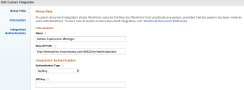

# Configurar [!DNL Workfront] com [!DNL Adobe Experience Manager] conector herdado

Como um [!DNL Adobe Workfront] administrador, é possível integrar [!DNL Workfront] com [!UICONTROL Ativos da Adobe Experience Manager (AEM)] e fornecer à sua organização uma solução abrangente de gerenciamento de conteúdo para a criação, compartilhamento e manutenção de ativos em seu fluxo de trabalho.

## Requisitos de acesso

Você deve ter o seguinte acesso para executar as etapas neste artigo:

<table style="table-layout:auto"> 
 <col> 
 <col> 
 <tbody> 
  <tr> 
   <td role="rowheader">[!DNL Adobe Workfront] plano*</td> 
   <td>Qualquer Um</td> 
  </tr> 
  <tr> 
   <td role="rowheader">[!DNL Adobe Workfront] licença*</td> 
   <td>[!UICONTROL Plan]</td> 
  </tr> 
  <tr> 
   <td role="rowheader">Configurações de nível de acesso*</td> 
   <td> <p>Você deve ser um [!DNL Workfront] administrador. Para obter informações sobre [!DNL Workfront] administradores, consulte <a href="../../administration-and-setup/add-users/configure-and-grant-access/grant-a-user-full-administrative-access.md" class="MCXref xref">Conceder ao usuário acesso administrativo total</a>.</p> </td> 
  </tr> 
 </tbody> 
</table>

&#42;Para descobrir qual plano, tipo de licença ou acesso você tem, entre em contato com seu [!DNL Workfront] administrador.

## [!DNL Workfront for AEM Assets]

O [!DNL Workfront for AEM Assets connector] O permite que sua organização faça o seguinte:

* Colabore e gerencie conteúdo criativo vinculando AEM ativos e pastas a projetos, tarefas, problemas e solicitações em [!DNL Workfront].

   Para obter mais informações sobre como configurar integrações de documentação com aplicativos de terceiros, consulte  [Configurar integrações de documentos](../../administration-and-setup/configure-integrations/configure-document-integrations.md).

* Integrar com o [!DNL AEM Digital Asset Managemen]repositório t (DAM), permitindo usar [!DNL Workfront] para gerenciar e compartilhar ativos digitais armazenados no DAM.

   Para obter mais informações sobre vinculação de documentos e pastas de ativos, consulte   [Vincular documentos de aplicativos externos](../../documents/adding-documents-to-workfront/link-documents-from-external-apps.md).

* Combine e aplique metadados de ambos os aplicativos a um ativo.
* Exibir um fluxo de comunicação abrangente para um ativo. Atualizações e comentários feitos a um ativo em [!DNL Workfront] ou [!UICONTROL AEM Assets] são sincronizadas com o outro aplicativo, estabelecendo um histórico abrangente de comunicações feitas ao ativo.

   Para obter mais informações sobre como fazer comentários em [!DNL Workfront], consulte [Adicionar uma atualização a um documento](../../documents/managing-documents/add-update-documents.md).

## Pré-requisitos para instalar o [!DNL AEM Assets] conector

Antes de instalar o [!DNL Workfront] conector para [!UICONTROL AEM Assets], certifique-se de que os seguintes pré-requisitos sejam atendidos:

* [!UICONTROL AEM Assets] instalado e configurado, versão 6.5 ou posterior. Para obter informações sobre a instalação [!UICONTROL AEM Assets], consulte o [[!DNL Adobe Experience Manager] documentação](https://experienceleague.adobe.com/docs/experience-manager.html).
* (Condicional) Se as regras de firewall não permitirem tráfego conforme esperado, adicione o endereço IP e/ou domínio do cluster à sua lista de permissões. Para obter mais informações, consulte [Configurar a  lista de permissões do firewall](../../administration-and-setup/get-started-wf-administration/configure-your-firewall.md).

## Instale o [!DNL Workfront for AEM Assets] pacote do conector {#install-the-workfront-for-aem-assets-connector-package}

>[!IMPORTANT]
>
>As instruções a seguir são para um [!DNL Workfront with AEM Assets] conector herdado que foi substituído pelo [[!DNL Workfront for Experience Manager] conector avançado](../../documents/workfront-and-experience-manager-integrations/workfront-for-experience-manager-enhanced-connector/workfront-for-aem-enhanced-connector.md). Entre em contato com seu representante de conta para obter mais informações.

Para instalar o [!DNL Workfront for AEM Assets] você deve importar o conector para o AEM como um pacote usando o [!UICONTROL Gerenciador de pacotes CRX].

1. Em uma estação de trabalho onde você já instalou o AEM, baixe o [!DNL Workfront for AEM Assets] Arquivo de instalação do conector.

   Você pode obter o [!DNL Workfront for AEM Assets] conector do seu [!DNL Workfront] representante.

1. Faça logon no AEM usando uma conta de administrador.
1. Clique em **[!UICONTROL Ferramentas]** > **[!UICONTROL Implantação]** > **[!UICONTROL Pacotes]**.

   O [!UICONTROL Gerenciador de pacotes CRX] é aberto.

1. Clique em **[!UICONTROL Fazer upload do pacote].**

1. No [!UICONTROL Fazer upload do pacote] , procure e selecione a caixa de diálogo [!UICONTROL Conector Workfront] e clique em **[!UICONTROL OK]**.\
   O pacote é exibido no [!UICONTROL Gerenciador de pacotes CRX].

1. Clique em **[!UICONTROL Instalar].**

1. No [!UICONTROL Embalagem] , ignore as configurações avançadas e clique em **[!UICONTROL Instalar]**.
1. (Opcional) Para confirmar se o conector foi instalado com êxito, verifique se a seguinte instrução é exibida no [!UICONTROL Log de atividades]:

   ```
   Package installed in <time>
   ```

1. Feche o [!UICONTROL Gerenciador de pacotes CRX].

   O conector está instalado e agora você pode configurar [!DNL AEM Assets] para integrar com [!DNL Workfront].

1. Continue com [Configurar [!DNL AEM Assets] para integrar com [!DNL Workfront]](#configure-aem-assets-to-integrate-with-workfront).

## Configurar [!DNL AEM Assets] para integrar com [!DNL Workfront] {#configure-aem-assets-to-integrate-with-workfront}

Depois de instalar o conector, importe o pacote do conector para AEM e configure AEM para vincular com documentos em [!DNL Workfront].

Para obter informações sobre como instalar o conector, consulte  [Instale o [!DNL Workfront for AEM Assets] pacote do conector](#install-the-workfront-for-aem-assets-connector-package).

* [Pré-requisitos](#prerequisites)
* [Integrar AEM com [!DNL Workfront]](#integrate-aem-with-workfront)
* [Configure o [!UICONTROL AEM Externalizador]](#configure-the-aem-externalizer)

### Pré-requisitos {#prerequisites}

Antes de começar, você deve ativar permissões para o serviço front-service:

1. Em AEM, acesse **[!UICONTROL Ferramentas]**> **[!UICONTROL Segurança]**> **[!UICONTROL Permissões]**.
1. No canto superior esquerdo, escolha **[!UICONTROL Usuários]**&#x200B; no menu suspenso e digite *[!UICONTROL serviço front-service]* no **[!UICONTROL Pesquisar]**&#x200B; campo . Selecione o [!UICONTROL serviço front-service] usuário.
1. No lado direito da tela, selecione **[!UICONTROL Adicionar ACE]** para criar novas entradas.
1. No &#x200B;**[!UICONTROL Adicionar nova entrada]**&#x200B; janela, selecione o ícone da caixa de seleção na **[!UICONTROL Caminho]**&#x200B; campo e escolha a pasta : */conf*
1. No campo Privilégios , informe: *jcr:read*
1. Selecionar **[!UICONTROL Adicionar]**&#x200B; no canto superior direito
1. (Opcional) Repita as etapas para criar mais entradas.

### Integrar AEM com [!DNL Workfront] {#integrate-aem-with-workfront}

1. Faça logon no AEM Assets como um administrador.
1. Clique em **[!UICONTROL Ferramentas]** >**[!UICONTROL Cloud Services]**>**[!UICONTROL Configuração de integração do Workfront]** >**[!UICONTROL Global-Workfront].**&#x200B;**&#x200B;**

1. (Condicional) Se ainda não tiver feito isso, crie um [!DNL Workfront] arquivo de configuração da nuvem.

   1. Clique em  **[!UICONTROL Criar]** no canto superior direito do [!DNL Global-Workfront] página.
   1. No **[!UICONTROL URL do Workfront]** , especifique o URL de sua [!DNL Workfront] instância.

      Por exemplo, [!DNL https]://`<account>`.my.workfront.com, onde `<account>` é a conta usada para integrações com o AEM.

   1. No &#x200B;**[!UICONTROL Pasta base]** selecione o ícone de caixa de seleção e, no menu suspenso, selecione o caminho onde os documentos estão vinculados [!DNL Workfront] são armazenados.
   1. No modal AEM exibido, siga o caminho para a pasta com os documentos conectados a [!DNL Workfront] objetos. Escolha a pasta e pressione **[!UICONTROL Selecionar]**&#x200B; no canto superior direito.

      Você pode vincular a qualquer pasta abaixo da raiz /content/dam/.

   1. No **[!UICONTROL Chave da API do Workfront]** , especifique [!UICONTROL Workfront] Chave da API.

      Para recuperar o [!DNL Workfront] Chave da API:

      1. Abra uma guia do navegador e faça logon em sua [!DNL Workfront] como uma [!DNL Workfront] administrador.
      1. Clique no botão **[!UICONTROL Menu principal]** ícone  no canto superior direito de [!DNL Adobe Workfront], depois clique em **[!UICONTROL Configuração]** .

      1. Clique em **[!UICONTROL Sistema]** >**[!UICONTROL Informações do cliente]**.

         Se você já gerou uma chave de API, [!DNL Workfront] Chave da API é exibida abaixo do rótulo Chave da API de seu usuário .

      1. (Condicional) Se você ainda não gerou uma chave de API, precisará gerar uma:

         1. No **[!UICONTROL Configurações da chave da API]** certifique-se de que **[!UICONTROL Após a criação, as chaves da API expiram em]** está definida como Nenhum.

            Se você selecionar um período de expiração, o conector deixará de funcionar depois que a chave de API expirar. Em seguida, será necessário gerar novamente uma chave de API e atualizar sua [!DNL Workfront] configuração.

         1. Em **[!UICONTROL Chave da API do seu usuário]** rótulo, clique em **[!UICONTROL Gerar chave de API]**.

            Uma chave de API para [!DNL Workfront] gera e exibe.
      1. Copie a chave da API para a área de transferência.
      1. Abra a guia do navegador para AEM Connector e no **[!DNL Workfront API Key]** , cole a Chave da API copiada.
   1. (Condicional) Clique no botão **[!UICONTROL Avançado]** no canto superior esquerdo do [!UICONTROL [!DNL Workfront] Configuração de integração] e selecione as seguintes opções, se aplicável:

      **[!UICONTROL Permitir navegação de coleção]:**&#x200B; Selecione essa opção se sua organização permitir [!DNL Workfront] usuários para vincular coleções do AEM Assets a [!DNL Workfront] objetos.

      **[!UICONTROL Federated ID do usuário]:** Selecione essa opção se sua organização estiver usando Federated IDs ou Single Sign-On (SSO) ao fazer logon no Workfront.

      **[!UICONTROL Ignorar domínio de email]:** Selecione essa opção se os usuários AEM não usarem o nome de domínio na ID de usuário.

      **[!UICONTROL Restringir acesso]:** Selecione essa opção para especificar o [!DNL Workfront] Endereços IP que precisam ser adicionados à  de lista de permissões. Para obter mais informações sobre a  de lista de permissões, consulte [Configurar a  lista de permissões do firewall](../../administration-and-setup/get-started-wf-administration/configure-your-firewall.md).

   1. Clique no botão **[!UICONTROL Básico]** no canto superior esquerdo da página Configuração da integração do Workfront e, em seguida, clique em **[!UICONTROL Connect]**.

      >[!NOTE]
      >
      >As alterações podem levar algum tempo para serem aplicadas. Reiniciar o pacote pode acelerar o processo.


1. (Condicional) Se você já criou um [!DNL Workfront] arquivo de configuração da nuvem, selecione **[!UICONTROL Global-[!DNL Workfront]]** e, no canto superior esquerdo, clique em **[!UICONTROL Propriedades]**.

1. Gere a chave da API de AEM clicando em **[!UICONTROL Gerar Chave],** em seguida, copie a chave da API de AEM para a área de transferência.

   Você precisará da chave de API AEM posteriormente ao configurar [!UICONTROL Workfront] para integrar com [!UICONTROL AEM Assets]. Para obter mais informações, consulte [Configurar o Workfront para integração com AEM ativos](#configure-workfront-to-integrate-with-aem-assets).

1. No canto superior direito, clique em **[!UICONTROL Salvar]**.

   O [!UICONTROL Global-[!DNL Workfront]] será exibida.

   

1. (Opcional) Sincronizar a comunicação bidirecional entre AEM e [!DNL Workfront].

   1. Clique em **[!UICONTROL Global-[!DNL Workfront]].**
   1. No canto superior esquerdo da janela, clique em **[!UICONTROL Propriedades]**.

      O [!UICONTROL [!DNL Workfront] Configuração de integração] será exibida.

      

   1. (Opcional) Para habilitar a sincronização de comentários entre [!UICONTROL AEM Assets] e [!DNL Workfront], clique em **[!UICONTROL Ativar Sincronização de Comentários]**.

      >[!IMPORTANT]
      >
      >Você deve ativar [!UICONTROL Sincronização de documentos] para sincronizar os ativos.

   1. (Opcional) Para desativar a sincronização de comentários, clique em **[!UICONTROL Desativar Sincronização de Comentários].**

      Ou

      Exclua o [!UICONTROL NOTA CRIAR] assinatura de evento registrada para a instância de AEM.

      Para obter informações sobre assinaturas de eventos, consulte [API de assinatura de evento](../../wf-api/general/event-subs-api.md).

1. Continue com [Configure o [!UICONTROL AEM Externalizador]](#configure-the-aem-externalizer).

### Configure o [!UICONTROL AEM Externalizador] {#configure-the-aem-externalizer}

O [!UICONTROL AEM Externalizador] permite que o AEM transmita URLs em um formato que pode ser usado em [!DNL Workfront]. Se não estiver configurado corretamente, [!DNL Workfront] O não pode fazer chamadas para a API de AEM, e os URLs que vinculam AEM documentos no Workfront não funcionarão.

1. Em AEM, clique em **[!UICONTROL Ferramentas]** > **[!UICONTROL Operações]** >**[!UICONTROL Console da Web]**.

1. Clique em **[!UICONTROL OSGI]**, depois clique em **[!UICONTROL Configuração]** no menu suspenso.

1. Na lista de configuração, selecione &#x200B;**[!UICONTROL Externalizador de links CQ do dia].**

   O [!UICONTROL Externalizador] será exibida.

1. No **[!UICONTROL Domínios]** verifique o domínio listado na seção [!UICONTROL Autor] é o nome de domínio externamente acessível aos usuários AEM.

   O nome de domínio no [!UICONTROL autor] deve corresponder ao domínio listado na linha de URL da instância de AEM.

   ![[!DNL Extenalizer].png](assets/extenalizer-350x128.png)

1. (Condicional) Se necessário, atualize o domínio no [!UICONTROL Autor] campo.
1. Clique em **[!UICONTROL Salvar]**.

   [!UICONTROL AEM Assets] agora está configurado para vincular documentos com [!DNL Workfront]

1. Continue com [Configurar [!DNL Workfront] para integrar com [!DNL AEM assets]](#configure-workfront-to-integrate-with-aem-assets).

## Configurar [!DNL Workfront] para integrar com [!DNL AEM assets] {#configure-workfront-to-integrate-with-aem-assets}

Depois de instalar o [!UICONTROL Workfront para AEM Assets] Conector (conforme descrito em [Instale o [!UICONTROL Workfront para AEM Assets] pacote do conector](#install-the-workfront-for-aem-assets-connector-package)) e configurar [!UICONTROL AEM Assets] (conforme descrito em [Configurar[!UICONTROL  AEM Assets] para integrar com [!DNL Workfront]](#configure-aem-assets-to-integrate-with-workfront)), você precisa configurar [!DNL Workfront] para vincular documentos entre [!DNL Workfront] e [!DNL AEM Assets].

1. Faça logon em [!DNL Workfront] como [!UICONTROL Workfront] administrador.

   >[!TIP]
   >
   >[!UICONTROL Workfront] A recomenda criar uma [!UICONTROL Workfront] administrador dedicado exclusivamente à sua integração de AEM. Para obter mais informações sobre como atribuir a variável [!UICONTROL Workfront] nível de acesso de administrador a um usuário, consulte [Conceder aos usuários acesso administrativo a determinadas áreas](../../administration-and-setup/add-users/configure-and-grant-access/grant-users-admin-access-certain-areas.md).

1. Clique no botão **[!UICONTROL Menu principal]** ícone  no canto superior direito de [!DNL Adobe Workfront], depois clique em **[!UICONTROL Configuração]** .

1. Clique em **[!UICONTROL Documentos]**> **[!UICONTROL Integração personalizada].**

1. Clique em **[!UICONTROL Adicionar integração personalizada]**.
1. No **[!UICONTROL Nome]** , especifique o nome da integração personalizada.

   Esse é o nome que os usuários veem ao usar a integração dentro de [!UICONTROL Workfront]; por exemplo, você pode inserir *&quot;[!DNL AEM Assets]&quot;* para o nome.

1. No **[!UICONTROL URL da API básica]** , especifique o URL da sua instância de AEM.

   O URL da API base consiste no URL da sua instância de AEM seguido pelo caminho: /bin/webhooks/api/

   

1. No **[!UICONTROL Tipo de autenticação]** , selecione **[!UICONTROL ApiKey].**

1. No &#x200B;**[!UICONTROL Chave da API]** , cole a Chave da API de AEM copiada ao configurar [!UICONTROL AEM Assets].
1. Clique em **[!UICONTROL Salvar]**.
1. (Opcional) Verifique se a integração está marcada [!UICONTROL Ativo].\
   

   [!DNL Workfront] agora está configurado para funcionar com [!DNL AEM Assets].

   Para acessar ativos no AEM, cada um [!DNL Workfront] usuário que precisa usar o conector deve ser configurado como usuário no AEM. Para obter informações sobre como criar usuários, consulte  [Configurar usuários para usar o conector](#set-up-users-to-use-the-connector).

## Configurar usuários para usar o conector {#set-up-users-to-use-the-connector}

Para que os usuários acessem o conector, eles devem ter um perfil de usuário no AEM e pertencer a um [!DNL Workfront] grupo que tem níveis de acesso que incluem a variável [!UICONTROL Criar] e [!UICONTROL Excluir] permissões.

Para obter mais informações sobre [!DNL Workfront] permissões, consulte [Criar ou modificar níveis de acesso personalizados](../../administration-and-setup/add-users/configure-and-grant-access/create-modify-access-levels.md).

* [Configurar usuários em [!DNL AEM assets]](#set-up-users-in-aem-assets)

### Configurar usuários em [!DNL AEM assets] {#set-up-users-in-aem-assets}

1. Faça logon em [!DNL AEM Assets] como [!DNL Workfront] administrador.
1. Clique em **[!UICONTROL Ferramentas]** >**&#x200B;**&#x200B;**[!UICONTROL Segurança]** >**[!UICONTROL Usuários]**.

1. (Condicional) Se o usuário não tiver um perfil de usuário no AEM, crie um perfil de usuário AEM.

   1. Clique em **[!UICONTROL Criar usuário].**
   1. Insira as informações pessoais do usuário.

      

      O único campo obrigatório é o campo de ID. A ID de AEM do usuário deve corresponder a [!DNL Workfront] ID, que é a [!DNL Workfront] endereço de email.

      Se você selecionou a variável [!UICONTROL Ignorar domínio de email] ao configurar AEM para integrar com [!DNL Workfront], a ID do AEM não corresponderá ao valor [!DNL Workfront] endereço de email.

1. (Condicional) Se o usuário tiver um perfil de AEM, abra o perfil de AEM do usuário.

   1. Clique em &#x200B;**[!UICONTROL Usuário].**

      O [!UICONTROL Gerenciamento de usuários] será exibida.

   1. Clique no usuário que deseja adicionar e clique em **[!UICONTROL Propriedades]**.

      A página de configurações do usuário é exibida.

1. Clique no botão **[!UICONTROL Grupos]** guia .

   

1. Certifique-se de que o usuário pertença a pelo menos um [!DNL Workfront] grupo que tem níveis de acesso que incluem a variável [!UICONTROL Criar] e [!UICONTROL Excluir] permissões.

   1. Para adicionar o usuário a um grupo existente, comece a digitar o nome do grupo no **[!UICONTROL Nome do grupo de tipos]** , em seguida, selecione o grupo quando ele for exibido no menu suspenso.

      Ou

      Para selecionar um grupo para o qual o usuário é membro, selecione um grupo no **[!UICONTROL Grupos de que este usuário é membro]** seção.

1. Clique em **[!UICONTROL Salvar].**
