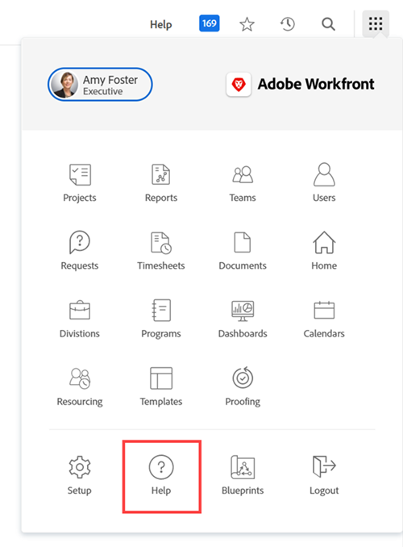

# Configurar um URL de ajuda personalizado

Se você criar um site de ajuda interno personalizado contendo informações sobre como sua organização usa o Workfront, poderá configurar o ícone Menu principal Ajuda para acessar esse site.

Isso não afeta o link principal da Ajuda no Menu principal nem os links de ajuda com reconhecimento de contexto no Workfront, que direciona os usuários para o site da Ajuda do Workfront.

Para obter informações sobre como os usuários acessam uma URL de ajuda personalizada que você configura no Workfront e o site de ajuda regular do Workfront, consulte [Acessando a Ajuda do Workfront na nova experiência do Adobe Workfront](/help/quicksilver/workfront-basics/navigate-workfront/workfront-navigation/access-workfront-help.md).

## Requisitos de acesso

+++ Expanda para visualizar os requisitos de acesso para a funcionalidade neste artigo.

Você deve ter o seguinte acesso para executar as etapas deste artigo:

<table style="table-layout:auto"> 
 <col> 
 <col> 
 <tbody> 
  <tr> 
   <td role="rowheader">plano do Adobe Workfront</td> 
   <td>Qualquer</td> 
  </tr> 
  <tr> 
   <td role="rowheader">Licença do Adobe Workfront</td> 
   <td>Plano</td> 
  </tr> 
  <tr> 
   <td role="rowheader">Configurações de nível de acesso</td> 
   <td> 
Você deve ser um administrador do Workfront.
 
<b>OBSERVAÇÃO</b>: se você ainda não tiver acesso, pergunte ao administrador do Workfront se ele definiu restrições adicionais no seu nível de acesso. Para obter informações sobre como um administrador do Workfront pode modificar seu nível de acesso, consulte <a href="../../../administration-and-setup/add-users/configure-and-grant-access/create-modify-access-levels.md" class="MCXref xref">Criar ou modificar níveis de acesso personalizados</a>.
 </td> 
  </tr> 
 </tbody> 
</table>

+++

## Configurar um URL de Ajuda personalizado

{{step-1-to-setup}}

1. Clique em **Sistema** > **Preferências**.
1. Na seção **Preferências Gerais**, no campo **URL de Ajuda Personalizada**, digite a URL onde está localizado o site de ajuda personalizado.

   Se o local de ajuda personalizado exigir credenciais de logon, essas credenciais serão necessárias para os usuários quando eles acessarem o site pela Workfront. As credenciais para o site de ajuda personalizado podem precisar ser gerenciadas separadamente das credenciais do Workfront se você não estiver usando o Logon único (SSO).

1. Clique em **Salvar**.
