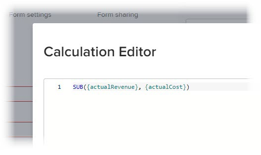

# Adicionar dados calculados a um formulário personalizado com o construtor de formulários herdado

<!--Audited: 01/2024-->

Em um formulário personalizado, você pode adicionar um campo personalizado calculado que usa dados existentes para gerar novos dados quando o formulário personalizado é anexado a um objeto.

Para fazer isso, crie uma instrução que use expressões de dados e os nomes de campos existentes, que podem ser campos personalizados, campos de dados personalizados calculados e campos Adobe Workfront incorporados.

Essa instrução calcula os dados inseridos e exibe o resultado no novo campo personalizado calculado.

Um campo personalizado calculado pode conter:

* Uma referência simples a um único campo incorporado.

  >[!INFO]
  >
  > **Exemplo:** Para calcular a receita gerada por projetos e tarefas, você pode criar um campo personalizado calculado que contenha o campo incorporado Receita real. Quando alguém anexa o formulário personalizado a um projeto ou tarefa, a receita do projeto ou tarefa é exibida no campo.

* Uma expressão que faz referência a um ou mais campos. Podem ser campos personalizados, outros campos personalizados calculados e campos incorporados.

  >[!INFO]
  >
  >**Exemplo:** Para calcular o lucro gerado por projetos e tarefas, você pode criar um campo personalizado calculado chamado Lucro contendo uma expressão matemática que subtrai o custo da receita.
  >
  >Para fazer isso, você pode usar a expressão matemática SUB (subtrair) com os campos integrados Custo real e Receita real do Workfront.
  >
  >Nas etapas abaixo, é possível ver como esse exemplo pode ser executado.

Para obter informações sobre como criar formulários personalizados para sua organização e entender o tipo de campos que você pode associar a eles, consulte [Criar ou editar um formulário personalizado](../../../administration-and-setup/customize-workfront/create-manage-custom-forms/create-or-edit-a-custom-form.md).

## Requisitos de acesso

Você deve ter o seguinte para executar as etapas deste artigo:

<table style="table-layout:auto"> 
 <col> 
 <col> 
 <tbody> 
  <tr data-mc-conditions=""> 
   <td role="rowheader"> 
plano do Adobe Workfront
 </td> 
   <td>Qualquer</td> 
  </tr> 
  <tr> 
   <td role="rowheader">Licença da Adobe Workfront*</td> 
   <td>
Atual: Plano

   Ou
   
Novo: Padrão

   </td> 
  </tr> 
  <tr> 
   <td role="rowheader">
Configuração do nível de acesso
</td> 
   <td> 
Acesso administrativo a formulários personalizados
 
 </td> 
  </tr>  
 </tbody> 
</table>

*Para descobrir quais configurações de plano, tipo de licença ou nível de acesso você tem, entre em contato com o administrador do Workfront. Para obter mais informações sobre requisitos de acesso, consulte [Requisitos de acesso na documentação do Workfront](/help/quicksilver/administration-and-setup/add-users/access-levels-and-object-permissions/access-level-requirements-in-documentation.md).

## Adicionar um campo calculado a um formulário personalizado {#add-a-calculated-field-to-a-custom-form}

Você pode usar campos Workfront incorporados e campos personalizados já criados na expressão de um campo personalizado calculado.

>[!IMPORTANT]
>
>Antes de criar um campo personalizado calculado, identifique os campos existentes que deseja incluir para ter certeza de que os dados necessários para o cálculo estão presentes no Workfront.

1. Comece a criar ou editar um formulário personalizado, conforme descrito em [Criar ou editar um formulário personalizado](../../../administration-and-setup/customize-workfront/create-manage-custom-forms/create-or-edit-a-custom-form.md).

1. No **Adicionar um campo** clique em **Calculado**.

   Na área de exibição à direita, o campo exibe um valor de preenchimento de 12345. É um indicador para lembrá-lo de que o campo é um campo personalizado calculado enquanto você cria ou edita o formulário personalizado. Quando o formulário é anexado a um objeto e os usuários o preenchem, eles veem o resultado do cálculo no campo, e não o valor 12345.

1. Especifique as seguintes informações para o campo calculado:

   <table style="table-layout:auto"> 
    <col> 
    </col> 
    <col> 
    </col> 
    <tbody> 
     <tr> 
      <td role="rowheader">Rótulo</td> 
      <td>Digite um rótulo para o campo. É o que os usuários veem quando usam o formulário personalizado. O campo <b>Nome</b>, que preenche automaticamente e corresponde ao Rótulo, é referenciado pelo Workfront nos relatórios. Este campo é obrigatório.</td> 
     </tr>

   <tr> 
   <td role="rowheader">Nome</td> 
   <td>Por padrão, o Nome de um campo é igual ao Rótulo. No entanto, você pode modificar o Nome de um campo para ser diferente do Rótulo de um campo. O campo <b>Nome</b> é referenciado pela Workfront nos relatórios. Este campo é obrigatório.</td> 
   </tr>

   <tr> 
     <td role="rowheader" id="instructions">Instruções</td> 
      <td> 
Adicione texto para fornecer informações adicionais sobre o campo e a fórmula nele.

      
Também é possível colar aqui a fórmula usada no cálculo do campo personalizado. Nesse caso, recomendamos que você atualize primeiro o Calculation do campo personalizado e, em seguida, copie a expressão final do campo Calculation e a cole no campo Instructions. 

   Isso pode ser útil das seguintes maneiras:
   <ul> 
      <li> 
Como um lembrete do que é a fórmula e como ela funciona. Isso é especialmente útil se você planeja usar esse campo personalizado calculado em vários formulários.
 </li> 
       <li> 
Como uma dica de ferramenta, os usuários podem ver quando passam o mouse sobre o campo. Você pode adicionar qualquer texto aqui que você deseja que eles vejam na dica de ferramenta.
 </li> 
       </ul>
       
Se não quiser que os usuários vejam a fórmula na dica de ferramenta, o que pode ser confuso para eles, não a adicione ao campo Instruções. Em vez disso, use a configuração "Exibir fórmula nas instruções" para exibir ou ocultar a fórmula, conforme descrito posteriormente neste artigo <a href="#build-the-calculation-for-your-calculated-custom-field">Crie o cálculo para seu campo personalizado calculado</a> neste artigo.

   
Para obter informações sobre como usar o mesmo campo personalizado calculado em um novo formulário, consulte <a href="../../../administration-and-setup/customize-workfront/create-manage-custom-forms/use-existing-calc-field-new-custom-form.md#using-an-existing-calculated-custom-field-on-a-new-form" class="MCXref xref">Reutilizar um campo personalizado calculado existente em um formulário personalizado</a>.

   </td> 
     </tr> 
     <tr> 
      <td role="rowheader">Formatar</td> 
      <td> 
O formato no qual você deseja que os resultados do campo sejam armazenados e exibidos.
 
Se você planeja usar o campo em cálculos matemáticos, sempre use um <strong>Número</strong> ou um <strong>Moeda</strong> formato. Ao selecionar Número ou Moeda, o sistema trunca automaticamente os números que começam com 0.
 
      
<b>IMPORTANTE</b>: 
Antes de escolher um formato, considere o formato correto para o novo campo. O campo de formato não pode ser editado depois que o formulário personalizado é salvo. E selecionar o formato errado poderia afetar cálculos futuros e agregar valores em agrupamentos de relatórios e listas.

      
<strong>NOTA:</strong> Os campos calculados com um formato de Moeda não devem incluir aspas. (Por exemplo, use 800.00 e não "800.00".) O uso de aspas pode causar consequências inesperadas devido a nuances na formatação de idioma para tipos de moeda.
</td> 
     </tr> 
    </tbody> 
   </table>

1. Continue a atualizar as informações de campo personalizado, conforme descrito na seção [Crie o cálculo para seu campo personalizado calculado](#build-the-calculation-for-your-calculated-custom-field) neste artigo.

## Crie o cálculo para seu campo personalizado calculado {#build-the-calculation-for-your-calculated-custom-field}

1. Comece a criar o campo personalizado calculado, conforme descrito na seção [Adicionar um campo calculado a um formulário personalizado](#add-a-calculated-field-to-a-custom-form) neste artigo.

1. Clique em **Maximizar** para abrir o **Editor de cálculo** e crie seu cálculo.

   >[!INFO]
   >
   >**Exemplo:** Usando o exemplo na introdução a este artigo, você pode criar um campo personalizado calculado chamado Lucro em um formulário personalizado para projetos e tarefas. Este campo pode conter um cálculo que exibe a diferença entre a Receita Efetiva e o Custo Efetivo:
   >
   >`SUB({actualRevenue},{actualCost})`
   >
   >Neste exemplo, `SUB` é a expressão e os campos referenciados são `actualRevenue` e `actualCost`.

   Um cálculo geralmente começa com uma expressão, seguida por parênteses contendo os campos que você deseja referenciar quando o formulário personalizado é anexado a um objeto. Para obter informações sobre as expressões disponíveis, consulte [Visão geral das expressões de dados calculadas](../../../reports-and-dashboards/reports/calc-cstm-data-reports/calculated-data-expressions.md).

   Cada campo deve estar entre chaves, conforme explicado na seção [Sintaxe necessária em campos personalizados calculados](#syntax-required-in-calculated-custom-fields) neste artigo. Quando você começa a digitar o nome de um campo, o sistema faz sugestões e você pode selecionar uma para inseri-la no cálculo.

   >[!NOTE]
   >
   >   Não é possível referenciar campos dos seguintes tipos em um cálculo: 
   >   
   >   * Campo de texto com formatação
   >   * Texto descritivo.
   >   
   >   Para obter informações sobre os tipos de campo personalizado, consulte [Adicionar um campo personalizado a um formulário personalizado](../../../administration-and-setup/customize-workfront/create-manage-custom-forms/add-a-custom-field-to-a-custom-form.md).

1. Clique na caixa de texto grande na caixa Editor de Cálculo e, em seguida, clique em pesquisar ou expandir e clique em uma opção na caixa **Expressões** e **Campos** seções à direita da caixa de texto. Isso os adiciona ao cálculo.

   Você também pode começar a digitar uma expressão ou campo na caixa de texto grande e selecioná-lo quando ele for exibido. Cada item é exibido com um &quot;F&quot; para o campo ou um &quot;E&quot; para a expressão.

   Se você digitar um parêntese de abertura, o parêntese de fechamento será adicionado automaticamente.

   >[!TIP]
   >
   >Você pode executar qualquer um dos seguintes procedimentos para obter ajuda com o cálculo:
   > 
   >* Passe o mouse sobre uma expressão no cálculo para ver uma descrição, um exemplo mostrando como ela pode ser usada e um link &quot;Saiba mais&quot; para obter mais informações no artigo [Visão geral das expressões de dados calculadas](../../../reports-and-dashboards/reports/calc-cstm-data-reports/calculated-data-expressions.md).
   >  
   >* Use a codificação de cores para identificar os componentes adicionados. As expressões são exibidas em azul e os campos são exibidos em verde.
   >  
   >* Encontre erros de cálculo, destacados em rosa, conforme você avança. Você pode passar o mouse sobre um erro destacado para exibir uma breve descrição da causa.
   >  
   >* No **Visualizar em um objeto existente** abaixo do cálculo, comece digitando o nome de um objeto do Workfront, selecione-o quando ele for exibido na lista. Isso fornece uma visualização da aparência do campo quando o formulário for anexado ao objeto.
   ><!--or by providing test values (NOT READY YET; CHANGE THIS SCREENSHOT WHEN IT IS)-->
   >  
   >* Referencie expressões em um cálculo longo usando os números de linha exibidos à esquerda.

1. Clique em **Minimizar** quando terminar de criar o cálculo para o campo personalizado calculado.

   >[!NOTE]
   >
   >Na área de exibição à direita, o campo exibe um valor de preenchimento de 12345. É um indicador para lembrá-lo de que o campo é um campo personalizado calculado enquanto você cria ou edita o formulário personalizado. Quando o formulário é anexado a um objeto e os usuários o preenchem, eles veem o resultado do cálculo no campo, e não o valor 12345.

1. (Opcional) Use qualquer uma das seguintes opções para configurar ainda mais seu campo personalizado calculado:

   <table style="table-layout:auto"> 
    <col> 
    <col> 
    <tbody> 
     <tr> 
      <td role="rowheader">Adicionar Lógica</td> 
      <td>Você pode adicionar Lógica de exibição para determinar se o campo calculado é exibido com base em pelo menos uma escolha que um usuário faz em um campo de múltipla escolha anterior (Suspenso, Caixas de seleção ou Botões de opção) ao preencher o formulário. Para obter mais informações, consulte <a href="../../../administration-and-setup/customize-workfront/create-manage-custom-forms/display-or-skip-logic-custom-form.md" class="MCXref xref">Adicionar lógica de exibição e lógica de salto a um formulário personalizado</a>. 
Isso está disponível somente quando pelo menos uma caixa de seleção, botão de opção ou campo suspenso precede o campo personalizado calculado no formulário. 
 
A Lógica de salto não está disponível para campos personalizados calculados.
 </td> 
     </tr> 
     <tr> 
      <td role="rowheader">Atualizar cálculos anteriores</td> 
      <td>Ao editar um campo personalizado calculado existente, você pode selecionar essa opção para acionar uma atualização no cálculo ao salvar o formulário personalizado. Isso acontece apenas uma vez quando você salva o formulário personalizado. Depois disso, a opção retornará ao estado desativado.</td> 
     </tr> 
     <tr> 
      <td role="rowheader">Exibir a fórmula nas instruções</td> 
      <td>Deixe essa opção ativada se quiser que os usuários que preenchem o formulário personalizado vejam a fórmula do campo quando passam o mouse sobre o campo. Para obter mais informações, consulte as <a href="#instructions" class="MCXref xref">Instruções</a> anteriormente nesta tabela.</td> 
     </tr> 
    </tbody> 
   </table>

1. Clique em **Concluído** quando todas as alterações forem concluídas no campo personalizado calculado.

   Ou clique em **Aplicar** para aplicar as alterações ao formulário até o momento se desejar continuar adicionando campos personalizados ao formulário.

   Ou clique em **Salvar + Fechar** quando todas as alterações forem concluídas no formulário personalizado.
1. Para verificar se o campo personalizado calculado funciona corretamente, anexe o formulário personalizado a um objeto e revise o resultado no campo personalizado calculado.

   Para obter instruções sobre como anexar um formulário personalizado, consulte [Adicionar um formulário personalizado a um objeto](../../../workfront-basics/work-with-custom-forms/add-a-custom-form-to-an-object.md).

   Se quiser continuar criando seu formulário personalizado de outras maneiras, continue com um dos seguintes artigos:

   * [Adicionar um campo personalizado a um formulário personalizado](../../../administration-and-setup/customize-workfront/create-manage-custom-forms/add-a-custom-field-to-a-custom-form.md)
   * [Posicionar campos e widgets personalizados em um formulário personalizado](../../../administration-and-setup/customize-workfront/create-manage-custom-forms/position-fields-in-a-custom-form.md)
   * [Adicionar ou editar um widget de ativo em um formulário personalizado](../../../administration-and-setup/customize-workfront/create-manage-custom-forms/add-widget-or-edit-its-properties-in-a-custom-form.md)
   * [Reutilizar um campo personalizado calculado existente em um formulário personalizado](../../../administration-and-setup/customize-workfront/create-manage-custom-forms/use-existing-calc-field-new-custom-form.md)
   * [Adicionar lógica de exibição e lógica de salto a um formulário personalizado](../../../administration-and-setup/customize-workfront/create-manage-custom-forms/display-or-skip-logic-custom-form.md)
   * [Pré-visualizar e preencher um formulário personalizado](../../../administration-and-setup/customize-workfront/create-manage-custom-forms/preview-and-complete-a-custom-form.md)

## Sintaxe necessária em campos personalizados calculados

Cada campo usado em um campo calculado personalizado deve usar a sintaxe explicada abaixo, com chaves ao redor de cada nome de campo. Quando você começa a digitar o nome de um campo, o sistema faz sugestões e você pode selecionar uma para inseri-la no cálculo. Se você inserir dados em um cálculo incorretamente, uma mensagem de aviso o alertará. Não é possível salvar o formulário, a menos que você edite o cálculo para que ele contenha campos válidos e uma expressão calculada válida.

>[!NOTE]
>
>Atualmente, o sistema faz sugestões apenas quando você começa a digitar o nome de um campo que deseja referenciar em um objeto ao qual o formulário personalizado será anexado, não no objeto principal.

### Nomes de campo de surround com chaves

* Se desejar que o cálculo faça referência a um campo incorporado, o nome do campo deve estar entre chaves e deve ser formatado conforme aparece no banco de dados do Workfront. Não é possível usar o nome dos campos como eles são exibidos na interface do Workfront.

Por exemplo: `{actualRevenue}`

Os nomes de campos fazem distinção entre maiúsculas e minúsculas e devem aparecer no formato camel case, como aparecem no sistema Workfront.

* Se você quiser que o cálculo faça referência a um campo personalizado, o nome do campo deverá estar entre chaves e precedido por `DE:` dentro dos colchetes. Os campos personalizados diferenciam maiúsculas de minúsculas e devem ser formatados conforme aparecem na interface do Workfront.

Por exemplo: `{DE:Profit}`

O sistema lista todos os campos personalizados que você pode escolher ao digitar `DE:`.

* Se desejar que o cálculo faça referência a um campo que extrairá dados do objeto pai quando o formulário personalizado for anexado a um objeto, você deve preceder o nome do campo com o tipo de objeto do objeto pai, também entre chaves.

  Por exemplo, se o formulário personalizado estiver configurado para trabalhar com tarefas e você quiser que o campo calcule a receita real do objeto pai quando o formulário for anexado a uma tarefa, será necessário indicar `project` como o tipo de objeto do campo:

  `{project}.{actualRevenue}`

  Ou, se for um campo personalizado:

  `{project}.{DE:profit}`

  Se você não tiver certeza de qual será o tipo de objeto do objeto pai porque o formulário personalizado está configurado para vários tipos de objeto, é possível usar a variável de filtro curinga `$$OBJCODE` para permitir que o cálculo funcione para cada um dos tipos possíveis. Para obter mais informações, consulte [Campos personalizados calculados em formulários personalizados de vários objetos](#calculated-custom-fields-in-multi-object-custom-forms) neste artigo.

### Separar itens com períodos

Ao fazer referência a um objeto relacionado em um campo personalizado calculado, você deve separar nomes de objeto e atributos com pontos.

Por exemplo, em um formulário personalizado do tipo tarefa, para exibir o nome do Proprietário do Portfolio em um campo personalizado calculado, você digitaria o seguinte:

`{project}.{porfolio}.{owner}`

Este sistema recupera as informações nas seguintes etapas (nesta ordem):

1. Do objeto do formulário personalizado (uma tarefa),
1. Acesse o pai da tarefa ou outro objeto relacionado (projeto) e
1. Acesse o pai ou outro objeto relacionado do projeto (um portfólio) e
1. Acesse o próximo objeto relacionado ao portfólio (o proprietário do portfólio).

### Sintaxe de nome para fazer referência a um campo personalizado

Ao fazer referência a outro campo personalizado em um campo personalizado calculado, é necessário inserir o nome do campo como ele é exibido na interface do Workfront.

Por exemplo, para fazer referência à opção selecionada em um campo personalizado rotulado como Patrocinador executivo, você digitaria o seguinte:

`{DE:Executive sponsor}`

>[!NOTE]
>
>A sintaxe de um campo Digitação antecipada é diferente de outros tipos de campos, pois é necessário adicionar `:name` no final.
>
>Por exemplo, para fazer referência à opção selecionada em um campo de digitação antecipada personalizado chamado &quot;Patrocinador executivo&quot;, você digitaria:
>
>`{DE:Executive sponsor:name}`

## Campos personalizados calculados em formulários personalizados de vários objetos {#calculated-custom-fields-in-multi-object-custom-forms}

Em um formulário personalizado de vários objetos, os tipos de objeto selecionados devem ser compatíveis com todos os campos referenciados nos campos personalizados calculados do formulário. Se houver uma incompatibilidade, uma mensagem o alertará para fazer ajustes.

>[!INFO]
>
>**Exemplo:**
>
>Em um formulário personalizado configurado para trabalhar com o tipo de objeto Tarefa, você cria um campo personalizado calculado chamado Em Cobrança. Você o configura para fazer referência ao campo incorporado, de modo que ele possa mostrar o nome do responsável principal sempre que o formulário estiver anexado a uma tarefa:
>
>`{assignedTo}.{name}`
>
>Posteriormente, você adiciona o tipo de objeto Projeto ao formulário personalizado. Uma mensagem de aviso informa que o tipo de objeto Project é incompatível com o campo personalizado calculado.

Quando isso ocorrer, você poderá executar um dos seguintes procedimentos:

* Remova um dos dois itens incompatíveis do formulário personalizado, seja o tipo de objeto ou o campo personalizado calculado referenciado.
* Manter ambos os itens e usar a variável de filtro curinga `$$OBJCODE` como uma condição em uma expressão IF para criar duas versões diferentes do campo Encargo. Isso permite que o campo funcione com êxito, independentemente do tipo de objeto ao qual o formulário está anexado.

>[!INFO]
>
>**Exemplo:** Embora não haja o campo Atribuído a: Nome nos projetos, há um campo Proprietário integrado (que é preenchido automaticamente com o nome da pessoa que criou o projeto, a menos que alguém altere isso manualmente).
>
>Portanto, em seu campo personalizado No Charge, você pode usar `$$OBJCODE` conforme mostrado abaixo para fazer referência ao campo Proprietário quando o formulário personalizado é anexado a um projeto, e ao campo Atribuído a: Nome quando o formulário é anexado a uma tarefa:
>
>`IF($$OBJCODE="PROJ",{owner}.{name},{assignedTo}.{name})`

Para obter mais informações sobre variáveis como `$$OBJCODE,` consulte [Visão geral das variáveis de filtro curinga](../../../reports-and-dashboards/reports/reporting-elements/understand-wildcard-filter-variables.md).

## Atualizações automáticas de campos personalizados calculados

Os campos personalizados calculados em um objeto são recalculados automaticamente quando as seguintes situações ocorrem:

* Algo no objeto muda, como um cálculo diário da linha do tempo.
* Alguém edita outro campo que é referenciado por um campo personalizado calculado no objeto.
* A expressão calculada está vazia e o campo contém um valor, isso define o valor como nulo.

  >[!NOTE]
  >
  >
Em um formulário personalizado anexado a um objeto, os demonstrativos de data e hora em campos personalizados calculados são calculados e salvos de acordo com o Tempo universal coordenado (UTC), não de acordo com as configurações de fuso horário definidas para a instância da organização e o perfil do usuário. Os cálculos em um formulário personalizado são gerados com base nos fusos horários individuais de cada usuário.

