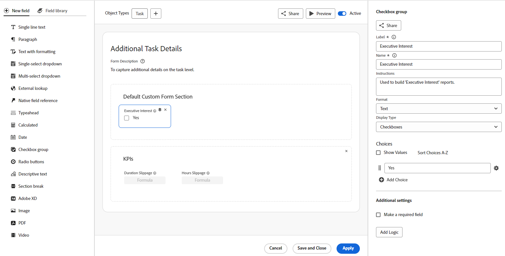

# Visão geral de formulários personalizados

{{highlighted-preview}}

<!--Audited: 12/2023-->

Você pode criar um formulário personalizado que os usuários podem anexar a um objeto do Adobe Workfront. Os usuários que trabalham no objeto podem preencher o formulário personalizado para fornecer informações sobre o objeto.

Por exemplo, você pode anexar um formulário personalizado chamado &quot;Pesquisa de conteúdo de marketing&quot; para anexar a um projeto para que os usuários do projeto possam solicitar conteúdo de marketing para o projeto:

## Como criar um formulário personalizado

O designer de formulário tem um espaço de trabalho no estilo da tela de desenho que permite exibir os campos, a tela de desenho e as configurações de campo, tudo ao mesmo tempo. Ela também permite arrastar e soltar campos nas seções ao criar o formulário. É possível redimensionar o lado direito da tela para fornecer mais espaço para as opções de campo.

Para obter mais informações, consulte [Criar um formulário personalizado](/help/quicksilver/administration-and-setup/customize-workfront/create-manage-custom-forms/form-designer/design-a-form/design-a-form.md).

Imagem de exemplo no ambiente de Pré-visualização:

Imagem de amostra no ambiente de produção:

## Campos e widgets personalizados

O Workfront fornece vários campos incorporados para cada tipo de objeto.

Em um formulário personalizado, você pode criar campos adicionais que solicitam aos usuários informações exclusivas de seus workflows. Esses campos personalizados são os blocos de construção de um formulário personalizado.

Você pode adicionar os seguintes tipos de campos personalizados a um formulário personalizado no Workfront:

* Texto de linha única
* Parágrafo
* Texto com formatação
* Lista suspensa de seleção única
* Lista suspensa com seleção múltipla
* Pesquisa externa
* Referência de campo nativo
* Typeahead
* Calculado
* Data
* Grupo de caixas de seleção
* Botões de opção
* Texto descritivo
* Quebra de seção
* Adobe XD
* Imagem
* PDF
* Vídeo

>[!NOTE]
>
>Para rastrear alterações de campo nos feeds de atualização, acesse Configurar > Interface > Atualizar feeds. Para obter mais informações, consulte [Configurar atualizações do sistema](/help/quicksilver/administration-and-setup/set-up-workfront/system-tracked-update-feeds/configure-system-updates.md).

## Objetos em que os usuários podem anexar um formulário personalizado

Quando estiver criando um formulário personalizado, você poderá configurá-lo para funcionar com mais de um tipo de objeto.

Os usuários podem anexar formulários personalizados aos seguintes tipos de objeto:

* Projeto (incluindo Business Cases)
* Tarefa
* Problema (incluindo a fila de solicitações)
* Empresa
* Documento
* Usuário
* Programa
* Portfólio
* Despesa
* Grupo
* Iteração
* Registro de cobrança

Para obter mais informações sobre como anexar formulários personalizados a objetos, consulte [Adicionar um formulário personalizado a um objeto](../../../workfront-basics/work-with-custom-forms/add-a-custom-form-to-an-object.md).

Para obter informações sobre o que acontece com formulários personalizados ao converter um objeto, consulte [Transferir dados de formulário personalizados ao converter um objeto](/help/quicksilver/administration-and-setup/customize-workfront/create-manage-custom-forms/transfer-custom-form-data-larger-item.md).

