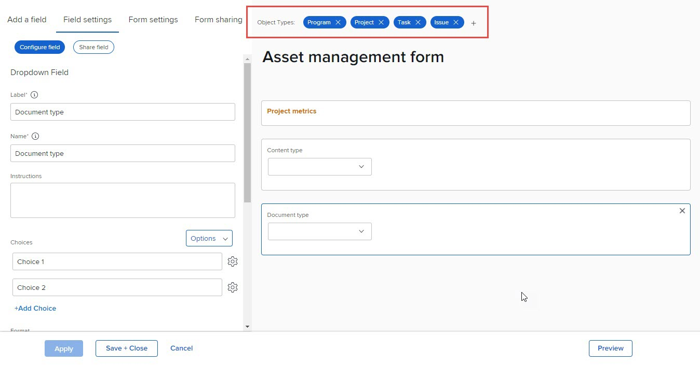

# Excluir tipos de objeto em um formulário personalizado

As informações destacadas nesta página se referem a funcionalidades ainda não disponíveis no geral. Ela está disponível somente no ambiente de Pré-visualização para todos os clientes ou no ambiente Produção para clientes que ativaram versões rápidas.

Para obter informações sobre lançamentos rápidos, consulte [Habilitar ou desabilitar versões rápidas para sua organização](/help/quicksilver/administration-and-setup/set-up-workfront/configure-system-defaults/enable-fast-release-process.md).

Para obter informações sobre a versão atual, consulte [Visão geral da versão do segundo trimestre de 2024](/help/quicksilver/product-announcements/product-releases/24-q2-release-activity/24-q2-release-overview.md).

Em um formulário personalizado existente, você pode excluir os tipos de objeto associados ao formulário. Depois disso, os usuários não poderão mais anexar o formulário a objetos desse tipo.

## Requisitos de acesso

Você deve ter o seguinte para executar as etapas deste artigo:

<table style="table-layout:auto"> 
 <col> 
 <col> 
 <tbody> 
  <tr data-mc-conditions=""> 
   <td role="rowheader"> 
plano do Adobe Workfront
 </td> 
   <td>Qualquer</td> 
  </tr> 
  <tr> 
   <td role="rowheader">Licença do Adobe Workfront</td> 
   <td>
   
Novo: Padrão

   
ou

   
Atual: Plano
</td>
  </tr> 
  <tr data-mc-conditions=""> 
   <td role="rowheader">Configurações de nível de acesso</td> 
   <td> 
Acesso administrativo a formulários personalizados
 </td> 
  </tr>  
 </tbody> 
</table>

Para obter mais detalhes sobre as informações nesta tabela, consulte [Requisitos de acesso na documentação do Workfront](/help/quicksilver/administration-and-setup/add-users/access-levels-and-object-permissions/access-level-requirements-in-documentation.md).

## Excluir tipos de objeto em um formulário personalizado

Você pode excluir tipos de objetos de um formulário personalizado existente.

Um formulário personalizado deve ter pelo menos um tipo de objeto.

>[!CAUTION]
>
>Se as pessoas já tiverem anexado o formulário personalizado a objetos do tipo que você deseja excluir e adicionado dados a ele, esses dados serão excluídos permanentemente quando você excluir esse tipo de objeto no formulário. Pode incluir informações históricas que os usuários precisarão mais tarde.
>
>Em geral, recomendamos minimizar o número de vezes que você edita um formulário personalizado que já está em uso. Não há um sistema de notificação para alertar as pessoas que usam o formulário personalizado sobre suas alterações.

{{step-1-to-setup}}

1. Clique em **Forms personalizado** no painel esquerdo.
1. Selecione o formulário personalizado que deseja editar e clique em **Editar** ou .
1. Clique no X em qualquer uma das **Tipos de objeto** que deseja excluir do formulário e, em seguida, clique em **Excluir** na mensagem de aviso que é exibida.

   

1. (Opcional) Repita a etapa anterior para qualquer outro tipo de objeto que você deseja remover do formulário.
1. Clique em **Concluído** e, em seguida, clique em **Salvar e fechar**.
