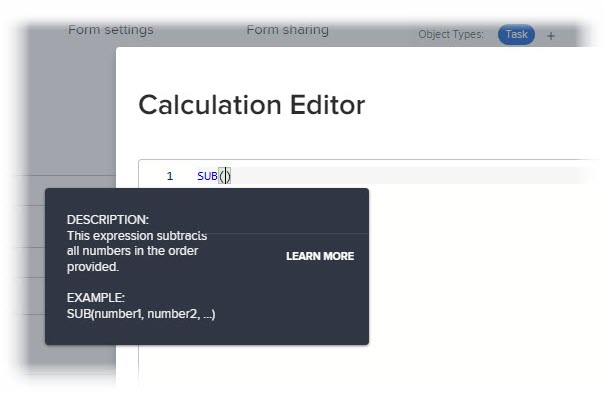

# Adicionar campos calculados com o designer de formulário

{{highlighted-preview-article-level}}

É possível adicionar um campo personalizado calculado que use dados existentes para gerar novos dados quando o formulário personalizado estiver anexado a um objeto.

Um campo personalizado calculado pode conter:

* Uma referência simples a um único campo integrado.

   >[!INFO]
   >
   > **Exemplo:** Para calcular a receita gerada pelos projetos e tarefas, é possível criar um campo personalizado calculado que contenha o campo incorporado Receita real . Quando alguém anexa o formulário personalizado a um projeto ou tarefa, a receita do projeto ou tarefa é exibida no campo .

* Uma expressão que faz referência a um ou mais campos. Esses podem ser campos personalizados, outros campos personalizados calculados e campos incorporados.

   >[!INFO]
   >
   >**Exemplo:** Para calcular o lucro gerado pelos projetos e tarefas, você pode criar um campo personalizado calculado chamado Lucro contendo uma expressão matemática que subtrai o custo da receita.
   >
   >Para fazer isso, você pode usar a expressão matemática SUB (subtrair) com os campos incorporados do Workfront Custo real e Receita real.
   >
   >Nas etapas abaixo, você pode ver como esse exemplo pode ser executado.

## Requisitos de acesso

Você deve ter o seguinte para executar as etapas neste artigo:

<table style="table-layout:auto"> 
 <col> 
 <col> 
 <tbody> 
  <tr data-mc-conditions=""> 
   <td role="rowheader"> 
Plano Adobe Workfront*
 </td> 
   <td>Qualquer Um</td> 
  </tr> 
  <tr> 
   <td role="rowheader">Licença da Adobe Workfront*</td> 
   <td>Plano</td> 
  </tr> 
  <tr data-mc-conditions=""> 
   <td role="rowheader">Configurações de nível de acesso*</td> 
   <td> 
Acesso administrativo a formulários personalizados
 
Para obter informações sobre como os administradores do Workfront concedem esse acesso, consulte <a href="/help/quicksilver/administration-and-setup/add-users/configure-and-grant-access/grant-users-admin-access-certain-areas.md" class="MCXref xref">Conceder aos usuários acesso administrativo a determinadas áreas</a>.
 </td> 
  </tr>  
 </tbody> 
</table>

&#42;Para descobrir que plano, tipo de licença ou configurações de nível de acesso você possui, entre em contato com o administrador da Workfront.

## Reutilizar um campo personalizado calculado existente em um formulário personalizado

É possível usar o mesmo campo personalizado calculado em formulários personalizados que pertencem a objetos diferentes. Por exemplo, é possível usar o campo Lucro calculado criado para o formulário personalizado do projeto em um formulário personalizado de tarefa.

Ao usar um campo personalizado calculado existente, o cálculo não é transferido para o novo formulário. Você deve adicionar o cálculo novamente, no mesmo campo, no novo formulário personalizado.

Também é possível ter um cálculo diferente para o mesmo campo, no novo formulário. Manter o mesmo nome para o campo personalizado calculado garante a coesão e a consistência em sua convenção de nomenclatura.

>[!IMPORTANT]
>
>As alterações nas expressões calculadas podem fazer com que o valor do campo nos objetos fique desatualizado. Para garantir que você sempre visualize o cálculo atualizado nesses campos, siga um destes procedimentos:
>
>* Depois de salvar um objeto em que você tenha editado dados em um formulário personalizado anexado, clique no ícone Mais  na página principal do objeto, em seguida, Recalcular expressões personalizadas.
>* Selecione a opção Recalcular expressões personalizadas ao editar objetos em massa.
>* Selecione a opção Atualizar cálculos anteriores ao editar um Campo personalizado calculado em um formulário personalizado.

Para reutilizar um campo personalizado calculado existente:

1. Clique no botão **Menu principal** ícone  no canto superior direito do Adobe Workfront, em seguida, clique em **Configuração** .

1. Clique em **Forms personalizada** no painel esquerdo.

   <!-- >[!TIP]
    >
    >In the view that appears, you can review all custom forms and custom fields that have been created for your organization. You can also see who created each form and the fields that are associated with it. -->

1. Clique em **Novo formulário personalizado.**
1. Selecione os tipos de objetos aos quais deseja anexar o formulário personalizado e clique em **Continuar**.

1. No lado superior esquerdo da tela, clique em **Biblioteca de campos**.

   

1. Use a caixa de pesquisa ou expanda a **Calculado** para localizar o campo calculado necessário, arraste o campo onde deseja que ele apareça no formulário personalizado.

1. (Opcional) Repita a etapa anterior para adicionar outros campos.

   >[!NOTE]
   >
   >É possível adicionar até 500 campos e widgets em um único formulário personalizado. No entanto, pode ocorrer degradação do desempenho quando houver mais de 100 em um formulário, dependendo de sua complexidade.
   >
   >
   >Exemplos de formulários complexos incluem formulários com parâmetros em cascata, campos de dados personalizados calculados e várias opções de valor em um único campo.

1. Para salvar as alterações, clique em **Aplicar** e vá para outra seção para continuar a criar o formulário.

   ou

   Clique em **Salvar e fechar**.

## Adicionar um novo campo calculado

>[!IMPORTANT]
>
>Antes de criar um novo campo personalizado calculado, identifique os campos existentes que deseja incluir para ter certeza de que os dados necessários para o cálculo estão presentes no Workfront.

1. Clique no botão **Menu principal** ícone  no canto superior direito do Adobe Workfront, em seguida, clique em **Configuração** .

1. Clique em **Forms personalizada** no painel esquerdo.

   <!-- >[!TIP]
    >
    >In the view that appears, you can review all custom forms and custom fields that have been created for your organization. You can also see who created each form and the fields that are associated with it. -->

1. Clique em **Novo formulário personalizado.**
1. Selecione os tipos de objetos aos quais deseja anexar o formulário personalizado e clique em **Continuar**.

1. No lado esquerdo da tela, encontre **Calculado** e arraste-a até uma seção na tela.

   

1. No lado direito da tela, configure as opções disponíveis para o tipo de campo personalizado que você está adicionando:

   <table style="table-layout:auto"> 
    <col> 
    </col> 
    <col> 
    </col> 
    <tbody> 
     <tr> 
      <td role="rowheader">Rótulo</td> 
      <td>Digite um rótulo para o campo. É o que os usuários verão ao usar o formulário personalizado. O campo <b>Nome</b>, que preenche automaticamente, é referenciado pelo Workfront nos relatórios.</td> 
     </tr> 
     <tr> 
      <td role="rowheader" id="instructions">Instruções</td> 
      <td> Por padrão, a fórmula criada para o campo é armazenada aqui. É possível adicionar texto para fornecer informações adicionais sobre o campo e a fórmula nele. Isso pode ser útil de duas maneiras: 
       <ul> 
      <li>
Lembrando o que é a fórmula e como ela funciona. Isso será especialmente útil se você planeja usar esse campo personalizado calculado em vários formulários.
 </li> 
      <li> 
Como uma dica de ferramenta, os usuários podem ver quando passam o mouse sobre o campo. Adicione qualquer texto aqui que você deseja que eles vejam na dica de ferramenta.
 
Se você não quiser que eles vejam a fórmula na dica de ferramenta, o que pode ser confuso para eles, você pode ocultá-la.</li> 
       </ul> </td> 
     </tr> 
     <tr> 
      <td role="rowheader">Formatar</td> 
      <td> 
O formato no qual você deseja que os resultados do campo sejam armazenados e exibidos.
 
Se o campo for usado em cálculos matemáticos, sempre use um <strong>Número</strong> ou <strong>Moeda</strong> formato. Quando você seleciona Número ou Moeda, o sistema trunca automaticamente os números que começam com 0.
 
      
<b>IMPORTANTE</b>: Antes de escolher um formato, considere o formato correto para o novo campo. O campo de formato não pode ser editado depois que o formulário personalizado é salvo. E a seleção do formato incorreto pode afetar cálculos futuros e valores agregados em agrupamentos de relatório e lista.
 </td> 
     </tr> 
    </tbody> 
   </table>

1. No **Cálculo** , comece criando seu cálculo:
   1. Clique em **Maximizar** para abrir o Editor de Cálculo e criar o cálculo.

Um cálculo geralmente começa com uma expressão, seguida de parênteses contendo os campos que você deseja referenciar quando o formulário personalizado é anexado a um objeto.

      Cada campo deve estar rodeado de chaves. Ao começar a digitar o nome de um campo, o sistema faz sugestões e você pode selecionar uma para inseri-lo no cálculo.

+++ **Expanda para ver a sintaxe necessária nos campos personalizados calculados**

      Cada campo deve usar a sintaxe explicada abaixo, com colchetes ao redor de cada nome de campo. Ao começar a digitar o nome de um campo, o sistema faz sugestões e você pode selecionar uma para inseri-lo no cálculo. Se você inserir dados em um cálculo incorretamente, uma mensagem de aviso o alertará. Não é possível salvar o formulário a menos que você edite o cálculo para conter campos válidos e uma expressão calculada válida.

      >[!NOTE]
      >
      >Atualmente, o sistema faz sugestões apenas quando você começa a digitar o nome de um campo que deseja referenciar em um objeto ao qual o formulário personalizado será anexado. Os campos do objeto pai não são sugeridos.

      **Marque nomes de campos com chaves**

      * Se você quiser que o cálculo faça referência a um campo incorporado, o nome do campo deverá estar rodeado por colchetes.

         Por exemplo: `{actualRevenue}`

         Os nomes de campos fazem distinção entre maiúsculas e minúsculas e devem aparecer no cálculo exatamente como aparecem no sistema Workfront.

         Navegue até o [Workfront API Explorer](https://developer.adobe.com/workfront/api-explorer/) para identificar os nomes de campo que podem ser usados em cálculos.

      * Se desejar que o cálculo faça referência a um campo personalizado, o nome do campo deve estar rodeado por colchetes e precedido por `DE:` entre parênteses.

         Por exemplo: `{DE:Profit}`

         O sistema lista todos os campos personalizados que você pode escolher ao digitar `DE:`.

         * Se desejar que o cálculo faça referência a um campo que extrairá dados do *parent* quando o formulário personalizado estiver anexado a um objeto, será necessário preceder o nome do campo ao tipo de objeto do objeto pai, também entre colchetes.

         Por exemplo, se o formulário personalizado estiver configurado para funcionar com tarefas e você quiser que o campo calcule a receita real do objeto pai quando o formulário estiver anexado a uma tarefa, será necessário indicar `Project` como o tipo de objeto do campo:

         `{project}.{actualRevenue}`

         Ou, se for um campo personalizado:

         `{project}.{DE:profit}`

         **Separar itens com pontos**

         Quando você faz referência a um objeto relacionado em um campo personalizado calculado, é necessário separar os nomes e os atributos do objeto por períodos.

         Por exemplo, em um formulário personalizado do tipo tarefa, para exibir o nome do Proprietário do Portfolio em um campo personalizado calculado, digite o seguinte:

         `{project}.{porfolio}.{owner}`

         Isso determinaria o seguinte: No objeto do formulário personalizado (uma tarefa), é possível acessar o próximo objeto relacionado à tarefa (um projeto). A partir daí, é possível acessar o próximo objeto relacionado do projeto (um portfólio) e, em seguida, fazer referência aos campos definidos para o objeto do portfólio (o proprietário)

         **Sintaxe de nome para referência a um campo personalizado**

         Ao fazer referência a outro campo personalizado em um campo personalizado calculado, é necessário inserir o nome do campo como ele é exibido na interface do usuário do Workfront.

         Por exemplo, para fazer referência à opção selecionada em um campo personalizado chamado Patrocinador executivo, digite o seguinte:

         `{DE:Executive sponsor}`

         >[!NOTE]
         >
         >A sintaxe de um campo typeforward é um pouco diferente de outros tipos de campos, pois é necessário adicionar `:name` no final.
         >
         >Por exemplo, para fazer referência à opção selecionada em um campo de tipo personalizado com o nome &quot;Patrocinador executivo&quot;, você digitaria:
         >
         >`{DE:Executive sponsor:name}`

         **Campos personalizados calculados em formulários personalizados com vários objetos**

         Em um formulário personalizado com vários objetos, os tipos de objetos selecionados devem ser compatíveis com pelo menos um campo referenciado nos campos personalizados calculados do formulário. Os campos incompatíveis com o objeto exibirão N/A no formulário.

         Para garantir que o campo calculado esteja mostrando um resultado correto para todos os tipos de objetos, é necessário usar `$$OBJCODE` para definir um cálculo para cada tipo de objeto.

         >[!INFO]
         >
         >**Exemplo:**
         >
         >Em um formulário personalizado configurado para trabalhar com projetos, tarefas e problemas, você pode usar a seguinte fórmula para exibir o tipo de objeto:
         >
         >`IF($$OBJCODE="PROJ","This is a project",IF($$OBJCODE="TASK","This is a task","This is an issue"))`
         >
         >Em um projeto, o campo mostrará &quot;Este é um projeto&quot;, em uma tarefa mostrará &quot;Esta é uma tarefa&quot; e, em um problema, dirá &quot;Isso é um problema&quot;.

         >[!INFO]
         >
         >**Exemplo:** Embora não haja Atribuído a: Nome nos projetos, há um campo Proprietário incorporado (que preenche automaticamente com o nome da pessoa que criou o projeto, a menos que alguém altere isso manualmente).
         >
         >Portanto, em seu campo Personalizado Em Encargo , você pode usar `$$OBJCODE` conforme mostrado abaixo para fazer referência ao campo Proprietário quando o formulário personalizado está anexado a um projeto e o campo Atribuído a: Campo Nome quando o formulário é anexado a uma tarefa:
         >
         >`IF($$OBJCODE="PROJ",{owner}.{name},{assignedTo}.{name})`

         Para obter mais informações sobre variáveis como `$$OBJCODE,` see [Variáveis de filtro curinga](/help/quicksilver/reports-and-dashboards/reports/reporting-elements/understand-wildcard-filter-variables.md).

         **Atualizações automáticas de campos personalizados calculados**

         Os campos personalizados calculados em um objeto são recalculados automaticamente quando as seguintes coisas acontecem:

         * Algo no objeto muda, como um cálculo diário da linha do tempo.
         * Alguém edita outro campo referenciado por um campo personalizado calculado no objeto.
         * A expressão calculada está vazia e o campo contém um valor. Isso define o valor como nulo.

            >[!NOTE]
            >
            >
Em um formulário personalizado anexado a um objeto, as declarações de data e hora em campos personalizados calculados são calculadas e salvas pelo Tempo Universal Coordenado (UTC), não pelas configurações de fuso horário definidas para a instância da sua organização e o perfil do usuário. Os cálculos em um formulário personalizado são gerados com base nos fusos horários individuais de cada usuário.

+++
   1. Clique em na caixa de texto grande e, em seguida, clique em **Expressões** e **Campos** que estão disponíveis para adicioná-las ao cálculo.

      Você também pode começar a digitar uma expressão ou um campo na caixa de texto grande e, em seguida, selecioná-lo quando for exibido. Cada item é exibido com um &quot;F&quot; para campo ou um &quot;E&quot; para expressão.

      Se você digitar um parêntese de abertura, o parênteses de fechamento será adicionado automaticamente.

+++ **Expanda para ver dicas úteis**
      >[!TIP]
      >
      >Você pode fazer qualquer um dos seguintes procedimentos para obter ajuda com o cálculo:
      > 
      >* Passe o mouse sobre uma expressão no cálculo para ver uma descrição, um exemplo mostrando como ela pode ser usada e um link &quot;Saiba mais&quot; para obter mais informações no artigo [Expressões de dados calculadas](/help/quicksilver/reports-and-dashboards/reports/calc-cstm-data-reports/calculated-data-expressions.md).
         >  
      >* Use a codificação de cores para identificar os componentes adicionados. As expressões são exibidas em azul e os campos são exibidos em verde.
         >  
      >* Encontre erros de cálculo, destacados em rosa, em seguida. Você pode passar o mouse sobre um erro destacado para exibir uma breve descrição da causa.
         >  
      >* Na área abaixo do cálculo, visualize os resultados em um objeto Workfront existente.
         ><!--or by providing test values (NOT READY YET; CHANGE THIS SCREENSHOT WHEN IT IS)-->

         >  
      >* Faça referência a expressões em um cálculo longo usando os números de linha exibidos à esquerda.

+++
   1. Clique em **Minimizar** quando você terminar de criar o cálculo para o campo personalizado calculado.

   1. (Opcional) Use qualquer uma das seguintes opções para configurar ainda mais o campo personalizado calculado:

      <table style="table-layout:auto">
   <col> 
    <col> 
    <tbody> 
     <tr> 
      <td role="rowheader">Adicionar Lógica</td> 
      <td>Você pode adicionar Lógica de exibição para determinar se o campo calculado é exibido, com base em pelo menos uma opção que um usuário faz em um campo de escolha múltipla anterior (Suspensão, Caixas de seleção ou Botões de opção) ao preencher o formulário. <!-- For more information, see <a href="Need to add link for new article when it's written" class="MCXref xref">Add display logic and skip logic to a custom form</a>.--> 
Isso só estará disponível quando pelo menos uma caixa de seleção, um botão de opção ou um campo suspenso preceder o campo personalizado calculado no formulário. 
 
A opção Ignorar lógica não está disponível para campos personalizados calculados.
 </td> 
     </tr> 
     <tr> 
      <td role="rowheader">Atualizar cálculos anteriores</td> 
      <td>Ao editar um campo personalizado calculado existente, é possível selecionar essa opção para acionar uma atualização no cálculo ao salvar o formulário personalizado. Isso acontece somente uma vez quando o formulário personalizado é salvo. A opção retornará ao estado desativado depois de fazer isso.</td> 
     </tr> 
     <tr> 
      <td role="rowheader">Exibir a fórmula nas instruções</td> 
      <td>Deixe essa opção habilitada se desejar que os usuários que preencherem o formulário personalizado vejam a fórmula do campo quando passarem o mouse sobre ele. Para obter mais informações, consulte as informações sobre <a href="#instructions" class="MCXref xref">Instruções</a> anteriormente nesta tabela.</td> 
     </tr> 
    </tbody> 
   </table>

1. Para salvar as alterações, clique em **Aplicar** e vá para outra seção para continuar a criar o formulário.

   ou

   Clique em **Salvar e fechar**.

