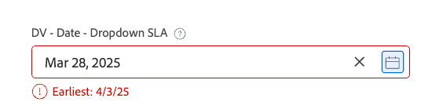

# Exemplos de lógica avançada em formulários personalizados

As regras lógicas permitem personalizar ainda mais os campos em um formulário personalizado.

Este artigo fornece exemplos de expressões usadas para criar lógica avançada em campos personalizados.

Para obter mais informações sobre como adicionar lógica a um formulário personalizado, consulte [Adicionar regras de lógica a formulários e campos personalizados](/help/quicksilver/administration-and-setup/customize-workfront/create-manage-custom-forms/form-designer/design-a-form/display-skip-logic-form-designer.md).

## Requisitos de acesso

+++ Expanda para visualizar os requisitos de acesso para a funcionalidade neste artigo.

Você deve ter o seguinte acesso para executar as etapas deste artigo:

<table style="table-layout:auto"> 
 <col> 
 <col> 
 <tbody> 
  <tr data-mc-conditions=""> 
   <td role="rowheader">plano do Adobe Workfront </td> 
   <td>Qualquer</td> 
  </tr> 
  <tr> 
   <td role="rowheader">Licença do Adobe Workfront</td> 
   <td>
   <p>Novo: Padrão</p>
   <p>ou</p>
   <p>Atual: Plano</p></td> 
  </tr> 
  <tr data-mc-conditions=""> 
   <td role="rowheader">Configurações de nível de acesso</td> 
   <td>Acesso administrativo a formulários personalizados </td> 
  </tr>  
 </tbody> 
</table>

Para obter mais detalhes sobre as informações nesta tabela, consulte [Requisitos de acesso na documentação do Workfront](/help/quicksilver/administration-and-setup/add-users/access-levels-and-object-permissions/access-level-requirements-in-documentation.md).

+++

## Exemplos de lógica de validação

A lógica de validação é criada usando fórmulas e você pode tornar a lógica tão simples ou complexa quanto necessário. A validação pode ser baseada nos valores de outros campos ou no status dos objetos, e você pode fornecer uma mensagem de erro para quando a validação falhar.

Se o campo com a lógica aplicada atender às condições de validação definidas quando um usuário preencher o formulário personalizado, o campo será realçado e a mensagem de erro será exibida.

Você pode aplicar lógica de validação aos seguintes tipos de campo: texto de linha única, parágrafo, lista suspensa de seleção única, lista suspensa de seleção múltipla, pesquisa externa, digitação antecipada, data, grupo de caixas de seleção e botões de opção.

### Permitir somente que o proprietário do projeto selecione &quot;Rush&quot; SLA

Neste exemplo, um campo suspenso de seleção única tem opções para o SLA Padrão: 14 dias, Prioridade: 7 dias e Atraso: 2 dias.

Expressão de validação:

```
IF({ownerID}!=$$USER&&{DE:DV - Dropdown - Control Dates}="2",CONCAT("Only ",{owner}.{name}," may select X Rush"))
```

Quando qualquer um que não seja o proprietário do projeto (incluindo o administrador do sistema) tenta selecionar **X Rush**, um erro é exibido:


### Validação de data com base na escolha no campo anterior

Continuando com o exemplo do SLA, é possível adicionar um campo de data validado com base nas configurações do campo suspenso anterior.

Expressão de validação:

```
IF({DE:DV - Date - Dropdown SLA}<ADDDAYS($$TODAY,{DE:DV - Dropdown - Control Dates}),CONCAT("Earliest: ",ADDDAYS($$TODAY,{DE:DV - Dropdown - Control Dates})))
```

Se o usuário selecionar uma data anterior à data permitida, a mensagem exibirá a data mais antiga que pode ser selecionada:



### Contagem mínima de caracteres com a opção de substituição

Neste exemplo, uma contagem mínima de caracteres é aplicada em um campo de texto, com a contagem de caracteres exibida. Além disso, uma caixa de seleção separada é configurada para desativar a validação para a contagem de caracteres.

Expressão de validação:

```
IF({DE:DV - Override}!="Disable Validation"&&LEN({DE:DV - Text - Min Length})<"7",CONCAT(LEN({DE:DV - Text - Min Length})," characters / ",("7"-LEN({DE:DV - Text - Min Length}))," remaining"))
```

A imposição da validação pode ser sobreposta marcando a caixa de seleção:


Uma contagem de caracteres em execução é incluída no campo de texto:


### Bloquear um campo para que somente o proprietário possa editá-lo

Neste exemplo, um campo só pode ser editado pelo proprietário do projeto. Até mesmo o administrador do sistema não pode editar o campo.

Expressão de validação:

```
IF({ownerID}!=$$USER,IF(ISBLANK({ownerID}),"Project Owner will provide this.",CONCAT("Only ",{owner}.{name}," can edit this.")))
```

Se um usuário que não é o proprietário do projeto tentar digitar no campo, ele verá uma mensagem informando que somente o proprietário do projeto pode editar o campo.


### A digitação antecipada permite ou rejeita valores com base em outros valores de campo

Neste exemplo, um campo de digitação antecipada permite ou rejeita dinamicamente valores com base no valor inserido em outro campo no formulário.

Expressão de validação:

```
IF({DE:DV - Text - Budget}>"10000",
   IF({DE:DV - TA User - by Budget}.{role}!="Director","Requires Director Approver")
)
```

Se o valor no campo de orçamento for maior que US$ 10.000, apenas os usuários com função de Diretor poderão ser selecionados na digitação antecipada, mesmo se não houver um filtro de função ativado na configuração de digitação antecipada.


### Não permitir valores inferiores a 10 dias a partir da data de entrada

Neste exemplo, a validação permite apenas valores que estejam 10 dias no futuro a partir da data de entrada. A opção para substituir a validação (em um campo de caixa de seleção separado) também está incluída na fórmula, além de permitir que o campo de data fique em branco.

Expressão de validação:

```
IF({DE:DV - Override}!="Disable Validation"&&ISBLANK({DE:DV - Date - Deadline})!="true"&&{DE:DV - Date - Deadline}<ADDDAYS({entryDate},"10"),CONCAT("Earliest: ",ADDDAYS({entryDate},"10")))
```

Qualquer valor menor que 10 dias a partir da data de entrada aciona a validação:


Um valor em branco não aciona a mensagem de validação:


### Impor seleções exatas/mínimas/máximas em um campo de seleção múltipla

Neste exemplo, um campo de seleção múltipla, como um grupo de caixas de seleção, exige que o usuário escolha um determinado número de opções.

Expressão de validação (escolha exatamente duas):

```
IF({DE:DV - Override}!="Disable Validation"&&ARRAYLENGTH(ARRAY({DE:DV - Checkbox - Pick exactly 2},","))!="2","Pick Exactly 2 Options")
```

Expressão de validação (escolha pelo menos dois):

```
IF({DE:DV - Override}!="Disable Validation"&&ARRAYLENGTH(ARRAY({DE:DV - Checkbox - Pick at least 2},","))<"2","Pick at least 2 choices")
```

Expressão de validação (escolha não mais que duas):

```
IF({DE:DV - Override}!="Disable Validation"&&ARRAYLENGTH(ARRAY({DE:DV - Checkbox - Pick no more than 2},","))>"2","Pick no more than 2 choices")
```

O usuário vê erros de validação se não selecionar o número correto de opções.


