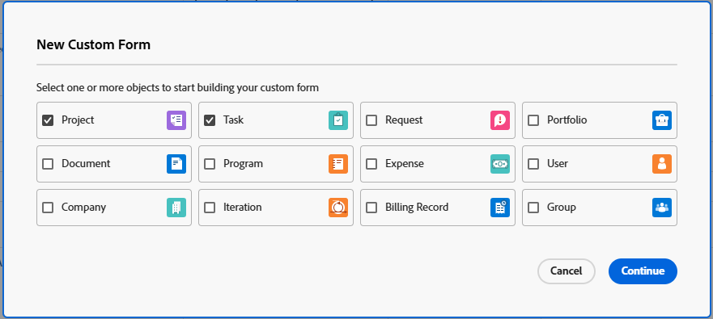

# Criar um formulário personalizado

<!-- Audited: 6/2025 -->

{{preview-fast-release-general}}

Você pode criar um formulário personalizado com o designer de formulário no Adobe Workfront. Você pode anexar formulários personalizados a diferentes objetos do Workfront para captar dados sobre esses objetos.

## Requisitos de acesso

+++ Expanda para visualizar os requisitos de acesso da funcionalidade neste artigo.

<table style="table-layout:auto"> 
 <col> 
 <col> 
 <tbody> 
  <tr> 
   <td>Pacote do Adobe Workfront</td> 
   <td> 
Para criar formulários personalizados para funções de trabalho, cartões de taxa e atribuições: Workflow Ultimate

      
Para criar formulários personalizados para todos os outros objetos compatíveis: qualquer pacote do Workfront ou Workflow
 </td> 
  </tr>  
  <tr> 
   <td>Licença do Adobe Workfront</td> 
   <td>
Padrão

       
Plano
</td>
  </tr> 
  <tr> 
   <td>Configurações de nível de acesso</td> 
   <td>Acesso administrativo a formulários personalizados</td> 
  </tr>  
 </tbody> 
</table>

Para obter informações, consulte [Requisitos de acesso na documentação do Workfront](/help/quicksilver/administration-and-setup/add-users/access-levels-and-object-permissions/access-level-requirements-in-documentation.md).

+++

## Começar a criar um formulário personalizado

{{step-1-to-setup}}

1. No painel esquerdo, clique em **Formulários personalizados** e selecione **Formulários**.

1. Clique em **Novo formulário personalizado.**
1. Selecione os tipos de objeto aos quais você deseja anexar o formulário personalizado e clique em **Continuar**.

Imagem de exemplo no ambiente de Pré-visualização:

Imagem de amostra no ambiente de produção:

+++ Expanda para exibir a lista de objetos que oferecem suporte a formulários personalizados.

* Projeto
* Tarefa
* Problema / Solicitação
* Portfólio
* Documento
* Programa
* Despesa
* Usuário
* Empresa
* Iteração
* Registro de cobrança
* Grupo
* Equipe

Se você estiver no pacote Workflow Ultimate, também poderá criar formulários personalizados para esses objetos:

* Função no trabalho
* Cartão de tarifa
* Atribuição

+++

1. Na área **Adicionar nome de formulário**, digite o título do formulário personalizado.
1. (Opcional) Se quiser adicionar mais tipos de objeto ao formulário para que ele possa ser anexado a mais objetos, clique em **Tipos de Objeto** no cabeçalho do designer de formulário. Selecione os tipos de objeto que deseja adicionar e desmarque todos os tipos de objeto que deseja excluir do formulário.
1. (Opcional) Se você quiser adicionar mais tipos de objeto ao formulário para que ele possa ser anexado a mais objetos, clique no ícone **Adicionar**  ao lado de **Tipos de objeto** e selecione o tipo desejado no menu exibido. Você pode repetir esse processo para adicionar quantos tipos de objeto desejar.

   Depois de adicionar mais de um objeto ao formulário, você pode clicar no X em um tipo de objeto para excluí-lo do formulário.

   >[!CAUTION]
   >
   >A exclusão de um formulário personalizado também exclui todos os dados personalizados nos objetos associados ao formulário. Os dados excluídos não podem ser recuperados. Se preferir, você pode desativar um formulário personalizado que não usa mais, o que manterá todos os dados históricos associados.
   >
   >Para obter mais informações, consulte [Adicionar ou excluir tipos de objetos de um formulário personalizado](/help/quicksilver/administration-and-setup/customize-workfront/create-manage-custom-forms/form-designer/manage-a-form/add-or-remove-objects-from-a-form.md) e [Desativar ou reativar um formulário personalizado](/help/quicksilver/administration-and-setup/customize-workfront/create-manage-custom-forms/form-designer/manage-a-form/activate-deactivate-form.md).

1. Em seguida, você pode começar a adicionar campos ao formulário personalizado. Para obter mais informações, consulte as seguintes seções:
   * [Reutilizar um campo ou widget já usado em outro formulário personalizado](#reuse-an-existing-field-or-widget-already-used-in-another-custom-form)
   * [Observações sobre nomes e rótulos de campos](#notes-on-field-names-and-labels)
   * [Adicionar campos de texto](#add-text-fields)
   * [Adicionar campos calculados](#add-calculated-fields)
   * [Adicionar botões de opção, grupos de caixas de seleção e menus suspensos](#add-radio-buttons-checkbox-groups-and-drop-downs)
   * [Adicionar campos de preenchimento automático e de data](#add-typeahead-and-date-fields)
   * [Adicionar campos de pesquisa externa](#add-external-lookup-fields)
   * [Adicionar imagens, PDFs e vídeos](#add-images-pdfs-and-videos)
   * [Adicionar campos nativos do Workfront](#add-workfront-native-fields)
   * [Adicionar arquivos do Adobe XD](#add-adobe-xd-files)
   * [Adicionar campos de conexão do Planning](#add-planning-connection-fields)

## Adicionar campos novos ou existentes ao formulário personalizado

Você pode usar campos novos ou já existentes ao criar o formulário personalizado.

Os formulários personalizados são limitados a 500 campos. Um contador no canto inferior esquerdo exibe quantos campos são usados no formulário e está sempre visível enquanto você rola a tela no designer de formulários.

### Reutilizar um campo ou widget já usado em outro formulário personalizado

1. No lado superior esquerdo da tela, clique em **Biblioteca de campos**.

1. Arraste e solte o campo ou widget desejado na tela. Repita essa etapa para adicionar outros campos ou widgets.

   >[!NOTE]
   >
   >Você pode adicionar até 500 campos e widgets em um único formulário personalizado. No entanto, a degradação do desempenho pode ocorrer quando houver mais de 100 em um formulário, dependendo da complexidade.
   >
   >
   >Exemplos de formulários complexos incluem os que utilizam parâmetros em cascata, campos de dados calculados personalizados e várias opções de valor em um único campo.

   >[!NOTE]
   >
   >Marcar um campo existente como inativo torna-o indisponível para uso em elementos de relatórios e formulários personalizados a partir desse momento. Se o campo inativo estiver sendo usado atualmente em um relatório ou formulário, o campo e seus dados históricos permanecerão no lugar.

1. Para salvar as alterações, clique em **Aplicar** e vá para outra seção para continuar criando o formulário.

   Ou

   Clique em **Salvar e fechar**.

### Observações sobre nomes e rótulos de campos {#notes-on-field-names-and-labels}

O rótulo está disponível para a maioria dos campos. É um rótulo descritivo que aparece acima do campo ou widget no formulário personalizado. Você pode alterar o rótulo a qualquer momento.

>[!NOTE]
>
>Evite usar caracteres especiais nesse rótulo, pois eles não são exibidos corretamente nos relatórios.

É exigido um nome para cada campo. Esse nome é a maneira como o sistema identifica o campo personalizado quando você o adiciona a várias áreas do Workfront, como relatórios, página inicial e interações com a API. Ao configurar o campo ou widget pela primeira vez e digitar o rótulo, o campo Nome será preenchido automaticamente para corresponder a ele. Os campos Rótulo e Nome não são sincronizados. Isso oferece a opção de alterar o rótulo que os usuários veem sem precisar alterar o nome que o sistema vê.

Cada nome de campo personalizado deve ser exclusivo na instância do Workfront da organização. Dessa forma, você pode reutilizar um nome que já foi criado para outro formulário personalizado.

>[!NOTE]
>
>Embora seja possível fazer isso, recomendamos que você não altere esse nome depois que você ou outros usuários começarem a usar o formulário personalizado no Workfront. Se você fizer isso, o sistema não reconhecerá mais o campo personalizado onde ele possa ser referenciado em outras áreas do Workfront.
>Por exemplo, se você adicionar o campo personalizado a um relatório e, posteriormente, alterar o nome dele, o Workfront não o reconhecerá no relatório e ele deixará de funcionar corretamente, a menos que você o adicione novamente ao relatório com o novo nome.
>
>Recomendamos que você não digite um nome que já esteja sendo usado para campos integrados do Workfront.
>
>Recomendamos que você não use o caractere de ponto no nome do campo personalizado para evitar erros ao usar o campo em diferentes áreas do Workfront.

Os caracteres especiais a seguir não são aceitos em rótulos e nomes de campos personalizados.

* \t
* \n
* \r
* \f
* `[`
* `]`
* (
* )
* :
* `{`
* `}`

### Adicionar campos de texto

É possível adicionar vários campos de texto diferentes a um formulário personalizado.

+++ Expanda para ver descrições de campos de texto disponíveis.

* **Campo de texto de linha única**: permite que os usuários digitem uma única linha de texto no campo.
* **Campo de parágrafo**: permite que os usuários digitem várias linhas de texto no campo.
* **Rich text**: permite que os usuários digitem várias linhas de texto no campo e formatem o texto com negrito, itálico, sublinhado, marcadores, numeração, subscrito e sobrescrito, hiperlinks, aspas de bloco, cabeçalhos e tabelas. Um limite de 15.000 caracteres fornece um grande espaço para texto e formatação.

  O tipo de campo Rich text está substituindo o Texto pelo tipo de campo de formatação. Você pode converter rapidamente texto existente com campos de formatação em Rich text, clicando no botão **Converter em Rich Text** nas opções de campo à direita.

* **Campo de texto com formatação**: permite aos usuários digitar várias linhas de texto no campo e formatar o texto com negrito, itálico, sublinhado, marcadores, numeração, hiperlinks e aspas de bloco. Um limite de 15.000 caracteres permite bastante texto e formatação.

  Esse tipo de campo personalizado não é aceito nos filtros em listas e relatórios.

  Para obter informações sobre como acessar esse campo por meio da API, consulte [Armazenamento de campo rich text na API](/help/quicksilver/administration-and-setup/customize-workfront/create-manage-custom-forms/rich-text-field-storage-in-the-api.md).

  >[!NOTE]
  >
  >Os campos de texto com formatação não estão disponíveis para aplicativos móveis do Workfront (estarão nas próximas versões).

* **Texto descritivo**: permite incluir instruções e vincular a páginas fora do Workfront.

+++

Para adicionar um campo de texto:

1. Na guia **Novo campo** no lado esquerdo da tela, localize um dos seguintes campos de texto e arraste-o para uma seção da tela:

   * Texto de linha única
   * Parágrafo
   * Rich text
   * Texto com formatação
   * Texto descritivo

   

1. No lado direito da tela, configure as opções disponíveis para o tipo de campo personalizado que você está adicionando:

   <table>
    <tr>
    <td>Inserção em</td>
    <td>Descrição</td>
    <td>Disponível para </td>
    </tr>
    <tr>
    <td>Tamanho</td>
    <td>
(Opcional) Altere o tamanho dos campos de texto no formulário.

   </td>
    <td><ul>
    <li>Texto de linha única</li>
    <li>Parágrafo</li>
    <li>Rich text</li>
    <li>Texto com formatação</li>
    <li>Texto descritivo</li>
    </ul></td>
    </tr>
    <tr>
    <td>Rótulo</td>
    <td>
(Obrigatório) Digite um rótulo descritivo para exibir acima do campo. Você pode alterar o rótulo a qualquer momento.

    
<b>Importante</b>: evite usar caracteres especiais neste rótulo, pois eles não são exibidos corretamente nos relatórios. Para obter mais informações, consulte <a href="design-a-form.md#notes-on-field-names-and-labels">Notas sobre nomes e rótulos de campos</a>.
</td>
    <td><ul>
    <li>Texto de linha única</li>
    <li>Parágrafo</li>
    <li>Rich text</li>
    <li>Texto com formatação</li>
    </ul></td>
    </tr>
    <tr>
     <td>Nome</td>
    <td>
(Obrigatório) Esse nome é a maneira como o sistema identifica o campo. Quando você está configurando o widget pela primeira vez e digita o rótulo, o campo Nome é preenchido automaticamente para corresponder a ele. Os campos Rótulo e Nome não são sincronizados. Isso oferece a opção de alterar o rótulo que os usuários veem sem precisar alterar o nome que o sistema vê.

    
Para obter mais informações, consulte <a href="design-a-form.md#notes-on-field-names-and-labels">Notas sobre nomes e rótulos de campos</a>.

    </td>
    <td><ul>
    <li>Texto de linha única</li>
    <li>Parágrafo</li>
    <li>Rich text</li>
    <li>Texto com formatação</li>
    <li>Texto descritivo</li>
    </ul></td>
    </tr>
    <tr>
    <td>Instruções</td>
    <td>Digite quaisquer informações adicionais sobre o campo. Quando os usuários preencherem o formulário personalizado, poderão passar o mouse sobre o ícone de ponto de interrogação para exibir uma dica de ferramenta contendo as informações digitadas aqui.
    
    </td>
    <td><ul>
    <li>Texto de linha única</li>
    <li>Parágrafo</li>
    <li>Rich text</li>
    <li>Texto com formatação</li>
    </ul></td>
    </tr>
    <tr>
    <td>Formato</td>
    <td>
Selecione o tipo de dados que serão captados no campo personalizado.
 
<b>Observação</b>:   
    <ul> 
    <li>Esse campo não pode ser editado depois que o formulário for salvo. Se você pretende usar o campo em cálculos matemáticos, certifique-se de selecionar um formato de Número ou Moeda.</li> 
    <li>Ao selecionar Número ou Moeda, o sistema trunca automaticamente os números que começam com 0.</li>
    <li>O limite de caracteres para campos de número é de 16. Você também pode usar um campo de texto para inserir números e evitar o limite.</li>
     </ul>
</td> </td>
    <td><ul>
    <li>Texto de linha única</li>
    <li>Parágrafo</li>
    </ul></td>
    </tr>
    <tr>
      <td>Tipo de permissão de finanças</td>
      <td>
Selecione o tipo de permissão financeira que os usuários devem ter para exibir ou editar este campo personalizado. Qualquer formato é permitido para campos calculados.

      <ul span class="preview">
      <li>
<strong>Nenhuma permissão necessária:</strong> todos os usuários podem ver este campo
</li>
      <li>
<strong>Geral:</strong> os usuários devem ter permissões para editar ou exibir Finanças Gerais
</li>
      <li>
<strong>Cobrança:</strong> Os usuários devem ter permissões para editar ou exibir taxas de cobrança
</li>
      <li>
<strong>Custo:</strong> Os usuários devem ter permissões para editar ou exibir taxas de custo
</li>
      </ul>
      
Para obter mais informações, consulte <a href="/help/quicksilver/administration-and-setup/customize-workfront/create-manage-custom-forms/form-designer/design-a-form/restrict-access-to-financial-data.md">Restringir o acesso aos dados financeiros em campos personalizados</a>.

      </td>
      <td><ul span class="preview">
       <li>Texto de linha única</li>
       <li>Parágrafo</li>
       </ul></td>
    </tr>
    <tr>
    <td>Tipo de exibição</td>
    <td>Alterne entre campos de texto de linha única e de parágrafo.</td>
    <td><ul>
    <li>Texto de linha única</li>
    <li>Parágrafo</li>
    </ul></td>
    </tr>
    <tr>
    <td>Hiperlink</td>
    <td> Se você deseja aplicar um hiperlink ao texto descritivo que digitou, adicione-o aqui. O texto descritivo é exibido como um link nos objetos aos quais o formulário está anexado.</td>
    <td><ul><li>Texto descritivo</li></ul></td>
    </tr>
    <tr>
     <td>Ativo</td>
     <td>
Essa opção está desabilitada por padrão.

Quando você define um campo como Inativo, ele é excluído de relatórios, filtros e visualizações, e não está mais disponível na biblioteca de campos dos formulários personalizados.
</td>
     <td><ul>
     <li>Texto de linha única</li>
     <li>Parágrafo</li>
     <li>Rich text</li>
     <li>Texto com formatação</li>
     <li>Texto descritivo</li></ul></td>
    </tr>
    <tr> 
      <td>Tornar um campo obrigatório</td>
      <td>
Selecione esta opção se desejar que o campo seja obrigatório para a conclusão do preenchimento do formulário personalizado.
</td>
    <td><ul>
    <li>Texto de linha única</li>
    <li>Parágrafo</li>
    <li>Rich text</li>
    <li>Texto com formatação</li>
    </ul></td> 
    </tr> 
   </table>

1. (Opcional) Repita a etapa anterior para adicionar outros campos ou widgets.

   Ou

   Para copiar um campo, passe o mouse sobre ele e clique no ícone Copiar.

   

1. Para salvar as alterações, clique em **Aplicar** e vá para outra seção para continuar criando o formulário.

   Ou

   Clique em **Salvar e Fechar**.

### Adicionar campos calculados

Em um formulário personalizado, você pode adicionar um campo personalizado calculado que usa dados já existentes para gerar novos dados quando o formulário personalizado é anexado a um objeto.

Para adicionar um campo calculado, consulte [Adicionar campos calculados com o designer de formulários](/help/quicksilver/administration-and-setup/customize-workfront/create-manage-custom-forms/form-designer/design-a-form/add-a-calculated-field.md).

### Adicionar botões de opção, grupos de caixas de seleção e menus suspensos

Você pode adicionar botões de opção, grupos de caixas de seleção, menus suspensos e menus suspensos com seleção múltipla a um formulário personalizado.

+++ Expanda para ver as descrições dos campos disponíveis.

* **Botões de opção**: requer que os usuários selecionem apenas uma opção.
* **Grupo de caixas de seleção**: permite que os usuários selecionem várias opções.
* **Menu suspenso de seleção única**: fornece uma lista de opções em um menu suspenso.
* **Menu suspenso de seleção múltipla**: permite que os usuários selecionem várias opções em uma lista suspensa.

+++

>[!NOTE]
>
>Campos que permitem múltiplas seleções, como o grupo de caixas de seleção e o menu suspenso de seleção múltipla, são difíceis de representar em gráficos e de agrupar em relatórios. Para permitir a criação de gráficos e o agrupamento mais fáceis em relatórios, você pode criar campos separados para cada opção (por exemplo, um campo de texto de linha única).

Para adicionar botões de opção, grupos de caixas de seleção e listas suspensas:

1. Na guia **Novo campo**, no lado esquerdo da tela, localize um dos campos a seguir e arraste-o para uma seção na tela:

   * Botões de opção
   * Grupo de caixas de seleção
   * Menu suspenso de seleção única
   * Menu suspenso de seleção múltipla

   

1. No lado direito da tela, configure as opções disponíveis para o tipo de campo personalizado que você está adicionando:

   <table style="table-layout:auto"> 
    <tbody> 
    <tr>
    <td>Inserção em</td>
    <td>Descrição</td>
    <td>Disponível para </td>
    </tr>
    <tr> 
     <td role="rowheader">Rótulo</td> 
     <td> 
(Obrigatório) Digite um rótulo descritivo para exibir acima do campo personalizado. Você pode alterar o rótulo a qualquer momento.
 
<b>Importante</b>: evite usar caracteres especiais neste rótulo, pois eles não são exibidos corretamente nos relatórios. Para obter mais informações, consulte <a href="design-a-form.md#notes-on-field-names-and-labels">Notas sobre nomes e rótulos de campos</a>.
 </td> 
     <td><ul>
    <li>Botões de opção</li>
    <li>Grupo de caixas de seleção</li>
    <li>Menu suspenso de seleção única</li>
    <li>Menu suspenso de seleção múltipla</li>
    </ul></td>
     </tr> 
     <tr> 
    <td role="rowheader">Nome</td> 
     <td> 
(Obrigatório) Esse nome é a maneira como o sistema identifica o campo. Quando você está configurando o widget pela primeira vez e digita o rótulo, o campo Nome é preenchido automaticamente para corresponder a ele. Os campos Rótulo e Nome não são sincronizados. Isso oferece a opção de alterar o rótulo que os usuários veem sem precisar alterar o nome que o sistema vê.
 
    
Para obter mais informações, consulte <a href="design-a-form.md#notes-on-field-names-and-labels">Notas sobre nomes e rótulos de campos</a>.
 </td>
     <td><ul>
    <li>Botões de opção</li>
    <li>Grupo de caixas de seleção</li>
    <li>Menu suspenso de seleção única</li>
    <li>Menu suspenso de seleção múltipla</li>
    </ul></td>
    </tr> 
    <tr> 
    <td role="rowheader">Instruções</td> 
    <td> 
Digite quaisquer informações adicionais sobre o campo personalizado. Quando os usuários preencherem o formulário personalizado, poderão passar o mouse sobre o ícone de ponto de interrogação para exibir uma dica de ferramenta contendo as informações digitadas aqui.
 
    
   

    </td> 
    <td><ul>
    <li>Botões de opção</li>
    <li>Grupo de caixas de seleção</li>
    <li>Menu suspenso de seleção única</li>
    <li>Menu suspenso de seleção múltipla</li>
    </ul></td>
    </tr> 
    <tr> 
    <td role="rowheader">Formato</td> 
    <td> 
Selecione o tipo de dados que serão captados no campo personalizado.
 
<b>Observação</b>:   
     <ul> 
    <li>Esse campo não pode ser editado depois que o formulário for salvo. Se você pretende usar o campo em cálculos matemáticos, certifique-se de selecionar um formato de Número ou Moeda. </li> 
    <li>Ao selecionar Número ou Moeda, o sistema trunca automaticamente os números que começam com 0.</li>
    <li>O limite de caracteres para campos de número é de 16. Você também pode usar um campo de texto para inserir números e evitar o limite.</li>
     </ul>
</td> 
     <td><ul>
    <li>Botões de opção</li>
    <li>Grupo de caixas de seleção</li>
    <li>Menu suspenso de seleção única</li>
    <li>Menu suspenso de seleção múltipla</li>
    </ul></td>
    </tr> 
    <tr>
      <td>Tipo de permissão de finanças</td>
      <td>
Selecione o tipo de permissão financeira que os usuários devem ter para exibir ou editar este campo personalizado. Qualquer formato é permitido para campos calculados.

      <ul span class="preview">
      <li>
<strong>Nenhuma permissão necessária:</strong> todos os usuários podem ver este campo
</li>
      <li>
<strong>Geral:</strong> os usuários devem ter permissões para editar ou exibir Finanças Gerais
</li>
      <li>
<strong>Cobrança:</strong> Os usuários devem ter permissões para editar ou exibir taxas de cobrança
</li>
      <li>
<strong>Custo:</strong> Os usuários devem ter permissões para editar ou exibir taxas de custo
</li>
      </ul>
      
Para obter mais informações, consulte <a href="/help/quicksilver/administration-and-setup/customize-workfront/create-manage-custom-forms/form-designer/design-a-form/restrict-access-to-financial-data.md">Restringir o acesso aos dados financeiros em campos personalizados</a>.

      </td>
      <td><ul span class="preview">
       <li>Botões de opção</li>
       <li>Grupo de caixas de seleção</li>
       <li>Menu suspenso de seleção única</li>
       <li>Menu suspenso de seleção múltipla</li>
       </ul></td>
    </tr>
    <tr> 
     <td role="rowheader">Tipo de exibição</td> 
    <td>Alterne entre botões de opção, grupo de caixas de seleção, menu suspenso de seleção única ou menu suspenso de seleção múltipla para o campo.</td> 
    <td><ul>
    <li>Botões de opção</li>
    <li>Grupo de caixas de seleção</li>
    <li>Menu suspenso de seleção única</li>
    <li>Menu suspenso de seleção múltipla</li>
    </ul></td>
    </tr> 
    <td role="rowheader">Seleções </td> 
    <td> 
    
Selecione qualquer uma das seguintes opções:
 
    <ul> 
    <li><strong>Mostrar valores</strong>: mostra os valores de cada escolha no campo. O rótulo de cada escolha é exibido por padrão.</li>
   <li><strong>Classificar escolhas de A a Z</strong>: classifica as escolhas adicionadas em ordem alfabética no campo.</li>
    </ul>
     
Para cada escolha adicionada para o usuário, clique no ícone de engrenagem  e selecione uma das seguintes opções:
 
    <ul> 
    <li><strong>Selecionar por padrão</strong>: selecione a escolha por padrão no campo.</li> 
    <li> 
<strong>Ocultar escolha</strong>: oculta a escolha no campo. As escolhas ocultas permanecem acessíveis nos relatórios.
 </li> 
    <li> 
<strong>Remover escolha</strong>: remova a escolha do campo.
 
<b>Aviso</b>: se você tiver objetos atuais usando essa escolha, não a remova do campo. A remoção fará com que os dados históricos sejam perdidos. Em vez disso, selecione a opção para ocultá-la, o que impede que os usuários a selecionem no futuro.
 </li> 
    </ul>   
    
<b>Observação:</b> não há limite para a quantidade de opções que você pode selecionar. 
    
    </td> 
    <td><ul>
    <li>Botões de opção</li>
    <li>Grupo de caixas de seleção</li>
    <li>Menu suspenso de seleção única</li>
    <li>Menu suspenso de seleção múltipla</li>
    </ul>
    </td>
     </tr>
    <tr>
     <td>Ativo</td>
     <td>
Essa opção está desabilitada por padrão.

Quando você define um campo como Inativo, ele é excluído de relatórios, filtros e visualizações, e não está mais disponível na biblioteca de campos dos formulários personalizados.
</td>
     <td><ul>
     <li>Botões de opção</li>
     <li>Grupo de caixas de seleção</li>
     <li>Menu suspenso de seleção única</li>
     <li>Menu suspenso de seleção múltipla</li></ul></td>
    </tr>
    <tr> 
    <td role="rowheader">Tornar um campo obrigatório</td> 
    <td>Selecione esta opção se desejar que o campo seja obrigatório para a conclusão do preenchimento do formulário personalizado. </td> 
    <td><ul>
    <li>Botões de opção</li>
    <li>Grupo de caixas de seleção</li>
    <li>Menu suspenso de seleção única</li>
    <li>Menu suspenso de seleção múltipla</li>
    </ul></td>
     </tr> 
    <tr> 
    </tbody> 
    </table>

1. (Opcional) Repita a etapa anterior para adicionar outros campos ou widgets.

   Ou

   Para copiar um campo, passe o mouse sobre ele e clique no ícone Copiar.

   

1. Para salvar as alterações, clique em **Aplicar** e vá para outra seção para continuar criando o formulário.

   Ou

   Clique em **Salvar e Fechar**.

### Adicionar campos de preenchimento automático e de data

Você pode adicionar campos de preenchimento automático e de data a um formulário personalizado.

+++ Expanda para ver as descrições dos campos disponíveis.

* **Preenchimento automático**: permite que os usuários digitem o nome de um objeto que existe no Workfront. Uma lista de sugestões é exibida quando o usuário começa a digitar. Esse tipo de campo oferece suporte aos seguintes objetos:
   * Usuário
   * Grupo
   * Função no trabalho
   * Portfólio
   * Programa
   * Projeto
   * Equipe
   * Modelo
   * Empresa
* **Data**: exibe um calendário em que os usuários podem selecionar uma data e hora.

+++

Para adicionar campos de preenchimento automático e de data:

1. Na guia **Novo campo** no lado esquerdo da tela, localize um dos campos a seguir e arraste-o para uma seção na tela.

   * Preenchimento automático
   * Data

   

1. No lado direito da tela, configure as opções disponíveis para o tipo de campo personalizado que você está adicionando:

   <table style="table-layout:auto"> 
    <tbody> 
     <tr>
    <td>Configuração de campo</td>
    <td>Descrição</td>
    <td>Disponível para </td>
    </tr>
     <tr> 
      <td role="rowheader">Rótulo</td> 
      <td> 
(Obrigatório) Digite um rótulo descritivo para exibir acima do campo personalizado. Você pode alterar o rótulo a qualquer momento.
 
<b>Importante</b>: evite usar caracteres especiais neste rótulo, pois eles não são exibidos corretamente nos relatórios. Para obter mais informações, consulte <a href="design-a-form.md#notes-on-field-names-and-labels">Notas sobre nomes e rótulos de campos</a>.
 </td> 
       <td><ul>
    <li>Preenchimento automático</li>
    <li>Data</li>
    </ul></td>
     </tr> 
     <tr> 
      <td role="rowheader">Nome</td> 
      <td> 
(Obrigatório) Esse nome é a maneira como o sistema identifica o campo. Quando você está configurando o widget pela primeira vez e digita o rótulo, o campo Nome é preenchido automaticamente para corresponder a ele. Os campos Rótulo e Nome não são sincronizados. Isso oferece a opção de alterar o rótulo que os usuários veem sem precisar alterar o nome que o sistema vê.
 
      
Para obter mais informações, consulte <a href="design-a-form.md#notes-on-field-names-and-labels">Notas sobre nomes e rótulos de campos</a>.
 </td>
    <td><ul>
    <li>Preenchimento automático</li>
    <li>Data</li>
    </ul></td>
     </tr> 
     <tr> 
      <td role="rowheader">Instruções</td> 
      <td> 
Digite quaisquer informações adicionais sobre o campo personalizado. Quando os usuários preencherem o formulário personalizado, poderão passar o mouse sobre o ícone de ponto de interrogação para exibir uma dica de ferramenta contendo as informações digitadas aqui.
 
      
  

      </td> 
         <td><ul>
    <li>Preenchimento automático</li>
    <li>Data</li>
    </ul></td>
     </tr> 
     <tr> 
      <td role="rowheader">Exibir horário</td> 
      <td>Selecione essa opção se quiser mostrar a hora do dia junto com a data no campo.</td> 
         <td><ul>
    <li>Data</li>
    </ul></td>
     </tr> 
     <tr> 
      <td role="rowheader">Tipo de objeto referenciado</td> 
      <td> 
Selecione o tipo de objeto que deseja associar ao campo.
 
Depois de clicar em <b>Aplicar</b> ou <b>Salvar e fechar</b>, você não poderá alterar o tipo de objeto do campo.
 
<b>Observação</b>:   
        <ul> 
         <li>Se o administrador do Workfront personalizou o nome de Portfólios, Programas ou Projetos na interface do usuário do Workfront, o nome padrão do Workfront para o objeto aparecerá nesse menu suspenso, e não o nome personalizado. Consulte o administrador do Workfront se precisar de ajuda com isso. </li> 
         <li>Os seguintes tipos de objeto são aceitos nos aplicativos móveis do Workfront para iOS e Android: Usuário, Empresa, Grupo, Função no trabalho, Portfólio, Programa, Projeto e Modelo.</li> 
        </ul> 
 </td> 
         <td><ul>
    <li>Preenchimento automático</li>
    </ul></td>
     </tr>
     <tr>
      <td role="rowheader">Adicionar filtro</td>
      <td>
Adicione um filtro para um tipo de objeto para limitar os objetos que os usuários podem escolher quando estiverem usando o campo. 
 
Por exemplo, é possível limitar um campo para que os nomes de usuário possam ser selecionados somente se atenderem aos seguintes critérios:
 
       <ul> 
        <li>Eles pertencem a um ou mais grupos especificados.</li> 
        <li>Eles estão associados a uma função ou cargo especificado por você.</li> 
        <li>Eles pertencem ao mesmo grupo que a pessoa que está usando o campo.</li> 
       </ul>
       
Use a sintaxe do modo texto para definir o filtro para o tipo de objeto selecionado. Para obter informações sobre como criar um filtro usando o modo texto, consulte <a href="/help/quicksilver/reports-and-dashboards/reports/text-mode/edit-text-mode-in-filter.md">Editar um filtro usando o modo texto</a>.

       
<b>Dica:</b> você pode criar um relatório para testar o filtro antes de adicioná-lo diretamente ao campo de preenchimento automático. Isso ajudará a verificar se o filtro retorna os objetos corretos. Em seguida, você pode alternar para o modo de texto no relatório, copiar a instrução do modo de texto e adicioná-la ao filtro de preenchimento automático.

       
<b>Observação</b>:
       <ul> 
        <li>Se você estiver editando um formulário personalizado, adicionar um filtro a um campo de preenchimento automático não remove nenhum objeto (fora do escopo do filtro) que os usuários já tenham adicionado usando o campo.</li> 
        <li>Esse filtro não está disponível em dispositivos móveis. Se você usar o filtro para um campo de preenchimento automático, o campo aparecerá nos dispositivos móveis dos usuários sem ser afetado pelo filtro.</li> 
        </ul>
</td> 
      <td>
       <ul>
       <li>Preenchimento automático</li>
       </ul>
      </td>
     </tr>
     <tr>
      <td>Ativo</td>
      <td>
Essa opção está desabilitada por padrão.

Quando você define um campo como Inativo, ele é excluído de relatórios, filtros e visualizações, e não está mais disponível na biblioteca de campos dos formulários personalizados.
</td>
      <td><ul>
      <li>Preenchimento automático</li>
      <li>Data</li></ul></td>
     </tr>
     <tr> 
      <td role="rowheader">Tornar um campo obrigatório</td> 
      <td>Selecione esta opção se desejar que o campo seja obrigatório para a conclusão do preenchimento do formulário personalizado. </td> 
       <td><ul>
    <li>Preenchimento automático</li>
    <li>Data</li>
    </ul></td>
     </tr> 
    </tbody> 
   </table>

1. (Opcional) Repita a etapa anterior para adicionar outros campos ou widgets.

   Ou

   Para copiar um campo, passe o mouse sobre ele e clique no ícone Copiar.

   

1. Para salvar as alterações, clique em **Aplicar** e vá para outra seção para continuar criando o formulário.

   Ou

   Clique em **Salvar e fechar**.

### Adicionar campos de pesquisa externa

Um campo de pesquisa externo chama uma API externa e retorna valores como opções em um campo suspenso. Os usuários que trabalham com o objeto ao qual o formulário personalizado está anexado podem selecionar uma ou mais dessas opções no menu suspenso, dependendo se o campo de pesquisa externa é um campo de seleção única ou múltipla. Os campos de pesquisa externa também estão disponíveis em listas e relatórios.

Para obter exemplos de como usar o campo de pesquisa externa para chamar a mesma instância do Workfront ou uma API pública, consulte [Exemplos do campo de pesquisa externa em um formulário personalizado](/help/quicksilver/administration-and-setup/customize-workfront/create-manage-custom-forms/form-designer/design-a-form/external-lookup-examples.md).

>[!NOTE]
>
>* Os campos de pesquisa externa não são aceitos no plug-in do Outlook.
>* Os campos de pesquisa externa não estão disponíveis em listas quando o campo tem uma dependência de outro campo.

Para adicionar uma pesquisa externa:

1. Na guia **Novo campo** no lado esquerdo da tela, localize a **Pesquisa externa** ou a **Pesquisa externa de seleção múltipla** e arraste-a para uma seção da tela.
1. No lado direito da tela, configure as opções do campo personalizado:

   <table style="table-layout:auto"> 
    <col> 
    <col> 
    <tbody> 
     <tr> 
      <td role="rowheader">Rótulo</td> 
      <td> 
(Obrigatório) Digite um rótulo descritivo para exibir acima do campo personalizado. Você pode alterar o rótulo a qualquer momento.
 
<b>Importante</b>: evite usar caracteres especiais neste rótulo, pois eles não são exibidos corretamente nos relatórios. Para obter mais informações, consulte <a href="design-a-form.md#notes-on-field-names-and-labels">Observações sobre nomes e rótulos de campos</a>.
 </td> 
     </tr> 
     <tr> 
      <td role="rowheader">Nome</td> 
      <td> 
(Obrigatório) Esse nome é a maneira como o sistema identifica o campo. Quando você está configurando o widget pela primeira vez e digita o rótulo, o campo Nome é preenchido automaticamente para corresponder a ele. Porém, os campos Rótulo e Nome não são sincronizados — isso oferece a opção de alterar o rótulo que os usuários veem sem precisar alterar o nome que o sistema vê.

      
Para obter mais informações, consulte <a href="design-a-form.md#notes-on-field-names-and-labels">Notas sobre nomes e rótulos de campos</a>.
 </td>
     </tr> 
      <td role="rowheader">Instruções</td> 
      <td> 
Digite quaisquer informações adicionais sobre o campo personalizado. Quando os usuários preencherem o formulário personalizado, poderão passar o mouse sobre o ícone de ponto de interrogação para exibir uma dica de ferramenta contendo as informações digitadas aqui.
 </td> 
     </tr> 
     <tr> 
      <td role="rowheader">Formato</td>
      <td>
Selecione o tipo de dados que serão captados no campo personalizado.

      
<strong>Observação:</strong>

      <ul><li>Você pode alterar o tipo de formato depois que o formulário for salvo, com uma limitação: todos os valores existentes nos objetos devem poder ser convertidos para o novo tipo. (Por exemplo, se o tipo de formato for Texto e um objeto estiver armazenando o valor "abc", você não poderá converter o campo e receberá um erro informando que o sistema não pode converter "abc" para número/moeda). Se você pretende usar o campo em cálculos matemáticos, certifique-se de selecionar um formato de Número ou Moeda.</li>
      <li>Ao selecionar Número ou Moeda, o sistema trunca automaticamente os números que começam com 0.</li>
      <li>O limite de caracteres para campos de número é de 16. Você também pode usar um campo de texto para inserir números e evitar o limite.</li>
      </ul></td>
     </tr> 
     <tr>
      <td>Tipo de permissão de finanças</td>
      <td>
Selecione o tipo de permissão financeira que os usuários devem ter para exibir ou editar este campo personalizado. Qualquer formato é permitido para campos calculados.

      <ul span class="preview">
      <li>
<strong>Nenhuma permissão necessária:</strong> todos os usuários podem ver este campo
</li>
      <li>
<strong>Geral:</strong> os usuários devem ter permissões para editar ou exibir Finanças Gerais
</li>
      <li>
<strong>Cobrança:</strong> Os usuários devem ter permissões para editar ou exibir taxas de cobrança
</li>
      <li>
<strong>Custo:</strong> Os usuários devem ter permissões para editar ou exibir taxas de custo
</li>
      </ul>
      
Para obter mais informações, consulte <a href="/help/quicksilver/administration-and-setup/customize-workfront/create-manage-custom-forms/form-designer/design-a-form/restrict-access-to-financial-data.md">Restringir o acesso aos dados financeiros em campos personalizados</a>.

      </td>
     </tr>
     <tr> 
      <td role="rowheader">URL da API base</td> 
      <td>
Digite ou cole o URL da API.

O URL da API deve retornar um conteúdo JSON com as opções que você deseja exibir na lista suspensa. Você pode usar o campo Caminho JSON para selecionar os valores específicos do JSON retornado para serem opções da lista suspensa.

Ao inserir o URL da API, você pode passar os seguintes valores no URL:

      <ul>
      <li>$$HOST — Representa o host atual do Workfront e pode ser usado para fazer/pesquisar chamadas de API para a API do Workfront. Quando esse curinga é usado, a autenticação é tratada e os usuários não precisam enviar cabeçalhos de autenticação. (Por exemplo, os usuários podem pesquisar tarefas usando o URL base <code>$$HOST/attask/api/task/search</code> que permitirá pesquisar tarefas e selecionar valores de uma lista de tarefas retornada).</li>
      <li>
$$QUERY — Representa o texto de pesquisa que o usuário final digita no campo e permite implementar a filtragem de consultas para seus usuários finais. (O usuário pesquisará o valor na lista suspensa).

      
Se a API que você está referenciando permitir, você também pode incluir modificadores em sua consulta de pesquisa para identificar como a pesquisa deve funcionar. Por exemplo, você pode usar o seguinte como URL base da API para permitir que as pessoas pesquisem qualquer projeto do Workfront que contenha um texto específico: <code>$$HOST/attask/api/v15.0/proj/search?name=$$QUERY&name_Mod=contains</code>.

Saiba mais sobre os modificadores de pesquisa do Workfront em <a href="/help/quicksilver/wf-api/general/api-basics.md">Noções básicas sobre API</a>.

      
<strong>Observação:</strong> se você não estiver usando $$QUERY e o usuário digitar um texto na caixa de pesquisa, as opções existentes serão reduzidas. No entanto, se você usar $$QUERY e o usuário digitar algo, uma nova chamada de rede para a API será executada. Portanto, se você tiver mais de 2000 valores em sua API e a API aceitar consultas, você poderá usar $$QUERY para pesquisar não apenas nos 2000 valores existentes, mas também na API original com as opções reduzidas.
</li>
      <li>
{fieldName} — Onde fieldName é qualquer campo personalizado ou nativo no Workfront. Dessa forma, você pode implementar filtros de opções suspensos em cascata, ao passar o valor de um campo já selecionado para o campo de pesquisa externa para filtrar as opções. (Por exemplo, o campo Região já existe no formulário e você está restringindo uma lista de países da API àqueles que estão em uma região específica).

      
Para um campo de pesquisa externa que tem dependência de outros campos (usando a sintaxe {fieldName}), as opções retornadas da API são limitadas àquelas que correspondem a quaisquer strings ou valores inseridos nos outros campos. (Essa funcionalidade não é suportada em listas e relatórios).
</li>
      <li>{referenceObject}.{fieldName} — Onde o campo faz parte de um objeto. Essa sintaxe é semelhante às expressões personalizadas. (Por exemplo, portfolioID={project}.{portfolioID})</li></ul>
      
<strong>Dica:</strong> revise a documentação da API com a qual você está trabalhando para ver as consultas específicas que você pode definir.
</td>
     </tr>
     <tr> 
      <td role="rowheader">Método HTTP</td> 
      <td>Selecione <strong>GET</strong>, <strong>POST</strong> ou <strong>PUT</strong> como o método.</td> 
     </tr>
     <tr> 
      <td role="rowheader">Caminho JSON</td>
      <td>
Digite ou cole o caminho JSON para a API.
 
Essa opção permite extrair dados do JSON retornado pelo URL da API. Ela serve como uma maneira de selecionar quais valores dentro do JSON aparecerão nas opções de lista suspensa.

Por exemplo, se o URL da API retornar JSON no seguinte formato, você poderá usar “$.data[*].name” para selecionar EUA e Canadá como opções de lista suspensa: 
      <pre>
      &lbrace;
       data: &lbrace;
         { name: "EUA"},
         { name: "Canadá"}
       &rbrace;
      &rbrace;
      </pre>
      

     
Para obter mais informações sobre o caminho JSON e garantir que você o escreva corretamente, consulte <a href="https://jsonpath.com/">https://jsonpath.com/</a>.
</td>
     </tr>
     <tr> 
      <td role="rowheader">Cabeçalhos</td>
      <td>
Clique em <strong>Adicionar cabeçalho</strong> e digite ou cole o par de valores chave exigido para autenticação com a API.

<strong>Nota:</strong> os campos de Cabeçalho não são um local seguro para armazenar credenciais, portanto tenha cuidado com o que inserir e salvar.
</td>
     </tr>
     <tr> 
      <td role="rowheader">Menu suspenso de seleção múltipla</td>
      <td>
Selecione essa opção para permitir que o usuário selecione mais de um valor no menu suspenso.
</td>
     </tr>
     <tr>
      <td>Ativo</td>
      <td>
Essa opção está desabilitada por padrão.

Quando você define um campo como Inativo, ele é excluído de relatórios, filtros e visualizações, e não está mais disponível na biblioteca de campos dos formulários personalizados.
</td>
     </tr>
     <tr> 
      <td role="rowheader">Tornar um campo obrigatório</td>
      <td>
Selecione esta opção se desejar que o campo seja obrigatório para a conclusão do preenchimento do formulário personalizado.
</td>
     </tr>       
    </tbody>
   </table>

1. Para salvar as alterações, clique em **Aplicar** e acesse outra seção para continuar criando o formulário.

   Ou

   Clique em **Salvar e fechar**.

>[!NOTE]
>
>Os itens a seguir são limitações técnicas da chamada para a API externa:
>
>* Número máximo de opções: 2000 (somente as primeiras 2000 opções exclusivas do JSON retornado são exibidas)
>* Tempo-limite: 30 segundos
>* Número de novas tentativas: 3
>* Tempo de espera entre tentativas: 500 ms
>* Status de resposta esperados: 2xx

### Adicionar imagens, PDFs e vídeos

Você pode adicionar imagens, PDFs e vídeos a um formulário personalizado. Os usuários que trabalham com o objeto ao qual o formulário personalizado está anexado podem ver a imagem, o PDF ou o vídeo somente nas seguintes áreas:

* A área Detalhes do objeto (por exemplo, para um projeto, a área Detalhes do projeto).
* A caixa Editar do objeto, se ele tiver a nova aparência da experiência do Adobe Workfront (por exemplo, as caixas Editar projeto e Editar tarefa).

<!--
 Do we need to tell them where they can't see it if we tell them where they can see it?
Currently, users cannot see the widget in the following areas:​
Lists and reports
Home and Summary
The Edit box for the object, if it doesn't have the new Adobe Workfront experience look and feel (for example, the Edit Expense box)
The Workfront Mobile app
-->

+++ Expanda para ver as descrições dos campos disponíveis.

* **Imagem**: permite que usuários adicionem arquivos de imagem.
* **PDF**: permite que usuários adicionem PDFs
* **Vídeos**: permite que os usuários adicionem arquivos de vídeo.

+++

Para adicionar imagens, PDFs ou vídeos:

1. Na guia **Novo campo** no lado esquerdo da tela, localize um dos campos a seguir e arraste-o para uma seção na tela.

   * Imagem
   * PDF
   * Vídeo

   

1. Digite ou edite qualquer uma das seguintes propriedades do widget:

   <table style="table-layout:auto"> 
    <col> 
    <col> 
    <tbody> 
         <tr> 
      <td role="rowheader">Tamanho</td> 
      <td>(Opcional) Altere o tamanho de exibição do widget conforme necessário.</td> 
     </tr> 
     <tr> 
      <td role="rowheader">Rótulo</td> 
      <td> 
(Exigido) Digite um rótulo descritivo para exibir acima do widget. Você pode alterar o rótulo a qualquer momento.
 
<b>Importante</b>: evite usar caracteres especiais neste rótulo, pois eles não são exibidos corretamente nos relatórios. Para obter mais informações, consulte <a href="design-a-form.md#notes-on-field-names-and-labels">Observações sobre nomes e rótulos de campos</a>.
 </td> 
     </tr> 
     <tr> 
      <td role="rowheader">Nome</td> 
      <td> 
(Exigido) Esse nome é a maneira como o sistema identifica o widget. Quando você está configurando o widget pela primeira vez e digita o rótulo, o campo Nome é preenchido automaticamente para corresponder a ele. Os campos Rótulo e Nome não são sincronizados. Isso oferece a opção de alterar o rótulo que os usuários veem sem precisar alterar o nome que o sistema vê.
 
Para obter mais informações, consulte <a href="design-a-form.md#notes-on-field-names-and-labels">Observações sobre nomes e rótulos de campos</a>.
 </td> 
     </tr> 
     <tr> 
      <td role="rowheader">URL</td> 
      <td> 
(Exigido) Digite ou cole o URL do widget onde ele está armazenado na Internet.
 
      
Se você estiver adicionando um widget de vídeo, é possível fazer isso adicionando o seguinte na caixa de URL:
 
      <ul> 
      <li> 
Link para o YouTube ou Vimeo
 </li> 
      <li> 
Link de vídeo do Google Drive
 </li> 
      <li> 
Link para vídeo com extensão MP4 e MOV
 </li> 
      <li> 
Link para o vídeo já carregado na área Documentos na sua instância do Workfront. Para obter instruções, consulte <a href="#add-a-video-widget-to-a-custom-form-from-the-documents-area" class="MCXref xref">Adicionar um widget de vídeo a um formulário personalizado a partir da área Documentos</a> neste artigo.
 </li> 
      </ul> 
       </td> 
     </tr> 
     <tr> 
      <td role="rowheader">Instruções</td> 
      <td> 
Digite quaisquer informações adicionais sobre o widget. Quando os usuários preencherem o formulário personalizado, poderão passar o mouse sobre o ícone de ponto de interrogação para exibir uma dica de ferramenta contendo as informações digitadas aqui.
 </td> 
     </tr> 
     <tr>
      <td>Ativo</td>
      <td>
Essa opção está desabilitada por padrão.

Quando você define um campo como Inativo, ele é excluído de relatórios, filtros e visualizações, e não está mais disponível na biblioteca de campos dos formulários personalizados.
</td>
     </tr>
    </tbody> 
   </table>

   >[!NOTE]
   >Para PDFs, é recomendável usar Grande como o tamanho de exibição do widget.
   >O visualizador de PDF do navegador afeta a exibição para os usuários, e eles podem precisar ajustar o tamanho da janela e a porcentagem de zoom do navegador se a exibição do PDF não for ideal.

1. (Opcional) Repita a etapa anterior para adicionar outros campos ou widgets.

   Ou

   Para copiar um campo, passe o mouse sobre ele e clique no ícone Copiar.

   

1. Para salvar as alterações, clique em **Aplicar** e vá para outra seção para continuar criando o formulário.

   Ou

   Clique em **Salvar e fechar**.

#### Adicionar um vídeo a um formulário personalizado a partir da área Documentos{#add-a-video-widget-to-a-custom-form-from-the-documents-area}

>[!IMPORTANT]
>
>Ao adicionar um vídeo a um formulário personalizado dessa maneira, as permissões definidas na área Documentos se aplicarão ao vídeo quando os usuários acessarem o formulário em um objeto.

1. Acesse o vídeo na área Documentos e gere uma prova para ele, conforme descrito em [Criar uma prova interativa para um site ou outro conteúdo da web](/help/quicksilver/review-and-approve-work/proofing/creating-proofs-within-workfront/generate-interactive-proof-for-website-or-other-web-content.md).
1. Abra a prova.
1. Clique com o botão direito em qualquer lugar do vídeo e selecione **Copiar endereço de vídeo**.
1. No formulário personalizado ao qual você está adicionando o widget de vídeo, cole o endereço copiado na caixa **URL**.
1. Para salvar as alterações, clique em **Aplicar** e acesse outra seção para continuar criando o formulário.

   Ou

   Clique em **Salvar e fechar**.

### Adicionar campos nativos do Workfront

Você pode adicionar campos nativos do Workfront aos formulários personalizados. Quando o formulário personalizado é anexado a um objeto, o campo é preenchido com base nos dados do objeto. Por exemplo, o campo Descrição de um formulário personalizado anexado a um projeto extrairá a descrição do projeto. (O campo pode mostrar “N/A” se não houver dados disponíveis.)

+++ Expanda para ver a lista de campos nativos compatíveis.

A tabela lista os campos nativos disponíveis para objetos específicos do Workfront em um formulário personalizado.

| Nome do campo | Projeto | Tarefa | Problema | Modelo | Tarefa de modelo | Portfólio | Programa | Grupo |
|--------------------------- |-------- |------- |------- |--------- |-------------- | --------- |-------- |------ |
| Data de conclusão efetiva | ✓ | ✓ | ✓ |   |   |   |   |   |
| Duração efetiva | ✓ |   |   |   |   |   |   |   |
| Horas efetivas | ✓ |   | ✓ |   |   |   |   |   |
| Data de início efetiva | ✓ | ✓ | ✓ |   |   |   |   |   |
| Empresa | ✓ |   |   | ✓ |   |   |   |   |
| Condição | ✓ | ✓ | ✓ |   |   |   |   |   |
| Tipo de condição | ✓ |   |   | ✓ |   |   |   |   |
| Descrição | ✓ | ✓ | ✓ | ✓ | ✓ | ✓ | ✓ | ✓ |
| Duração |   | ✓ |   |   | ✓ |   |   |   |
| Tipo de duração |   | ✓ |   |   | ✓ |   |   |   |
| Unidade de duração |   | ✓ |   |   | ✓ |   |   |   |
| Cadastrado por | ✓ | ✓ | ✓ | ✓ | ✓ |   |   | ✓ |
| Data de entrada | ✓ | ✓ | ✓ | ✓ | ✓ |   |   | ✓ |
| Grupo | ✓ |   |   | ✓ |   | ✓ | ✓ |   |
| Última atualização realizada por | ✓ | ✓ | ✓ | ✓ | ✓ |   |   |   |
| Data da última atualização | ✓ | ✓ | ✓ | ✓ | ✓ |   |   |   |
| Nome | ✓ | ✓ | ✓ | ✓ | ✓ | ✓ | ✓ | ✓ |
| Proprietário | ✓ |   |   | ✓ |   | ✓ | ✓ |   |
| Data de conclusão planejada | ✓ | ✓ | ✓ |   |   |   |   |   |
| Duração planejada | ✓ |   |   | ✓ |   |   |   |   |
| Horas planejadas | ✓ | ✓ | ✓ |   | ✓ |   |   |   |
| Data de início planejada | ✓ |   |   |   |   |   |   |   |
| Portfólio | ✓ |   |   | ✓ |   |   | ✓ |   |
| Prioridade | ✓ | ✓ | ✓ | ✓ | ✓ |   |   |   |
| Programa | ✓ |   |   | ✓ |   |   |   |   |
| Data de término projetada | ✓ | ✓ |   |   |   |   |   |   |
| Duração projetada em minutos |   | ✓ |   |   |   |   |   |   |
| Data de início projetada | ✓ | ✓ |   |   |   |   |   |   |
| Número de referência | ✓ | ✓ | ✓ | ✓ | ✓ |   |   |   |
| Modo de cronograma | ✓ |   |   | ✓ |   |   |   |   |
| Severidade |   |   | ✓ |   |   |   |   |   |
| Patrocinador | ✓ |   |   | ✓ |   |   |   |   |
| Status | ✓ | ✓ |   |   |   |   |   |   |
| Pontos da história |   | ✓ |   |   |   |   |   |   |
| Modelo | ✓ |   |   |   |   |   |   |   |
| URL | ✓ | ✓ |   | ✓ | ✓ |   |   |   |

{style="table-layout:auto"}

+++

1. Na guia **Novo campo** no lado esquerdo da tela, localize a **Referência de campo nativo** e arraste-a para uma seção da tela.
1. No lado direito da tela, configure as opções do campo personalizado:

   <table style="table-layout:auto"> 
    <col> 
    <col> 
    <tbody> 
         <tr> 
      <td role="rowheader">Tamanho</td> 
      <td>(Opcional) Altere o tamanho de exibição do campo, conforme necessário.</td> 
     </tr> 
     <tr> 
      <td role="rowheader">Rótulo</td> 
      <td> 
(Obrigatório) Digite um rótulo descritivo para exibir acima do campo. Você pode alterar o rótulo a qualquer momento.
 
<b>Importante</b>: evite usar caracteres especiais neste rótulo, pois eles não são exibidos corretamente nos relatórios. Para obter mais informações, consulte <a href="design-a-form.md#notes-on-field-names-and-labels">Observações sobre nomes e rótulos de campos</a>.
 </td> 
     </tr> 
     <tr> 
      <td role="rowheader">Nome</td>
      <td> 
(Obrigatório) Esse nome é a maneira como o sistema identifica o campo. Ao configurar o campo pela primeira vez e digitar o rótulo, o campo Nome é preenchido automaticamente para corresponder a ele. Os campos Rótulo e Nome não são sincronizados. Isso oferece a opção de alterar o rótulo que os usuários veem sem precisar alterar o nome que o sistema vê.

      
Para obter mais informações, consulte <a href="design-a-form.md#notes-on-field-names-and-labels">Observações sobre nomes e rótulos de campos</a>.
</td> 
     </tr> 
     <tr> 
      <td role="rowheader">Instruções</td> 
      <td> 
Digite quaisquer informações adicionais sobre o campo. Quando os usuários preencherem o formulário personalizado, poderão passar o mouse sobre o ícone de ponto de interrogação para exibir uma dica de ferramenta contendo as informações digitadas aqui.</td> 
     </tr> 
     <tr> 
      <td role="rowheader">Campo de referência</td> 
      <td>
(Exigido) Selecione um campo nativo do Workfront.

Só estão disponíveis campos nativos para os objetos do formulário. Por exemplo, se a lista Tipos de objeto na parte superior do designer do formulário mostrar Projeto, você poderá selecionar campos nativos para projetos, mas não campos específicos para tarefas.
</td>
     </tr>
     <tr>
      <td role="rowheader">Adicionar filtro</td>
      <td>
Adicione um filtro para o campo de referência para limitar a lista de itens que os usuários podem escolher quando estiverem usando o campo. 
 
Por exemplo, é possível limitar um campo para que os nomes de usuário possam ser selecionados somente se atenderem aos seguintes critérios:
 
       <ul>
        <li>Eles pertencem a um ou mais grupos especificados.</li> 
        <li>Eles estão associados a uma função ou cargo especificado por você.</li> 
        <li>Eles pertencem ao mesmo grupo que a pessoa que está usando o campo.</li> 
       </ul>
       
Use a sintaxe do Modo texto para definir o filtro para o campo de referência selecionado. Para obter informações, consulte <a href="/help/quicksilver/reports-and-dashboards/reports/text-mode/edit-text-mode-in-filter.md">Editar um filtro usando o modo texto</a>.

       
<b>Observação</b>:
       <ul> 
        <li>A opção de filtro só está disponível quando você referencia um campo nativo de preenchimento automático, como Portfólio, Empresa ou Proprietário.</li>
        <li>Se você estiver editando um formulário personalizado existente, adicionar um filtro a um campo nativo não removerá nenhum objeto (fora do escopo do filtro) que os usuários já tenham adicionado usando o campo.</li> 
        <li>Esse filtro não está disponível em dispositivos móveis. Se você usar o filtro para um campo nativo, o campo aparecerá nos dispositivos móveis dos usuários sem ser afetado pelo filtro.</li> 
        </ul>
</td> 
      <td>
     </tr>
     <tr>
      <td>Ativo</td>
      <td>
Essa opção está desabilitada por padrão.

Quando você define um campo como Inativo, ele é excluído de relatórios, filtros e visualizações, e não está mais disponível na biblioteca de campos dos formulários personalizados.
</td>
     </tr>
     <tr> 
      <td role="rowheader">Tornar um campo obrigatório</td>
      <td>
Selecione esta opção se desejar que o campo seja obrigatório para a conclusão do preenchimento do formulário personalizado.
</td>
     </tr> 
    </tbody> 
   </table>

1. Para salvar as alterações, clique em **Aplicar** e acesse outra seção para continuar criando o formulário.

   Ou

   Clique em **Salvar e fechar**.

### Adicionar arquivos do Adobe XD

Você pode adicionar um protótipo do Adobe XD diretamente a um formulário personalizado. Os usuários que trabalham com o objeto ao qual o formulário personalizado está anexado podem ver o arquivo do Adobe XD somente nas seguintes áreas:

* A área Detalhes do objeto (por exemplo, para um projeto, a área Detalhes do projeto)
* A caixa Editar do objeto, se ele tiver a nova aparência da experiência do Adobe Workfront (por exemplo, as caixas Editar projeto e Editar tarefa)

Para adicionar um arquivo do Adobe XD:

1. Na guia **Novo campo** no lado esquerdo da tela, localize o **Adobe XD** e arraste-o para uma seção da tela.
1. Digite ou edite qualquer uma das seguintes propriedades do widget:

   <table style="table-layout:auto"> 
    <col> 
    <col> 
    <tbody> 
         <tr> 
      <td role="rowheader">Tamanho</td> 
      <td>(Opcional) Altere o tamanho de exibição do widget conforme necessário.</td> 
     </tr> 
     <tr> 
      <td role="rowheader">Rótulo</td> 
      <td> 
(Exigido) Digite um rótulo descritivo para exibir acima do widget. Você pode alterar o rótulo a qualquer momento.
 
<b>Importante</b>: evite usar caracteres especiais neste rótulo, pois eles não são exibidos corretamente nos relatórios. Para obter mais informações, consulte <a href="design-a-form.md#notes-on-field-names-and-labels">Observações sobre nomes e rótulos de campos</a>.
 </td> 
     </tr> 
     <tr> 
      <td role="rowheader">Nome</td> 
      <td> 
(Exigido) Esse nome é a maneira como o sistema identifica o widget. Quando você está configurando o widget pela primeira vez e digita o rótulo, o campo Nome é preenchido automaticamente para corresponder a ele. Os campos Rótulo e Nome não são sincronizados. Isso oferece a opção de alterar o rótulo que os usuários veem sem precisar alterar o nome que o sistema vê.

    
Para obter mais informações, consulte <a href="design-a-form.md#notes-on-field-names-and-labels">Observações sobre nomes e rótulos de campos</a>.
</td> 
     </tr> 
     <tr> 
      <td role="rowheader">URL</td> 
      <td> 
(Obrigatório) Digite ou cole um link de protótipo válido do XD.
 
      
<b>Observação</b>: a configuração de Acesso ao link na guia Compartilhar do Adobe XD deve ser definida como Qualquer pessoa que tenha o link. Caso contrário, os usuários não poderão visualizar o protótipo. 
   </td> 
     </tr> 
     <tr> 
      <td role="rowheader">Instruções</td> 
      <td> 
Digite quaisquer informações adicionais sobre o widget. Quando os usuários preencherem o formulário personalizado, poderão passar o mouse sobre o ícone de ponto de interrogação para exibir uma dica de ferramenta contendo as informações digitadas aqui.
    
 </td> 
     </tr>
     <tr>
      <td>Ativo</td>
      <td>
Essa opção está desabilitada por padrão.

Quando você define um campo como Inativo, ele é excluído de relatórios, filtros e visualizações, e não está mais disponível na biblioteca de campos dos formulários personalizados.
</td>
     </tr>
    </tbody> 
   </table>

1. (Opcional) Repita a etapa anterior para adicionar outros campos ou widgets.

   Ou

   Para copiar um campo, passe o mouse sobre ele e clique no ícone Copiar.

   

1. Para salvar as alterações, clique em **Aplicar** e vá para outra seção para continuar criando o formulário.

   Ou

   Clique em **Salvar e fechar**.

### Adicionar campos de conexão do Planning

>[!IMPORTANT]
>
>As informações nesta seção se referem ao Planejamento do Adobe Workfront, um recurso adicional do Adobe Workfront.
>
>Você deve ter pacotes adicionais para acessar o Planejamento do Workfront.
>
>Para obter uma lista completa dos requisitos para acessar Planejamento do Workfront, consulte [Visão geral do acesso ao Planejamento do Adobe Workfront](/help/quicksilver/planning/access/access-overview.md).
> 
>Para obter mais informações sobre o Planejamento do Workfront, consulte [Introdução ao Planejamento do Adobe Workfront](/help/quicksilver/planning/general/planning-overview.md).

Você pode visualizar registros conectados do Planejamento do Workfront em um campo personalizado de um objeto do Workfront adicionando um campo personalizado de conexão do Planejamento ao formulário personalizado de um objeto.

Você pode adicionar o campo de conexão do Planejamento a todos os formulários personalizados de objetos. No entanto, é possível exibir registros conectados somente nos formulários personalizados associados a objetos do Workfront que podem ser conectados a partir do Planejamento do Workfront.

>[!NOTE]
>
>Os usuários que visualizam informações no campo personalizado devem ter acesso ao Planejamento do Workfront e aos espaços de trabalho que contêm os tipos de registros conectados aos objetos do Workfront.

Para adicionar um campo de conexão do Planejamento:

1. Na guia **Novo campo** no lado esquerdo da tela, localize a **conexão do Planejamento** e arraste-a para uma seção da tela.
1. No lado direito da tela, configure as opções do campo personalizado:

   <table style="table-layout:auto"> 
    <col> 
    <col> 
    <tbody> 
    <tr> 
      <td role="rowheader">Tamanho</td> 
      <td>(Opcional) Altere o tamanho de exibição do widget conforme necessário.</td> 
     </tr> 
     <tr> 
      <td role="rowheader">Rótulo</td> 
      <td> 
(Obrigatório) Digite um rótulo descritivo para exibir acima do campo. Você pode alterar o rótulo a qualquer momento.
 
<b>Importante</b>: evite usar caracteres especiais neste rótulo.
 
      
Recomendamos que você escolha um rótulo que ajude a identificar facilmente de onde vem o registro do Planejamento. Adicione informações como o nome do espaço de trabalho ou o nome do tipo de registro. 
   </td> 
     </tr> 
     <tr> 
      <td role="rowheader">Nome</td>
      <td> 
(Obrigatório) O nome é a forma como o sistema identifica o campo. Ao configurar o campo pela primeira vez e digitar o rótulo, o campo Nome é preenchido automaticamente para corresponder a ele. Os campos Rótulo e Nome não são sincronizados. Isso oferece a opção de alterar o rótulo que os usuários veem sem precisar alterar o nome que o sistema vê.
</td> 
     </tr> 
     <tr> 
      <td role="rowheader">Instruções</td> 
      <td> 
(Recomendado) Digite quaisquer informações adicionais sobre o campo. Quando os usuários preencherem o formulário personalizado, poderão passar o mouse sobre o ícone de ponto de interrogação para exibir uma dica de ferramenta contendo as informações digitadas aqui.

      
Aqui, você pode adicionar informações detalhadas sobre o registro e os objetos que você está conectando. 

      </td> 
     </tr> 
     <tr> 
      <td role="rowheader">Tipo de objeto</td> 
      <td>
(Obrigatório) Selecione um tipo de objeto do Workfront que esteja conectado a um tipo de registro no Planejamento do Workfront.

      Você pode selecionar entre os seguintes tipos de objeto:
      <ul><li> Projeto</li>
      <li> Portfólio</li><li> Programa</li><li> Empresa</li><li> Grupo</li></ul>
       
Só estão disponíveis os tipos de objeto do Workfront para os tipos de objeto do formulário.
 
 Por exemplo, se a lista Tipos de objetos na parte superior do designer de formulários mostrar Projeto, você só poderá selecionar Projeto neste campo e não Portfólios, embora os portfólios também possam ser conectados a tipos de registros.

      </td>
     </tr>
     <tr> 
      <td role="rowheader">Espaço de trabalho</td> 
      <td> 
(Obrigatório) Selecione o espaço de trabalho do Planejamento de onde vêm os registros que você deseja exibir no Workfront.
 
 Apenas os espaços de trabalho conectados aos tipos de objeto selecionados no campo Tipo de objeto são exibidos. </td> 
     </tr> 
     <tr> 
      <td role="rowheader">Tipo de registro</td> 
      <td>
(Obrigatório) Selecione o tipo de registro do Planejamento do Workfront que possui uma conexão com o tipo de objeto do Workfront.

Somente os tipos de registro que têm conexões com o tipo de objeto selecionado no campo Tipo de objeto são exibidos. 
</td> 
     </tr>
     <tr> 
      <td role="rowheader">Campo de conexão</td> 
      <td>
(Obrigatório) Selecione o campo de conexão entre o tipo de registro do Planejamento selecionado, que você deseja exibir nos objetos do Workfront, e o tipo de objeto do Workfront. 
 
 <b>Observação</b>: você pode ter vários campos de conexão entre o mesmo objeto e os mesmos tipos de registro, mas pode selecionar apenas um campo.
  </td> 
     </tr>

<tr> 
      <td role="rowheader">Campos de tipo de registro</td> 
      <td>
(Opcional) Selecione até 7 campos de pesquisa do tipo de registro conectado para exibir no formulário personalizado. O campo principal é selecionado por padrão e não pode ser editado. 
 
 Os campos do registro conectado que você selecionar são exibidos em uma visualização de tabela no formulário personalizado. Quando o formulário é anexado a um objeto do Workfront, a visualização de tabela é somente leitura. 
  
    </td> 
     </tr>
     <tr>
      <td>Ativo</td>
      <td>
Essa opção está desabilitada por padrão.

Quando você define um campo como Inativo, ele é excluído de relatórios, filtros e visualizações, e não está mais disponível na biblioteca de campos dos formulários personalizados.
</td>
     </tr>
      </tbody> 
   </table>

1. (Opcional) Repita as etapas anteriores para adicionar outros campos.

   Ou

   Para copiar um campo, passe o mouse sobre ele e clique no ícone Copiar.

   

1. Para salvar as alterações, clique em **Aplicar** e vá para outra seção para continuar criando o formulário.

   Ou

   Clique em **Salvar e fechar**.

   Agora você pode anexar o formulário a um objeto conectado a partir do Planejamento do Workfront e realizar uma das seguintes ações:

   * Exibir os tipos de registro do Planejamento do Workfront conectados ao objeto do Workfront, se houver.
   * Conectar ou desconectar registros a partir do objeto do Workfront.

   Para obter mais informações, consulte [Gerenciar conexões de registro a partir de objetos do Workfront](/help/quicksilver/planning/records/manage-records-in-planning-section.md)

### Adicionar extensões de UI

Um aplicativo pode ser incorporado a um formulário personalizado do Workfront usando o tipo de campo Extensões de UI. Para criar Extensões de UI, é necessário ter acesso ao Adobe App Builder no Adobe Developer Console. Para obter mais informações, consulte [Incorporar um aplicativo usando um formulário personalizado do Workfront](/help/quicksilver/app-builder/app-builder.md#embed-an-app-using-a-workfront-custom-form) no artigo [Criar aplicativos personalizados para o Workfront com o Adobe App Builder](/help/quicksilver/app-builder/app-builder.md).

## Organizar e visualizar um formulário com o designer de formulário

Para obter informações sobre como organizar um formulário personalizado com quebras de seção e pré-visualizar, consulte [Organizar e pré-visualizar um formulário com o designer de formulário](/help/quicksilver/administration-and-setup/customize-workfront/create-manage-custom-forms/form-designer/design-a-form/organize-a-form.md).

