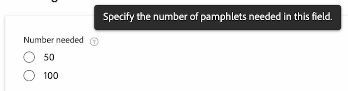

# Projetar um formulário com o designer de formulários

Você pode criar um formulário personalizado com o designer de formulário. É possível anexar formulários personalizados a diferentes objetos Workfront para capturar dados sobre esses objetos.

## Requisitos de acesso

Você deve ter o seguinte para executar as etapas neste artigo:

<table style="table-layout:auto"> 
 <col> 
 <col> 
 <tbody> 
  <tr data-mc-conditions=""> 
   <td role="rowheader"> 
Plano Adobe Workfront*
 </td> 
   <td>Qualquer Um</td> 
  </tr> 
  <tr> 
   <td role="rowheader">Licença da Adobe Workfront*</td> 
   <td>
   
Plano atual: Padrão

   
ou

   
Plano herdado: Plano
</td> 
  </tr> 
  <tr data-mc-conditions=""> 
   <td role="rowheader">Configurações de nível de acesso*</td> 
   <td> 
Acesso administrativo a formulários personalizados
 
Para obter informações sobre como os administradores do Workfront concedem esse acesso, consulte <a href="/help/quicksilver/administration-and-setup/add-users/configure-and-grant-access/grant-users-admin-access-certain-areas.md" class="MCXref xref">Conceder aos usuários acesso administrativo a determinadas áreas</a>.
 </td> 
  </tr>  
 </tbody> 
</table>

&#42;Para descobrir que plano, tipo de licença ou configurações de nível de acesso você possui, entre em contato com o administrador da Workfront.

## Iniciar a criação de um formulário personalizado

1. Clique no botão **Menu principal** ícone  no canto superior direito do Adobe Workfront, em seguida, clique em **Configuração** .

1. Clique em **Forms personalizada** no painel esquerdo.

   <!-- >[!TIP]
    >
    >In the view that appears, you can review all custom forms and custom fields that have been created for your organization. You can also see who created each form and the fields that are associated with it. -->

1. Clique em **Novo formulário personalizado.**
1. Selecione os tipos de objetos aos quais deseja anexar o formulário personalizado e clique em **Continuar**.

   

1. No **O título é obrigatório** digite o título personalizado do formulário.
1. (Opcional) Se desejar adicionar mais tipos de objetos ao formulário para que ele possa ser anexado a mais objetos, clique no botão **Adicionar** ícone  after **Tipos de objetos** e, em seguida, selecione o tipo que deseja no menu exibido. Você pode repetir isso para adicionar quantos tipos de objeto desejar.

   Você também pode clicar no X em um tipo de objeto para excluí-lo do formulário.

   >[!CAUTION]
   >
   >A exclusão de um formulário personalizado também exclui todos os dados personalizados dos objetos associados ao formulário. Os dados excluídos não podem ser recuperados. Considere desativar um formulário personalizado em vez disso — ao desativar um formulário personalizado que não é mais usado, você mantém todos os dados históricos associados.
   >
   >Para obter mais informações, consulte [Excluir tipos de objetos em um formulário personalizado](/help/quicksilver/administration-and-setup/customize-workfront/create-manage-custom-forms/delete-object-type-on-a-custom-form.md).

1. Em seguida, você pode começar a adicionar campos ao formulário personalizado. Consulte as seguintes seções:
   * [Reutilizar um campo ou widget existente já usado em outro formulário personalizado](#reuse-an-existing-field-or-widget-already-used-in-another-custom-form)
   * [Adicionar campos de texto](#add-text-fields)
   * [Adicionar campos calculados](#add-calculated-fields)
   * [Adicionar botões de opção, grupo de caixas de seleção e menus suspensos](#add-radio-buttons-checkboxes-and-dropdowns)
   * [Adicionar campos de data e data de digitação](#add-typeahead-and-date-fields)
   * [Adicionar imagens, PDF e vídeos](#add-images-pdfs-and-videos)
   * [Adicionar arquivos Adobe XD](#add-adobe-xd-files)

## Adicionar campos novos ou existentes ao formulário personalizado

Você pode usar campos novos ou existentes ao projetar seu formulário personalizado.

## Reutilizar um campo ou widget existente já usado em outro formulário personalizado

1. No lado superior esquerdo da tela, clique em **Biblioteca de campos**.

1. Arraste o campo ou o widget aqui que desejar no formulário personalizado.
1. (Opcional) Repita a etapa anterior para adicionar outros campos ou widgets.

   >[!NOTE]
   >
   >É possível adicionar até 500 campos e widgets em um único formulário personalizado. No entanto, pode ocorrer degradação do desempenho quando houver mais de 100 em um formulário, dependendo de sua complexidade.
   >
   >
   >Exemplos de formulários complexos incluem formulários com parâmetros em cascata, campos de dados personalizados calculados e várias opções de valor em um único campo.

1. Para salvar as alterações, clique em **Aplicar** e vá para outra seção para continuar a criar o formulário.

   ou

   Clique em **Salvar e fechar**.

### Adicionar campos de texto

É possível adicionar vários campos de texto diferentes a um formulário personalizado.

+++ **Expandir para ver descrições de campos de texto disponíveis**

* **Campo de texto de linha única**: Permite que os usuários digitem uma única linha de texto no campo.
* **Campo de texto do parágrafo**: Permite que os usuários digitem várias linhas de texto no campo.
* **Campo de texto com formatação**: Permite que os usuários digitem várias linhas de texto no campo e formatem o texto com negrito, itálico, sublinhado, marcadores, numeração, hiperlinks e aspas de bloco. Um limite de 15.000 caracteres permite bastante texto e formatação.

   Para obter informações sobre como acessar esse campo por meio da API, consulte Armazenamento de campo de Rich Text na API.

   >[!NOTE]
   >
   >Campos de texto com formatação não estão disponíveis para aplicativos móveis Workfront (disponíveis em próximas versões).

* **Texto descritivo**: Permite incluir instruções e vincular a páginas fora do Workfront.

+++

Para adicionar um campo de texto:

1. No lado esquerdo da tela, encontre um dos seguintes campos de texto e arraste-o para uma seção na tela:

   * Texto de linha única:
   * Texto do parágrafo
   * Campo de texto com formatação
   * Texto descritivo

   

1. No lado direito da tela, configure as opções disponíveis para o tipo de campo personalizado que você está adicionando:

   <table>
    <tr>
    <td>Entrada em</td>
    <td>Descrição</td>
    <td>Disponível para </td>
    </tr>
    <tr>
    <td>Tamanho</td>
    <td>
Altere o tamanho dos campos de texto no formulário.

   </td>
    <td><ul>
    <li>Texto de linha única</li>
    <li>Texto de parágrafo</li>
    <li>Texto com formatação</li>
    <li>Texto descritivo - Em breve</li>
    </ul></td>
    </tr>
    <tr>
    <td>Rótulo</td>
    <td>
Digite um rótulo descritivo para exibir acima do widget. Você pode alterar o rótulo a qualquer momento.

    
IMPORTANTE: Evite usar caracteres especiais neste rótulo. Eles não são exibidos corretamente nos relatórios.
</td>
    <td><ul>
    <li>Texto de linha única</li>
    <li>Texto de parágrafo</li>
    <li>Texto com formatação</li>
    </ul></td>
    </tr>
    <tr>
     <td>Nome</td>
    <td>
(Obrigatório) Esse nome é como o sistema identifica o campo. Ao configurar o widget pela primeira vez e digitar o rótulo, o campo Nome é preenchido automaticamente para corresponder a ele. Mas os campos Rótulo e Nome não são sincronizados — isso dá a você a liberdade de alterar o rótulo que seus usuários veem sem precisar alterar o nome que o sistema vê.

    
<b>IMPORTANTE</b>:   
      <ul> 
      <li>Embora seja possível fazer isso, recomendamos que você não altere esse nome depois que você ou outros usuários começarem a usar o formulário personalizado no Workfront. Nesse caso, o sistema não reconhecerá mais o campo personalizado, onde agora pode ser referenciado em outras áreas do Workfront. 
Por exemplo, se você adicionar o campo personalizado a um relatório e depois alterar seu nome, o Workfront não o reconhecerá no relatório e ele deixará de funcionar corretamente lá, a menos que você o adicione novamente ao relatório usando o novo nome.
 </li>
      <li> 
Recomendamos que você não digite um nome que já esteja sendo usado em campos integrados do Workfront.
 </li>
      <li>
Recomendamos que você não use o caractere ponto/ponto no nome do campo personalizado para evitar erros ao usar o campo em diferentes áreas do Workfront.
</li>
    </td>
    <td><ul>
    <li>Texto de linha única</li>
    <li>Texto de parágrafo</li>
    <li>Texto com formatação</li>
    <li>Texto descritivo</li>
    </ul></td>
    </tr>
    <tr>
    <td>Instruções</td>
    <td>Digite quaisquer informações adicionais sobre o widget. Quando os usuários preenchem o formulário personalizado, eles podem passar o mouse sobre o ícone de ponto de interrogação para visualizar uma dica de ferramenta com as informações digitadas aqui.
    
    </td>
    <td><ul>
    <li>Texto de linha única</li>
    <li>Texto de parágrafo</li>
    <li>Texto com formatação</li>
    </ul></td>
    </tr>
    <tr>
    <td>Formatar</td>
    <td>
Selecione o tipo de dados que será capturado no campo personalizado.
 
<b>Nota</b>:   
    <ul> 
    <li>Este campo não pode ser editado depois que o formulário é salvo. Se você pretende usar seu campo em cálculos matemáticos, selecione um formato de Número ou Moeda. </li> 
    <li>Quando você seleciona Número ou Moeda, o sistema trunca automaticamente os números que começam com 0.</li> 
     </ul>
</td> </td>
    <td><ul>
    <li>Texto de linha única</li>
    <li>Texto de parágrafo</li>
    </ul></td>
    </tr>
    <tr>
    <td>Tipo de Exibição</td>
    <td>Alternar entre campos de texto de linha única e de parágrafo.</td>
    <td><ul>
    <li>Texto de linha única</li>
    <li>Texto de parágrafo</li>
    </ul></td>
    </tr>
    <tr>
    <td>Hiperlink</td>
    <td> Se quiser aplicar um hiperlink ao Texto descritivo digitado, adicione-o aqui. O texto Descritivo é exibido como um link nos objetos aos quais o formulário está anexado.</td>
    <td><ul><li>Texto descritivo</li></ul></td>
    </tr>
   </table>

1. (Opcional) Repita a etapa anterior para adicionar outros campos ou widgets.

   ou

   Para copiar um campo, passe o mouse sobre um campo e clique no ícone de cópia.

   

1. Para salvar as alterações, clique em **Aplicar** e vá para outra seção para continuar a criar o formulário.

   ou

   Clique em **Salvar e fechar**.

### Adicionar campos calculados

Em um formulário personalizado, é possível adicionar um campo personalizado calculado que use dados existentes para gerar novos dados quando o formulário personalizado estiver anexado a um objeto.

Para adicionar um campo calculado, consulte [Adicionar campos calculados com o designer de formulário](/help/quicksilver/administration-and-setup/customize-workfront/create-manage-custom-forms/form-designer/design-a-form/add-a-calculated-field.md).

### Adicionar botões de opção, caixas de seleção e menus suspensos

É possível adicionar botões de opção, caixas de seleção e menus suspensos a um formulário personalizado.

+++ **Expanda para ver descrições de campos disponíveis**

* **Botões de opção**: Requer que os usuários selecionem apenas uma opção.
* **Grupo de caixa de seleção**: Permite que os usuários selecionem várias opções.
* **Lista suspensa**: Fornece uma lista de opções suspensas.

+++

Para adicionar botões de opção e caixas de seleção:

1. No lado esquerdo da tela, encontre um dos seguintes campos e arraste-o para uma seção na tela.

   * Botões de seleção
   * Grupo de caixas de seleção
   * Suspenso

   

1. No lado direito da tela, configure as opções disponíveis para o tipo de campo personalizado que você está adicionando:

   <table style="table-layout:auto"> 
    <tbody> 
    <tr>
    <td>Entrada em</td>
    <td>Descrição</td>
    <td>Disponível para </td>
    </tr>
    <tr> 
     <td role="rowheader">Rótulo</td> 
     <td> 
(Obrigatório) Digite um rótulo descritivo para exibir acima do campo personalizado. Você pode alterar o rótulo a qualquer momento.
 
<b>IMPORTANTE</b>: Evite usar caracteres especiais neste rótulo. Eles não são exibidos corretamente nos relatórios.
 </td> 
     <td><ul>
    <li>Botões de seleção</li>
    <li>Grupo de caixas de seleção</li>
    <li>Suspenso</li>
    </ul></td>
     </tr> 
     <tr> 
    <td role="rowheader">Nome</td> 
     <td> 
(Obrigatório) Esse nome é como o sistema identifica o campo personalizado quando você o adiciona a várias áreas em todo o Workfront, como relatórios, Início e interações da API.
 
Ao configurar o campo personalizado pela primeira vez e digitar o rótulo, o campo Nome é preenchido automaticamente para correspondência. Mas os campos Rótulo e Nome não são sincronizados — isso dá a você a liberdade de alterar o rótulo que seus usuários veem sem precisar alterar o nome que o sistema vê.
 
    
<b>IMPORTANTE</b>:   
     <ul> 
    <li>Embora seja possível fazer isso, recomendamos que você não altere esse nome depois que você ou outros usuários começarem a usar o formulário personalizado no Workfront. Nesse caso, o sistema não reconhecerá mais o campo personalizado, onde agora pode ser referenciado em outras áreas do Workfront. 
Por exemplo, se você adicionar o campo personalizado a um relatório e depois alterar seu nome, o Workfront não o reconhecerá no relatório e ele deixará de funcionar corretamente lá, a menos que você o adicione novamente ao relatório usando o novo nome.
 </li>
    <li> 
Recomendamos que você não digite um nome que já esteja sendo usado em campos integrados do Workfront.
 </li>
     <li>
Recomendamos que você não use o caractere ponto/ponto no nome do campo personalizado para evitar erros ao usar o campo em diferentes áreas do Workfront.
</li>
     </ul> 
Cada nome de campo personalizado deve ser exclusivo na instância do Workfront de sua organização. Dessa forma, é possível reutilizar um que já foi criado para outro formulário personalizado. Para obter mais informações, consulte <a href="#Add" class="MCXref xref">Adicionar um campo personalizado a um formulário personalizado</a> neste artigo.
 </td>
     <td><ul>
    <li>Botões de seleção</li>
    <li>Grupo de caixas de seleção</li>
    <li>Suspenso</li>
    </ul></td>
    </tr> 
    <tr> 
    <td role="rowheader">Instruções</td> 
    <td> 
Digite quaisquer informações adicionais sobre o campo personalizado. Quando os usuários preenchem o formulário personalizado, eles podem passar o mouse sobre o ícone de ponto de interrogação para visualizar uma dica de ferramenta com as informações digitadas aqui.
 
    
   

    </td> 
    <td><ul>
    <li>Botões de seleção</li>
    <li>Grupo de caixas de seleção</li>
    <li>Suspenso</li>
    </ul></td>
    </tr> 
    <tr> 
    <td role="rowheader">Formatar</td> 
    <td> 
Selecione o tipo de dados que será capturado no campo personalizado.
 
<b>Nota</b>:   
     <ul> 
    <li>Este campo não pode ser editado depois que o formulário é salvo. Se você pretende usar seu campo em cálculos matemáticos, selecione um formato de Número ou Moeda. </li> 
    <li>Quando você seleciona Número ou Moeda, o sistema trunca automaticamente os números que começam com 0.</li> 
     </ul>
</td> 
     <td><ul>
    <li>Botões de seleção</li>
    <li>Grupo de caixas de seleção</li>
    <li>Suspenso</li>
    </ul></td>
    </tr> 
    <tr> 
     <td role="rowheader">Tipo de Exibição</td> 
    <td>Alterne entre botões de opção, grupos de caixas de seleção ou listas suspensas para o campo.</td> 
    <td><ul>
    <li>Botões de seleção</li>
    <li>Grupo de caixas de seleção</li>
    <li>Suspenso</li>
    </ul></td>
    </tr> 
     <tr> 
    <td role="rowheader">Tornar um campo obrigatório</td> 
    <td>Selecione essa opção se desejar que o campo seja obrigatório para que o usuário preencha o formulário personalizado. </td> 
    <td><ul>
    <li>Botões de seleção</li>
    <li>Grupo de caixas de seleção</li>
    <li>Suspenso</li>
    </ul></td>
     </tr> 
    <tr> 
    <td role="rowheader">Seleções </td> 
    <td> 
    <ol> 
    <li> 
Clique em <b>Opções</b>, em seguida, ative uma das seguintes opções:
 
    <ul> 
    <li><strong>Mostrar valores</strong>: Mostra os valores de cada escolha no campo . O rótulo de cada escolha é exibido por padrão.</li> 
     <li><strong>Classificar opções A-Z</strong>: Classifica as opções adicionadas alfabeticamente no campo .</li> 
    </ul> 
    </li> 
    <li> 
Para cada escolha que você adicionar para o usuário, clique no ícone de engrenagem e selecione uma das seguintes opções:
 
    <ul> 
    <li><strong>Selecionar por padrão</strong>: Selecione a escolha por padrão no campo .</li> 
    <li> 
<strong>Ocultar Escolha</strong>: Oculte a escolha no campo . As opções ocultas permanecem acessíveis nos relatórios.
 </li> 
    <li> 
<strong>Remover Escolha</strong>: Remova a opção do campo .
 
<b>AVISO</b>: Se você tiver objetos atuais usando essa opção, não os remova do campo. A remoção fará com que os dados históricos sejam perdidos. Em vez disso, selecione a opção para ocultá-la, o que impede que os usuários a selecionem no futuro.
 </li> 
    </ul> 
     </li> 
    </ol> </td> 
    <td><ul>
    <li>Botões de seleção</li>
    <li>Grupo de caixas de seleção</li>
    <li>Suspenso</li>
    </ul></td>
     </tr> 
    </tbody> 
    </table>

1. (Opcional) Repita a etapa anterior para adicionar outros campos ou widgets.

   ou

   Para copiar um campo, passe o mouse sobre um campo e clique no ícone de cópia.

   

1. Para salvar as alterações, clique em **Aplicar** e vá para outra seção para continuar a criar o formulário.

   ou

   Clique em **Salvar e fechar**.

### Adicionar campos de data e data de digitação

É possível adicionar campos de data e data de digitação a um formulário personalizado.

+++ **Expanda para ver descrições de campos disponíveis**

* **Digitalização antecipada**: Permite que os usuários digitem o nome de um objeto existente no Workfront. Uma lista de sugestões é exibida quando o usuário começa a digitar. Esse tipo de campo oferece suporte para os seguintes objetos:
   * Usuário
   * Grupo
   * Função de trabalho
   * Portfólio
   * Programa
   * Projeto
   * Equipe
   * Modelo
   * Empresa
* **Campo de data**: Exibe um calendário em que os usuários podem selecionar uma data e hora.

+++

Para adicionar campos de data de digitação antecipada:

1. No lado esquerdo da tela, encontre um dos seguintes campos e arraste-o para uma seção na tela.

   * Typeahead
   * Campo de Data

   

1. No lado direito da tela, configure as opções disponíveis para o tipo de campo personalizado que você está adicionando:

   <table style="table-layout:auto"> 
    <tbody> 
     <tr>
    <td>Configuração do campo</td>
    <td>Descrição</td>
    <td>Disponível para </td>
    </tr>
     <tr> 
      <td role="rowheader">Rótulo</td> 
      <td> 
(Obrigatório) Digite um rótulo descritivo para exibir acima do campo personalizado. Você pode alterar o rótulo a qualquer momento.
 
<b>IMPORTANTE</b>: Evite usar caracteres especiais neste rótulo. Eles não são exibidos corretamente nos relatórios.
 </td> 
       <td><ul>
    <li>Typeahead</li>
    <li>Campo de Data</li>
    </ul></td>
     </tr> 
     <tr> 
      <td role="rowheader">Nome</td> 
      <td> 
(Obrigatório) Esse nome é como o sistema identifica o campo personalizado quando você o adiciona a várias áreas em todo o Workfront, como relatórios, Início e interações da API.
 
Ao configurar o campo personalizado pela primeira vez e digitar o rótulo, o campo Nome é preenchido automaticamente para correspondência. Mas os campos Rótulo e Nome não são sincronizados — isso dá a você a liberdade de alterar o rótulo que seus usuários veem sem precisar alterar o nome que o sistema vê.
 
      
<b>IMPORTANTE</b>:   
      <ul> 
      <li>Embora seja possível fazer isso, recomendamos que você não altere esse nome depois que você ou outros usuários começarem a usar o formulário personalizado no Workfront. Nesse caso, o sistema não reconhecerá mais o campo personalizado, onde agora pode ser referenciado em outras áreas do Workfront. 
Por exemplo, se você adicionar o campo personalizado a um relatório e depois alterar seu nome, o Workfront não o reconhecerá no relatório e ele deixará de funcionar corretamente lá, a menos que você o adicione novamente ao relatório usando o novo nome.
 </li>
      <li> 
Recomendamos que você não digite um nome que já esteja sendo usado em campos integrados do Workfront.
 </li>
      <li>
Recomendamos que você não use o caractere ponto/ponto no nome do campo personalizado para evitar erros ao usar o campo em diferentes áreas do Workfront.
</li>
      </ul> 
Cada nome de campo personalizado deve ser exclusivo na instância do Workfront de sua organização. Dessa forma, é possível reutilizar um que já foi criado para outro formulário personalizado. Para obter mais informações, consulte <a href="#Add" class="MCXref xref">Adicionar um campo personalizado a um formulário personalizado</a> neste artigo.
 </td>
         <td><ul>
    <li>Typeahead</li>
    <li>Campo de Data</li>
    </ul></td>
     </tr> 
     <tr> 
      <td role="rowheader">Instruções</td> 
      <td> 
Digite quaisquer informações adicionais sobre o campo personalizado. Quando os usuários preenchem o formulário personalizado, eles podem passar o mouse sobre o ícone de ponto de interrogação para visualizar uma dica de ferramenta com as informações digitadas aqui.
 
      
  

      </td> 
         <td><ul>
    <li>Typeahead</li>
    <li>Campo de Data</li>
    </ul></td>
     </tr> 
     <tr> 
      <td role="rowheader">Exibir horário</td> 
      <td>Selecione essa opção se desejar mostrar a hora do dia junto com a data no campo .</td> 
         <td><ul>
    <li>Campo de Data</li>
    </ul></td>
     </tr> 
     <tr> 
      <td role="rowheader">Tipo de objeto referenciado</td> 
      <td> 
Selecione o tipo de objeto que deseja associar ao campo.
 
Depois de clicar em Aplicar ou Salvar+Fechar, não será possível alterar o tipo de objeto do campo.
 
<b>Nota</b>:   
        <ul> 
         <li>Se o administrador do Workfront personalizou o nome de Portfolio, Programas ou Projetos na interface do usuário do Workfront, o nome padrão do Workfront para o objeto será exibido nessa lista suspensa, não no nome personalizado. Consulte o administrador do Workfront se precisar de ajuda com isso. </li> 
         <li>Os seguintes tipos de objeto são compatíveis com os aplicativos móveis iOS e Android Workfront: Usuário, Empresa, Grupo, Função do trabalho, Portfolio, Programa, Projeto e Modelo.</li> 
        </ul> 
 </td> 
         <td><ul>
    <li>Typeahead</li>
    </ul></td>
     </tr>
     <tr> 
      <td role="rowheader">Tornar um campo obrigatório</td> 
      <td>Selecione essa opção se desejar que o campo seja obrigatório para que o usuário preencha o formulário personalizado. </td> 
       <td><ul>
    <li>Typeahead</li>
    <li>Campo de Data</li>
    </ul></td>
     </tr> 
    </tbody> 
   </table>

1. (Opcional) Repita a etapa anterior para adicionar outros campos ou widgets.

   ou

   Para copiar um campo, passe o mouse sobre um campo e clique no ícone de cópia.

   

1. Para salvar as alterações, clique em **Aplicar** e vá para outra seção para continuar a criar o formulário.

   ou

   Clique em **Salvar e fechar**.

### Adicionar imagens, PDF e vídeos

É possível adicionar imagens, PDF e Vídeos a um formulário personalizado. Os usuários que trabalham com o objeto ao qual o formulário personalizado está anexado podem ver a imagem, o PDF ou o vídeo apenas nas seguintes áreas:

* A área Detalhes do objeto (por exemplo, para um projeto, a área Detalhes do projeto)
* A caixa Editar do objeto, se ele tiver a nova aparência da experiência do Adobe Workfront (por exemplo, as caixas Editar projeto e Editar tarefa)

<!-- Do we need to tell them where they can't see it if we tell them where they can see it?
Currently, users cannot see the widget in the following areas:​
Lists and reports
Home and Summary
The Edit box for the object, if it doesn't have the new Adobe Workfront experience look and feel (for example, the Edit Expense box)
The Workfront Mobile app -->

+++ **Expanda para ver descrições de campos disponíveis**

* **Imagem**: Permite que os usuários adicionem arquivos de imagem _____.
* **PDF**: Permite aos usuários adicionar PDF
* **Vídeos**: Permite que os usuários adicionem arquivos de vídeo ____.

+++

Para adicionar imagens, PDF ou vídeos:

1. No lado esquerdo da tela, encontre um dos seguintes campos e arraste-o para uma seção na tela.

   * Imagem
   * PDF
   * Vídeo

   

1. Digite ou edite qualquer uma das seguintes propriedades do widget:

   <table style="table-layout:auto"> 
    <col> 
    <col> 
    <tbody> 
     <tr> 
      <td role="rowheader">Rótulo</td> 
      <td> 
(Obrigatório) Digite um rótulo descritivo para exibir acima do widget. Você pode alterar o rótulo a qualquer momento.
 
<b>IMPORTANTE</b>: Evite usar caracteres especiais neste rótulo. Eles não são exibidos corretamente nos relatórios.
 </td> 
     </tr> 
     <tr> 
      <td role="rowheader">Nome</td> 
      <td> 
(Obrigatório) Este nome é como o sistema identifica o widget.
 
Ao configurar o widget pela primeira vez e digitar o rótulo, o campo Nome é preenchido automaticamente para corresponder a ele. Mas os campos Rótulo e Nome não são sincronizados — isso dá a você a liberdade de alterar o rótulo que seus usuários veem sem precisar alterar o nome que o sistema vê.
 
<b>IMPORTANTE</b>: Embora seja possível fazer isso, recomendamos que você não altere esse nome depois que você ou outros usuários começarem a usar o formulário personalizado no widget. Caso sim, o sistema não reconhecerá mais o widget, onde ele pode ser referenciado em outras áreas do Workfront. 
 
Cada nome de widget deve ser exclusivo na instância do Workfront de sua organização. Dessa forma, é possível reutilizar um que já foi criado para outro formulário personalizado. 
 </td> 
     </tr> 
     <tr> 
      <td role="rowheader">URL</td> 
      <td> 
(Obrigatório) Digite ou cole o URL do widget onde ele está armazenado na Internet.
 
      
Se você estiver adicionando um widget de vídeo, no momento, é possível fazê-lo adicionando o seguinte na caixa URL:
 
      <ul> 
      <li> 
Link YouTube ou Vimeo
 </li> 
      <li> 
Link de vídeo da unidade Google
 </li> 
      <li> 
Link para vídeo com extensão MP4 e MOV
 </li> 
      <li> 
Link para o vídeo já carregado na área Documents na instância do Workfront. Para obter instruções, consulte <a href="#add-a-video-widget-to-a-custom-form-from-the-documents-area" class="MCXref xref">Adicionar um widget de vídeo a um formulário personalizado na área Documentos</a> neste artigo.
 </li> 
      </ul> 
       </td> 
     </tr> 
     <tr> 
      <td role="rowheader">Instruções</td> 
      <td> 
Digite quaisquer informações adicionais sobre o widget. Quando os usuários preenchem o formulário personalizado, eles podem passar o mouse sobre o ícone de ponto de interrogação para visualizar uma dica de ferramenta com as informações digitadas aqui.
 </td> 
     </tr> 
     <tr> 
      <td role="rowheader">Tamanho</td> 
      <td>Altere o tamanho de exibição do widget, conforme necessário.</td> 
     </tr> 
    </tbody> 
   </table>

1. (Opcional) Repita a etapa anterior para adicionar outros campos ou widgets.

   ou

   Para copiar um campo, passe o mouse sobre um campo e clique no ícone de cópia.

   

1. Para salvar as alterações, clique em **Aplicar** e vá para outra seção para continuar a criar o formulário.

   ou

   Clique em **Salvar e fechar**.

#### **Adicionar um widget de vídeo a um formulário personalizado na área Documentos**{#add-a-video-widget-to-a-custom-form-from-the-documents-area}

>[!IMPORTANT]
>
>Ao adicionar um vídeo a um formulário personalizado dessa forma, somente as permissões definidas para o formulário personalizado se aplicam ao vídeo quando os usuários acessam o formulário em um objeto, não as permissões definidas para o vídeo na área Documentos.

1. Vá para o vídeo na área Documents e gere uma prova para ele, conforme descrito em [Criar uma prova interativa para um site ou outro conteúdo da Web](/help/quicksilver/review-and-approve-work/proofing/creating-proofs-within-workfront/generate-interactive-proof-for-website-or-other-web-content.md).
1. Abra a prova.
1. Clique com o botão direito do mouse em qualquer lugar do vídeo e selecione **Copiar endereço de vídeo**.
1. No formulário personalizado, onde você está adicionando o widget de vídeo, cole o endereço copiado no **URL** caixa.
1. Para salvar as alterações, clique em **Aplicar** e vá para outra seção para continuar a criar o formulário.

   ou

   Clique em **Salvar e fechar**.

### Adicionar arquivos Adobe XD

É possível adicionar um protótipo do Adobe XD diretamente a um formulário personalizado. Os usuários que trabalham com o objeto ao qual o formulário personalizado está anexado podem ver o arquivo Adobe XD somente nas seguintes áreas:

* A área Detalhes do objeto (por exemplo, para um projeto, a área Detalhes do projeto)
* A caixa Editar do objeto, se ele tiver a nova aparência da experiência do Adobe Workfront (por exemplo, as caixas Editar projeto e Editar tarefa)

Para adicionar um arquivo Adobe XD:

1. No lado esquerdo da tela, encontre **Adobe XD** e arraste-a até uma seção na tela.
1. Digite ou edite qualquer uma das seguintes propriedades do widget:

   <table style="table-layout:auto"> 
    <col> 
    <col> 
    <tbody> 
     <tr> 
      <td role="rowheader">Rótulo</td> 
      <td> 
(Obrigatório) Digite um rótulo descritivo para exibir acima do widget. Você pode alterar o rótulo a qualquer momento.
 
<b>IMPORTANTE</b>: Evite usar caracteres especiais neste rótulo. Eles não são exibidos corretamente nos relatórios.
 </td> 
     </tr> 
     <tr> 
      <td role="rowheader">Nome</td> 
      <td> 
(Obrigatório) Este nome é como o sistema identifica o widget. Ao configurar o widget pela primeira vez e digitar o rótulo, o campo Nome é preenchido automaticamente para corresponder a ele. Mas os campos Rótulo e Nome não são sincronizados — isso dá a você a liberdade de alterar o rótulo que seus usuários veem sem precisar alterar o nome que o sistema vê.

    
<b>IMPORTANTE</b>:   
      <ul> 
      <li>Embora seja possível fazer isso, recomendamos que você não altere esse nome depois que você ou outros usuários começarem a usar o formulário personalizado no Workfront. Nesse caso, o sistema não reconhecerá mais o campo personalizado, onde agora pode ser referenciado em outras áreas do Workfront. 
Por exemplo, se você adicionar o campo personalizado a um relatório e depois alterar seu nome, o Workfront não o reconhecerá no relatório e ele deixará de funcionar corretamente lá, a menos que você o adicione novamente ao relatório usando o novo nome.
 </li>
      <li> 
Recomendamos que você não digite um nome que já esteja sendo usado em campos integrados do Workfront.
 </li>
      <li>
Recomendamos que você não use o caractere ponto/ponto no nome do campo personalizado para evitar erros ao usar o campo em diferentes áreas do Workfront.
</td> 
     </tr> 
     <tr> 
      <td role="rowheader">URL</td> 
      <td> 
(Obrigatório) Digite ou cole um link de protótipo de XD válido.
 
      
Observação: A configuração Acesso a link na guia Compartilhar no Adobe XD deve ser definida como Qualquer pessoa com o link . Caso contrário, os usuários não poderão visualizar o protótipo. 
   </td> 
     </tr> 
     <tr> 
      <td role="rowheader">Instruções</td> 
      <td> 
Digite quaisquer informações adicionais sobre o widget. Quando os usuários preenchem o formulário personalizado, eles podem passar o mouse sobre o ícone de ponto de interrogação para visualizar uma dica de ferramenta com as informações digitadas aqui.
    
 </td> 
     </tr> 
     <tr> 
      <td role="rowheader">Tamanho</td> 
      <td>(Opcional) Altere o tamanho de exibição do widget, conforme necessário.</td> 
     </tr> 
    </tbody> 
   </table>

1. (Opcional) Repita a etapa anterior para adicionar outros campos ou widgets.

   ou

   Para copiar um campo, passe o mouse sobre um campo e clique no ícone de cópia.

   

1. Para salvar as alterações, clique em **Aplicar** e vá para outra seção para continuar a criar o formulário.

   ou

   Clique em **Salvar e fechar**.

## Organizar e visualizar um formulário com o designer de formulário

Para obter informações sobre como organizar e visualizar um formulário, consulte [Organizar e visualizar um formulário com o designer de formulário](/help/quicksilver/administration-and-setup/customize-workfront/create-manage-custom-forms/form-designer/design-a-form/organize-a-form.md).