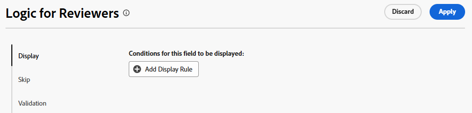

# Adicionar regras de lógica a formulários e campos personalizados

{{highlighted-preview}}

As regras lógicas permitem personalizar ainda mais os campos no formulário.

Por exemplo, você pode exibir ou ignorar campos ou seções em um formulário personalizado com base nas escolhas que um usuário faz ao preenchê-lo.

>[!NOTE]
>
>A lógica se aplica somente a um formulário e não pode ser baseada em seleções de um formulário diferente.

## Requisitos de acesso

+++ Expanda para visualizar os requisitos de acesso da funcionalidade neste artigo.

<table style="table-layout:auto"> 
 <col> 
 <col> 
 <tbody> 
  <tr> 
   <td>Pacote do Adobe Workfront</td> 
   <td> <p>Para aplicar a exibição avançada, o valor padrão, a formatação condicional ou a lógica de capacidade de edição: Workflow Prime ou superior</p>
         <p>Para aplicar todos os outros tipos lógicos: qualquer pacote de Workfront ou Workflow</p> </td> 
  </tr> 
  <tr> 
   <td>Licença do Adobe Workfront</td> 
   <td><p>Padrão</p>
       <p>Plano</p></td>
  </tr> 
  <tr> 
   <td>Configurações de nível de acesso</td> 
   <td> <p>Acesso administrativo a formulários personalizados</p> </td> 
  </tr>  
 </tbody> 
</table>

Para obter informações, consulte [Requisitos de acesso na documentação do Workfront](/help/quicksilver/administration-and-setup/add-users/access-levels-and-object-permissions/access-level-requirements-in-documentation.md).

+++

## Ícones de indicador lógico

Os formulários personalizados exibem ícones para indicar quando a lógica é aplicada aos campos.

<span class="preview">Clique em **Mostrar lógica** no cabeçalho do designer de formulário para mostrar ou ocultar os ícones dos diferentes tipos de lógica de campo.</span>

| Ícone | Definição |
| --- | --- |
|  | O campo é o campo de destino onde a lógica de exibição é aplicada. Se uma seleção específica for feita no formulário, esse campo será exibido. |
|  | O campo é o campo de referência para lógica de exibição. Uma seleção ou um valor específico nesse campo exibe o campo de destino. |
|  | O campo é o campo alvo no qual a lógica de salto é aplicada. Uma seleção ou um valor específico nesse campo ignora outros campos e vai diretamente para o campo de referência. |
|  | O campo é o campo de referência para lógica de salto. Se uma seleção específica for feita no campo de destino, o formulário pulará adiante para esse campo e os campos intermediários estarão ocultos. |
|  | O campo é o campo de destino onde a lógica de validação é aplicada. Uma seleção ou valor específico no campo de referência determina se a validação falha. O campo de destino e o campo de referência podem ser os mesmos para a lógica de validação. |
|  | O campo é o campo de referência para a lógica de validação. Uma seleção específica ou um valor nesse campo determina se a validação falha no campo de destino. O campo de destino e o campo de referência podem ser os mesmos para a lógica de validação. |
|  | <span class="preview">O campo é o campo de destino onde a lógica de valor padrão é aplicada. Uma seleção ou um valor específico no campo de referência determina o valor padrão. O campo de destino e o campo de referência podem ser os mesmos para a lógica de valor padrão.</span> |
|  | <span class="preview">O campo é o campo de referência para a lógica de valor padrão. Uma seleção ou valor específico nesse campo determina o valor padrão no campo de destino. O campo de destino e o campo de referência podem ser os mesmos para a lógica de valor padrão.</span> |
|  | <span class="preview">O campo é o campo de destino onde a lógica de formatação é aplicada. Uma seleção ou um valor específico no campo de referência determina a formatação. O campo de destino e o campo de referência podem ser os mesmos para a lógica de formatação.</span> |
|  | <span class="preview">O campo é o campo de referência para a lógica de formatação. Uma seleção ou valor específico nesse campo determina a formatação no campo de destino. O campo de destino e o campo de referência podem ser os mesmos para a lógica de formatação.</span> |
|  | <span class="preview">O campo é o campo de destino onde a lógica de editabilidade é aplicada. O campo pode ser editável ou somente leitura quando as condições definidas são atendidas. O campo de destino e o campo de referência podem ser os mesmos para a lógica de edição.</span> |
|  | <span class="preview">O campo é o campo de referência para a lógica de edição. Quando as condições definidas são atendidas nesse campo, a lógica é aplicada no campo de público-alvo. O campo de destino e o campo de referência podem ser os mesmos para a lógica de edição.</span> |

<!--  -->

Para lógica de exibição e de salto somente, selecione um campo para mostrar as regras de lógica existentes nas configurações do campo.


## Considerações sobre o uso da lógica de exibição e da lógica de salto

* Para adicionar lógica de exibição em um campo personalizado, widget ou quebra de seção, pelo menos um campo de múltipla escolha (botões de opção, lista suspensa ou caixas de seleção) deve ser posicionado antes dele no formulário.
Para obter informações sobre campos e widgets personalizados em formulários personalizados, consulte [Criar um formulário personalizado](/help/quicksilver/administration-and-setup/customize-workfront/create-manage-custom-forms/form-designer/design-a-form/design-a-form.md).
* Não é possível adicionar lógica de salto a um widget ou quebra de seção. Você pode adicioná-lo somente a um campo de múltipla escolha (botões de opção, lista suspensa ou caixas de seleção).
* Não é possível aplicar a exibição ou a lógica de salto para mostrar ou ocultar as opções de um campo de várias opções. Por exemplo, você não pode restringir as opções exibidas para um campo Suspenso, Grupo de caixas de seleção ou Botão de opção, com base na exibição ou na lógica de ignorar outro campo.
* Você pode adicionar a lógica de exibição e a lógica de salto a um campo personalizado se todos os itens a seguir forem verdadeiros sobre o campo personalizado:

   * É um campo de múltipla escolha (botões de opção, lista suspensa ou caixas de seleção)
   * É precedido por um campo de múltipla escolha
   * Ele é seguido por outro campo personalizado

* Ao copiar formulários com lógica de exibição ou lógica de salto, a lógica é copiada para o novo formulário personalizado.
* Ao editar objetos em massa, todos os campos personalizados são exibidos na caixa Editar objetos, incluindo os campos que são ignorados ou ocultos.
* Lembre-se do seguinte ao criar uma regra de lógica de exibição para um formulário personalizado:

   * Campos personalizados não incluídos em uma instrução lógica de exibição são exibidos em um formulário personalizado por padrão.
   * Você pode criar instruções lógicas de exibição de vários campos.
   * Se todos os campos em uma quebra de seção tiverem lógica de exibição aplicada a eles e todos estiverem ocultos como resultado da lógica, a seção inteira será ocultada no formulário personalizado.

## Adicionar lógica de exibição a um formulário personalizado

A lógica de exibição define quais campos personalizados aparecem no formulário quando o usuário seleciona um valor específico em um campo de múltipla escolha. A lógica é adicionada ao campo de destino, que é exibido somente quando o valor é selecionado.

>[!NOTE]
>
><span class="preview">Este procedimento descreve o modo básico da lógica de exibição. A lógica de exibição avançada também está disponível. Para obter mais informações, consulte [Adicionar lógica de exibição avançada a um formulário personalizado](#add-advanced-display-logic-to-a-custom-form), neste artigo.</span>

{{step-1-to-setup}}

1. Clique em **Forms Personalizado**.
1. Crie um novo formulário personalizado ou abra um formulário existente. Consulte [Criar um formulário personalizado](/help/quicksilver/administration-and-setup/customize-workfront/create-manage-custom-forms/form-designer/design-a-form/design-a-form.md) para obter detalhes.
1. Adicione campos ao formulário conforme necessário. Pelo menos um campo de múltipla escolha (botão de opção, lista suspensa ou caixa de seleção) deve ser posicionado antes do campo de destino que será exibido.
1. Selecione o campo de destino e clique em **Adicionar Lógica**.
1. Selecione a guia **Exibição** no construtor de lógica.
1. Clique em **Adicionar Regra de Exibição**.

   

1. Siga as etapas abaixo para criar a instrução lógica no construtor.

   1. A primeira opção é escolher o campo de definição. Este é o campo com o valor de seleção que exibe o target. Deve ser um campo de múltipla escolha.
   1. A segunda opção é escolher o valor de seleção. Somente os valores já definidos para esse campo estão disponíveis.
   1. A terceira opção é **Selecionado** ou **Não Selecionado**. Escolher **Selecionado** significa que, quando o valor for selecionado, o campo de destino será exibido. Escolher **Não selecionado** significa que quando qualquer outro valor é selecionado no campo de definição, o campo de destino é exibido.
   1. Para adicionar uma regra **And** à instrução lógica, clique em **Adicionar Regra** diretamente abaixo da regra que você acabou de criar. Siga os mesmos prompts para criar a regra. Todas as regras And devem ser atendidas para que o campo de público alvo seja exibido.

      

   1. Para adicionar uma regra **Or** à instrução lógica, clique em **Adicionar regra** próximo à parte inferior do construtor de lógica. Em seguida, clique em **Adicionar regra** dentro da área Ou e siga os mesmos prompts para criar a regra. Quando uma regra Ou é atendida, o campo de destino é exibido.

1. Clique em **Aplicar** quando terminar de criar a instrução lógica.

   Os ícones de lógica de exibição são adicionados ao campo de destino e ao campo de definição no designer do formulário.

<div class="preview">

## Adicionar lógica de exibição avançada a um formulário personalizado

A lógica de exibição avançada para campos de formulário personalizados permite criar lógica complexa usando fórmulas. É possível aplicar essa lógica aos seguintes tipos de campo: texto de linha única, parágrafo, texto com formatação, lista suspensa de seleção única, lista suspensa de seleção múltipla, pesquisa externa, pesquisa externa de seleção múltipla, referência de campo nativo, digitação antecipada, calculada, data, grupo de caixas de seleção e botões de opção.

>[!NOTE]
>
>Este procedimento descreve o modo avançado para a lógica de exibição. A lógica básica de exibição também está disponível. Para obter mais informações, consulte [Adicionar lógica de exibição a um formulário personalizado](#add-display-logic-to-a-custom-form), neste artigo.

### Exemplos

Você pode usar a lógica de exibição avançada para controlar a visibilidade de seções de formulário personalizadas com base em funções de usuário e a visibilidade de um campo com base no status de outro campo.

Nenhuma lógica é aplicada à seção padrão no formulário, portanto, ela é sempre visível para todos os usuários.

Usando a condição a seguir, a seção Recursos Necessários só é exibida quando um usuário com a função de trabalho de Gerenciador de Recursos visualiza o formulário.

```IF($$USER.{roleID}="123abc", true)```

Observe que ```123abc``` representa a ID de função do Gerenciador de Recursos.


A mesma condição com uma ID de função diferente é aplicada à seção KPIs Financeiros do Projeto para definir que somente a função Supervisor Financeiro possa exibir a seção.

Usando a condição a seguir, o campo KPI Vendido só ficará visível quando o projeto for concluído. Essa lógica é aplicada diretamente ao campo, em vez de a uma seção de formulário. Não há necessidade de especificar qual função pode exibir o campo, pois ele já está definido na seção em que o campo está.

```IF({status}="CPL", true)```


### Definir lógica de exibição avançada

{{step-1-to-setup}}

1. Clique em **Forms Personalizado**.
1. Crie um novo formulário personalizado ou abra um formulário existente. Consulte [Criar um formulário personalizado](/help/quicksilver/administration-and-setup/customize-workfront/create-manage-custom-forms/form-designer/design-a-form/design-a-form.md) para obter detalhes.
1. Adicione campos ao formulário conforme necessário.
1. Selecione o campo ao qual aplicar lógica e clique em **Adicionar Lógica**.
1. Selecione a guia **Exibição** no construtor de lógica.
1. Ative o **Modo avançado**.

   Essa opção pode ser ativada automaticamente em campos que não oferecem suporte ao modo simples da lógica de exibição.

   

1. Crie a condição de exibição no editor.

   Para obter mais informações sobre cálculos e expressões, consulte [Adicionar campos calculados a um formulário](/help/quicksilver/administration-and-setup/customize-workfront/create-manage-custom-forms/form-designer/design-a-form/add-a-calculated-field.md) e [Visão geral de expressões de dados calculadas](/help/quicksilver/reports-and-dashboards/reports/calc-cstm-data-reports/calculated-data-expressions.md).

1. Clique em **Aplicar**.

   A lógica é aplicada ao campo e o ícone da lógica de exibição é adicionado no designer do formulário.

   >[!NOTE]
   >
   >A lógica de exibição avançada não é compatível com o modo de visualização do designer de formulário.

</div>

## Adicionar lógica de salto a um formulário personalizado

A lógica de salto define campos de formulário personalizados que são ignorados quando o usuário seleciona um valor específico em um campo de múltipla escolha. Os campos ignorados estão ocultos no formulário. A lógica é aplicada ao campo de definição onde a seleção é feita, não aos campos que são ignorados.

{{step-1-to-setup}}

1. Clique em **Forms Personalizado**.
1. Crie um novo formulário personalizado ou abra um formulário existente. Consulte [Criar um formulário personalizado](/help/quicksilver/administration-and-setup/customize-workfront/create-manage-custom-forms/form-designer/design-a-form/design-a-form.md) para obter detalhes.
1. Adicione campos ao formulário conforme necessário. O campo de definição para a lógica de salto deve ser um campo de múltipla escolha (botão de opção, lista suspensa ou caixa de seleção).
1. Selecione o campo de definição e clique em **Adicionar lógica** no canto inferior esquerdo da tela.
1. Selecione a guia **Ignorar** no construtor de lógica.
1. Clique em **Adicionar Regra de salto**.

   

1. Siga as etapas abaixo para criar a instrução lógica no construtor.

   1. O campo de definição é mostrado no construtor. É o campo que você selecionou para aplicar a lógica de salto.
   1. A primeira opção é escolher o valor da seleção. Somente os valores já definidos para o campo estão disponíveis.
   1. A segunda opção é **Selecionada** ou **Não Selecionada**. Escolher **Selecionado** significa que quando o valor é selecionado, o campo de destino é exibido e os campos intermediários são ignorados. Escolher **Não selecionado** significa que quando qualquer outro valor é selecionado no campo de definição, o campo de destino é exibido e os campos intermediários são ignorados.
   1. A terceira opção é o campo de destino ou para onde pular. Selecione um nome de campo ou **Fim do formulário**. Talvez seja necessário clicar na palavra &quot;vazio&quot; primeiro antes de selecionar uma opção.

      

   1. Para adicionar uma regra **Or** à instrução lógica, clique em **Adicionar regra** próximo à parte inferior do construtor de lógica. Em seguida, selecione as opções seguindo os mesmos prompts para criar a regra. Quando uma regra **Or** é atendida, o campo de destino é exibido.

1. Clique em **Aplicar** quando terminar de criar a instrução lógica.

   Os ícones de lógica de salto são adicionados ao campo de destino e ao campo de definição no designer do formulário.

<div class="preview">

## Adicionar lógica de valor padrão a um formulário personalizado

A lógica do valor padrão permite configurar valores padrão para campos de formulário personalizados, usando fórmulas. O valor padrão é exibido quando as condições definidas são atendidas. Um valor padrão pode ser um valor estático ou dinâmico que faz referência a outros campos no objeto. Embora o valor padrão possa fazer referência a outros campos, ele não será alterado à medida que outros campos no formulário forem alterados.

Você pode aplicar lógica avançada de valor padrão aos seguintes tipos de campo: texto de linha única, parágrafo, lista suspensa de seleção única, lista suspensa de seleção múltipla, pesquisa externa, pesquisa externa de seleção múltipla. referência de campo nativo, digitação antecipada, grupo de caixas de seleção e botões de opção.

>[!TIP]
>
>Um valor padrão é aplicado apenas uma vez a um campo personalizado, quando o formulário personalizado é anexado ao objeto. Se a fórmula de valor padrão for dependente do valor de outro campo, o valor no outro campo já deverá existir quando o formulário personalizado for anexado.

>[!NOTE]
>
>A lógica de valor padrão padrão no designer do formulário ainda existe. Se ambos os tipos forem aplicados no mesmo campo, a lógica avançada terá precedência. Para obter informações sobre a lógica do valor padrão, consulte [Adicionar botões de opção, grupos de caixas de seleção e menus suspensos](/help/quicksilver/administration-and-setup/customize-workfront/create-manage-custom-forms/form-designer/design-a-form/design-a-form.md#add-radio-buttons-checkbox-groups-and-drop-downs) em [Criar um formulário personalizado](/help/quicksilver/administration-and-setup/customize-workfront/create-manage-custom-forms/form-designer/design-a-form/design-a-form.md).

### Exemplo

Usando a fórmula a seguir, o campo suspenso de várias seleções ao qual a lógica é aplicada obterá seu valor padrão da descrição do projeto quando o status do projeto for Planning.

```
IF({status} = 'PLN', ARRAY({description}, ','))
```

Quando o formulário personalizado é anexado a um projeto e o status do projeto é Planning, o valor do campo de descrição do projeto é usado como o valor padrão no campo de seleção múltipla. Como é um campo de seleção múltipla, mais de um valor pode ser extraído quando os valores correspondem à descrição. Se o valor da descrição não corresponder a nenhuma das opções de valor de seleção múltipla, o campo de seleção múltipla não terá um valor padrão e o usuário poderá selecionar um valor na lista suspensa.

### Definir a lógica do valor padrão

1. Clique em **Forms Personalizado**.
1. Crie um novo formulário personalizado ou abra um formulário existente. Consulte [Criar um formulário personalizado](/help/quicksilver/administration-and-setup/customize-workfront/create-manage-custom-forms/form-designer/design-a-form/design-a-form.md) para obter detalhes.
1. Adicione campos ao formulário conforme necessário.
1. Selecione o campo ao qual aplicar lógica e clique em **Adicionar Lógica**.
1. Selecione a guia **Valor padrão** no construtor de lógica.

   

1. Crie a condição de valor padrão no editor.

   Para obter mais informações sobre cálculos e expressões, consulte [Adicionar campos calculados a um formulário](/help/quicksilver/administration-and-setup/customize-workfront/create-manage-custom-forms/form-designer/design-a-form/add-a-calculated-field.md) e [Visão geral de expressões de dados calculadas](/help/quicksilver/reports-and-dashboards/reports/calc-cstm-data-reports/calculated-data-expressions.md).

1. Clique em **Aplicar**.

   A lógica é aplicada ao campo no designer do formulário.

   >[!NOTE]
   >
   >A lógica de valor padrão não tem suporte no modo de visualização do designer de formulário.

</div>

## Adicionar lógica de validação a um formulário personalizado

A lógica de validação é criada usando fórmulas e você pode tornar a lógica tão simples ou complexa quanto necessário. A validação pode ser baseada nos valores de outros campos ou no status dos objetos, e você pode fornecer uma mensagem de erro para quando a validação falhar.

Se o campo com a lógica aplicada atender às condições de validação definidas quando um usuário preencher o formulário personalizado, o campo será realçado e a mensagem de erro será exibida.

Você pode aplicar a lógica de validação aos seguintes tipos de campo: texto de linha única, parágrafo, lista suspensa de seleção única, lista suspensa de seleção múltipla, pesquisa externa, pesquisa externa de seleção múltipla, digitação antecipada, data, grupo de caixas de seleção e botões de opção.

### Exemplos

Usando a condição a seguir, o campo Budget exibe uma mensagem abaixo do campo quando o usuário insere um valor que aciona a mensagem. Por exemplo, se o valor inserido for negativo, a primeira mensagem será exibida. Se o usuário tentar alterar o status do projeto para Atual antes de inserir um valor de orçamento, a segunda mensagem será exibida.

```
IF({DE:Budget Field} < 0,
     "Budget cannot be negative",
     IF({DE:Budget Field} == 0 && {status} == "CUR", "Budget must be specified before moving to Current status")
)
```

Outro exemplo simples é que um campo de número de telefone deve conter um determinado número de dígitos para ser válido.

Um exemplo adicional para validação com base em outros campos é um campo para tamanho da sala de reunião (pequeno, médio ou grande) e um campo separado para o número de participantes da reunião. O número de pessoas para cada tamanho de quarto é escrito na fórmula de validação. Se o número de participantes que o usuário digita for muito grande para a sala de reunião escolhida, a mensagem de erro será exibida.

Para obter mais exemplos de lógica de validação, consulte [Exemplos de lógica avançada em formulários personalizados](/help/quicksilver/administration-and-setup/customize-workfront/create-manage-custom-forms/form-designer/design-a-form/advanced-logic-examples.md).

### Definir lógica de validação

{{step-1-to-setup}}

1. Clique em **Forms Personalizado**.
1. Crie um novo formulário personalizado ou abra um formulário existente. Consulte [Criar um formulário personalizado](/help/quicksilver/administration-and-setup/customize-workfront/create-manage-custom-forms/form-designer/design-a-form/design-a-form.md) para obter detalhes.
1. Adicione campos ao formulário conforme necessário.
1. Selecione o campo ao qual aplicar lógica e clique em **Adicionar Lógica**.
1. Selecione a guia **Validação** no construtor de lógica.

   

1. Crie a condição de validação no editor, incluindo a mensagem de erro a ser exibida quando a validação não for atendida.

   Para obter mais informações sobre cálculos e expressões, consulte [Adicionar campos calculados a um formulário](/help/quicksilver/administration-and-setup/customize-workfront/create-manage-custom-forms/form-designer/design-a-form/add-a-calculated-field.md) e [Visão geral de expressões de dados calculadas](/help/quicksilver/reports-and-dashboards/reports/calc-cstm-data-reports/calculated-data-expressions.md).

1. Clique em **Aplicar**.

   A lógica é aplicada ao campo no designer do formulário.

   >[!NOTE]
   >
   >Não há suporte para a lógica de validação no modo de visualização do designer de formulário.

<div class="preview">

## Adicionar lógica de formatação a um formulário personalizado

A lógica de formatação destaca um valor de campo quando atende às condições definidas. A formatação aplicada funcionará em vários campos de uma só vez.

Você pode aplicar lógica de formatação aos seguintes tipos de campo: texto de linha única, parágrafo, lista suspensa de seleção única, lista suspensa de seleção múltipla, pesquisa externa, pesquisa externa de seleção múltipla, digitação antecipada, calculada, data, grupo de caixas de seleção e botões de opção.

A formatação aplicada aos formulários personalizados é separada da formatação aplicada a listas e relatórios. Para obter informações sobre a formatação do relatório, consulte [Usar formatação condicional nas exibições](/help/quicksilver/reports-and-dashboards/reports/reporting-elements/use-conditional-formatting-views.md).

### Exemplo

Usando a condição a seguir, o campo Budget aparece em vermelho quando o usuário insere um valor de 1000 ou mais. O campo aparece em amarelo quando o usuário insere um valor de 500 ou mais.

Para adicionar uma definição de sobreposição da formatação, use o campo Instruções no formulário personalizado. Por exemplo, uma mensagem no campo Orçamento poderia dizer &quot;Insira um orçamento dentro de um intervalo razoável. Valores acima de 500 são avisos de advertência e acima de 1000 são considerados muito altos.&quot;

```
IF(
     {DE:Budget Field} >=1000,
     FORMAT($$NEGATIVE),
     IF({DE:Budget Field} >= 500, FORMAT($$NOTICE))
)
```

### Definir lógica de formatação

{{step-1-to-setup}}

1. Clique em **Forms Personalizado**.
1. Crie um novo formulário personalizado ou abra um formulário existente. Consulte [Criar um formulário personalizado](/help/quicksilver/administration-and-setup/customize-workfront/create-manage-custom-forms/form-designer/design-a-form/design-a-form.md) para obter detalhes.
1. Adicione campos ao formulário conforme necessário.
1. Selecione o campo ao qual aplicar lógica e clique em **Adicionar Lógica**.
1. Selecione a guia **Formatação** no construtor de lógica.

   

1. Crie a condição de formatação no editor.

   Você pode adicionar até cinco regras de formatação por campo.

   As opções de cor de realce do campo são:

   * `$$POSITIVE (green)`
   * `$$INFORMATIVE (blue)`
   * `$$NEGATIVE (red)`
   * `$$NOTICE (orange)`

   As opções de formatação de texto são:

   * `$$BOLD`
   * `$$ITALIC`
   * `$$UNDERLINE`

   Somente uma opção de cor pode ser usada por função, juntamente com até três opções adicionais de formatação de texto. Se nenhuma opção de cor for especificada, a cor padrão do sistema será aplicada.

   Para obter mais informações sobre cálculos e expressões, consulte [Adicionar campos calculados a um formulário](/help/quicksilver/administration-and-setup/customize-workfront/create-manage-custom-forms/form-designer/design-a-form/add-a-calculated-field.md) e [Visão geral de expressões de dados calculadas](/help/quicksilver/reports-and-dashboards/reports/calc-cstm-data-reports/calculated-data-expressions.md).

1. Clique em **Aplicar**.

   A lógica é aplicada ao campo no designer do formulário.

   >[!NOTE]
   >
   >A lógica de formatação não tem suporte no modo de visualização do designer de formulário.

</div>

<div class="preview">

## Adicionar lógica de editabilidade a um formulário personalizado

A lógica da capacidade de edição determina se um campo de formulário personalizado pode ser editado ou se é somente leitura. Essa lógica é criada usando fórmulas e, quando o campo atende às condições definidas, pode ser definido como editável ou somente leitura.

Você pode aplicar lógica de editabilidade aos seguintes tipos de campo: texto de linha única, parágrafo, texto com formatação, lista suspensa de seleção única, lista suspensa de seleção múltipla, pesquisa externa, pesquisa externa de seleção múltipla, digitação antecipada, data, grupo de caixas de seleção e botões de opção.

### Exemplo

Usando a fórmula a seguir, o campo com lógica aplicada só poderá ser editado quando outro campo chamado Rádio tiver a opção Ativado selecionada.

```
IF({DE:Radio} = "Enabled", true)
```

Usando a fórmula a seguir, o campo Descrição só poderá ser editado quando estiver em branco. Depois que um valor é inserido, ele se torna somente leitura.

```
IF(ISBLANK({DE:Description}), true)
```

Usando a fórmula a seguir, o campo com lógica aplicada só poderá ser editado quando um usuário com a função de trabalho de Gerenciador de Recursos visualizar o formulário.

```
IF($$USER.{role}.{name}="Resource Manager", true)
```

### Definir lógica de editabilidade

{{step-1-to-setup}}

1. Clique em **Forms Personalizado**.
1. Crie um novo formulário personalizado ou abra um formulário existente. Consulte [Criar um formulário personalizado](/help/quicksilver/administration-and-setup/customize-workfront/create-manage-custom-forms/form-designer/design-a-form/design-a-form.md) para obter detalhes.
1. Adicione campos ao formulário conforme necessário.
1. Selecione o campo ao qual aplicar lógica e clique em **Adicionar Lógica**.
1. Selecione a guia **Editabilidade** no construtor de lógica.

   

1. Crie a condição de editabilidade no editor.

   Para obter mais informações sobre cálculos e expressões, consulte [Adicionar campos calculados a um formulário](/help/quicksilver/administration-and-setup/customize-workfront/create-manage-custom-forms/form-designer/design-a-form/add-a-calculated-field.md) e [Visão geral de expressões de dados calculadas](/help/quicksilver/reports-and-dashboards/reports/calc-cstm-data-reports/calculated-data-expressions.md).

1. Clique em **Aplicar**.

   A lógica é aplicada ao campo no designer do formulário.

   >[!NOTE]
   >
   >A lógica de capacidade de edição não é compatível com o modo de visualização do designer de formulário.

</div>
