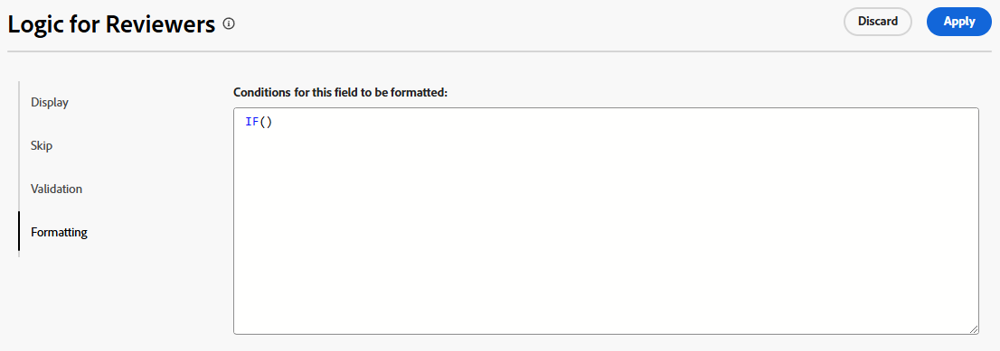

# Adicionar regras de lógica a formulários e campos personalizados

{{highlighted-preview}}

As regras lógicas permitem personalizar ainda mais os campos no formulário.

Por exemplo, você pode exibir ou ignorar campos ou seções em um formulário personalizado com base nas escolhas que um usuário faz ao preenchê-lo.

>[!NOTE]
>
>A lógica se aplica somente a um formulário e não pode ser baseada em seleções de um formulário diferente.

## Requisitos de acesso

+++ Expanda para visualizar os requisitos de acesso para a funcionalidade neste artigo.

Você deve ter o seguinte acesso para executar as etapas deste artigo:

<table style="table-layout:auto"> 
 <col> 
 <col> 
 <tbody> 
  <tr data-mc-conditions=""> 
   <td role="rowheader">plano do Adobe Workfront </td> 
   <td>Qualquer</td> 
  </tr> 
  <tr> 
   <td role="rowheader">Licença do Adobe Workfront</td> 
   <td>
   <p>Novo: Padrão</p>
   <p>ou</p>
   <p>Atual: Plano</p></td> 
  </tr> 
  <tr data-mc-conditions=""> 
   <td role="rowheader">Configurações de nível de acesso</td> 
   <td>Acesso administrativo a formulários personalizados </td> 
  </tr>  
 </tbody> 
</table>

Para obter mais detalhes sobre as informações nesta tabela, consulte [Requisitos de acesso na documentação do Workfront](/help/quicksilver/administration-and-setup/add-users/access-levels-and-object-permissions/access-level-requirements-in-documentation.md).

+++

## Exibir e ignorar ícones lógicos

Os formulários personalizados exibem ícones para indicar quando a lógica de exibição ou salto é aplicada a determinados campos. Os ícones em um campo no designer do formulário indicam que a lógica é aplicada ao campo.

| Ícone | Localização no campo no designer do formulário | Definição |
|--- |--- |--- |
|  | Inferior esquerdo | O campo é o campo de destino da lógica de exibição. Se uma seleção específica for feita no formulário, esse campo será exibido. |
|  | Inferior direito | O campo define a lógica de exibição. Uma seleção ou um valor específico nesse campo exibe o campo de destino. |
|  | Inferior esquerdo | O campo é o campo de destino para lógica de salto. Se uma seleção específica for feita no formulário, ele pulará adiante para esse campo e os campos intermediários estarão ocultos. |
|  | Inferior direito | O campo define a lógica de salto. Uma seleção ou um valor específico nesse campo ignora outros campos e vai diretamente para o campo de destino. |


Selecione um campo com lógica aplicada para exibir as regras de lógica existentes nas configurações do campo.


## Considerações sobre o uso da lógica de exibição e da lógica de salto

* Para adicionar lógica de exibição em um campo personalizado, widget ou quebra de seção, pelo menos um campo de múltipla escolha (botões de opção, lista suspensa ou caixas de seleção) deve ser posicionado antes dele no formulário.
Para obter informações sobre campos e widgets personalizados em formulários personalizados, consulte [Criar um formulário personalizado](/help/quicksilver/administration-and-setup/customize-workfront/create-manage-custom-forms/form-designer/design-a-form/design-a-form.md).
* Não é possível adicionar lógica de salto a um widget ou quebra de seção. Você pode adicioná-lo somente a um campo de múltipla escolha (botões de opção, lista suspensa ou caixas de seleção).
* Não é possível aplicar a exibição ou a lógica de salto para mostrar ou ocultar as opções de um campo de várias opções. Por exemplo, você não pode restringir as opções exibidas para um campo Suspenso, Grupo de caixas de seleção ou Botão de opção, com base na exibição ou na lógica de ignorar outro campo.
* Você pode adicionar a lógica de exibição e a lógica de salto a um campo personalizado se todos os itens a seguir forem verdadeiros sobre o campo personalizado:

   * É um campo de múltipla escolha (botões de opção, lista suspensa ou caixas de seleção)
   * É precedido por um campo de múltipla escolha
   * Ele é seguido por outro campo personalizado

* Ao copiar formulários com lógica de exibição ou lógica de salto, a lógica é copiada para o novo formulário personalizado.
* Ao editar objetos em massa, todos os campos personalizados são exibidos na caixa Editar objetos, incluindo os campos que são ignorados ou ocultos.
* Lembre-se do seguinte ao criar uma regra de lógica de exibição para um formulário personalizado:

   * Campos personalizados não incluídos em uma instrução lógica de exibição são exibidos em um formulário personalizado por padrão.
   * Você pode criar instruções lógicas de exibição de vários campos.
   * Se todos os campos em uma quebra de seção tiverem lógica de exibição aplicada a eles e todos estiverem ocultos como resultado da lógica, a seção inteira será ocultada no formulário personalizado.

## Adicionar lógica de exibição a um formulário personalizado

A lógica de exibição define quais campos personalizados aparecem no formulário quando o usuário seleciona um valor específico em um campo de múltipla escolha. A lógica é adicionada ao campo de destino, que é exibido somente quando o valor é selecionado.

<!--
>[!NOTE]
>
><span class="preview">This procedure describes the basic mode for display logic. Advanced display logic is also available. For more information, see [Add advanced display logic to a custom form](#add-advanced-display-logic-to-a-custom-form), in this article.</span>
-->

{{step-1-to-setup}}

1. Clique em **Forms Personalizado**.
1. Crie um novo formulário personalizado ou abra um formulário existente. Consulte [Criar um formulário personalizado](/help/quicksilver/administration-and-setup/customize-workfront/create-manage-custom-forms/form-designer/design-a-form/design-a-form.md) para obter detalhes.
1. Adicione campos ao formulário conforme necessário. Pelo menos um campo de múltipla escolha (botão de opção, lista suspensa ou caixa de seleção) deve ser posicionado antes do campo de destino que será exibido.
1. Selecione o campo de destino e clique em **Adicionar Lógica**.
1. Selecione a guia **Exibição** no construtor de lógica.
1. Clique em **Adicionar Regra de Exibição**.

   <span class="preview">Imagem de exemplo no ambiente de Visualização:</span>

   

   Imagem de amostra no ambiente de produção:

   

1. Siga as etapas abaixo para criar a instrução lógica no construtor.

   1. A primeira opção é escolher o campo de definição. Este é o campo com o valor de seleção que exibe o target. Deve ser um campo de múltipla escolha.
   1. A segunda opção é escolher o valor de seleção. Somente os valores já definidos para esse campo estão disponíveis.
   1. A terceira opção é **Selecionado** ou **Não Selecionado**. Escolher **Selecionado** significa que, quando o valor for selecionado, o campo de destino será exibido. Escolher **Não selecionado** significa que quando qualquer outro valor é selecionado no campo de definição, o campo de destino é exibido.
   1. Para adicionar uma regra **And** à instrução lógica, clique em **Adicionar Regra** diretamente abaixo da regra que você acabou de criar. Siga os mesmos prompts para criar a regra. Todas as regras And devem ser atendidas para que o campo de público alvo seja exibido.

      <span class="preview">Imagem de exemplo no ambiente de Visualização:</span>

      

      Imagem de amostra no ambiente de produção:

      

   1. Para adicionar uma regra **Or** à instrução lógica, clique em **Adicionar regra** próximo à parte inferior do construtor de lógica. Em seguida, clique em **Adicionar regra** dentro da área Ou e siga os mesmos prompts para criar a regra. Quando uma regra Ou é atendida, o campo de destino é exibido.

1. Clique em **Salvar** <span class="preview">ou **Aplicar**</span> quando terminar de criar a instrução lógica.

   Os ícones de lógica de exibição são adicionados ao campo de destino e ao campo de definição no designer do formulário.

<!--
<div class="preview">

## Add advanced display logic to a custom form

The advanced display logic for custom form fields allows you to build complex logic using formulas. You can apply this logic to the following field types: drop-down, radio button, checkbox, typeahead, single line text, paragraph text, date field, text with formatting, and calculated fields.

### Examples

You can use advanced display logic to control the visibility of custom form sections based on user roles and the visibility of a field based on another field's status.

No logic is applied to the default section on the form, so it is always visible to all users.

Using the following condition, the Resources Required section is only displayed when a user with the job role of Resource Manager views the form.

```IF($$USER.{roleID}="123abc", true)```

Note that ```123abc``` represents the role ID of the Resource Manager.


The same condition with a different role ID is applied to the Project Financial KPIs section to define that  only the Financial Advisor role can view the section.

Using the following condition, the Sold KPI field only becomes visible when the project is complete. This logic is applied directly to the field instead of to a form section. There is no need to specify which role can view the field, because that is already defined in the section that the field is in.

```IF({status}="CPL", true)```


### Define advanced display logic

{{step-1-to-setup}}

1. Click **Custom Forms**.
1. Create a new custom form or open an existing form. See [Create a custom form](/help/quicksilver/administration-and-setup/customize-workfront/create-manage-custom-forms/form-designer/design-a-form/design-a-form.md) for details.
1. Add fields to the form as needed.
1. Select the field to apply logic to, and click **Add Logic**.
1. Select the **Display** tab on the logic builder.
1. Turn on **Advanced mode**.
   
   This option might be turned on automatically, for fields that do not support the simple mode of display logic.

   

1. Build the display condition in the editor.

   For more information about calculations and expressions, see [Add calculated fields to a form](/help/quicksilver/administration-and-setup/customize-workfront/create-manage-custom-forms/form-designer/design-a-form/add-a-calculated-field.md) and [Overview of calculated data expressions](/help/quicksilver/reports-and-dashboards/reports/calc-cstm-data-reports/calculated-data-expressions.md).

1. Click **Apply**.
   
   The logic is applied to the field and the display logic icon is added in the form designer.

</div>
-->

## Adicionar lógica de salto a um formulário personalizado

A lógica de salto define campos de formulário personalizados que são ignorados quando o usuário seleciona um valor específico em um campo de múltipla escolha. Os campos ignorados estão ocultos no formulário. A lógica é aplicada ao campo de definição onde a seleção é feita, não aos campos que são ignorados.

{{step-1-to-setup}}

1. Clique em **Forms Personalizado**.
1. Crie um novo formulário personalizado ou abra um formulário existente. Consulte [Criar um formulário personalizado](/help/quicksilver/administration-and-setup/customize-workfront/create-manage-custom-forms/form-designer/design-a-form/design-a-form.md) para obter detalhes.
1. Adicione campos ao formulário conforme necessário. O campo de definição para a lógica de salto deve ser um campo de múltipla escolha (botão de opção, lista suspensa ou caixa de seleção).
1. Selecione o campo de definição e clique em **Adicionar lógica** no canto inferior esquerdo da tela.
1. Selecione a guia **Ignorar** no construtor de lógica.
1. Clique em **Adicionar Regra de salto**.


   <span class="preview">Imagem de exemplo no ambiente de Visualização:</span>

   

   Imagem de amostra no ambiente de produção:

   

1. Siga as etapas abaixo para criar a instrução lógica no construtor.

   1. O campo de definição é mostrado no construtor. É o campo que você selecionou para aplicar a lógica de salto.
   1. A primeira opção é escolher o valor da seleção. Somente os valores já definidos para o campo estão disponíveis.
   1. A segunda opção é **Selecionada** ou **Não Selecionada**. Escolher **Selecionado** significa que quando o valor é selecionado, o campo de destino é exibido e os campos intermediários são ignorados. Escolher **Não selecionado** significa que quando qualquer outro valor é selecionado no campo de definição, o campo de destino é exibido e os campos intermediários são ignorados.
   1. A terceira opção é o campo de destino ou para onde pular. Selecione um nome de campo ou **Fim do formulário**. Talvez seja necessário clicar na palavra &quot;vazio&quot; primeiro antes de selecionar uma opção.

      <span class="preview">Imagem de exemplo no ambiente de Visualização:</span>

      

      Imagem de amostra no ambiente de produção:

      

   1. Para adicionar uma regra **Or** à instrução lógica, clique em **Adicionar regra** próximo à parte inferior do construtor de lógica. Em seguida, selecione as opções seguindo os mesmos prompts para criar a regra. Quando uma regra **Or** é atendida, o campo de destino é exibido.

1. Clique em **Salvar** <span class="preview">ou **Aplicar**</span> quando terminar de criar a instrução lógica.

   Os ícones de lógica de salto são adicionados ao campo de destino e ao campo de definição no designer do formulário.

<div class="preview">

## Adicionar lógica de validação a um formulário personalizado

A lógica de validação é criada usando fórmulas e você pode tornar a lógica tão simples ou complexa quanto necessário. A validação pode ser baseada nos valores de outros campos ou no status dos objetos, e você pode fornecer uma mensagem de erro para quando a validação falhar.

Se o campo com a lógica aplicada atender às condições de validação definidas quando um usuário preencher o formulário personalizado, o campo será realçado e a mensagem de erro será exibida.

Você pode aplicar lógica de validação aos seguintes tipos de campo: lista suspensa, botão de opção, caixa de seleção, digitação antecipada, texto de linha única, texto de parágrafo, campo de data, texto com formatação e campos calculados.

### Exemplos

Usando a condição a seguir, o campo Budget exibe uma mensagem abaixo do campo quando o usuário insere um valor que aciona a mensagem. Por exemplo, se o valor inserido for negativo, a primeira mensagem será exibida. Se o usuário tentar alterar o status do projeto para Atual antes de inserir um valor de orçamento, a segunda mensagem será exibida.

```
IF({DE:Budget Field} < 0,
     "Budget cannot be negative",
     IF({DE:Budget Field} == 0 && {status} == "CUR", "Budget must be specified before moving to Current status")
)
```

Outro exemplo simples é que um campo de número de telefone deve conter um determinado número de dígitos para ser válido.

Um exemplo adicional para validação com base em outros campos é um campo para tamanho da sala de reunião (pequeno, médio ou grande) e um campo separado para o número de participantes da reunião. O número de pessoas para cada tamanho de quarto é escrito na fórmula de validação. Se o número de participantes que o usuário digita for muito grande para a sala de reunião escolhida, a mensagem de erro será exibida.

### Definir lógica de validação

{{step-1-to-setup}}

1. Clique em **Forms Personalizado**.
1. Crie um novo formulário personalizado ou abra um formulário existente. Consulte [Criar um formulário personalizado](/help/quicksilver/administration-and-setup/customize-workfront/create-manage-custom-forms/form-designer/design-a-form/design-a-form.md) para obter detalhes.
1. Adicione campos ao formulário conforme necessário.
1. Selecione o campo ao qual aplicar lógica e clique em **Adicionar Lógica**.
1. Selecione a guia **Validação** no construtor de lógica.

   

1. Crie a condição de validação no editor, incluindo a mensagem de erro a ser exibida quando a validação não for atendida.

   Para obter mais informações sobre cálculos e expressões, consulte [Adicionar campos calculados a um formulário](/help/quicksilver/administration-and-setup/customize-workfront/create-manage-custom-forms/form-designer/design-a-form/add-a-calculated-field.md) e [Visão geral de expressões de dados calculadas](/help/quicksilver/reports-and-dashboards/reports/calc-cstm-data-reports/calculated-data-expressions.md).

1. Clique em **Aplicar**.

   A lógica é aplicada ao campo no designer do formulário.

</div>

<!--
<div class="preview">

## Add formatting logic to a custom form

Formatting logic highlights a field value when it meets the defined conditions. You can apply formatting logic to all field types, and it will work on multiple fields at once.

Formatting applied to custom forms is separate from formatting applied to lists and reports. For information on report formatting, see [Use conditional formatting in views](/help/quicksilver/reports-and-dashboards/reports/reporting-elements/use-conditional-formatting-views.md).

### Example

Using the following condition, the Budget field appears red when the user enters a value of 1000 or more. The field appears yellow when the user enters a value of 500 or more.

To add a hover-over definition of the formatting, use the Instructions field in the custom form. For example, a message on the Budget field could say "Please enter a budget within a reasonable range. Values over 500 are a warning notice, and above 1000 is considered too high."

```
IF(
     {DE:Budget Field} >=1000,
     FORMAT($$NEGATIVE),
     IF({DE:Budget Field} >= 500, FORMAT($$NOTICE))
)
```

### Define formatting logic

{{step-1-to-setup}}

1. Click **Custom Forms**.
1. Create a new custom form or open an existing form. See [Create a custom form](/help/quicksilver/administration-and-setup/customize-workfront/create-manage-custom-forms/form-designer/design-a-form/design-a-form.md) for details.
1. Add fields to the form as needed.
1. Select the field to apply logic to, and click **Add Logic**.
1. Select the **Formatting** tab on the logic builder.

   

1. Build the formatting condition in the editor.

   You can add up to five formatting rules per field.

   The field highlighting color options are:

   * `$$POSITIVE (green)`
   * `$$INFORMATIVE (blue)`
   * `$$NEGATIVE (red)`
   * `$$NOTICE (orange)`
   
   The text formatting options are:
   
   * `$$BOLD`
   * `$$ITALIC`
   * `$$UNDERLINE`

   Only one color option may be used per function, along with up to three additional text formatting options. If no color option is specified, the system's default color is applied.

   For more information about calculations and expressions, see [Add calculated fields to a form](/help/quicksilver/administration-and-setup/customize-workfront/create-manage-custom-forms/form-designer/design-a-form/add-a-calculated-field.md) and [Overview of calculated data expressions](/help/quicksilver/reports-and-dashboards/reports/calc-cstm-data-reports/calculated-data-expressions.md).

1. Click **Apply**.
   
   The logic is applied to the field in the form designer.

</div>
-->
