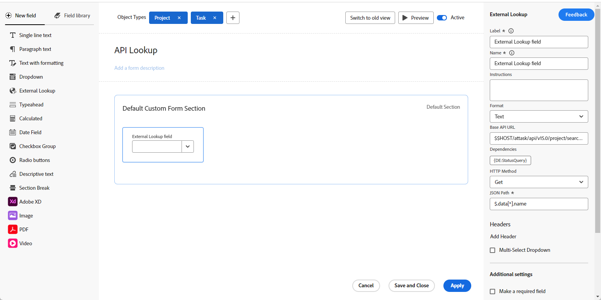

# Exemplos do campo de pesquisa externa em um formulário personalizado

Um campo de pesquisa externo em um formulário personalizado chama uma API externa e retorna valores como opções em um campo suspenso. Os usuários que trabalham com o objeto ao qual o formulário personalizado está anexado podem selecionar uma ou mais dessas opções na lista suspensa.

This article provides examples of using the External lookup field to call the same instance of Workfront or a public API. You can also use the External lookup to communicate with an external system such as Jira, Salesforce, or ServiceNow.

For more information about adding an External lookup field to a custom form and additional definitions of the external lookup components, see [Create a custom form](/help/quicksilver/administration-and-setup/customize-workfront/create-manage-custom-forms/form-designer/design-a-form/design-a-form.md).

## Set up an External lookup field for the same instance of Workfront

You can use the External lookup to bring data from your Workfront instance into the custom form.

### Usar valores de campo nativos do Workfront na pesquisa externa

Este exemplo demonstra como chamar a API do Workfront e preencher uma lista de projetos em um campo de Pesquisa externa, filtrado por status usando o valor do campo personalizado &quot;Consulta de status&quot; e um termo de pesquisa por meio de $$QUERY.

1. Abra o formulário personalizado.
1. No lado esquerdo da tela, encontre **Pesquisa externa** e arraste-a para uma seção da tela.
1. Insira o **Rótulo** e o **Nome** do campo.
1. Selecione o **Formato** para o campo.
1. Insira a chamada de API no campo **URL da API base**.

   * Use $$HOST para fazer referência à mesma instância do Workfront em que o formulário personalizado está.
   * Use $$QUERY para filtrar dinamicamente os resultados com base na entrada do usuário.

   **Exemplo de chamada de API**
   `$$HOST/attask/api/v15.0/project/search?status={DE:Status Query}&description=$$QUERY`

1. Revise as **Dependências** para os campos referenciados na chamada de API.

   Um campo de dependência pode ser qualquer campo personalizado ou nativo disponível no objeto. Por exemplo, ao criar um formulário personalizado para grupos que inclui um campo de pesquisa externo, os campos de dependência podem incluir quaisquer campos disponíveis em um grupo.

   Neste exemplo, `{DE:Status Query}` será substituído dinamicamente pelo valor do campo personalizado &quot;Consulta de status&quot; para o grupo atual. Assim, quando o formulário é anexado ao Grupo A, `{DE:Status Query}` é substituído pelo valor definido no campo &quot;Consulta de status&quot; para esse grupo.

1. Selecione o **Método HTTP**.

   Isto provavelmente será **Obter**.

1. Insira o **Caminho JSON** para obter os resultados da sua chamada à API.

   **Exemplo**
   `$.data[*].name`

   >[!NOTE]
   >
   >As informações do **Cabeçalho** não são necessárias para uma chamada para a mesma instância do Workfront.

1. Clique em **Aplicar**.

   

   Quando o formulário personalizado é adicionado a um objeto do Workfront (neste exemplo, um projeto), ele é semelhante a este.

   

   

### Usar valores de campo personalizado na pesquisa externa

This example shows you to call the Workfront API and bring data from a custom field into your External lookup field. The example custom field is called &quot;Custom Colors.&quot;

1. Abra o formulário personalizado.
1. No lado esquerdo da tela, encontre **Pesquisa externa** e arraste-a para uma seção da tela.
1. Insira o **Rótulo** e o **Nome** do campo.
1. Selecione o **Formato** para o campo.
1. Insira a chamada da URL da API no campo **URL da API de base**.

   **Exemplo**
   `$$HOST/attask/api/v18.0/PORT/search?ID={portfolioID}&fields=parameterValues`

1. Revise as **Dependências** dos campos aos quais este campo de pesquisa faz referência na API.

   Um campo de dependência pode ser qualquer campo personalizado ou nativo existente na página de detalhes do objeto.

1. Selecione o **Método HTTP**.

   Isto provavelmente será **Obter**.

1. Insira o **Caminho JSON** para obter os resultados da sua chamada à API.

   **Exemplo**
   `$.data[*].parameterValues.["DE:Combo Colors"]`

   * &quot;parameterValues&quot; refere-se a qualquer campo personalizado no Workfront para o objeto em que você está.
   * Neste exemplo, &quot;DE:Combo Colors&quot; é o campo personalizado específico que contém os valores que você deseja recuperar.

   >[!NOTE]
   >
   >As informações do **Cabeçalho** não são necessárias para uma chamada para a mesma instância do Workfront.

1. Clique em **Aplicar**.

   Quando o formulário personalizado é adicionado a um objeto do Workfront, todos os valores do campo &quot;Cores de combinação&quot; são exibidos na lista suspensa do campo Pesquisa externa.

## Configurar um campo de pesquisa externo para a API do Workfront Planning

Um endpoint está disponível na API do Workfront Planning para pesquisar registros por ID de tipo de registro por meio do método Get. Você pode usar esse endpoint para fazer referência a registros do Planning em campos de pesquisa Externos.

* URL da API de **Base:** `$$HOST/maestro/api/v1/records/search?recordTypeId={recordTypeID}`
* **Método HTTP:** Get
* **Caminho JSON:** `$.records[*].data.{fieldID}`

  **{fieldID}** é o campo a ser exibido nos resultados da pesquisa de pesquisa externa no formulário personalizado para usuários finais.

Para obter mais informações, consulte [API do Workfront Planning](/help/quicksilver/planning/general/planning-api-basics.md).

## Set up an External lookup field for a public API

Você pode usar a pesquisa externa para chamar uma API externa e pública e recuperar dados.

Este exemplo mostra como chamar uma API de países (como <https://api.first.org/data/v1/countries>) para que você não precise codificar todos os nomes de países nas opções suspensas.

1. Abra o formulário personalizado.
1. No lado esquerdo da tela, encontre **Pesquisa externa** e arraste-a para uma seção da tela.
1. Insira o **Rótulo** e o **Nome** do campo.
1. Selecione o **Formato** para o campo.
1. Insira a chamada da URL da API no campo **URL da API de base**.

   * You can add $$QUERY to implement query filtering for your end users.

   **Examples**
Lista todos os países: <https://api.first.org/data/v1/countries>

   Permite que o usuário pesquise por qualquer país no campo suspenso: <https://api.first.org/data/v1/countries?q=$$QUERY>

   Permite que o usuário procure por um país em uma região: <https://api.first.org/data/v1/countries?region={DE:Region}&q=$$QUERY>

   * As regiões disponíveis são definidas em um campo personalizado separado no Workfront.
   * Quando o usuário seleciona uma região no formulário, o campo Pesquisa externa mostra apenas os países dessa região (qual país está em qual região está definida na API). O usuário também pode pesquisar por um país na região selecionada.

1. Revise as **Dependências** dos campos aos quais este campo de pesquisa faz referência na API.

   Um campo de dependência pode ser qualquer campo personalizado ou nativo existente na página de detalhes do objeto.

   Neste exemplo, o `{DE:Region}` será substituído pelo valor do campo personalizado Região.

1. Selecione o **Método HTTP**.

   Isto provavelmente será **Obter**.

1. Insira o **Caminho JSON** para obter os resultados da sua chamada à API.

   Essa opção permite extrair dados do JSON retornado pelo URL da API. Ela serve como uma maneira de selecionar quais valores dentro do JSON aparecerão nas opções suspensas.

   **Exemplo**
   `$.data[*].country`

1. (Opcional) Clique em **Adicionar cabeçalho** e digite ou cole o par de valores chave necessário para autenticação com a API.

   >[!NOTE]
   >
   >Os campos de Cabeçalho não são um local seguro para armazenar credenciais, e você deve ter cuidado com o que digitar e salvar.

1. (Opcional) Selecione **Seleção múltipla** para permitir que o usuário selecione mais de um valor na lista suspensa.

1. Clique em **Aplicar**.

   

   Quando o formulário personalizado é adicionado a um objeto do Workfront (neste exemplo, um projeto), ele é semelhante a este.

   

   

## Casos de uso adicionais para campos de pesquisa externos

Há muitos outros casos de uso para criar uma pesquisa externa.

**Caso de uso:** substitua os campos de digitação antecipada, pois eles podem causar problemas nos relatórios.
**Solução:** use uma chamada de API para objetos existentes no sistema.

Exemplo de URL da API base para modelos, para substituir um campo de digitação antecipada:
`$$HOST/attask/api/v17.0/tmpl/search?isActive=true&name_Sort=asc`

**Caso de uso:** crie campos suspensos com mais recursos (por exemplo, há quebra automática de linha no campo Pesquisa externa).
**Solução:** use uma chamada de API para objetos existentes no sistema ou crie um novo objeto e use uma chamada de API para esse objeto.

**Caso de uso:** defina uma maneira para os usuários manterem seus próprios campos fora da área de formulários personalizados. Configure o campo Pesquisa externa e forneça aos usuários os objetos que compõem o campo. Essa opção é boa para campos e equipes de alta manutenção.
**Solução:** crie um novo objeto e use uma chamada de API para esse objeto.

**Caso de uso:** Integração com objetos fora do Workfront. Por exemplo, acessar outro sistema para obter o nome de cada usuário, em vez de ser restrito em um campo de digitação antecipada.
**Solução:** automação do Webhook/Fusion para conexão com outros sistemas.

