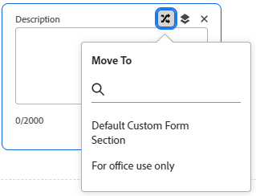

# Organizar e visualizar um formulário

{{highlighted-preview}}

Você pode organizar um formulário personalizado com o designer do formulário e visualizá-lo para verificar se ele está configurado corretamente.

## Requisitos de acesso

+++ Expanda para visualizar os requisitos de acesso para a funcionalidade neste artigo.

Você deve ter o seguinte para executar as etapas deste artigo:

<table style="table-layout:auto"> 
 <col> 
 <col> 
 <tbody> 
  <tr data-mc-conditions=""> 
   <td role="rowheader"> 
plano do Adobe Workfront
 </td> 
   <td>Qualquer</td> 
  </tr> 
  <tr> 
   <td role="rowheader">Licença do Adobe Workfront</td> 
   <td>
   
Novo: Padrão

   
ou

   
Atual: Plano
</td>
  </tr> 
  <tr data-mc-conditions=""> 
   <td role="rowheader">Configurações de nível de acesso</td> 
   <td> 
Acesso administrativo a formulários personalizados
 </td> 
  </tr> 
 </tbody> 
</table>

Para obter mais detalhes sobre as informações nesta tabela, consulte [Requisitos de acesso na documentação do Workfront](/help/quicksilver/administration-and-setup/add-users/access-levels-and-object-permissions/access-level-requirements-in-documentation.md).

+++

## Adicionar uma quebra de seção

Você pode agrupar campos e widgets personalizados em um formulário personalizado em seções com cabeçalhos. Isso é útil para apresentar uma experiência organizada a usuários que preencherão o formulário. Além disso, se você precisar limitar o acesso a determinados campos e widgets personalizados a determinados usuários, poderá colocá-los em uma seção e conceder acesso à seção somente a esses usuários.

Por exemplo, se você precisar rastrear informações confidenciais que somente administradores do sistema devem poder exibir ou editar, poderá criar uma quebra de seção com permissões Somente de administrador e colocar os campos confidenciais nessa seção.

As configurações de acesso selecionadas para uma seção são vinculadas diretamente às permissões que os usuários têm no objeto do Workfront ao qual o formulário personalizado está anexado. Você pode ocultar ou mostrar uma seção com base no fato de o usuário ter acesso para exibir, contribuir ou gerenciar esse objeto. Ou você pode definir uma seção como Somente administrador para que somente usuários com um nível de acesso de administrador do sistema possam acessá-la.

Para obter informações sobre permissões em objetos, consulte [Visão geral das permissões de compartilhamento em objetos](/help/quicksilver/workfront-basics/grant-and-request-access-to-objects/sharing-permissions-on-objects-overview.md).

Para obter informações sobre campos e widgets personalizados em formulários personalizados, consulte [Criar um formulário personalizado](/help/quicksilver/administration-and-setup/customize-workfront/create-manage-custom-forms/form-designer/design-a-form/design-a-form.md).

### Criar e configurar o acesso para uma seção em um formulário personalizado

1. Comece a criar ou editar um formulário personalizado e adicionar campos, conforme descrito em [Criar um formulário personalizado](/help/quicksilver/administration-and-setup/customize-workfront/create-manage-custom-forms/form-designer/design-a-form/design-a-form.md).

1. Clique em **Quebra de seção** e arraste-a para a posição desejada na tela.

1. No painel direito, configure as opções desejadas para a seção:

   <table style="table-layout:auto"> 
    <col> 
    </col> 
    <col> 
    </col> 
    <tbody> 
     <tr> 
      <td role="rowheader">Rótulo</td> 
      <td> 
(Obrigatório) Digite um rótulo descritivo para exibir acima da seção. Você pode alterar o rótulo a qualquer momento.
 
<b>IMPORTANTE</b>: Evite usar caracteres especiais neste rótulo. Eles não são exibidos corretamente nos relatórios.
 </td> 
     </tr> 
     <tr> 
      <td role="rowheader">Descrição</td> 
      <td>Digite texto se quiser explicar aos usuários para que serve a seção. É exibido abaixo do rótulo da seção no formulário personalizado.</td> 
     </tr> 
     <tr> 
      <td role="rowheader"> 
Conceder acesso
 </td> 
      <td> 
 Selecione as permissões que os usuários precisam em um objeto ao qual o formulário personalizado está anexado para exibir esta seção e editar seus valores de campo. 
       
As seguintes permissões estão disponíveis em <b>Os usuários com este acesso ao objeto podem exibir os valores do campo</b>:
 
         <ul>
          <li><strong>Exibir</strong>: exibir permissões para o objeto</li>
          <li>
<b>Edição Limitada</b>: (Disponível somente se o objeto for um projeto, tarefa, problema ou usuário):
 
          
Permite que os usuários contribuam com o objeto se ele for um projeto, tarefa ou problema.

          
Permite que os usuários editem o perfil ou sejam proprietários da permissão de perfil para o objeto, se for um usuário.
</li> 
          <li><b>Editar</b>: gerenciar permissões para o objeto </li> 
          <li><b>Somente administrador</b>: nível de acesso de Administrador do Sistema</li> 
         </ul> </li> 
        
As seguintes permissões estão disponíveis em <b>Os usuários com este acesso ao objeto podem editar os valores dos campos</b>: 
 
         <ul> 
          <li> 
<b>Edição Limitada</b>: (Disponível somente se o objeto for um projeto, tarefa, problema ou usuário):
 
           
Se o objeto for um projeto, tarefa ou problema, essa permissão permitirá que os usuários contribuam para o objeto

          
Se o objeto for um usuário, essa permissão permitirá que os usuários editem o perfil ou sejam proprietários da permissão de perfil para o objeto.
 
          <li><b>Editar</b>: gerenciar permissões para o objeto </li> 
          <li><b>Somente administrador</b>: nível de acesso de Administrador do Sistema</li> 
         </ul> </li> 
       </ul> 
       
Para obter informações sobre permissões em objetos, consulte <a href="/help/quicksilver/workfront-basics/grant-and-request-access-to-objects/sharing-permissions-on-objects-overview.md" class="MCXref xref">Visão geral das permissões de compartilhamento em objetos</a>.
 
       
<b>NOTA</b>:  
       <ul> 
       <li> 
Os usuários sem as permissões especificadas aqui não podem ver os campos e widgets personalizados na seção. 
 
Isso também é verdadeiro se você exibir os valores dos campos nos relatórios ou usá-los em campos calculados nos relatórios do modo de texto.
 </li> 
       <li>
Para formulários personalizados de solicitação/ocorrência: se o acesso de Exibição for necessário para ver os campos na quebra de seção, mas o acesso de Administrador for necessário para editar os campos, a seção e todos os seus campos não estarão visíveis para não administradores quando eles preencherem o formulário. Depois que a solicitação é criada, os usuários com acesso de Visualização podem exibir os campos na seção.
</li>
       <li> 
Associar vários tipos de objeto ao seu formulário pode alterar as permissões de exibição e edição disponíveis nessas etapas. Para obter mais informações, consulte <a href="#how-multiple-object-types-can-affect-section-break-permissions-in-a-custom-form" class="MCXref xref">Como vários tipos de objeto podem afetar as permissões de quebra de seção em um formulário personalizado</a> neste artigo.
 </li> 
        </ul> 
 </td> 
     </tr> 
     <tr> 
      <td role="rowheader">
Adicionar Lógica
</td> 
      <td>
Use a lógica de exibição para especificar se a seção deve ser exibida no formulário, com base nas seleções que os usuários fazem em campos personalizados de múltipla escolha quando preenchem o formulário.

<strong>OBSERVAÇÃO:</strong> se todos os campos individuais em uma quebra de seção tiverem uma lógica de exibição aplicada a eles e todos estiverem ocultos como resultado da lógica, a seção inteira será ocultada no formulário personalizado. Isso ocorrerá mesmo se a lógica de exibição não for aplicada à quebra de seção.

Para obter mais informações, consulte <a href="/help/quicksilver/administration-and-setup/customize-workfront/create-manage-custom-forms/form-designer/design-a-form/display-skip-logic-form-designer.md" class="MCXref xref">Adicionar lógica de exibição e lógica de salto com o designer de formulário</a>.
</td> 
     </tr> 
    </tbody> 
   </table>

1. Arraste ou adicione pelo menos um campo ou widget personalizado à nova seção. Isso é necessário antes de salvar a seção.

1. Clique em **Concluído**.

   >[!TIP]
   >
   >Você pode clicar em **Aplicar** a qualquer momento enquanto estiver criando um formulário personalizado para salvar suas alterações e manter o formulário aberto.

### Como vários tipos de objeto podem afetar as permissões de quebra de seção {#how-multiple-object-types-can-affect-section-break-permissions-in-a-custom-form}

A permissão Edição limitada para quebras de seção de formulário personalizado está disponível somente para os tipos de objeto Projeto, Tarefa, Problema e Usuário.

Em um formulário personalizado com uma quebra de seção configurada com a permissão Edição limitada, se você adicionar um dos outros tipos de objeto ao formulário (Portfolio, Programa, Documento, Empresa, Registro de faturamento, Iteração, Despesa ou Grupo), será solicitado que você alterne para a permissão Editar, que é compatível tanto com esse tipo de objeto quanto com os tipos de objeto existentes no formulário.

>[!INFO]
>
>**Exemplo:** em um formulário personalizado associado ao tipo de objeto Projeto, uma quebra de seção é configurada com a permissão Edição Limitada.
>
>Você adiciona o tipo de objeto Portfolio ao formulário, o que significa que a opção de permissão Edição limitada não está mais disponível para a quebra de seção no formulário.
>
>Uma mensagem na tela solicita que você alterne para a permissão Editar, que é o nível mínimo de permissões compatíveis com o tipo de objeto Projeto e o tipo de objeto Portfolio.

## Posicionar campos e widgets personalizados em um formulário personalizado

1. Comece a criar ou editar um formulário personalizado, conforme descrito em [Criar um formulário personalizado](/help/quicksilver/administration-and-setup/customize-workfront/create-manage-custom-forms/form-designer/design-a-form/design-a-form.md).

1. Para posicionar campos e widgets personalizados na mesma linha, arraste um ao lado do outro até que uma linha apareça entre eles.

   >[!NOTE]
   >
   >* Você pode usar o botão **Visualizar** no canto superior direito para ter uma ideia de como os campos e widgets personalizados serão exibidos no formulário.
   >* Campos e widgets personalizados nem sempre podem ser exibidos da mesma maneira no formulário, dependendo de quanto espaço na tela está disponível quando um usuário o está visualizando. Por exemplo, o terceiro campo em uma linha de campos pode passar para a próxima linha de campos se o espaço horizontal for limitado.

1. (Opcional) Para posicionar um campo ou widget personalizado acima ou abaixo de outro, arraste-o para cima ou para baixo até que uma linha azul horizontal apareça entre os itens.

1. Para mover um campo personalizado para outra seção no formulário, você pode arrastá-lo e soltá-lo no local, ou clicar no ícone **Mover para** no campo e selecionar a seção para a qual movê-lo.

   Imagem de exemplo no ambiente de Visualização:
   

1. Para salvar as alterações, clique em **Aplicar**

   ou

   Clique em **Salvar e fechar**.

## Pré-visualizar um formulário personalizado

1. Comece a criar ou editar um formulário personalizado e adicionar campos, conforme descrito em [Criar um formulário personalizado](/help/quicksilver/administration-and-setup/customize-workfront/create-manage-custom-forms/form-designer/design-a-form/design-a-form.md).

1. Clique em **Visualizar** no canto superior direito para ver como o formulário será exibido quando estiver sendo usado e clique em **Finalizar Visualização** para retornar à edição do formulário.

