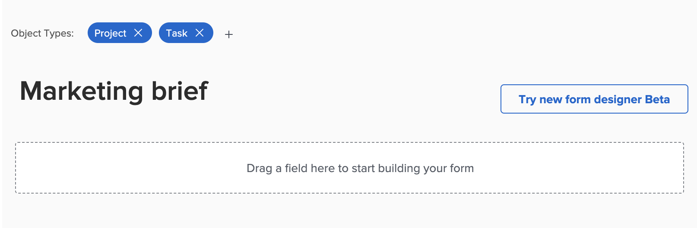

# Visão geral do designer do formulário

Você pode usar o novo designer de formulário para criar um formulário personalizado que os usuários podem anexar a um objeto do Workfront. Os usuários que trabalham no objeto podem preencher o formulário personalizado para fornecer informações sobre o objeto.

O novo designer de formulário tem um novo espaço de trabalho no estilo da tela de desenho que permite exibir os campos, a tela de desenho e as configurações de campo, tudo ao mesmo tempo. Ela também permite arrastar e soltar campos nas seções ao criar o formulário.

<!-- add screenshot when field settings empty state is ready -->

## Como acessar o novo designer de formulário

Há um novo botão na parte superior do novo designer de formulário e do construtor de formulários herdado. Você pode usar esse botão para alternar entre o construtor herdado e o novo designer.

## Nova funcionalidade disponível com o designer de formulário

Com o novo designer de formulários, adicionamos a capacidade de

* **Copiar um campo**: Agora é possível copiar campos existentes clicando no ícone Copiar nos campos diretamente da tela.

* **Alterar o tamanho para Texto descritivo**: agora é possível atribuir tamanhos pequeno, médio ou grande a campos de texto Descritivo. Também é possível usá-los na mesma linha com outros campos.

* **Usar uma seção padrão**: se o criador do formulário não tiver adicionado uma seção na parte superior do formulário, uma seção Padrão agora estará visível na tela, para que os usuários possam ajustar as permissões para campos que não tenham uma seção personalizada atribuída.

  >[!NOTE]
  >
  >A seção padrão não fica visível dentro dos objetos depois que o formulário é anexado ao objeto.

## Funcionalidade em breve

Os itens a seguir não estão disponíveis no momento no designer do formulário, mas serão adicionados em breve:

* Lógica de exibição/salto

* Filtro para campos de digitação antecipada

>[!IMPORTANT]
>
>As configurações existentes para filtros de lógica e digitação antecipada não serão afetadas ao trabalhar com o novo designer de formulário.

### Lógica de exibição/salto

Embora ainda não seja possível adicionar a lógica de exibição/salto ao criar um novo formulário personalizado, é possível exibir a lógica de exibição/salto existente nos formulários criados no construtor de formulários herdado.

Os ícones em um campo no designer do formulário indicam que a lógica é aplicada ao campo.

A variável  O ícone na parte inferior esquerda significa que o campo é o campo de destino da lógica de exibição (se uma seleção específica for feita no formulário, esse campo será exibido). A variável  O ícone na parte inferior direita significa que o campo é usado para definir a lógica de exibição (uma seleção ou um valor específico nesse campo exibirá o campo de destino).

A variável  O ícone na parte inferior esquerda significa que o campo é o campo de destino para a lógica de salto (se uma seleção específica for feita no formulário, o formulário pulará adiante para esse campo). A variável  O ícone na parte inferior direita significa que o campo é usado para definir a lógica de salto (uma seleção específica ou um valor neste campo ignorará outros campos e irá diretamente para o campo de destino).

Selecionar um campo com lógica aplicada exibe as regras de lógica existentes nas configurações do campo.

## Funcionalidade removida do designer do formulário

Removemos as seguintes funcionalidades do designer de formulário interno:

* Guias Configurações de formulário, Compartilhamento de formulários, Compartilhamento de campos

   * As configurações de formulário agora estão disponíveis na parte superior da tela

   * Guia principal Compartilhamento de formulário e subguia Compartilhamento de campo

  >[!NOTE]
  >
  >É possível controlar o compartilhamento de formulários e campos na guia Configurar > Forms personalizado > Forms ou Campos.

* Rastrear alterações de campo nos campos de atualização
  >[!NOTE]
  >
  >Você pode encontrar isso em Configuração > Interface > Feeds de atualização
