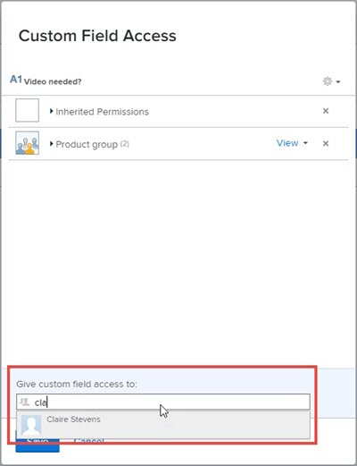

# Configurar compartilhamento para campos e widgets personalizados

Por padrão, quando você adiciona um novo campo ou widget personalizado a um formulário personalizado, qualquer pessoa no sistema com acesso a formulários personalizados pode editar as propriedades desse item, como rótulo e nome. Você pode alterar isso controlando com quem ele pode ser compartilhado.

Para obter informações sobre campos e widgets personalizados em formulários personalizados, consulte [Criar um formulário com o designer de formulário](/help/quicksilver/administration-and-setup/customize-workfront/create-manage-custom-forms/form-designer/design-a-form/design-a-form.md).

## Requisitos de acesso

+++ Expanda para visualizar os requisitos de acesso para a funcionalidade neste artigo.

Você deve ter o seguinte para executar as etapas deste artigo:

<table style="table-layout:auto"> 
 <col> 
 <col> 
 <tbody> 
  <tr data-mc-conditions=""> 
   <td role="rowheader"> 
plano do Adobe Workfront
 </td> 
   <td>Qualquer</td> 
  </tr> 
  <tr> 
   <td role="rowheader">Licença do Adobe Workfront</td> 
   <td>
   
Novo: Padrão

   
ou

   
Atual: Plano
</td>
  </tr> 
  <tr data-mc-conditions=""> 
   <td role="rowheader">Configurações de nível de acesso</td> 
   <td> 
Acesso administrativo a formulários personalizados
 </td> 
  </tr> 
 </tbody> 
</table>

Para obter mais detalhes sobre as informações nesta tabela, consulte [Requisitos de acesso na documentação do Workfront](/help/quicksilver/administration-and-setup/add-users/access-levels-and-object-permissions/access-level-requirements-in-documentation.md).

+++

## Configurar o compartilhamento de um campo ou widget personalizado da lista de formulários

{{step-1-to-setup}}

1. No painel esquerdo, clique em **Forms Personalizado**.
1. Clique em **Campos** para abrir a área Campos.
1. Selecione o item para o qual você deseja configurar o compartilhamento e clique em .
1. Na caixa Acesso de campo personalizado exibida, especifique com quem você deseja compartilhar o item e como deseja compartilhá-lo:

   1. Próximo ao canto inferior esquerdo da caixa **Acesso a Campo Personalizado**, em **Conceda acesso a campo personalizado a**, comece digitando o nome de um usuário, equipe, função de trabalho, grupo ou empresa com a qual deseja compartilhar o item e clique no nome quando ele aparecer.

      

   1. Se quiser ser mais específico sobre como compartilhar o item, clique na lista suspensa à direita do nome e use uma das seguintes opções:

      

      <table style="table-layout:auto"> 
       <col> 
       <col> 
       <tbody> 
        <tr> 
         <td role="rowheader">Visualizar o projeto</td> 
         <td> 
Você pode clicar em <strong>Configurações Avançadas</strong> para especificar se deseja que o usuário ou usuários possam usar seu acesso para adicionar o item a um formulário personalizado ou compartilhá-lo com outros usuários.
 </td> 
        </tr> 
        <tr> 
         <td role="rowheader">Gerenciar o projeto</td> 
         <td> 
Permite acesso para editar o campo personalizado e vê-lo na Biblioteca de campos e na página onde você cria formulários personalizados.
 
Você pode clicar em <strong>Configurações avançadas</strong> para especificar se deseja que o usuário ou usuários possam usar seu acesso para excluir o item do sistema ou compartilhá-lo com outros usuários.
 </td> 
        </tr> 
       </tbody> 
      </table>

1. (Opcional) Repita a etapa anterior para adicionar outros nomes à lista e configurar suas opções.
1. (Opcional) Clique no ícone de engrenagem  no canto superior direito se desejar escolher uma opção de compartilhamento em todo o sistema para o campo.

   Nem todas as opções a seguir são exibidas nesse menu suspenso ao mesmo tempo. Por exemplo, o segundo é exibido somente quando um dos outros dois é selecionado.

   * **Tornar isto editável em todo o sistema para que todos no Workfront possam editá-lo** (a opção padrão)

     Ao adicionar um campo ou widget personalizado e não limitar o compartilhamento, todos os usuários no sistema que têm acesso a formulários personalizados podem visualizá-lo e editar suas propriedades.

   * **Remover acesso de edição em todo o sistema**

     Limita o acesso somente àqueles que você adicionou à lista.

   * **Tornar isto visível em todo o sistema para que todos no Workfront possam vê-lo**

1. Clique em **Salvar**.

## Configurar o compartilhamento de um campo ou widget personalizado no designer de formulário

{{step-1-to-setup}}

1. No painel esquerdo, clique em **Forms Personalizado**.
1. Abra um formulário personalizado ou crie um novo formulário personalizado.
1. No designer do formulário, selecione o item para o qual você deseja configurar o compartilhamento e clique em **Compartilhar** na área de edição de campos à direita.
1. Na caixa exibida, em **Conceder acesso ao formulário personalizado**, comece digitando o nome do usuário, da equipe, da função de trabalho, do grupo ou da empresa com a qual deseja compartilhar o item e pressione **Enter** quando o nome for exibido.
1. Se quiser ser mais específico sobre como compartilhar o item, clique no menu suspenso à direita do nome e use uma das seguintes opções:

   <table style="table-layout:auto"> 
    <col> 
    <col> 
      <tbody> 
       <tr> 
        <td role="rowheader">Visualizar o projeto</td> 
        <td> 
Clique em <strong>Configurações avançadas</strong> para especificar se você deseja que os usuários possam adicionar o item a um formulário personalizado ou compartilhá-lo com outros usuários.
 </td> 
       </tr> 
       <tr> 
        <td role="rowheader">Gerenciar o projeto</td> 
        <td> 
Permite o acesso para editar o campo personalizado e visualizá-lo na Biblioteca de campos e no designer do formulário.
 
Clique em <strong>Configurações avançadas</strong> para especificar se você deseja que os usuários possam excluir o item do sistema ou compartilhá-lo com outros usuários.
 </td> 
       </tr> 
     </tbody> 
    </table>

1. (Opcional) Repita as etapas 5 a 6 para adicionar outros nomes à lista e configurar suas opções.
1. (Opcional) Escolha uma opção de compartilhamento em todo o sistema para o campo:

   * **Todos no sistema podem editar** (a opção padrão)

     Ao adicionar um campo ou widget personalizado e não limitar o compartilhamento, todos os usuários no sistema que têm acesso a formulários personalizados podem visualizá-lo e editar suas propriedades.

   * **Todos no sistema podem visualizar**
   * **Somente pessoas convidadas podem acessar**

     Limita o acesso somente àqueles que você adicionou à lista.

   

1. Clique em **Salvar**.

## Acesso herdado a campos e widgets personalizados quando um formulário personalizado é compartilhado

Quando alguém compartilha um formulário personalizado com um grupo, função de trabalho, equipe ou empresa, os recipients herdam o acesso de Visualização a quaisquer campos e widgets personalizados que estejam no formulário. Esse nível de acesso a esses itens no formulário é sempre retido para que o formulário possa funcionar para os recipients conforme pretendido pela pessoa que o criou. Isso é verdade mesmo para recipients que têm acesso para Editar ao formulário.

Você pode descobrir quem herdou acesso a um campo ou widget personalizado e remover o acesso a ele.

>[!NOTE]
>
>Se um recipient tiver Acesso de gerenciamento a um campo ou widget personalizado no formulário personalizado compartilhado, esse acesso será retido para o recipient.

### Descubra quem herdou acesso a um campo ou widget personalizado {#find-out-who-has-inherited-access-to-a-custom-field-or-widget}

{{step-1-to-setup}}

1. No painel esquerdo, clique em **Forms Personalizado**.
1. Clique em **Campos** e selecione o campo, a imagem ou o widget de acesso.
1. Na caixa exibida, clique em **Permissões Herdadas** e exiba os nomes exibidos.
1. Clique em **Cancelar**.

### Remover o acesso a um campo ou widget personalizado em um formulário personalizado que foi compartilhado {#remove-access-to-a-custom-field-or-widget-in-a-custom-form-that-was-shared}

Se você precisar remover o acesso a um campo ou widget personalizado em um formulário personalizado que foi compartilhado, será necessário cancelar o compartilhamento do formulário. Para obter instruções, consulte a seção [Remover acesso a um formulário personalizado](/help/quicksilver/administration-and-setup/customize-workfront/create-manage-custom-forms/share-access-to-a-custom-form.md#remove-access-to-a-custom-form-from-the-list-of-forms) no artigo [Compartilhar um formulário personalizado](/help/quicksilver/administration-and-setup/customize-workfront/create-manage-custom-forms/share-access-to-a-custom-form.md).
