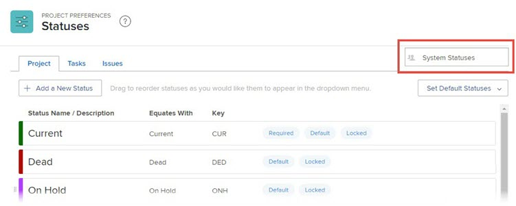

# Criar ou editar um status

<!--DON'T DELETE, DRAFT OR HIDE THIS ARTICLE. IT IS LINKED TO THE PRODUCT THROUGH CONTEXT SENSITIVE HELP LINKS.-->

Como administrador do Adobe Workfront, você pode criar status personalizados para projetos, tarefas e problemas. Eles podem ser para usuários em todo o sistema Workfront ou para grupos ou subgrupos específicos. Para obter mais informações sobre status, consulte [Visão geral dos status](../../../administration-and-setup/customize-workfront/creating-custom-status-and-priority-labels/statuses-overview.md).

>[!NOTE]
>
>Os administradores de grupo também podem criar seus próprios status de grupo, para uso somente por seus grupos. Para obter mais informações, consulte [Criar ou editar um status de grupo](../../../administration-and-setup/manage-groups/manage-group-statuses/create-or-edit-a-group-status.md).

## Requisitos de acesso

Você deve ter o seguinte acesso para executar as etapas neste artigo:

<table style="table-layout:auto"> 
 <col> 
 <col> 
 <tbody> 
  <tr> 
   <td role="rowheader">Plano Adobe Workfront</td> 
   <td>Qualquer Um</td> 
  </tr> 
  <tr> 
   <td role="rowheader">Licença Adobe Workfront</td> 
   <td>Plano</td> 
  </tr> 
  <tr> 
   <td role="rowheader">Configurações de nível de acesso</td> 
   <td> 
Você deve ser um administrador do Workfront.
 
<b>OBSERVAÇÃO</b>: Caso ainda não tenha acesso, pergunte ao administrador do Workfront se ele definiu restrições adicionais em seu nível de acesso. Para obter informações sobre como um administrador do Workfront pode modificar seu nível de acesso, consulte <a href="../../../administration-and-setup/add-users/configure-and-grant-access/create-modify-access-levels.md" class="MCXref xref">Criar ou modificar níveis de acesso personalizados</a>.
 </td> 
  </tr> 
 </tbody> 
</table>

## Criar ou editar um status personalizado

Você pode adicionar um status personalizado para usar por toda a organização ou por um único grupo.

Ao criar um status personalizado para toda a organização, você pode configurá-la para que todos os grupos no sistema possam usá-la sem editá-la. Ou você pode configurá-lo para que os administradores de grupo possam modificá-lo para seus grupos, como explicado em [Criar ou editar um status de grupo](../../../administration-and-setup/manage-groups/manage-group-statuses/create-or-edit-a-group-status.md).

1. Clique no botão **Menu principal** ícone  no canto superior direito do Adobe Workfront, em seguida, clique em **Configuração** .

1. No painel esquerdo, clique em **Preferências do projeto** > **Status**.

1. (Condicional) Se você estiver criando ou editando um status para uso em todo o sistema, verifique se **Status do sistema** está selecionada na caixa no canto superior direito.

   

   Ou

   Se o status for para um grupo ou subgrupo, comece a digitar o nome do grupo no canto superior direito e selecione-o quando aparecer.

   

1. Selecione a guia do tipo de objeto (**Projeto**, **Tarefas** ou **Problemas**) que você deseja associar ao status.

1. Se você estiver criando um novo status, clique em **Adicionar um novo status**.

   Ou

   Se você estiver editando um status existente, passe o mouse sobre ele e clique no botão **Editar** ícone que é exibido na extremidade direita.

   

1. Configure o status usando as seguintes opções:

   <table style="table-layout:auto"> 
    <col> 
    <col> 
    <tbody> 
     <tr> 
      <td role="rowheader">Nome do status</td> 
      <td> 
Digite um nome para o status. Este campo é obrigatório.
 
Ao criar um nome de status, esteja ciente de que outros usuários no sistema podem criar um status com o mesmo nome. Recomendamos usar um nome exclusivo para evitar confusão ao selecionar status no Workfront.
 </td> 
     </tr> 
     <tr> 
      <td role="rowheader">Descrição</td> 
      <td>(Opcional) Digite uma descrição do status. Isto comunica o seu objetivo a quem o utiliza.</td> 
     </tr> 
     <tr> 
      <td role="rowheader">Cor</td> 
      <td> 
Personalize a cor do status clicando no campo de cor e selecionando uma cor no painel de amostra. Também é possível inserir um número hexadecimal no campo .
 
A cor do status é exibida no canto superior direito do Workfront quando um usuário exibe o objeto.
  
 </td> 
     </tr> 
     <tr> 
      <td role="rowheader">Correspondente</td> 
      <td> 
Selecione uma das opções na lista que melhor descreve a função do status. Por exemplo, se o nome do status for Concluído, a opção com a qual ele equivale deve ser Concluído.
 
Cada status deve ser igual a uma dessas opções, pois isso determina como o status funciona.
 
Essa opção não pode ser modificada após a criação do status.
 </td> 
     </tr> 
     <tr> 
      <td role="rowheader">Chave</td> 
      <td> 
Se estiver criando um novo status, digite um código ou abreviação para o status ou use o que foi gerado para você. Essa chave deve ser exclusiva no Workfront, pois pode ser usada para fins de relatório. Se você tentar especificar uma chave que já está sendo usada no sistema, o campo ficará vermelho.
 
Pode ser útil usar uma abreviação que seja reconhecível para aqueles que a usarão.
 
Essa opção não pode ser modificada após a criação do status.
 
Não é possível alterar o código de chave dos status Planejamento, Atual e Concluído. Isso é importante se você estiver criando um relatório no modo de texto.
 </td> 
     </tr> 
     <tr> 
      <td role="rowheader">Ocultar Status</td> 
      <td> 
(Status do projeto e da tarefa somente)
 
Ative essa opção se desejar que o status fique oculto dos usuários. Quando estiver desativado (a configuração padrão), todos os usuários do sistema poderão usar o status .
 
É possível ocultar um status de Ocorrência desativando todos os quatro tipos de problema (Relatório de erros, Pedido de alteração, Ocorrência, Solicitação).
 </td> 
     </tr> 
     <tr> 
      <td role="rowheader">Bloquear para todos os grupos</td> 
      <td>
       
Quando um status é bloqueado, os usuários em todo o sistema podem vê-lo e usá-lo, e os administradores de grupo não podem personalizá-lo para seus grupos.
 
       
Quando um status é desbloqueado, os administradores de grupo podem personalizá-lo para seus grupos individuais.

   

       
Você pode usar os status bloqueado e desbloqueado em um processo de aprovação do sistema. Se você criar um processo de aprovação do sistema com um status de sistema desbloqueado, os usuários em todo o sistema poderão anexar o processo de aprovação a qualquer projeto, tarefa ou problema no sistema.

       
 Nos seguintes cenários, mensagens de aviso são exibidas para ajudar você e seus usuários a entender os resultados da desbloqueio de um status:

       <ul>
       <li>Um administrador desbloqueia um status de nível de sistema usado em um processo de aprovação. Uma mensagem avisa que pode excluir o status desbloqueado de seus grupos, o que impediria que os membros do grupo usassem esse processo de aprovação corretamente para objetos atribuídos ao grupo.</li>
       <li>Um usuário começa a editar um processo de aprovação que usa um status desbloqueado. Uma mensagem alerta o usuário sobre o status desbloqueado para que ele possa avaliar se seria uma boa ideia rebloqueá-lo ou substituí-lo.</li>
       <li>Um processo de aprovação no nível do sistema com um status desbloqueado é anexado em um objeto e o status foi excluído para o grupo atribuído ao objeto. Quando um membro do grupo vai para a seção Aprovações do objeto, uma mensagem explica que o processo de aprovação não pode ser iniciado para o objeto.</li>
       </ul>
       
Para obter mais informações sobre o bloqueio de status, consulte <a href="../../../administration-and-setup/customize-workfront/creating-custom-status-and-priority-labels/lock-or-unlock-a-custom-system-level-status.md" class="MCXref xref">Status de nível de sistema bloqueados e desbloqueados</a>.

       

      </td>
     </tr> 
    </tbody> 
   </table>

1. Clique em **Salvar**.

   Para obter instruções sobre como tornar esse status um status padrão, consulte [Usar status personalizados como status padrão](../../../administration-and-setup/customize-workfront/creating-custom-status-and-priority-labels/use-custom-statuses-as-default-statuses.md).

Para obter informações sobre a reordenação de status de grupo, consulte [Reordenar os status do sistema e do grupo](../../../administration-and-setup/customize-workfront/creating-custom-status-and-priority-labels/reorder-system-statuses.md).
