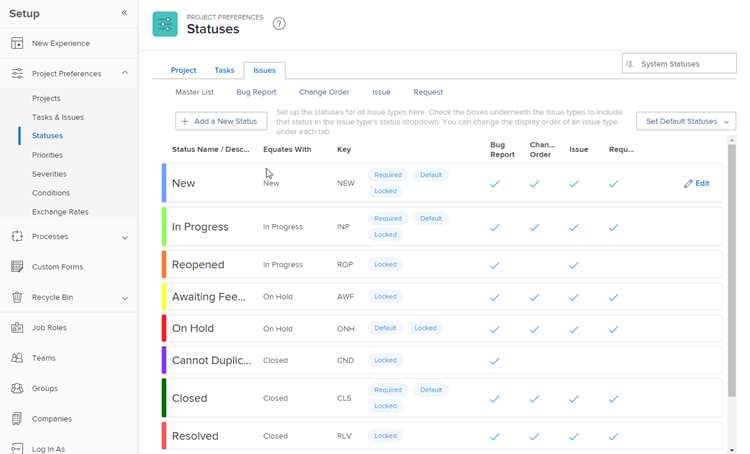

# Acessar a lista de status de problemas do sistema

Você pode usar o status de um problema para mostrar aos usuários no sistema em que estágio de desenvolvimento um problema está em um determinado momento.

## Requisitos de acesso

+++ Expanda para visualizar os requisitos de acesso para a funcionalidade neste artigo.

Você deve ter o seguinte acesso para executar as etapas deste artigo:

<table style="table-layout:auto"> 
 <col> 
 <col> 
 <tbody> 
  <tr> 
   <td role="rowheader">plano do Adobe Workfront</td> 
   <td>Qualquer</td> 
  </tr> 
  <tr> 
  <tr> 
   <td role="rowheader">Licença do Adobe Workfront</td> 
   <td>
Novo: Padrão

       
Ou

       
Atual: Plano
</td>
  </tr> 
  </tr> 
  <tr> 
   <td role="rowheader">Configurações de nível de acesso</td> 
   <td>[!UICONTROL Administrador do Sistema]</td>
  </tr> 
 </tbody> 
</table>

Para obter mais detalhes sobre as informações nesta tabela, consulte [Requisitos de acesso na documentação do Workfront](/help/quicksilver/administration-and-setup/add-users/access-levels-and-object-permissions/access-level-requirements-in-documentation.md).

+++

## Acessar status de problemas

Você pode acessar e modificar status de problemas no nível do sistema. Você pode editar algumas informações sobre os status padrão do sistema ou criar novos status personalizados. Para obter mais informações sobre como criar status personalizados ou editar status do sistema, consulte [Criar ou editar um status](../../../administration-and-setup/customize-workfront/creating-custom-status-and-priority-labels/create-or-edit-a-status.md).

Para acessar os status de problemas no nível do sistema:

{{step-1-to-setup}}

1. Clique em **Preferências do projeto** > **Status**.

1. Clique na guia **Problemas** para ver os status de problemas disponíveis no Workfront.

   

## Status de problemas do sistema

O Workfront vem com 10 status de problema originais. Os primeiros 4 na tabela abaixo são obrigatórios, o que significa que você pode desbloqueá-los, renomeá-los e reordená-los, mas não pode ocultá-los ou excluí-los.

Você pode adicionar status de problema personalizados para atender às necessidades em sua organização. Para obter mais informações, consulte [Criar ou editar um status](../../../administration-and-setup/customize-workfront/creating-custom-status-and-priority-labels/create-or-edit-a-status.md).

Para usuários, alterar o status de um problema geralmente é um processo manual. No entanto, há situações, descritas na lista a seguir, em que o status de um problema muda automaticamente, dependendo de outros fatores que estão acontecendo no sistema.

Os seguintes status de problema são fornecidos com a instância do Workfront:

<table style="table-layout:auto"> 
 <col> 
 <col> 
 <col> 
 <thead> 
  <tr> 
   <th>Status de problema do sistema</th> 
   <th>Como você pode usar o status</th> 
   <th>O que acontece no status</th> 
  </tr> 
 </thead> 
 <tbody> 
  <tr> 
   <td>Novo (status obrigatório)</td> 
   <td>Esse é o status padrão para cada problema recém-criada.</td> 
   <td>Se a ocorrência estiver em um projeto com o status Atual, a ocorrência será exibida na guia Solicitações de trabalho dos usuários atribuídos à ocorrência. Os usuários agora podem começar a trabalhar no problema.</td> 
  </tr> 
  <tr> 
   <td>Em andamento (status obrigatório)</td> 
   <td> 
Você pode colocar um problema neste status para indicar que o trabalho naquele problema começou.
 
Se a resolução do problema estiver conectada a outro objeto (uma tarefa, projeto ou outro problema), o status do problema será alterado para Em andamento automaticamente, quando você alterar o status do objeto de resolução para Em andamento. 
 
Para obter mais informações sobre a resolução de objetos, consulte <a href="../../../manage-work/issues/convert-issues/resolving-and-resolvable-objects.md" class="MCXref xref">Visão Geral de Objetos Resolventes e Resolvíveis </a>.
 </td> 
   <td> 
Se o problema estiver em um projeto com o status Atual, o problema será exibido na guia Em execução dos usuários atribuídos ao problema.
 
Quando um problema está Em andamento, o problema mostra um valor para a Data de início real.
 
 
 </td> 
  </tr> 
  <tr> 
   <td>Fechado (status obrigatório)</td> 
   <td> 
Você pode marcar manualmente um problema como Fechado quando o trabalho nele estiver concluído. 
 
Se a resolução do problema estiver conectada a outro objeto (uma tarefa, projeto ou outro problema), o status do problema será alterado para Fechado automaticamente, quando você alterar o status do objeto de resolução para Fechado.
 
Para obter mais informações sobre a resolução de objetos, consulte <a href="../../../manage-work/issues/convert-issues/resolving-and-resolvable-objects.md" class="MCXref xref">Visão Geral de Objetos Resolventes e Resolvíveis </a>.
 </td> 
   <td> 
Quando uma ocorrência é Fechada, a ocorrência é removida da lista Trabalhando em do destinatário. Nesse caso, a ocorrência mostra um valor para a Data de conclusão real. 
 
Quando todas as tarefas são concluídas e os problemas são fechados em um projeto, o projeto pode ser concluído.
 </td> 
  </tr> 
  <tr> 
   <td>Em Espera (status obrigatório)</td> 
   <td> 
Você pode marcar manualmente uma ocorrência como Em espera, para indicar que houve um atraso na conclusão da ocorrência. 
 </td> 
   <td> 
Se o problema estiver em um projeto com o status Atual, o problema será exibido na guia Em execução dos usuários atribuídos ao problema. 
 
Quando todas as tarefas são concluídas em um projeto, mas há pelo menos um problema em espera no projeto, o projeto não pode ser concluído. 
 </td> 
  </tr> 
  <tr> 
   <td>Reaberto (Igual a Em Andamento)</td> 
   <td> 
Você pode colocar um problema neste status para indicar que o trabalho naquele problema não foi totalmente concluído quando o problema foi fechado anteriormente e que ele precisava ser reaberto para concluir o trabalho.
 </td> 
   <td> 
Se a ocorrência estiver em um projeto com o status Atual, a ocorrência será exibida na guia Solicitações de trabalho dos usuários atribuídos à ocorrência. Os usuários agora podem começar a trabalhar no problema.
 
Esse status é importante nos relatórios para diferenciar entre problemas que estão abertos pela primeira vez (geralmente no status Novo ) e problemas que estão abertos depois de terem sido fechados antes (geralmente no status Reaberto ). 
 </td> 
  </tr> 
  <tr> 
   <td>Aguardando feedback (Equivale a Em espera)</td> 
   <td>Você pode colocar um problema neste status para indicar que está aguardando feedback (normalmente do contato principal) antes de continuar trabalhando no problema. </td> 
   <td> 
Se o problema estiver em um projeto com o status Atual, o problema será exibido na guia Em execução dos usuários atribuídos ao problema.
 
Se um problema estiver Aguardando feedback, um projeto não poderá ser concluído.
 
Esse status é importante nos relatórios para diferenciar entre problemas que estão atualmente abertos, mas sendo trabalhados (geralmente no status Em andamento) e problemas que estão atualmente abertos, mas não sendo trabalhados, porque é necessário mais feedback para concluí-los (geralmente no status Aguardando feedback).
 </td> 
  </tr> 
  <tr> 
   <td>Não é Possível Duplicar (Equivale a Fechado)</td> 
   <td>Você pode colocar um problema neste status para indicar que está fechando o problema, mas não pode ver o problema que acionou a abertura do problema. O problema ainda pode existir, mas não pode ser replicado em um determinado momento. </td> 
   <td> 
Esse status é importante nos relatórios para diferenciar entre problemas que estão concluídos e cujo problema foi abordado (geralmente no status Fechado) e problemas cujo problema não está visível em um determinado momento (geralmente no status Não é possível duplicar).
 
Quando um problema é marcado como Não é possível duplicar, o problema é removido da lista de Trabalho em do destinatário. Nesse caso, a ocorrência mostra um valor para a Data de conclusão real.
 
Se todas as tarefas em um projeto forem concluídas e alguns problemas estiverem no status Não é Possível Duplicar, o projeto poderá ser concluído.
 </td> 
  </tr> 
  <tr> 
   <td>Resolvido (Equivale a Fechado)</td> 
   <td>Você pode colocar um problema neste status para indicar que está fechando o problema e que o problema que o criou foi realmente resolvido.</td> 
   <td> 
Esse status é importante nos relatórios para diferenciar entre problemas que são fechados com ou sem uma resolução (geralmente no status Fechado) e problemas que são fechados com uma resolução real (geralmente no status Resolvido).
 
Quando um problema é marcado como Resolvido, ele é removido da lista Trabalhar em do destinatário. Nesse caso, a ocorrência mostra um valor para a Data de conclusão real.
 
Se todas as tarefas em um projeto forem concluídas e pelo menos um problema estiver no status Resolvido, o projeto poderá ser concluído. 
 </td> 
  </tr> 
  <tr> 
   <td>Verificação Concluída (Equivalente a Fechada)</td> 
   <td>Você pode colocar um problema neste status para indicar que está fechando o problema e que verificou que o problema que gerou o problema foi resolvido.</td> 
   <td> 
Quando um problema é marcado como Concluído verificado, o problema é removido da lista Trabalhando em do destinatário. Nesse caso, a ocorrência mostra um valor para a Data de conclusão real.
 
Se todas as tarefas em um projeto forem concluídas e alguns problemas estiverem no status Verificado concluído, o projeto pode ser concluído.
 </td> 
  </tr> 
  <tr> 
   <td>Não Resolvido (Equivale a Fechado)</td> 
   <td>Você pode colocar um problema neste status para indicar que está fechando o problema, mas o problema que o gerou não pode ser resolvido.</td> 
   <td> 
Esse status é importante nos relatórios para diferenciar entre problemas que são fechadas com ou sem uma resolução (geralmente no status Fechado) e problemas que são fechadas sem uma resolução real (geralmente no status Não resolverá).
 
Quando um problema é marcado como Não resolverá, o problema é removido da lista Trabalhar em. do destinatário. Nesse caso, a ocorrência mostra um valor para a Data de conclusão real.
 
Se todas as tarefas em um projeto forem concluídas e pelo menos um problema estiver no status Não será resolvido, o projeto pode ser concluído.
 </td> 
  </tr> 
 </tbody> 
</table>

## Personalizar status de problemas

Um administrador do Workfront pode adicionar status de problemas no nível do sistema e do grupo ao Workfront e alterar a ordem em que os usuários os veem. Para obter mais informações, consulte [Criar ou editar um status](../../../administration-and-setup/customize-workfront/creating-custom-status-and-priority-labels/create-or-edit-a-status.md).

Um administrador de grupo pode adicionar um status personalizado específico a um grupo. Para obter mais informações, consulte [Criar ou editar o status de um grupo](../../../administration-and-setup/manage-groups/manage-group-statuses/create-or-edit-a-group-status.md).
