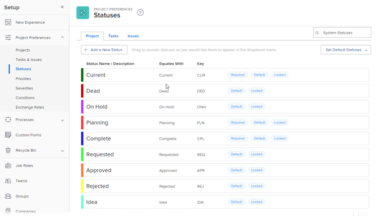

# Acessar a lista de status de projeto do sistema

Os usuários podem especificar o status de um projeto para que outros usuários possam ver o estágio atual de desenvolvimento do projeto em um determinado momento.

O Workfront vem com 9 status de projeto de sistema. Você pode alterar o nome desses status, mas não pode excluí-los.

Você também pode adicionar status de projeto personalizados para atender às necessidades em sua organização.

Como administrador do Workfront, você configura o status padrão para todos os novos projetos no sistema. Para obter instruções, consulte [Configurar preferências de projeto do sistema](../../../administration-and-setup/set-up-workfront/configure-system-defaults/set-project-preferences.md).

## Requisitos de acesso

+++ Expanda para visualizar os requisitos de acesso da funcionalidade neste artigo.

<table style="table-layout:auto"> 
 <col> 
 <col> 
 <tbody> 
  <tr> 
   <td>Pacote do Adobe Workfront</td> 
   <td>
Qualquer
</td> 
  </tr> 
  <tr> 
   <td>Licença do Adobe Workfront</td> 
   <td>
Padrão

       
Plano
</td>
  </tr> 
  <tr> 
   <td>Configurações de nível de acesso</td> 
   <td>Administrador de sistema</td> 
  </tr> 
 </tbody> 
</table>

Para obter informações, consulte [Requisitos de acesso na documentação do Workfront](/help/quicksilver/administration-and-setup/add-users/access-levels-and-object-permissions/access-level-requirements-in-documentation.md).

+++

## Acessar os status do projeto

Como administrador do Workfront, você pode acessar a lista de status de projeto no nível do sistema.

Para obter informações sobre como editar um status do sistema e criar status personalizados, consulte [Criar ou editar um status](../../../administration-and-setup/customize-workfront/creating-custom-status-and-priority-labels/create-or-edit-a-status.md).

{{step-1-to-setup}}

1. Clique em **Preferências do projeto** > **Status**.

1. Clique na guia **Projeto**.

   Os status do projeto disponíveis no Workfront estão listados nesta guia.

   

   Para obter detalhes sobre cada status de projeto do sistema interno, consulte [Visão geral dos status de projeto do sistema](../../../administration-and-setup/customize-workfront/creating-custom-status-and-priority-labels/system-project-statuses.md).

## Criação de status de projeto personalizados e personalização dos status do sistema

Como administrador do Workfront, você pode adicionar status de projeto do sistema ao Workfront. Como proprietário de um grupo, você pode adicionar um status personalizado específico a um grupo. Para obter mais informações sobre como criar status personalizados ou editar os status do sistema, consulte [Criar ou editar um status](../../../administration-and-setup/customize-workfront/creating-custom-status-and-priority-labels/create-or-edit-a-status.md).

Ao criar um status de projeto personalizado, você deve sempre igualar o novo status a um status de sistema existente. Você deve entender o comportamento dos status do sistema para saber qual status é apropriado para igualar seu status personalizado. Após selecionar seu status de igual, essa seleção não pode ser alterada. Para obter mais informações sobre os status de projetos do sistema, consulte [Visão geral dos status de projetos do sistema](../../../administration-and-setup/customize-workfront/creating-custom-status-and-priority-labels/system-project-statuses.md).
