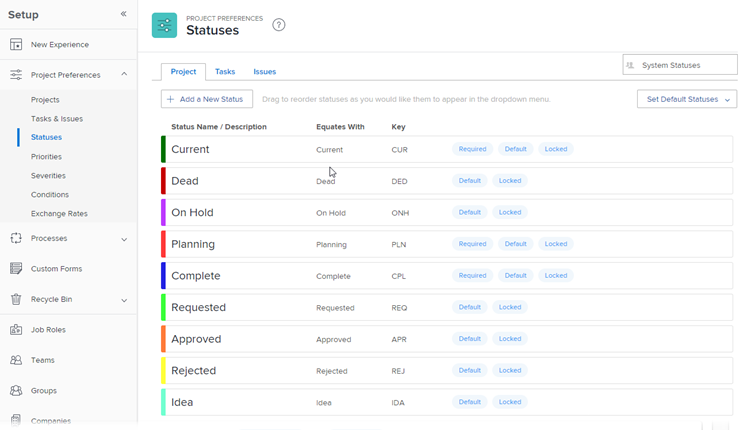

# Acessar a lista de status de projeto do sistema

Os usuários podem especificar o status de um projeto para que outros usuários possam ver o estágio atual de desenvolvimento do projeto em um determinado momento.

O Workfront vem com 9 status de projeto de sistema. Você pode alterar o nome desses status, mas não pode excluí-los.

Você também pode adicionar status de projeto personalizados para atender às necessidades em sua organização.

Como administrador do Workfront, você configura o status padrão para todos os novos projetos no sistema. Para obter instruções, consulte [Configurar preferências de projeto em todo o sistema](../../../administration-and-setup/set-up-workfront/configure-system-defaults/set-project-preferences.md).

## Requisitos de acesso

Você deve ter o seguinte acesso para executar as etapas deste artigo:

<table style="table-layout:auto"> 
 <col> 
 <col> 
 <tbody> 
  <tr> 
   <td role="rowheader">plano do Adobe Workfront</td> 
   <td>Qualquer</td> 
  </tr> 
  <tr> 
   <td role="rowheader">Licença do Adobe Workfront</td> 
   <td>Plano</td> 
  </tr> 
  <tr> 
   <td role="rowheader">Configurações de nível de acesso</td> 
   <td> 
Você deve ser um administrador do Workfront.
 
<b>NOTA</b>: se você ainda não tiver acesso, pergunte ao administrador do Workfront se ele definiu restrições adicionais em seu nível de acesso. Para obter informações sobre como um administrador do Workfront pode modificar seu nível de acesso, consulte <a href="../../../administration-and-setup/add-users/configure-and-grant-access/create-modify-access-levels.md" class="MCXref xref">Criar ou modificar níveis de acesso personalizados</a>.
 </td> 
  </tr> 
 </tbody> 
</table>

## Acessar os status do projeto

Como administrador do Workfront, você pode acessar a lista de status de projeto no nível do sistema.

Para obter informações sobre como editar um status do sistema e criar status personalizados, consulte [Criar ou editar um status](../../../administration-and-setup/customize-workfront/creating-custom-status-and-priority-labels/create-or-edit-a-status.md).

1. Clique em **Menu principal** ícone  no canto superior direito do Adobe Workfront e clique em **Configuração** .

1. Clique em **Preferências do projeto** > **Status**.

1. Clique em **Projeto** guia.

   Os status do projeto disponíveis no Workfront estão listados nesta guia.

   

   Para obter detalhes sobre cada status de projeto do sistema integrado, consulte [Visão geral dos status de projeto do sistema](../../../administration-and-setup/customize-workfront/creating-custom-status-and-priority-labels/system-project-statuses.md).

## Criação de status de projeto personalizados e personalização dos status do sistema

Como administrador do Workfront, você pode adicionar status de projeto do sistema ao Workfront. Como proprietário de um grupo, você pode adicionar um status personalizado específico a um grupo. Para obter mais informações sobre criação de status personalizados ou edição dos status do sistema, consulte [Criar ou editar um status](../../../administration-and-setup/customize-workfront/creating-custom-status-and-priority-labels/create-or-edit-a-status.md).

Ao criar um status de projeto personalizado, você deve sempre igualar o novo status a um status de sistema existente. Você deve entender o comportamento dos status do sistema para saber qual status é apropriado para igualar seu status personalizado. Após selecionar seu status de igual, essa seleção não pode ser alterada. Para obter mais informações sobre os status dos projetos do sistema, consulte [Visão geral dos status de projeto do sistema](../../../administration-and-setup/customize-workfront/creating-custom-status-and-priority-labels/system-project-statuses.md).
