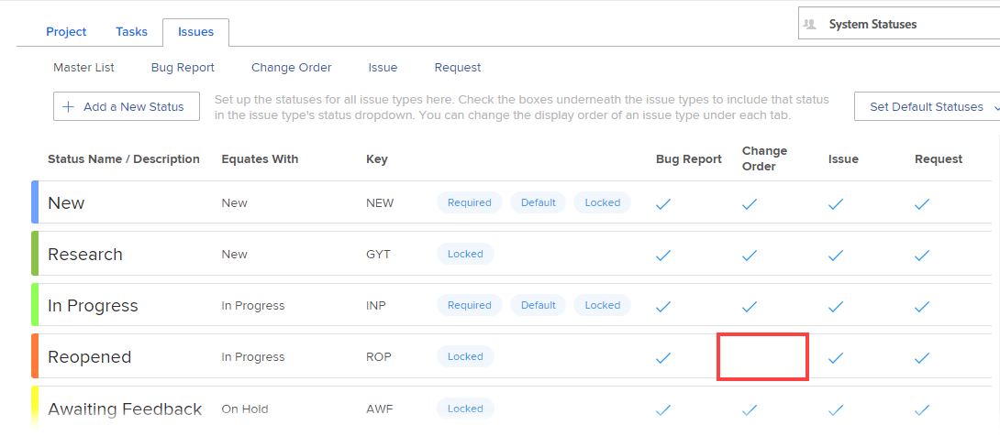

# Usar status personalizados como status padrão

Quando um status personalizado é definido como um status padrão, o novo status padrão é usado em todo o sistema de várias maneiras. A forma como ele é usado depende se é definido como um status padrão do nível do sistema ou um status padrão do nível do grupo.

## Requisitos de acesso

+++ Expanda para visualizar os requisitos de acesso para a funcionalidade neste artigo.

<table style="table-layout:auto"> 
 <col> 
 <col> 
 <tbody> 
  <tr> 
   <td>Pacote do Adobe Workfront</td> 
   <td>
Qualquer
</td> 
  </tr> 
  <tr> 
   <td>Licença do Adobe Workfront</td> 
   <td>
Standard

       
Plano
</td>
  </tr> 
  <tr> 
   <td>Configurações de nível de acesso</td> 
   <td>Administrador de Sistema</td> 
  </tr> 
 </tbody> 
</table>

Para obter informações, consulte [Requisitos de acesso na documentação do Workfront](/help/quicksilver/administration-and-setup/add-users/access-levels-and-object-permissions/access-level-requirements-in-documentation.md).

+++

## Status padrão personalizados no nível do sistema

Quando você define um status personalizado como um status de sistema padrão, todos os novos grupos criados no sistema herdam esse status.

Os grupos que já existiam quando você definiu o novo status padrão do sistema não o herdam automaticamente.

Por exemplo, suponha que já existam dois grupos criados em seu ambiente do Adobe Workfront (Marketing e Vendas). Você cria um novo status personalizado que equivale a Atual e chama o status de Em andamento. Agora você cria um novo grupo chamado Engenharia. Nesse cenário, o grupo de Engenharia herda o novo status padrão; os grupos de Marketing e Vendas não.

## Status padrão personalizados em nível de grupo

Um status personalizado que você define como um status de grupo padrão é usado nas seguintes circunstâncias:

* **Quando o sistema Workfront escolhe um status automaticamente, o status padrão do grupo é usado:** O status personalizado definido como o status padrão do grupo é usado quando o sistema Workfront atribui automaticamente um status a um objeto.

  Por exemplo, uma tarefa pode ser configurada para mudar automaticamente para o status Concluído quando a porcentagem concluída atingir 100%. Se você criar um status personalizado igual a Concluído e definir esse status como um status padrão, o Workfront alterará o status da tarefa para o novo status padrão.

  Status personalizados são usados dessa forma apenas com status de grupo associados a uma tarefa ou problema. Status personalizados não podem ser usados dessa forma para status associados a um projeto.

* O **status de um projeto é determinado pelo grupo associado ao projeto**: se o grupo associado a um determinado projeto for alterado, o status do projeto será alterado, dependendo dos status padrão definidos para o grupo. (Um grupo pode ser associado a um projeto por meio do campo Grupos ao editar o projeto.)

  Se esse grupo for alterado, o status do projeto será alterado se o novo grupo tiver um status padrão diferente definido que corresponda ao status atual do projeto.

  Por exemplo, um projeto pode ser associado ao grupo Marketing e o status do projeto é definido como Planning. O projeto é editado para ser associado ao grupo Vendas. O grupo Vendas tem um status de grupo padrão personalizado chamado Pensamento (e esse status equivale ao Planning). Como o Grupo no projeto foi alterado, o status do projeto agora muda para Thinking.

Se você for um administrador de grupo, consulte [Definir um status como um status padrão para um grupo](/help/quicksilver/administration-and-setup/manage-groups/manage-group-statuses/use-custom-statuses-as-default-statuses-group.md).

## Status de problemas

Se o status personalizado for um status de Problema, todos os quatro tipos de problemas deverão ser habilitados para ele (Relatório de erros, Pedido de alteração, Problema e Solicitação). Por exemplo, no status de ocorrência mostrado abaixo, o status Reaberto não pode ser usado como um status padrão porque o tipo de ocorrência de Pedido de alteração não está selecionado:

## Definir um status personalizado como status padrão

{{step-1-to-setup}}

1. No painel esquerdo, clique em **Preferências do projeto** > **Status**.
1. (Condicional) Se estiver definindo um status padrão para um grupo, comece digitando o nome do grupo no menu no canto superior direito e, em seguida, selecione-o quando ele for exibido.
1. Abra a guia **Projeto**, **Tarefas** ou **Problemas**, dependendo do tipo de status que você deseja definir como um status padrão.
1. Clique no menu suspenso **Definir status padrão**.
1. Na área suspensa que é exibida, ao lado do status em que você deseja definir o status padrão, selecione o status padrão desejado.
1. Clique em **Salvar**.
1. Associe o projeto ao grupo em que o status reside.

   >[!NOTE]
   >
   >Se você estiver definindo o status personalizado de um grupo e, posteriormente, atribuir o projeto a um grupo diferente, o status do projeto será recarregado e poderá ser alterado.

   1. Vá para o projeto em que deseja usar o status personalizado.
   1. Clique no ícone Mais  do menu e em **Editar**.
   1. Na caixa **Editar Projeto** que é exibida, no campo **Grupo** em **Associação de projeto**, selecione o grupo onde o status reside.
   1. Clique em **Salvar alterações**.
