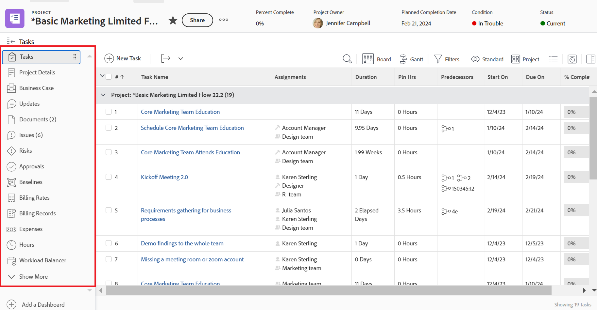

# Personalizar o painel esquerdo usando um modelo de layout

<!--Audited: 10/2024-->

Em um modelo de layout, você pode personalizar o que os usuários veem na área do painel esquerdo no [!DNL Adobe Workfront].

Por exemplo, você pode determinar qual dos seguintes itens os usuários veem no painel esquerdo ao visualizar uma tarefa:

>[!IMPORTANT]
>
>As alterações feitas no pedido e na visibilidade são refletidas no aplicativo móvel.

Para obter informações sobre como criar modelos de layout, consulte [Criar e gerenciar modelos de layout](../use-layout-templates/create-and-manage-layout-templates.md).

Para obter informações sobre modelos de layout para grupos, consulte [Criar e modificar modelos de layout de um grupo](../../../administration-and-setup/manage-groups/work-with-group-objects/create-and-modify-a-groups-layout-templates.md).

Após configurar um modelo de layout, você deve atribuí-lo aos usuários para que as alterações feitas fiquem visíveis para outros usuários. Para obter informações sobre como atribuir um modelo de layout aos usuários, consulte [Atribuir usuários a um modelo de layout](../use-layout-templates/assign-users-to-layout-template.md).

## Requisitos de acesso

+++ Expanda para visualizar os requisitos de acesso para a funcionalidade neste artigo.

Você deve ter o seguinte acesso para executar as etapas deste artigo:

<table style="table-layout:auto"> 
 <col> 
 <col> 
 <tbody> 
  <tr> 
   <td role="rowheader">plano do Adobe Workfront</td> 
   <td>
Qualquer

   
Adicionar aplicativos personalizados ao menu principal só está disponível para organizações licenciadas para o Adobe App Builder.
</td> 
  </tr> 
  <tr> 
   <td role="rowheader">Licença da Adobe Workfront*</td> 
   <td>
Novo: Padrão

  
 Atual: Plano

   </td> 
  </tr> 
  <tr> 
   <td role="rowheader">Configurações de nível de acesso</td> 
   <td> 
Para executar essas etapas no nível do sistema, você precisa do nível de acesso Administrador do sistema.
Para executá-las para um grupo, você deve ser um gerente desse grupo.
 </td> 
  </tr> 
 </tbody> 
</table>

*Para obter mais informações, consulte [Requisitos de acesso na documentação do Workfront](/help/quicksilver/administration-and-setup/add-users/access-levels-and-object-permissions/access-level-requirements-in-documentation.md).

+++

## Personalizar o painel esquerdo para uma área em [!DNL Workfront]:

1. Comece a trabalhar em um modelo de layout, conforme descrito em [Criar e gerenciar modelos de layout](../../../administration-and-setup/customize-workfront/use-layout-templates/create-and-manage-layout-templates.md).
1. Clique na seta para baixo  em **[!UICONTROL Personalize o que os usuários veem]** e clique no nome de um tipo de objeto ou de uma área [!DNL Workfront] cujo painel esquerdo você deseja personalizar.

   Os tipos de objetos e as áreas [!DNL Workfront] cujo painel esquerdo você pode personalizar estão listados na tabela a seguir:

   <table style="table-layout:auto"> 
    <col> 
    <col> 
    <col> 
    <thead> 
     <tr> 
      <th>Tipo de objeto ou área [!DNL Workfront]</th> 
      <th>Quando os usuários clicarem no seguinte...</th> 
      <th>Seções no painel esquerdo que os usuários veem depois que você as mostra no modelo de layout:</th> 
     </tr> 
    </thead> 
    <tbody> 
     <tr> 
      <td>[!UICONTROL Projeto]</td> 
      <td>O nome de um projeto</td> 
      <td>[!UICONTROL Tarefas], [!UICONTROL Detalhes do Projeto], [!UICONTROL Business Case], [!UICONTROL Atualizações], [!UICONTROL Documentos], [!UICONTROL Problemas], [!UICONTROL Riscos], [!UICONTROL Aprovações], [!UICONTROL Linhas de Base], [!UICONTROL Taxas de Cobrança], [!UICONTROL Registros de Cobrança], [!UICONTROL Despesas], [!UICONTROL Horas], [!UICONTROL Balanceador de Carga de Trabalho], [!UICONTROL Pessoas], [!UICONTROL Utilização], [!UICONTROL Detalhes da Fila], [!UICONTROL Regras de Roteamento], [!UICONTROL Tópico de Fila], [!UICONTROL Grupo de Tópicos], [!UICONTROL Métricas], [!UICONTROL Planning]*, [!UICONTROL Aplicativo personalizado]**</td> 
     </tr> 
     <tr> 
      <td>[!UICONTROL Tarefa]</td> 
      <td>O nome de uma tarefa</td> 
      <td> [!UICONTROL Atualizações], [!UICONTROL Documentos], [!UICONTROL Detalhes da Tarefa], [!UICONTROL Subtarefa], [!UICONTROL Problemas], [!UICONTROL Horas], [!UICONTROL Aprovações], [!UICONTROL Despesas], [!UICONTROL Predecessoras], [!UICONTROL Aplicativo Personalizado]**</td> 
     </tr> 
     <tr> 
      <td>[!UICONTROL Problema]</td> 
      <td>O nome de um problema</td> 
      <td> [!UICONTROL Atualizações], [!UICONTROL Documentos], [!UICONTROL Detalhes do Problema], [!UICONTROL Horas], [!UICONTROL Aprovações], [!UICONTROL Aplicativo Personalizado]**</td> 
     </tr> 
     <tr> 
      <td>[!UICONTROL Portfolio]</td> 
      <td>O nome de um portfólio</td> 
      <td>[!UICONTROL Projetos], [!UICONTROL Programas], [!UICONTROL Detalhes do Portfolio], [!UICONTROL Portfolio] [!UICONTROL Otimização], [!UICONTROL Documentos], [!UICONTROL Atualizações], [!UICONTROL Planejamento]*, [!UICONTROL Aplicativo Personalizado]**</td> 
     </tr> 
     <tr> 
      <td>[!UICONTROL Programa]</td> 
      <td>O nome de um programa</td> 
      <td>[!UICONTROL Projetos], [!UICONTROL Detalhes do Programa], [!UICONTROL Atualizações], [!UICONTROL Documentos], [!UICONTROL Planejamento]*, [!UICONTROL Aplicativo Personalizado]**</td> 
     </tr> 
     <tr> 
      <td>[!UICONTROL Modelo]</td> 
      <td>O nome de um modelo de projeto</td> 
      <td>[!UICONTROL Tarefas de Modelo], [!UICONTROL Detalhes de Modelo], [!UICONTROL Atualizações], [!UICONTROL Documentos], [!UICONTROL Riscos], [!UICONTROL Despesas], [!UICONTROL Pessoas], [!UICONTROL Aprovações], [!UICONTROL Taxas de Cobrança], [!UICONTROL Detalhes da Fila], [!UICONTROL Regras de Roteamento], [!UICONTROL Tópico de Fila], [!UICONTROL Grupo de Tópicos]</td> 
     </tr> 
     <tr> 
      <td>[!UICONTROL Modelo de Tarefa]</td> 
      <td>O nome de uma tarefa de modelo</td> 
      <td>[!UICONTROL Atualizações], [!UICONTROL Documentos], [!UICONTROL Detalhes da Tarefa de Modelo], [!UICONTROL Subtarefas], [!UICONTROL Despesas], [!UICONTROL Aprovações], [!UICONTROL Predecessoras]</td>
     </tr>
     <!--
      <tr> 
       <td>Document</td> 
       <td>Document Details (for a document uploaded to Workfront)</td> 
       <td>Updates, Approvals, All Versions, Custom Forms</td> 
      </tr>
     --> 
     <tr> 
      <td> [!UICONTROL Registro de Cobrança]</td> 
      <td>O nome de um registro de cobrança para um projeto</td> 
      <td>[!UICONTROL Detalhes de Registro de Cobrança], [!UICONTROL Horas Faturáveis], [!UICONTROL Despesas Faturáveis], [!UICONTROL Receitas Fixas]</td> 
     </tr> 
     <tr> 
      <td>[!UICONTROL Projetos]</td> 
      <td>Projetos  no menu principal  </td> 
      <td>[!UICONTROL Projetos]</td> 
     </tr> 
     <tr> 
      <td>[!UICONTROL Solicitações]</td> 
      <td>O nome de uma solicitação</td> 
      <td>[!UICONTROL Nova Solicitação], [!UICONTROL Solicitações Enviadas], [!UICONTROL Todas as Solicitações], [!UICONTROL Rascunhos]</td> 
     </tr> 
     <tr> 
      <td>[!UICONTROL Painéis]</td> 
      <td>O nome de um painel</td> 
      <td>[!UICONTROL Meus Painéis], [!UICONTROL Painéis Compartilhados], [!UICONTROL Todos os Painéis]
<b>OBSERVAÇÃO</b>: se você criou guias personalizadas para a área [!UICONTROL Reports] usando um modelo de layout em [!DNL Adobe Workfront Classic], elas serão exibidas na parte inferior da lista. Para usuários, eles são exibidos na parte inferior do painel esquerdo na área [!UICONTROL Dashboards].
 </td> 
     </tr> 
     <tr> 
      <td>[!UICONTROL Equipe de Scrum]</td> 
      <td>O nome de uma equipe Scrum</td> 
      <td>
[!UICONTROL Iterações], [!UICONTROL Iteração atual], [!UICONTROL Lista de Pendências], [!UICONTROL Balanceador de Carga de Trabalho], [!UICONTROL Atualizações], [!UICONTROL Configurações de Equipe]
 
<strong>OBSERVAÇÃO:</strong> o item <strong>[!UICONTROL Iteração atual]</strong> só é exibido no painel esquerdo quando há pelo menos uma tarefa ou problema na iteração.
</td> 
     </tr> 
     <tr> 
      <td>[!UICONTROL Equipe Kanban]</td> 
      <td>O nome de uma equipe Kanban</td> 
      <td>[!UICONTROL Balanceador de Carga], [!UICONTROL Quadro Kanban], [!UICONTROL Lista de Pendências], [!UICONTROL Atualizações], [!UICONTROL Configurações de Equipe]</td> 
     </tr> 
     <tr> 
      <td>[!UICONTROL Equipe de Cascata]</td> 
      <td>O nome de uma equipe do Waterfall</td> 
      <td>[!UICONTROL Balanceador de Carga], [!UICONTROL Atualizações], [!UICONTROL Solicitações de Equipe], [!UICONTROL Configurações de Equipe]</td> 
     </tr> 
     <tr> 
      <td>[!UICONTROL Iteração]</td> 
      <td>O nome de uma iteração</td> 
      <td>[!UICONTROL Histórias], [!UICONTROL Problemas], [!UICONTROL Story Board], [!UICONTROL Visão Geral], [!UICONTROL Custom Forms], [!UICONTROL Atualizações] </td> 
     </tr> 
     <!--
      <tr> 
       <td>Company</td> 
       <td>The name of the company</td> 
       <td> 
People (cannot be hidden), Billing Rates, Custom Forms 
 </td> 
      </tr>
     --> 
     <!--
      <tr> 
       <td>Timesheets</td> 
       <td>The name of the timesheet</td> 
       <td>My Timesheets, Timesheets I Approve, All Timesheets (cannot be hidden) </td> 
      </tr>
     --> 
     <!--
      <tr> 
       <td>Resourcing</td> 
       <td>The name of the resource</td> 
       <td>Planner (cannot be hidden), Workload Balancer, Utilization, Resource Pools </td> 
      </tr>
     --> 
     <!--
      <tr> 
       <td>User Details</td> 
       <td>____________</td> 
       <td>Details (cannot be hidden), Org Chart, Time Off, Custom Forms </td> 
      </tr>
     --> 
    </tbody> 
   </table>

   *Sua empresa deve comprar uma licença adicional para que o Workfront Planning possa adicionar essa área ao painel esquerdo de projetos, portfólios e programas. Para obter mais informações, consulte [Visão geral do Adobe Workfront Planning](/help/quicksilver/planning/general/planning-overview.md)

   **Os aplicativos personalizados devem ser criados separadamente antes de serem disponibilizados como opções do Menu principal. Para obter mais informações, consulte [Criar um aplicativo personalizado para o Workfront com o Adobe App Builder](/help/quicksilver/app-builder/app-builder.md).

1. Na lista **[!UICONTROL Painel esquerdo]**, siga um destes procedimentos para determinar o que os usuários verão no painel esquerdo para a área [!DNL Workfront] ou o tipo de objeto selecionado:

   * Clique nos ícones **Mostrar**  ou **Ocultar**  para exibir ou ocultar seções no painel esquerdo. Você não pode ocultar itens que não tenham um ícone **Mostrar** ou **Ocultar**.

   * Arraste os itens  para alterar sua ordem no painel esquerdo.

   >[!NOTE]
   >
   >Os seguintes itens da **[!UICONTROL Personalize o que os usuários veem]** na lista suspensa se referem a áreas diferentes do painel esquerdo:
   >* [!UICONTROL Listas]
   >* [!UICONTROL Painel de resumo]
   >* [!UICONTROL Página inicial]
   >* [!UICONTROL Identidade visual]
   > 
   >Para obter informações sobre como personalizar as áreas adicionais, consulte os seguintes artigos:
   >
   >* [Personalizar Filtros, Modos de Exibição e Agrupamentos usando um modelo de layout](../../../administration-and-setup/customize-workfront/use-layout-templates/customize-fvg-list-controls-layout-template.md)
   >* [Personalizar o [!UICONTROL Painel de resumo] usando um modelo de layout](/help/quicksilver/administration-and-setup/customize-workfront/use-layout-templates/customize-home-summary-layout-template.md)
   >* [Personalizar Página Inicial usando um modelo de layout](/help/quicksilver/administration-and-setup/customize-workfront/use-layout-templates/customize-new-home-layout-template.md)
   >* [Brand Adobe [!DNL Workfront] usando um modelo de layout](../../../administration-and-setup/customize-workfront/use-layout-templates/brand-wf-using-a-layout-template.md)

1. (Opcional) Se quiser adicionar um item do painel esquerdo que se vincule a um dos painéis da sua organização, clique em **[!UICONTROL Adicionar seção personalizada]**, digite um **[!UICONTROL Título da seção personalizada]** para o item e, em seguida, adicione o painel.

   Os itens do painel são exibidos na parte inferior do painel esquerdo. Os usuários veem o título da seção Personalizada que você digita ao lado do item do painel quando passam o mouse sobre ele no painel esquerdo.

   >[!NOTE]
   >
   >Os usuários podem adicionar itens personalizados do painel a seu próprio painel esquerdo. Ao adicionar itens personalizados do painel em um modelo de layout, seus itens são exibidos além daqueles que adicionam, sem substituí-los ou redefini-los. Isso também é verdadeiro se você atribuir usuários a um novo modelo de layout com itens de painel personalizados. Para obter informações sobre como os usuários podem personalizar o painel esquerdo, consulte [Criar guias ou seções personalizadas](../../../workfront-basics/manage-your-account-and-profile/configuring-your-user-profile/create-custom-tabs.md).
   >
   >Para obter informações sobre painéis, consulte [Painéis](../../../reports-and-dashboards/dashboards/dashboards-overview.md).

1. Continue personalizando o modelo de layout.

   Ou

   Se tiver terminado de personalizar, clique em **[!UICONTROL Salvar]**.

   >[!TIP]
   >
   >Você pode clicar em [!UICONTROL **Salvar**] a qualquer momento para salvar seu progresso, o que fecha o editor de modelo de layout, e continuar modificando o modelo posteriormente.
