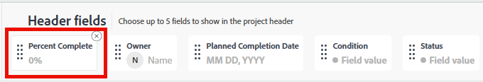
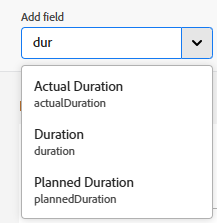

# Personalizar cabeçalhos de objetos usando um modelo de layout

Como administrador do Adobe Workfront ou administrador de grupo, você pode usar um modelo de layout para configurar os campos que os usuários veem no cabeçalho do objeto quando abrem a página de um objeto.

>[!IMPORTANT]
>
>A personalização de cabeçalhos de objetos está disponível atualmente para projetos, tarefas, problemas, portfólios, programas, modelos, registros de faturamento, equipes, usuários, empresas, grupos e cartões de taxa.

Para obter informações sobre como criar modelos de layout, consulte [Criar e gerenciar modelos de layout](../use-layout-templates/create-and-manage-layout-templates.md).

Para obter informações sobre modelos de layout para grupos, consulte [Criar e modificar modelos de layout de um grupo](../../../administration-and-setup/manage-groups/work-with-group-objects/create-and-modify-a-groups-layout-templates.md).

Após configurar um modelo de layout, você deve atribuí-lo aos usuários para que as alterações feitas fiquem visíveis para outros usuários. Para obter informações sobre como atribuir um modelo de layout aos usuários, consulte [Atribuir usuários a um modelo de layout](../use-layout-templates/assign-users-to-layout-template.md).

## Requisitos de acesso

+++ Expanda para visualizar os requisitos de acesso da funcionalidade neste artigo.

<table style="table-layout:auto"> 
 <col> 
 <col> 
 <tbody> 
  <tr> 
   <td>Pacote do Adobe Workfront</td> 
   <td>
Qualquer
</td> 
  </tr> 
  <tr> 
   <td>Licença do Adobe Workfront</td> 
   <td>
Padrão

       
Plano
</td>
  </tr> 
  </tr> 
  <tr> 
   <td>Configurações de nível de acesso</td> 
   <td> 
Para executar essas etapas no nível do sistema, você precisa do nível de acesso Administrador do sistema.

        
Para executá-las para um grupo, você deve ser um gerente desse grupo.
 </td> 
  </tr> 
 </tbody> 
</table>

Para obter informações, consulte [Requisitos de acesso na documentação do Workfront](/help/quicksilver/administration-and-setup/add-users/access-levels-and-object-permissions/access-level-requirements-in-documentation.md).

+++

## Personalizar cabeçalhos de objetos

1. Comece a trabalhar em um modelo de layout, conforme descrito em [Criar e gerenciar modelos de layout](../../customize-workfront/use-layout-templates/create-and-manage-layout-templates.md).
1. No menu suspenso **Personalizar o que os usuários veem**, selecione um objeto cujo cabeçalho você deseja personalizar.
1. Na seção [!UICONTROL Campos de cabeçalho], passe o mouse sobre os campos atuais e siga um destes procedimentos:
   * Clique no ícone **x** para remover um campo

     Ou

   * Clique e segure o ícone de **captura** para arrastar e soltar o campo em um novo local.

   

1. Você pode ter até cinco campos no cabeçalho de um objeto.

   Se você já tiver cinco campos selecionados, remova um campo antes de adicionar um novo.

1. Na caixa **Adicionar campo**, comece digitando o nome de um campo personalizado ou de um campo nativo do Workfront que deseja adicionar e, em seguida, selecione-o quando ele for exibido na lista. O campo é adicionado imediatamente à direita da caixa Adicionar campo e será exibido como o primeiro campo no canto superior direito do cabeçalho do objeto.

   >[!TIP]
   >
   >* É possível adicionar qualquer campo personalizado ou qualquer campo nativo disponível na área Visão geral da seção Detalhes de um objeto. Por exemplo, somente problemas têm o campo Gravidade, e esse campo não está disponível para ser adicionado a projetos ou tarefas.
   >
   >* Quando um usuário edita um campo personalizado no cabeçalho e ele está contido em um formulário personalizado que não está anexado ao objeto, o formulário personalizado é adicionado automaticamente ao objeto.
   >
   >* Ao adicionar o campo &quot;Resolvido por&quot; ao cabeçalho de um problema, o campo é alterado para &quot;Resolvendo problema, tarefa ou projeto&quot; quando há um objeto de resolução associado ao problema.

   

1. (Opcional) Arraste e solte os campos em uma ordem diferente.

1. Continue personalizando o modelo de layout. Você pode clicar em **Aplicar** a qualquer momento para salvar seu progresso.

   Ou

   Se tiver terminado de personalizar, clique em **Salvar e Fechar**.

