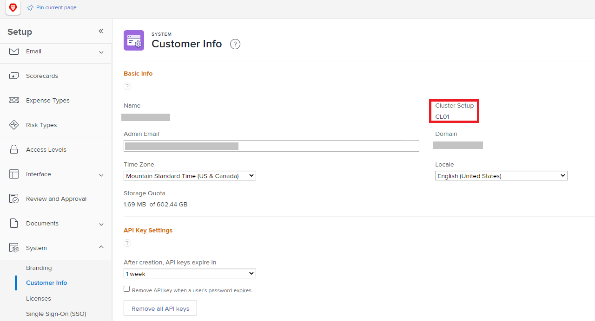

# Visão geral do firewall

Como a Adobe Workfront se comunica com a rede de sua organização, o firewall da organização deve ser configurado para permitir essa comunicação. Os firewalls são medidas de segurança altamente eficazes que funcionam ao separar a rede de uma organização da Internet. Eles garantem que somente os dados e o tráfego de rede selecionados possam ser movidos para dentro ou para fora da rede da organização. O firewall permite ou bloqueia dados com base no site que está enviando ou recebendo os dados. Como administrador do Adobe Workfront, você deve garantir que os dados enviados para ou da Workfront possam passar pelo firewall da sua organização.

Isso é feito por meio de uma inclui na lista de permissões, que é essencialmente uma &quot;lista&quot; de sites que têm &quot;permissão&quot; para enviar ou receber dados por meio do firewall. Os sites podem ser identificados de uma das duas formas a seguir:

* **Endereço IP**: uma série de números como 52.31.132.175
* **Domínio**: parte de uma URL, como `thisdomain` em `www.thisdomain.com`.

O Workfront usa domínios e endereços IP específicos para comunicação na Web. Eles devem ser adicionados ao arquivo de inclui na lista de permissões da sua organização antes de você poder usar o Workfront na organização.

Geralmente, uma inclui na lista de permissões é configurada por um administrador de rede. Trabalhe com o administrador de rede de sua organização para garantir que o firewall permita esses endereços IP. Se você não souber quem é o administrador da rede, o departamento de TI da sua organização poderá orientá-lo na direção certa.

>[!IMPORTANT]
>
>Como administrador do Workfront, você deve garantir que esses endereços IP e domínios sejam adicionados à inclui na lista de permissões da sua organização. Isso é verdade mesmo se você não adicioná-los você mesmo. A Workfront não pode configurar o arquivo de inclui na lista de permissões da sua organização.

## Coletar informações para configurar seu firewall

Para configurar o firewall para o Workfront, o administrador de rede precisa saber quais endereços IP e domínios adicionar. Algumas dessas informações estão disponíveis somente para um administrador do Workfront. Como administrador do Workfront, você deve localizar essas informações e fornecê-las ao administrador de rede.

>[!NOTE]
>
>A prática recomendada para segurança é adicionar somente os endereços IP e domínios que se conectam à funcionalidade que sua organização está usando ativamente. Ao fornecer essas informações, você pode garantir que essa prática recomendada seja seguida.

Forneça ao administrador de rede as seguintes informações:

<table style="table-layout:auto"> 
 <col> 
 <col> 
 <tbody> 
  <tr> 
   <td role="rowheader">Endereços IP e domínios específicos a serem permitidos</td> 
   <td> 
Incluir na lista de permissões O artigo <a href="../../administration-and-setup/get-started-wf-administration/configure-your-firewall.md" class="MCXref xref">Configurar a inclui na lista de permissões do firewall</a> contém a lista de endereços IP e domínios que sua organização deve adicionar ao seu arquivo de. 
 
O administrador de rede talvez não tenha acesso ao artigo "Configurar a inclui na lista de permissões do firewall". Nesse caso, você deve fornecê-lo a eles. Não é recomendável imprimir uma cópia impressa (papel). Uma cópia digital permite que o administrador da rede copie e cole os endereços, o que é mais rápido e preciso do que digitar de uma cópia impressa.
 </td> 
  </tr> 
  <tr> 
   <td role="rowheader">Seu cluster</td> 
   <td>Para localizar o cluster da sua organização, consulte <a href="#view-your-organization-s-cluster-and-workfront-plan" class="MCXref xref">Exibir o cluster da sua organização e o plano da Workfront</a>.</td> 
  </tr> 
  <tr> 
   <td role="rowheader">Seu plano do Workfront</td> 
   <td> 
Para localizar o plano da sua organização, consulte <a href="#view-your-organization-s-cluster-and-workfront-plan" class="MCXref xref">Exibir o cluster da sua organização e o plano da Workfront.</a>
 </td> 
  </tr> 
  <tr> 
   <td role="rowheader">Seu domínio</td> 
   <td> 
Para localizar seu domínio, verifique o endereço da Web usado para se conectar ao Workfront.
 
Exemplo: no endereço Web <code>greatcompany.my.workfront.com</code>, o domínio é "grande empresa"
 </td> 
  </tr> 
  <tr> 
   <td role="rowheader">Outros produtos da Adobe Workfront</td> 
   <td> 
Informe o administrador da rede se você tiver licenças para uma das seguintes opções:
 
    <ul> 
     <li> 
Prova do Adobe Workfront
 </li> 
     <li> 
Adobe Workfront Fusion 
 </li> 
    </ul> </td> 
  </tr> 
  <tr> 
   <td role="rowheader">Integrações do Adobe Workfront</td> 
   <td>Informe o administrador da rede se você usar uma das seguintes opções:
    <ul>
     <li>
Workfront para Microsoft Teams
</li>
     <li>
Workfront para Outlook
</li>
    </ul></td> 
  </tr> 
  <tr> 
   <td role="rowheader">Funcionalidade adicional</td> 
   <td> 
Informe o administrador da rede se você usar:
 
    <ul> 
     <li> 
Uma unidade de teste do Workfront
 </li> 
    </ul> </td>
  </tr> 
 </tbody> 
</table>

>[!IMPORTANT]
>
>Se você adicionar algum desses produtos, integrações ou funcionalidades posteriormente, entre em contato com o administrador da rede para que ele possa ajustar a inclui na lista de permissões.

### Exibir o cluster da sua organização e o plano da Workfront {#view-your-organization-s-cluster-and-workfront-plan}

{{step-1-to-setup}}

1. Clique em **Sistema** no painel esquerdo
1. Para exibir seu cluster, Selecione **Informações do Cliente**.

   Seu cluster é exibido próximo ao canto superior direito da seção **Informações Básicas**.

   

1. Para exibir seu plano do Workfront, selecione **Licenças**.

   Seu plano é exibido próximo ao canto superior direito da página.

   
