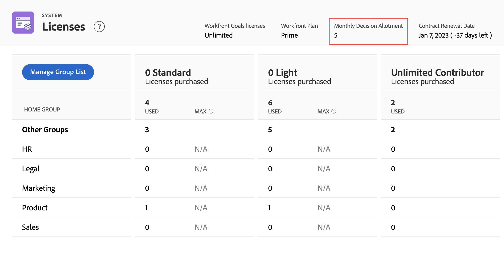

# Gerenciar licenças disponíveis em seu sistema

<!-- Audited: 12/2023 -->

Como administrador do Adobe Workfront, você pode acessar informações sobre sua conta da Workfront, incluindo o número de licenças compradas para sua organização, bem como o número dessas licenças em uso no momento.

## Requisitos de acesso

Você deve ter o seguinte acesso para executar as etapas deste artigo:

<table style="table-layout:auto">
 <col> 
 <col> 
 <tbody> 
  <tr> 
   <td role="rowheader">plano do Adobe Workfront</td> 
   <td>Qualquer</td> 
  </tr> 
  <tr> 
   <td role="rowheader">Licença do Adobe Workfront</td> 
   <td>
    
Novo: Padrão

    
ou

    
Atual: Plano
</td> 
  </tr> 
  <tr> 
   <td role="rowheader">Configurações de nível de acesso</td> 
   <td> 
Você deve ser um administrador do Workfront. Para obter mais informações, consulte <a href="../../administration-and-setup/add-users/configure-and-grant-access/grant-a-user-full-administrative-access.md" class="MCXref xref">Conceder acesso administrativo total a um usuário</a>.
 
<b>NOTA</b>: se você ainda não tiver acesso, pergunte ao administrador do Workfront se ele definiu restrições adicionais em seu nível de acesso. Para obter informações sobre como um administrador do Workfront pode modificar seu nível de acesso, consulte <a href="../../administration-and-setup/add-users/configure-and-grant-access/create-modify-access-levels.md" class="MCXref xref">Criar ou modificar níveis de acesso personalizados</a>.
 </td> 
  </tr> 
 </tbody> 
</table>

## Exibir as licenças de sua organização

O número de licenças em uso é atualizado automaticamente à medida que você atribui níveis de acesso aos usuários adicionados ao Workfront. Para obter mais informações, consulte [Adicionar usuários](../../administration-and-setup/add-users/create-and-manage-users/add-users.md).

Para exibir informações de licença em seu sistema:

{{step-1-to-setup}}

1. Na parte inferior do painel esquerdo, clique em **Sistema** > **Licenças**.

   Para obter mais informações sobre as licenças listadas nesta página, consulte [Visão geral de licenças](../../administration-and-setup/add-users/access-levels-and-object-permissions/wf-licenses.md).

   >[!NOTE]
   >
   >Licenças de comprovação estão disponíveis somente para clientes que compraram o complemento pago do Workfront Proof, além da licença do Workfront. Para obter informações sobre este complemento, consulte [Workfront Proof: índice do artigo](../../workfront-proof/workfront-proof.md).

1. (Condicional) Se você vir a mensagem **Para definir um máximo, é necessário adicionar um Grupo padrão**, adicione um Grupo padrão no seu sistema conforme explicado na seção [Adicionar ou remover um Grupo Padrão da página de licenças](#add-or-remove-a-home-group-to-the-licenses-page) neste artigo.

## Exibir informações sobre licenças para complementos do Workfront

Se sua organização tiver o complemento pago Workfront Proof, o número de licenças usadas e o número de licenças disponíveis serão exibidos. Por exemplo, **5 de 10 licenças de comprovação** indica que a organização está usando atualmente cinco das dez licenças do Workfront Proof que adquiriu.

Se sua organização adquiriu o Workfront Goals, as informações de licença desse produto também são exibidas aqui. Nesse caso, você pode exibir as seguintes informações:

* O número total de licenças do Workfront Goals que sua empresa adquiriu
* O número de licenças do Workfront Goals associadas aos usuários. Este é o número de usuários aos quais foi concedido acesso de Visualização a Metas em seus respectivos níveis de acesso.

Para obter informações sobre o Workfront Goals, consulte [Visão geral dos objetivos do Adobe Workfront](../../workfront-goals/goal-management/wf-goals-overview.md). Para obter informações sobre o acesso ao Workfront Goals, consulte [Conceder acesso ao Adobe Workfront Goals](../../administration-and-setup/add-users/configure-and-grant-access/grant-access-goals.md).

>[!NOTE]
>
>O Workfront permite atribuir mais licenças do Workfront Goals que você adquiriu. No entanto, quando você atribuir mais licenças do que o permitido pelo contrato do Workfront Goals, um gerente de conta da Workfront entrará em contato com você para informar que você excedeu o número contratual.
>

<!--
If an organization has other paid add-on products, their license information also displays here. If the organization doesn't have any paid add-on products, nothing displays here. (Drafted this because not sure this is accurate: Scenario Planner is an add-on product and its licenses are not displayed there.)
-->

>[!TIP]
>
>Os usuários sem acesso administrativo podem usar um relatório de Grupo para exibir a contagem de licenças. Na guia Relatório, crie um novo relatório de grupo e adicione as seguintes colunas:
>
>* Limite de Tipo de Licença: Limite de Trabalhadores
>* Limite de Tipo de Licença: Limite do Planejador
>
>Para saber mais sobre como criar um relatório, consulte [Criar um relatório personalizado](../../reports-and-dashboards/reports/creating-and-managing-reports/create-custom-report.md).

## Exibir informações sobre prova mensal e alocações de decisão do documento

>[!IMPORTANT]
>
>Os limites de decisão de prova e documento se aplicam apenas aos usuários nas novas licenças. Para obter mais informações, consulte [Visão geral de novas licenças](/help/quicksilver/administration-and-setup/add-users/how-access-levels-work/licenses-overview.md).

As decisões de prova e documento são limitadas a todas as licenças não pagas do Workfront. Limites redefinidos por usuário a cada mês.

Os limites de decisão para cada licença diferem dependendo do plano em que você está. Você pode visualizar a alocação mensal em Configurar > Licenças.

Para obter mais informações sobre limites de decisão de prova e documento, consulte [Visão geral de documentos e decisões de prova limitados para usuários não pagos](/help/quicksilver/review-and-approve-work/proof-doc-decision-limits.md).

## Adicionar ou remover um Grupo Padrão da página de licenças {#add-or-remove-a-home-group-to-the-licenses-page}

<!--A Business or Enterprise Workfront Plan is required to use this feature. For more information about the various plans available, see [Workfront Plans.](https://www.workfront.com/plans)-->

Cada usuário pode ser atribuído a apenas um Grupo padrão. O Workfront fornece uma contagem de licenças orientada por grupo calculando quantas licenças estão alocadas e são usadas atualmente em cada Grupo padrão.

Se você vir a mensagem **Para definir um máximo, é necessário adicionar um Grupo padrão** na página Licenças, é necessário adicionar pelo menos um Grupo inicial à página Licenças.

>[!IMPORTANT]
>
>* Para gerenciar licenças com grupos padrão, recomendamos configurar Grupos padrão específicos para unidades de negócios antes de atualizar a contagem máxima de licenças. Para obter mais informações, consulte [Visão geral dos Grupos padrão](../../administration-and-setup/manage-groups/groups-overview/home-groups.md).
>* Você pode adicionar somente grupos de nível superior como Grupos padrão, não subgrupos. Se um usuário tiver um subgrupo atribuído como Grupo inicial, sua licença será adicionada à contagem de licenças do grupo de nível superior acima desse subgrupo.
>

Para adicionar ou remover um Grupo Inicial da página Licenças:

{{step-1-to-setup}}

1. Na parte inferior do painel esquerdo, clique em **Sistema** > **Licenças**.

1. Clique em **Gerenciar lista de grupos**.
1. Comece digitando o nome do grupo de nível superior no **Grupos padrão** caixa.
1. Para adicionar o grupo, clique no nome quando ele aparecer.

   Ou

   Para remover o grupo, clique no ícone X à direita do nome.

1. Clique em **Salvar**.

Como administrador do Workfront, você pode definir contagens máximas de licença para os Grupos Padrão para impedir que uma unidade de negócios use licenças do Workfront adquiridas para outras unidades de negócios. Para obter instruções, consulte [Definir a contagem máxima de licenças para um Grupo padrão](#set-the-maximum-license-count-for-a-home-group) neste artigo.

## Definir a contagem máxima de licenças para um Grupo padrão {#set-the-maximum-license-count-for-a-home-group}

Como administrador do Workfront, você pode definir contagens máximas de licença para os Grupos padrão do sistema. Isso permite impedir que uma unidade de negócios use licenças da Workfront adquiridas para outras unidades de negócios na organização.

Por padrão, a contagem máxima de licenças é definida como N/D, o que significa que não há limite.

Os administradores de grupo podem exibir o número de licenças alocadas e usadas em um Grupo padrão gerenciado. Para obter mais informações, consulte [Exibir o número de licenças alocadas e usadas em um grupo](../../administration-and-setup/manage-groups/create-and-manage-groups/view-number-licenses-allocated-used-group.md).

Para definir a contagem máxima de licenças para um Grupo padrão:

{{step-1-to-setup}}

1. Na parte inferior do painel esquerdo, clique em **Sistema** > **Licenças**.

1. Localize o Grupo padrão na lista.
1. No **Máx** do grupo, clique no valor para o qual você deseja definir um máximo.
1. Digite o número máximo e pressione Enter.

   

   >[!NOTE]
   >
   >Para redefinir o valor máximo de licença de um grupo para o padrão, não digite 0. Em vez disso, exclua o número na caixa. Definir o valor máximo de licença como 0 indica que não há licenças alocadas para esse grupo.
