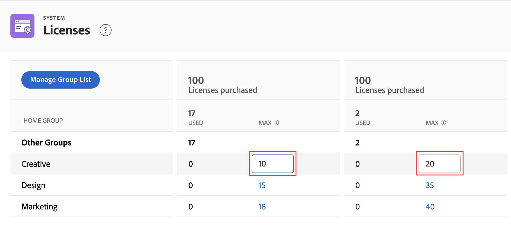

# Gerenciar licenças disponíveis em seu sistema

<!-- Audited: 12/2023 -->

Como administrador do Adobe Workfront, você pode acessar informações sobre sua conta do Workfront, incluindo o número de licenças adquiridas para sua organização, bem como o número dessas licenças atualmente em uso.

## Requisitos de acesso

+++ Expanda para visualizar os requisitos de acesso da funcionalidade neste artigo.

<table style="table-layout:auto"> 
 <col> 
 <col> 
 <tbody> 
  <tr> 
   <td role="rowheader">Pacote do Workfront</td> 
   <td>
Qualquer
</td> 
  </tr> 
  <tr> 
   <td role="rowheader">Licença do Adobe Workfront</td> 
   <td>
Padrão
 
Plano
</td> 
  </tr> 
  <tr> 
   <td role="rowheader">Configurações de nível de acesso</td> 
   <td>Você deve ser um administrador do Workfront. </td> 
  </tr> 
 </tbody> 
</table>

Para obter informações, consulte [Requisitos de acesso na documentação do Workfront](/help/quicksilver/administration-and-setup/add-users/access-levels-and-object-permissions/access-level-requirements-in-documentation.md).

>[!NOTE]
>
>As instruções a seguir se aplicam aos pacotes Select, Prime e Ultimate.
>
>Para o pacote Select:
>
>1. Os administradores do sistema não podem definir limites para Grupos Domésticos.
>2. Os administradores do sistema podem ver apenas o número total de licenças usadas em todos os Grupos Domésticos.
>3. Os administradores de grupo não podem acessar a página Licenças.
>
>Para os pacotes Prime e Ultimate:
>
>1. Os administradores do sistema podem adicionar Grupos domésticos à página Licenças para exibir o uso de licenças nesses grupos e também podem definir limites de licença.
>2. Os administradores de grupo podem acessar a página Licenças e visualizar a utilização de licenças nos grupos que eles gerenciam que foram adicionados à página Licenças por administradores do sistema.
>3. Os administradores de grupo não podem visualizar informações de outros grupos padrão ou adicionar máximos.

+++

## Exibir as licenças de sua organização

O número de licenças em uso é atualizado automaticamente à medida que você atribui níveis de acesso aos usuários adicionados ao Workfront. Para obter mais informações, consulte [Adicionar usuários](../../administration-and-setup/add-users/create-and-manage-users/add-users.md).

Para exibir informações de licença no sistema:

{{step-1-to-setup}}

1. Na parte inferior do painel esquerdo, clique em **Sistema** > **Licenças**.

   Para obter mais informações sobre as licenças listadas nesta página, consulte [Visão geral das licenças](../../administration-and-setup/add-users/access-levels-and-object-permissions/wf-licenses.md).

   >[!NOTE]
   >
   >Licenças de comprovação estão disponíveis somente para clientes que compraram o complemento pago do Workfront Proof, além da licença do Workfront. Para obter informações sobre este complemento, consulte [Workfront Proof: índice do artigo](../../workfront-proof/workfront-proof.md).

1. (Condicional) Se você vir a mensagem **Para definir um máximo, é necessário adicionar um Grupo Doméstico**, adicionar um Grupo Doméstico no sistema conforme explicado na seção [Adicionar ou remover um Grupo Doméstico da página Licenças](#add-or-remove-a-home-group-to-the-licenses-page) deste artigo.

   >[!NOTE]
   >
   >Para os novos planos, o plano Select não permite que os administradores visualizem licenças por Grupo padrão. Você só pode ver o número geral de licenças usadas. Os planos Prime e Ultimate permitem definir o número máximo de licenças por grupo doméstico.

## Exibir informações sobre licenças para complementos do Workfront

Se sua organização tiver o complemento pago do Workfront Proof, serão exibidos o número de licenças usadas e o número de licenças disponíveis. Por exemplo, **5 de 10 licenças de prova** indica que a organização está usando atualmente 5 das 10 licenças da Workfront Proof que adquiriram.

Se sua organização comprou o Workfront Goals, as informações de licença do produto também serão exibidas aqui. Nesse caso, você pode exibir as seguintes informações:

* O número total de licenças do Workfront Goals que sua empresa comprou
* O número de licenças do Workfront Goals associadas aos usuários. Este é o número de usuários para os quais deve ser concedido pelo menos o acesso de Exibição às Metas em seu nível de acesso.

Para obter informações sobre o Workfront Goals, consulte [Visão geral do Adobe Workfront Goals](../../workfront-goals/goal-management/wf-goals-overview.md). Para obter informações sobre acesso às Metas do Workfront, consulte [Conceder acesso às Metas do Adobe Workfront](../../administration-and-setup/add-users/configure-and-grant-access/grant-access-goals.md).

>[!NOTE]
>
>O Workfront permite que você atribua mais licenças do Workfront Goals que você comprou. No entanto, quando você atribuir mais licenças do que o permitido pelo contrato do Workfront Goals, um gerente de contas da Workfront entrará em contato com você para avisar que você excedeu o número do contrato.
>

<!--
If an organization has other paid add-on products, their license information also displays here. If the organization doesn't have any paid add-on products, nothing displays here. (Drafted this because not sure this is accurate: Scenario Planner is an add-on product and its licenses are not displayed there.)
-->

>[!TIP]
>
>Os usuários sem acesso administrativo podem usar um relatório de Grupo para exibir a contagem de licenças. Na guia Relatório, crie um novo relatório de grupo e adicione as seguintes colunas:
>
>* Limite de Tipos de Licença: Limite de Trabalhadores
>* Limite de Tipos de Licença: Limite do Planejador
>
>Para saber mais sobre como criar um relatório, consulte [Criar um relatório personalizado](../../reports-and-dashboards/reports/creating-and-managing-reports/create-custom-report.md).

## Exibir informações sobre alocações mensais de prova e decisão de documento

>[!IMPORTANT]
>
>Os limites de prova e decisão do documento se aplicam apenas aos usuários nas novas licenças. Para obter mais informações, consulte [Visão geral de novas licenças](/help/quicksilver/administration-and-setup/add-users/how-access-levels-work/licenses-overview.md).

As decisões sobre prova e documentos são limitadas a todas as licenças não pagas do Workfront. Os limites são redefinidos por usuário a cada mês.

Os limites de decisão de cada licença variam de acordo com o plano em que você está. Veja sua cota mensal em Configuração > Licenças.

Para obter mais informações sobre limites de prova e decisão de documentos, consulte [Visão geral de documentos e decisões de prova limitados para usuários não pagos](/help/quicksilver/review-and-approve-work/proof-doc-decision-limits.md).

## Adicionar ou remover um Grupo Doméstico da página Licenças {#add-or-remove-a-home-group-to-the-licenses-page}

Cada usuário pode ser atribuído a apenas um Grupo Doméstico. O Workfront fornece um número de licenças orientado por grupo calculando quantas licenças estão alocadas e são usadas atualmente em cada Grupo Doméstico.

Se a mensagem **Para definir um máximo, você deve adicionar um Grupo Doméstico** na página Licenças, é necessário adicionar pelo menos um Grupo Doméstico à página Licenças.

>[!IMPORTANT]
>
>* Para gerenciar licenças com grupos domésticos de forma eficaz, recomendamos configurar Grupos domésticos específicos para unidades de negócios antes de atualizar a quantidade máxima de licenças. Para obter mais informações, consulte [Visão geral de Grupos Domésticos](../../administration-and-setup/manage-groups/groups-overview/home-groups.md).
>* Você pode adicionar somente grupos de nível superior como Grupos padrão, não subgrupos. Se um usuário tiver um subgrupo atribuído como Grupo inicial, sua licença será adicionada à contagem de licenças do grupo de nível superior acima desse subgrupo.
>

Para adicionar ou remover um Grupo Inicial da página Licenças:

{{step-1-to-setup}}

1. Na parte inferior do painel esquerdo, clique em **Sistema** > **Licenças**.

1. Clique em **Gerenciar Lista de Grupos**.
1. Comece a digitar o nome do grupo de nível superior na caixa **Grupos Padrão**.
1. Para adicionar o grupo, clique no nome quando ele aparecer.

   Ou

   Para remover o grupo, clique no ícone X à direita do nome.

1. Clique em **Salvar**.

Como administrador do Workfront, você pode definir contagens máximas de licença para os Grupos Padrão para impedir que uma unidade de negócios use licenças do Workfront adquiridas para outras unidades de negócios. Para obter instruções, consulte [Definir a contagem máxima de licenças para um Grupo Doméstico](#set-the-maximum-license-count-for-a-home-group) neste artigo.

## Definir a contagem máxima de licenças para um Grupo Doméstico {#set-the-maximum-license-count-for-a-home-group}

Como administrador do Workfront, você pode definir o número máximo de licenças para os grupos base de nível superior no sistema. Isso permite impedir que uma unidade de negócios use licenças da Workfront adquiridas para outras unidades de negócios dentro da sua organização.

Por padrão, a quantidade máxima de licenças é definida como N/A, o que significa que não há limite.

Os administradores de grupo podem exibir o número de licenças alocadas e usadas em um grupo doméstico que gerenciam. Para obter mais informações, consulte [Exibir o número de licenças alocadas e usadas em um grupo](../../administration-and-setup/manage-groups/create-and-manage-groups/view-number-licenses-allocated-used-group.md).

Para definir o número máximo de licenças para um Grupo Doméstico:

{{step-1-to-setup}}

1. Na parte inferior do painel esquerdo, clique em **Sistema** > **Licenças**.

1. Localize o Grupo Doméstico na lista.
1. Na coluna **Máx** do grupo, clique no valor para o qual deseja definir um máximo.
1. Digite o número máximo e pressione Enter.

   

   >[!NOTE]
   >
   >Para redefinir o valor máximo de licença de um grupo para o padrão, não digite 0. Em vez disso, exclua o número na caixa. Definir o valor máximo de licença como 0 indica que não há licenças alocadas para esse grupo.
