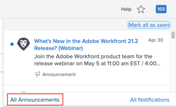

# Enviar avisos

Como administrador do Adobe Workfront, você pode usar a página Comunicados para enviar comunicados aos usuários.

As mensagens de anúncio da Workfront normalmente incluem informações sobre novos recursos e versões, alterações de processos etc.

Para obter informações sobre como exibir comunicados, consulte [Exibir e gerenciar notificações no aplicativo](../../workfront-basics/using-notifications/view-and-manage-in-app-notifications.md).

## Requisitos de acesso

+++ Expanda para visualizar os requisitos de acesso da funcionalidade neste artigo.

<table style="table-layout:auto"> 
 <col> 
 <col> 
 <tbody> 
  <tr> 
   <td role="rowheader">Pacote do Workfront</td> 
   <td>
Qualquer
</td> 
  </tr> 
  <tr> 
   <td role="rowheader">Licença do Adobe Workfront</td> 
   <td>
Padrão
 
Plano
</td> 
  </tr> 
  <tr> 
   <td role="rowheader">Configurações de nível de acesso</td> 
   <td>Você deve ser um administrador do Workfront. </td> 
  </tr> 
 </tbody> 
</table>

Para obter informações, consulte [Requisitos de acesso na documentação do Workfront](/help/quicksilver/administration-and-setup/add-users/access-levels-and-object-permissions/access-level-requirements-in-documentation.md).

+++

## Enviar comunicados aos usuários

Você pode usar a página **Comunicados** para se comunicar com os usuários do sistema Workfront encaminhando comunicados enviados do Workfront e compondo novos comunicados. Você pode enviar comunicados para usuários, grupos, equipes ou empresas específicas usando seu sistema do Workfront.

* [Encaminhar comunicados da Workfront aos usuários](#forward-workfront-announcements-to-users)
* [Compor novos comunicados](#compose-new-announcements)

### Encaminhar comunicados do Workfront aos usuários {#forward-workfront-announcements-to-users}

Você pode encaminhar facilmente as mensagens recebidas do Workfront aos usuários do sistema.

1. Vá para a página Comunicados clicando no ícone de **Notificação** no canto superior direito da interface do Workfront e, em seguida, clique em **Todos os Comunicados**.

   

1. Na página **Comunicados**, selecione a mensagem que deseja encaminhar.
1. Clique em **Avançar**.
1. Na caixa **Enviar para**, comece a digitar o nome de um usuário, grupo, equipe ou empresa que deseja receber a mensagem de comunicado e, em seguida, clique no nome quando ele aparecer na lista suspensa. Repita esse processo para adicionar vários usuários, grupos, equipes ou empresas.

   Ou

   Para encaminhar o comunicado a todos os usuários do sistema, comece a digitar **Todos** e clique nele quando ele aparecer na lista suspensa.

1. Continue com a Etapa 3 em [Compor novos comunicados](#compose-new-announcements).

### Compor novos comunicados {#compose-new-announcements}

1. Vá para a página Comunicados clicando no ícone de **Notificação** no canto superior direito da interface do Workfront e, em seguida, clique em **Todos os Comunicados**.

   

1. Na página **Comunicados**, clique em **Novo Comunicado.**

1. Na caixa **Enviar para**, comece a digitar o nome de um usuário, grupo, equipe ou empresa que deseja receber a mensagem de comunicado e, em seguida, clique no nome quando ele aparecer na lista suspensa. Repita esse processo para adicionar vários usuários, grupos, equipes ou empresas.

   Por padrão, ao enviar uma nova mensagem de anúncio, **Todos** é preenchido previamente neste campo. Para que nem todos os usuários do sistema recebam a mensagem de comunicado, remova **Todos** da lista.

1. Especifique as seguintes informações adicionais:

   | Assunto | Especifique um assunto para o comunicado. |
   |---|---|
   | Digite a mensagem aqui | Especifique o conteúdo da mensagem. O editor de mensagens permite incluir marcações comuns, como negrito, itálico, sublinhado, listas numeradas e com marcadores, e hiperlinks. |
   | Anexos | Clique em **Adicionar Anexo** e navegue até o arquivo que deseja anexar à mensagem e selecione-o. |

   {style="table-layout:auto"}

1. (Opcional) Clique em **Salvar como Rascunho** para salvar a mensagem (incluindo a lista de destinatários, o assunto e os anexos) como um rascunho.

1. (Opcional) Para exibir um rascunho, na área **Comunicados**, clique em **Rascunhos**.

1. Clique em **Enviar.**

   Agora os usuários podem exibir a mensagem de anúncio, conforme descrito em [Exibir e gerenciar notificações no aplicativo](../../workfront-basics/using-notifications/view-and-manage-in-app-notifications.md).

## Limitar os tipos de comunicados do Workfront que você recebe

Se você for um administrador do Workfront, poderá deixar de receber determinados tipos de mensagens.

Por padrão, você recebe todas as mensagens enviadas do Workfront. Esta é a configuração recomendada.

1. Na página **Comunicados**, clique em **Configurações.**
1. Selecione os tópicos para os quais você não deseja mais receber mensagens.
1. Clique em **Salvar Configurações.**
