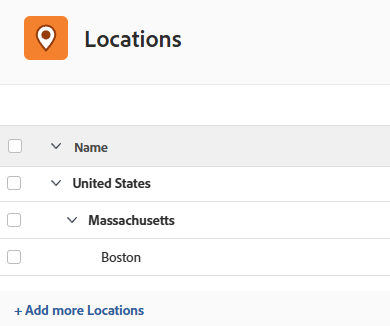

# Configurar locais

{{preview-fast-release-general}}

Você pode configurar as localizações padrão disponíveis para designar como atributos a funções de trabalho em cartões de taxa. Isso garante que os cartões de taxa reflitam com precisão as taxas de mercado em cada local.

Os cartões de taxa permitem que sua organização gerencie facilmente as taxas de cobrança dos projetos. Para obter mais informações, consulte [Gerenciar cartões de taxa](/help/quicksilver/administration-and-setup/manage-enterprise-operations/manage-rate-cards.md) e [Definir atributos de taxa](/help/quicksilver/administration-and-setup/manage-enterprise-operations/define-rate-attributes.md).

## Requisitos de acesso

+++ Expanda para visualizar os requisitos de acesso da funcionalidade neste artigo.

<table style="table-layout:auto"> 
 <col> 
 <col> 
 <tbody> 
  <tr> 
   <td>[!DNL Adobe Workfront] pacote</td> 
   <td>Workflow Ultimate</td> 
  </tr> 
  <tr> 
   <td>[!DNL Adobe Workfront] licença</td> 
   <td>[!UICONTROL Padrão]</td>
  </tr> 
  <tr> 
   <td>Configurações de nível de acesso</td> 
   <td>[!UICONTROL Administrador do Sistema]</td> 
  </tr> 
 </tbody> 
</table>

Para obter informações, consulte [Requisitos de acesso na documentação do Workfront](/help/quicksilver/administration-and-setup/add-users/access-levels-and-object-permissions/access-level-requirements-in-documentation.md).

+++

## Adicionar uma localização

{{step-1-to-setup}}

1. No painel esquerdo, clique em [!UICONTROL **Locais**].
1. No ambiente de Produção, clique em [!UICONTROL **Adicionar mais locais**] na parte inferior da lista.
   No ambiente de Visualização, clique em [!UICONTROL **Nova linha**] na parte inferior da lista.

1. Insira o nome e a descrição do local.
1. Clique fora da linha para salvar o local.
1. Para excluir um local no ambiente de Produção, selecione-o na lista e clique no ícone **Excluir** .
   Para excluir um local no ambiente de Visualização, selecione-o na lista e clique em [!UICONTROL **Excluir**] na barra de ações na parte inferior da tela.

>[!NOTE]
>
>Os locais associados às funções de trabalho em um cartão de taxa não podem ser excluídos.

## Adicionar uma sublocalização

Você pode adicionar uma sublocalização a uma localização existente. Por exemplo, se você já tiver uma localização do Reino Unido, Londres poderá ser uma sublocalização.

São permitidos três níveis de sublocalizações. País, estado ou província e cidade são usos comuns de sublocalizações.

Cada sublocal pode ser adicionado como um atributo em um cartão de taxa da mesma forma que um local de nível superior, para definir a taxa de uma função de trabalho específica nesse local.

{{step-1-to-setup}}

1. No painel esquerdo, clique em [!UICONTROL **Locais**].
1. No ambiente de Produção, selecione um local existente na lista e clique em [!UICONTROL **Adicionar sublocal**].
   No ambiente de Visualização, selecione um local existente na lista e clique em [!UICONTROL **Adicionar sublocal**] na barra de ações na parte inferior da tela.

1. Insira o nome e a descrição do local.
1. Clique fora da área de entrada para salvar o local.

   O sublocal é recuado abaixo do local de nível superior.

   Imagem de amostra no ambiente de produção:
   

   Imagem de exemplo no ambiente de Visualização:
   

