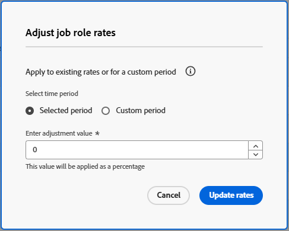

# Gerenciar cartões de taxa

{{highlighted-preview-article-level}}

Um cartão de taxa representa o contrato com seu cliente no qual as taxas horárias são definidas para as funções de trabalho que concluirão o trabalho. Em um cartão de taxa, você pode definir várias taxas de faturamento por função de trabalho, com base em atributos como agência, local ou centro de custo. Seus atributos de taxa exclusivos são configurados na área Configuração. Para obter mais informações, consulte [Definir atributos de taxa](/help/quicksilver/administration-and-setup/manage-enterprise-operations/define-rate-attributes.md).

Por exemplo, você pode ter uma função de trabalho de Designer com base em Paris para a Agência A, outra Designer com base em Paris para a Agência B e uma terceira Designer com base em Nova York não atribuída a uma agência, cada uma com taxas de faturamento diferentes. No entanto, os atributos não são necessários para funções de trabalho em um cartão de taxa. Os atributos servem como ferramentas para estabelecer taxas mais granulares. Uma taxa de cobrança em um cartão de taxa também pode ter data de efetivação, de modo que a taxa comece e termine em datas especificadas.

Também é possível bloquear taxas em um cartão de taxa para evitar que elas sejam substituídas no nível do projeto ou da tarefa. As taxas bloqueadas são as mais altas na hierarquia de taxas de faturamento, exceto para taxas preservadas em um projeto. Para obter mais informações, consulte [Visão geral da hierarquia de receita e custo](/help/quicksilver/manage-work/projects/project-finances/overview-revenue-cost-hierarchy.md).

## Requisitos de acesso

+++ Expanda para visualizar os requisitos de acesso da funcionalidade neste artigo.

<table style="table-layout:auto"> 
 <col> 
 <col> 
 <tbody> 
  <tr> 
   <td>[!DNL Adobe Workfront] pacote</td> 
   <td>Workflow Ultimate</td> 
  </tr> 
  <tr> 
   <td>[!DNL Adobe Workfront] licença</td> 
   <td>[!UICONTROL Padrão]</td>
  </tr> 
  <tr> 
   <td>Configurações de nível de acesso</td> 
   <td>Editar acesso a [!UICONTROL Rate Cards]</td> 
  </tr> 
  <tr> 
   <td>Permissões de objeto</td> 
   <td>Para editar um cartão de taxa compartilhado com você, é necessário ter permissões de gerenciamento para o cartão de taxa.</td> 
  </tr> 
 </tbody> 
</table>

Para obter informações, consulte [Requisitos de acesso na documentação do Workfront](/help/quicksilver/administration-and-setup/add-users/access-levels-and-object-permissions/access-level-requirements-in-documentation.md).

+++

## Adicionar um cartão de taxa

{{step-1-to-setup}}

1. No painel esquerdo, clique em [!UICONTROL **Classificar cartões**].
1. Clique em [!UICONTROL **Novo cartão de taxa**] e em [!UICONTROL **Criar novo cartão de taxa**].
1. Digite um nome e uma descrição para o cartão de taxa na caixa [!UICONTROL **Novo cartão de taxa**].

   O nome deve ser exclusivo.

   

1. (Opcional) Selecione um [!UICONTROL **Grupo**] para o cartão de taxa. Essa é a agência que define o cartão de taxa.
1. (Opcional) Selecione uma [!UICONTROL **Empresa**] para o cartão de tarifas. Este é o cliente para o qual as taxas são contratadas.

   >[!NOTE]
   >
   >O Grupo e a Empresa são usados não apenas nos detalhes do cartão de taxa, mas também como filtros ao anexar um cartão de taxa a um projeto.

1. Clique em **Criar**.

   A tela Cartão de tarifa > Funções de trabalho e taxas é exibida.

1. Clique em [!UICONTROL **Adicionar função de trabalho**].
1. Na caixa [!UICONTROL **Nova taxa de cobrança**], selecione uma [!UICONTROL **Função de trabalho**] para definir taxas de cobrança para.

   

1. (Opcional) Selecione atributos para a taxa de faturamento como Agência, Local ou Centro de Custo.

   >[!NOTE]
   >
   >Esses atributos são definidos separadamente e podem afetar os cálculos de receita e custo. Para obter mais informações, consulte [Definir atributos de taxa](/help/quicksilver/administration-and-setup/manage-enterprise-operations/define-rate-attributes.md).

1. Selecione uma [!UICONTROL **Moeda**] para a taxa de cobrança.
1. (Opcional) Insira um [!UICONTROL **Alias da função de trabalho**] para a função de trabalho.

   Se o nome do alias digitado ainda não existir, você pode adicioná-lo.

   Quando o cartão de taxa é anexado a um projeto, o alias aparece em informações como atribuições de espaço reservado, despesas e relatórios, em vez do nome da função de trabalho interna.

   >[!NOTE]
   >
   >* Somente um alias pode existir para cada combinação de função de trabalho e atributo em um único cartão de taxa.
   >* Um alias deve ser atualizado no cartão de taxa e não pode ser editado em um projeto.

1. No campo [!UICONTROL **Taxa de Cobrança**], insira a taxa de cobrança para esta função de trabalho e seus atributos.
1. (Opcional) Selecione [!UICONTROL **Taxa de bloqueio**] para bloquear essa taxa e não permitir que ela seja alterada no nível do projeto ou da tarefa. Você pode desbloqueá-lo posteriormente, se necessário.
1. (Opcional) Clique em [!UICONTROL **Adicionar taxa efetiva de data**] para aplicar datas efetivas à taxa de cobrança.
1. (Opcional) Clique novamente em [!UICONTROL **Adicionar taxa efetiva de data**] para adicionar mais taxas de cobrança com datas efetivas para esta função de trabalho e seus atributos.
1. (Condicional) Se você estiver adicionando mais de uma taxa de faturamento para esta função de trabalho, especifique as seguintes informações:

   * [!UICONTROL **Taxa de Cobrança**]: o valor da taxa de cobrança do período.
   * [!UICONTROL **Data de início**]: a data em que a taxa começa.
   * [!UICONTROL **Data de término**]: a data em que a taxa termina.

     A primeira taxa de cobrança não precisa ter uma data de início, e a última taxa de cobrança não precisa ter uma data de término. São permitidas lacunas entre as datas da taxa, mas não são permitidas datas sobrepostas. Durante uma lacuna, outras áreas da hierarquia de taxas de faturamento são usadas para determinar a taxa de faturamento, com base no tipo de receita de uma tarefa. Para obter mais informações, consulte [Visão geral da hierarquia de receita e custo](/help/quicksilver/manage-work/projects/project-finances/overview-revenue-cost-hierarchy.md).

1. Clique em [!UICONTROL **Salvar**].
1. (Opcional) Para adicionar outra taxa de cobrança, para a mesma função de trabalho com atributos diferentes ou para uma função de trabalho separada, clique em [!UICONTROL **Adicionar função de trabalho**].

   As taxas para cada função são adicionadas ao cartão de taxas à medida que você as cria. A taxa em vigor atualmente, com base nas datas, é indicada com um ícone .

   

## Editar detalhes e taxas do cartão de taxa

{{step-1-to-setup}}

1. No painel esquerdo, clique em [!UICONTROL **Classificar cartões**].
1. Para editar um cartão de taxa existente, clique no nome do cartão de taxa na lista Cartões de taxa.
1. Para atualizar os detalhes do cartão de taxa, clique em [!UICONTROL **Detalhes**] no painel esquerdo.
1. (Opcional) Para anexar um formulário personalizado ao cartão de taxa, clique no campo [!UICONTROL **Adicionar formulário personalizado**] no canto superior direito da página Detalhes e selecione um formulário personalizado na lista exibida.

   Para obter mais informações sobre como anexar um formulário personalizado, consulte [Adicionar um formulário personalizado a um objeto](/help/quicksilver/workfront-basics/work-with-custom-forms/add-a-custom-form-to-an-object.md).

1. Clique em [!UICONTROL **Salvar alterações**] após editar os detalhes do cartão de taxa.
1. Clique em [!UICONTROL **Funções e taxas de trabalho**] no painel esquerdo para editar as taxas de cobrança.
1. Para editar uma taxa, marque a caixa de seleção ao lado da taxa e clique em [!UICONTROL **Editar**] na barra de ações, na parte inferior da tela.

   Para obter mais informações sobre a barra de ações, consulte [Usar listas aprimoradas](/help/quicksilver/workfront-basics/navigate-workfront/use-lists/enhanced-lists.md).

   >[!NOTE]
   >
   >Como cada taxa está associada à combinação da função e dos atributos para criar uma taxa exclusiva, a função e os atributos não podem ser alterados quando você edita uma taxa.

1. Para excluir uma taxa de cobrança do cartão de taxa, marque a caixa de seleção ao lado da taxa e clique em [!UICONTROL **Excluir**] na barra de ações.
1. Para bloquear uma taxa, marque a caixa de seleção ao lado da taxa e clique em [!UICONTROL **Bloquear**] na barra de ações.

   Taxas bloqueadas não podem ser alteradas no nível de projeto ou tarefa. Um ícone de bloqueio é exibido ao lado das taxas bloqueadas na lista.

   Também é possível desbloquear uma taxa bloqueada na barra de ações.

1. Para ajustar as taxas em uma porcentagem, siga estas etapas:

   1. Selecione todas as taxas que deseja ajustar na tela Cartão de Taxas > Funções e Taxas de Trabalho.

      Você pode escolher uma ou várias taxas. Todos serão ajustados pela mesma porcentagem.

   1. Clique em [!UICONTROL **Ajustar taxas**] na barra de ações.
   1. Na caixa [!UICONTROL **Ajustar taxas de função de trabalho**], escolha se deseja que o ajuste de taxa ocorra durante o período selecionado (as datas de efetivação existentes) ou um intervalo de datas personalizado que você define.

      

   1. Informe o valor de ajuste para as taxas.

      Esse valor é aplicado como uma porcentagem. Por exemplo, se você inserir 10, as taxas selecionadas aumentarão em 10%.

   1. Clique em [!UICONTROL **Atualizar taxas**].
   1. Clique em [!UICONTROL **Atualizar**] na mensagem de confirmação.

      As taxas selecionadas são aumentadas pela porcentagem.

## Importar um cartão de taxa

Consulte o artigo [Importar cartões de taxa de um modelo](/help/quicksilver/administration-and-setup/manage-enterprise-operations/import-rate-cards.md).

## Copiar um cartão de taxa

{{step-1-to-setup}}

1. No painel esquerdo, clique em [!UICONTROL **Classificar cartões**].
1. Marque a caixa de seleção ao lado do cartão de taxa na lista e clique no ícone **Copiar** .
1. Digite um nome para o novo cartão de taxa na caixa [!UICONTROL **Copiar cartão de taxa**]. Em seguida, clique em [!UICONTROL **Criar**].

   O novo cartão de taxa é salvo. Edite os detalhes do cartão de classificação, as funções de trabalho e as taxas conforme necessário.

## Excluir um cartão de taxa inteiro

{{step-1-to-setup}}

1. No painel esquerdo, clique em [!UICONTROL **Classificar cartões**].
1. Marque a caixa de seleção ao lado do cartão de taxa na lista e clique no ícone **Excluir** .

   >[!NOTE]
   >
   >Um cartão de taxa anexado a um projeto será excluído do projeto.

