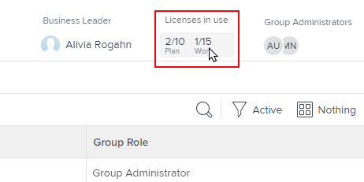
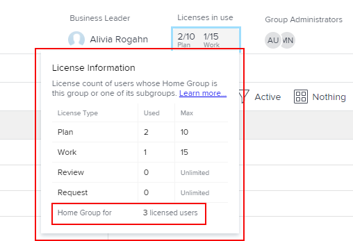

# Exibir o número de licenças alocadas e usadas em um grupo

Como administrador do Adobe Workfront, você pode exibir contagens dos tipos individuais de licenças usados atualmente no seu grupo e seus subgrupos. Isso é útil quando você precisa avaliar se redistribui licenças.

Se houver algum grupo acima do grupo gerenciado por você, os administradores também poderão fazer isso pelo seu grupo. O mesmo se aplica aos administradores do Workfront (para qualquer grupo).

>[!IMPORTANT]
>
>Uma licença de usuário é contada em um grupo específico somente se o grupo for o Grupo inicial do usuário.

## Requisitos de acesso

+++ Expanda para visualizar os requisitos de acesso para a funcionalidade neste artigo.

<table style="table-layout:auto"> 
 <col> 
 <col> 
 <tbody> 
  <tr> 
   <td>Pacote do Adobe Workfront</td> 
   <td>
Qualquer
</td> 
  </tr> 
  <tr> 
   <td>Licença do Adobe Workfront</td> 
   <td>
Standard

       
Plano
</td>
  </tr>
  <tr> 
   <td>Configurações de nível de acesso</td> 
   <td>Você deve ser um administrador de grupo do grupo ou um administrador do sistema.</td>
  </tr>
 </tbody> 
</table>

Para obter informações, consulte [Requisitos de acesso na documentação do Workfront](/help/quicksilver/administration-and-setup/add-users/access-levels-and-object-permissions/access-level-requirements-in-documentation.md).

+++

## Exibir o número de licenças usadas em um grupo

{{step-1-to-setup}}

1. No painel esquerdo, clique em **Grupos** .

1. Clique no nome do grupo.
1. Na página exibida, na área de cabeçalho próxima ao canto superior direito, exiba a área **Licenças em uso** para ver o número de licenças do **Plano** e do **Trabalho** que estão sendo usadas no momento.

   Se você estiver visualizando um grupo de nível superior e o administrador do Workfront tiver definido um número máximo de cada tipo de licença para o grupo, esses números também serão exibidos. Por exemplo, no grupo abaixo, um máximo de 10 usuários pode ter uma licença de Plano e um máximo de 15 usuários pode ter uma licença de Trabalho:

   

   Para obter informações sobre como um administrador do Workfront define um número máximo de licenças alocadas para um grupo, consulte a seção [Definir a contagem máxima de licenças para um Grupo Doméstico](../../../administration-and-setup/get-started-wf-administration/manage-available-licenses-in-your-system.md#set) no artigo [Gerenciar licenças disponíveis no sistema](../../../administration-and-setup/get-started-wf-administration/manage-available-licenses-in-your-system.md).

   >[!NOTE]
   >
   >Se o grupo que você está observando for um subgrupo, você poderá ver somente os números de licenças que estão sendo usadas, não o número máximo de licenças alocadas para o grupo. Isso ocorre porque os administradores do Workfront não definem uma contagem máxima de licenças para um subgrupo.
   >
   >
   >

1. Para contagens separadas de cada tipo de licença usada atualmente no grupo (incluindo Revisão e Solicitação), clique na área de texto diretamente abaixo de **Licenças em uso:**

   

   A caixa que é exibida fornece as mesmas informações para todos os quatro tipos de licença do Workfront: Plano, Trabalho, Revisão e Solicitação. Na parte inferior da caixa, é possível ver o número total de licenças que estão sendo usadas pelos membros deste grupo ou de um de seus subgrupos:

   

   Para licenças de Revisão e Solicitação, a coluna Máximo sempre exibe Ilimitado.
