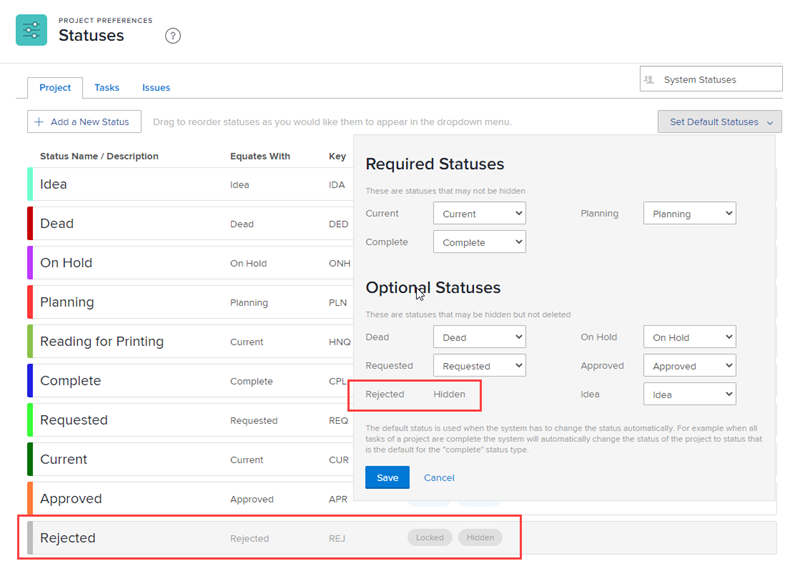

# Usar um status personalizado como status padrão para um grupo

Como administrador de grupo, você pode configurar um status personalizado como status padrão para um grupo ou subgrupo gerenciado. Isso é útil quando o sistema precisa atribuir automaticamente um status do Workfront a um projeto, tarefa ou problema. Um projeto, tarefa ou problema sempre exibe o status personalizado definido como status padrão, em vez de exibir o status do Workfront igual a.

O status configurado pode ser qualquer status personalizado criado para o grupo, herdado de um grupo acima do grupo ou herdado do nível do sistema.

Se houver algum grupo acima do grupo gerenciado por você, os administradores também poderão fazer isso pelo seu grupo. O mesmo se aplica aos administradores do Workfront (para qualquer grupo).

>[!INFO]
>
>**Exemplo:** você poderia criar um status personalizado chamado Concluído e defini-lo como um status padrão equivalente ao status Concluído do Workfront.
>
>Em seguida, para tarefas definidas para alteração para o status Concluído quando atingirem 100%, o status é exibido como Concluído em vez de Concluído.

## Requisitos de acesso

Você deve ter o seguinte para executar as etapas deste artigo:

<table style="table-layout:auto"> 
 <col> 
 <col> 
 <tbody> 
  <tr> 
   <td role="rowheader">plano do Workfront*</td> 
   <td>Qualquer</td> 
  </tr> 
  <tr> 
   <td role="rowheader">Licença da Adobe Workfront*</td> 
   <td> 
Plano 
 
Você deve ser um administrador de grupo do grupo ou um administrador do Workfront. Para obter mais informações, consulte <a href="../../../administration-and-setup/manage-groups/group-roles/group-administrators.md" class="MCXref xref">Administradores de grupo</a> e <a href="../../../administration-and-setup/add-users/configure-and-grant-access/grant-a-user-full-administrative-access.md" class="MCXref xref">Conceder acesso administrativo total a um usuário</a>.
 </td> 
  </tr> 
 </tbody> 
</table>

&#42;Se precisar descobrir o tipo de plano ou licença, contate o administrador do Workfront.

## Status de problemas

Se o status personalizado for um status de Problema, todos os quatro tipos de problemas deverão ser habilitados para ele (Relatório de erros, Pedido de alteração, Problema e Solicitação). Por exemplo, no status de ocorrência mostrado abaixo, o status Reaberto não pode ser usado como um status padrão porque o tipo de ocorrência de Pedido de alteração não está selecionado:

## Definir um status personalizado como status padrão para um grupo

1. Clique no ícone  do **Menu Principal** no canto superior direito do Adobe Workfront e em **Configurar** .
1. No painel esquerdo, clique em **Grupos**  e depois clique no nome do grupo no qual deseja criar ou personalizar os status.
1. No painel esquerdo, clique em **Status** .
1. Abra a guia **Projeto**, **Tarefas** ou **Problemas**, dependendo do tipo de status que você deseja definir como um status padrão.
1. Clique em **Definir status padrão** próximo ao canto superior direito.
1. Na área suspensa que é exibida, ao lado do status em que você deseja definir o status padrão, selecione o status padrão que deseja definir.
1. Clique em **Salvar**.

   O status agora está disponível como um status padrão para uso com projetos associados ao grupo.

1. Associe o status personalizado ao projeto em que deseja usá-lo.

   Associe o status ao projeto associando o grupo em que o status reside ao projeto. Os usuários podem usar o status personalizado somente se o grupo onde o status reside estiver associado ao projeto.

   >[!NOTE]
   >
   >Se você atribuir o projeto a um grupo diferente, o status do projeto será recarregado e poderá ser alterado.

   1. Vá para o projeto em que deseja usar o status personalizado.
   1. Clique no menu Mais  e em **Editar**.
   1. Na caixa **Editar Projeto** que é exibida, no campo **Grupo** em **Associação de projeto**, selecione o grupo ao qual o status personalizado está associado.

   1. Clique em **Salvar alterações**.

## Os grupos herdam as configurações de status padrão

Depois que um administrador do Workfront configura um status personalizado como status padrão, novos grupos criados herdam essa configuração.

Da mesma forma, depois que um administrador de grupo define um status personalizado como um status padrão, novos subgrupos criados diretamente abaixo do grupo herdam essa configuração.

Para obter mais informações, consulte [Como os grupos herdam os status](../../../administration-and-setup/manage-groups/manage-group-statuses/how-groups-inherit-statuses.md).

## Quando um status padrão está oculto

Se você ocultar um status padrão (ativando a opção Ocultar status para ele), o sistema tentará definir outro status do tipo equivalente como padrão.

Se não houver status disponível do tipo equivalente, o tipo de status será exibido como **Oculto** e não estará disponível para itens de trabalho.

